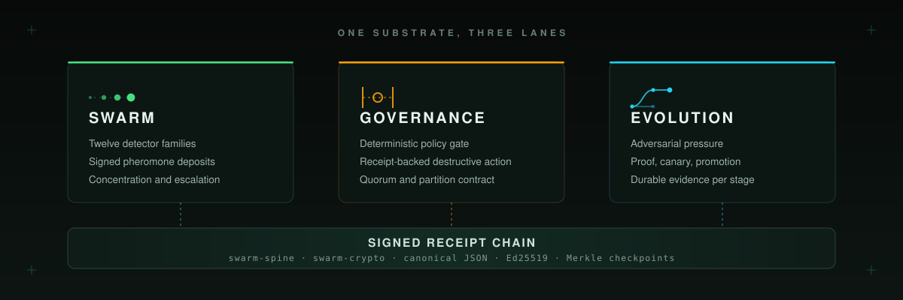
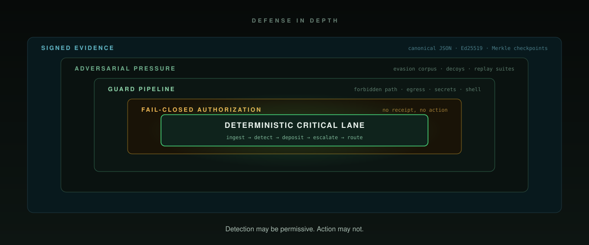

<p align="center">
  <picture>
    <source media="(max-width: 500px)" srcset="docs/assets/hero-mobile.svg" />
    
  </picture>
</p>

<p align="center">
  <a href="LICENSE"></a>
  
  
  <a href="docs/ARCHITECTURE.md"></a>
  <a href="docs/CONSENSUS.md"></a>
</p>

<p align="center">
  <strong>Autonomous Detection And Live Response, In One Rust Runtime</strong>
</p>

<p align="center">
  <picture>
    <source media="(max-width: 500px)" srcset="docs/assets/subhead-mobile.svg" />
    
  </picture>
</p>

<p align="center">
  <a href="#what-is-ambush">What</a>&nbsp;&nbsp;&middot;&nbsp;&nbsp;
  <a href="#the-three-lanes">Lanes</a>&nbsp;&nbsp;&middot;&nbsp;&nbsp;
  <a href="#quickstart">Quickstart</a>&nbsp;&nbsp;&middot;&nbsp;&nbsp;
  <a href="#architecture">Architecture</a>&nbsp;&nbsp;&middot;&nbsp;&nbsp;
  <a href="#the-clowder">The Clowder</a>&nbsp;&nbsp;&middot;&nbsp;&nbsp;
  <a href="#detection-coverage">Coverage</a>&nbsp;&nbsp;&middot;&nbsp;&nbsp;
  <a href="#security-and-trust">Security</a>&nbsp;&nbsp;&middot;&nbsp;&nbsp;
  <a href="#benchmarks">Benchmarks</a>&nbsp;&nbsp;&middot;&nbsp;&nbsp;
  <a href="#roadmap">Roadmap</a>&nbsp;&nbsp;&middot;&nbsp;&nbsp;
  <a href="docs/ARCHITECTURE.md">Docs</a>
</p>

---

```sh
cargo install --git https://github.com/backbay-labs/ambush swarm-runtime-http --bin swarmctl
```

## What is Ambush

Ambush is a Rust runtime that hunts. It ingests kernel, cloud, and infrastructure
telemetry, evaluates twelve detector families over it on a hot path measured in microseconds,
and writes what it finds into a substrate that every other role in the runtime can read.

Detection is not one classifier with a threshold. Findings are deposited as pheromones: signed,
decaying observations bound to a host, a threat class, and a source. Weak signals from unrelated
detectors accumulate on the same target, evaporate when nothing reinforces them, and escalate
only when enough distinct sources agree. Prior work treated swarm intelligence as a training-time
optimizer wrapped around a static classifier. Here the swarm is the runtime, and coordination is
what the substrate does rather than something a central orchestrator arranges.

> A SIEM tells you what happened.<br>
> An XDR tells you what it blocked.<br>
> **Ambush proves what it saw, what it was allowed to do, and why it was allowed to do it.**

Live response is a product feature, not an advisory footnote. When concentration crosses an
escalation threshold, the runtime matches the finding against a repo-owned response playbook and
routes a typed action through deterministic governance and policy gates. Every governed action
listed in [the consensus contract](docs/CONSENSUS.md#what-requires-a-governance-receipt) requires a
full-request-bound authorization that the dispatcher durably consumes once immediately before
routing, plus human approval when the configured severity threshold applies. The guided first-run
is a detect-only policy rehearsal and mints neither kind of receipt. The runtime fails
closed. Invalid configuration is rejected at load, degraded quorum blocks destructive response,
and an action the runtime cannot seal into a pending authorization is an action it does not take.

Detection itself is under pressure and expected to move. The runtime scores its own detectors
against an adversarial corpus, mutates the ones losing ground, validates candidates against
recorded replay, and moves survivors through proof, canary, and promotion gates. Every stage
persists a durable artifact, so a promoted detector carries the evidence that earned it.

The landscape this sits in, from DARPA CHASE and the HOLMES and ATLAS provenance work to the
commercial XDR ceiling and its centralized-push failure mode, is written up in
[**docs/RESEARCH.md**](docs/RESEARCH.md).

## The three lanes

<p align="center">
  <picture>
    <source media="(max-width: 500px)" srcset="docs/assets/pillars-mobile.svg" />
    
  </picture>
</p>

Three lanes over one substrate. Every deposit, decision, and rollout resolves to a signed receipt.

### Swarm

> Normalized telemetry goes in. Signed, decaying, independently verifiable evidence comes out.

| Primitive | What it does |
| --- | --- |
| **Twelve detector families** | Process trees, DNS exfiltration, lateral movement, credential access, scripting, persistence, supply chain, network connect, infrastructure anomaly, fileless execution, behavioral baselines, and kill-chain sequences, all selectable from config. |
| **Composite detection** | Multiple strategies run over one event and vote. A detector set is a config list, not a code change, and per-strategy profiles tune thresholds without touching Rust. |
| **The pheromone substrate** | Ed25519-signed deposits with a configurable half-life. Concentration sums live evidence per host and threat class; evaporation retires signals nothing reinforces. |
| **Distinct-source escalation** | A single noisy detector cannot escalate on its own. Mode transitions require agreement from a minimum number of distinct sources before the runtime changes posture. |
| **Pluggable durability** | `in_memory` for the hot path, `local_journal` for durable single-node, NATS JetStream for multi-instance runtimes that share one substrate. |

### Governance

> Authority to act is explicit evidence attached to a request, not an ambient property of the process.

| Primitive | What it does |
| --- | --- |
| **Four governance modes** | Observation, guarded response, receipt-backed response, and maintenance-only. Most work never enters the governance path; crossing a trust boundary always does. |
| **Receipt-backed destructive action** | Destructive actions require a signed governance receipt from the Tom role. The dispatcher revalidates it before the request reaches the response router. |
| **Registry-backed identity** | Each role and slot holds a persisted Ed25519 seed and a stable `swarm:ed25519:<hex>` identity. An identity the registry has not admitted never joins the dispatcher and never deposits trusted pheromones. |
| **Human approval** | Threshold rules from repo-owned policy layer on top of governance rather than beside it. Approval sets, ledgers, verdicts, and receipt packs are all durable and exportable. |
| **Partition contingency** | Leases are pre-staged while quorum is healthy, capped by blast radius, and redeemed only during partition. Reconciliation markers persist so healing never erases partition history. |

### Evolution

> Detectors that stop earning their place get replaced, and the replacement arrives with its evidence.

| Primitive | What it does |
| --- | --- |
| **Adversarial pressure** | Drift signals, analyst feedback penalties, decoy interaction fitness, evasion coverage gaps, and adversarial corpus results all feed the mutation trigger. |
| **Mutation and ranking** | Candidate strategies are materialized in batches, validated against recorded replay, ranked on fitness, and tracked with durable lineage and episode history. |
| **A proof lane** | Candidates carry proof artifacts, and an optional Z3 lane records solver results and counterexamples rather than asserting safety by convention. |
| **Canary and promotion** | Admission, canary runs, promotion, halt, and rollback are explicit persisted artifacts. There is exactly one rollout path, and operator review inspects it rather than duplicating it. |
| **Evidence packets** | Every stage exports a verifiable bundle, so a promoted detector can be audited back to the pressure that produced it. |

## Quickstart

Run a full hunt against recorded telemetry, read the receipts, then point it at your own data.

### 1. Install

```sh
cargo install --git https://github.com/backbay-labs/ambush swarm-runtime-http --bin swarmctl
```

<sub>Or from source: <code>git clone https://github.com/backbay-labs/ambush && cd ambush && cargo build --release</code>, then use <code>./target/release/swarmctl</code>.</sub>

### 2. Watch a hunt end to end

The first-run path drives a recorded adversarial scenario through a detect-only rehearsal: ingest,
detection, pheromone deposit, concentration, escalation, policy, human review, and evidence
receipts. Those rehearsal receipts do not authorize a governed live response.

```sh
swarmctl first-run --scenario scenarios/office-dropper-correlation.yaml
```

That scenario is an Office document spawning two suspicious children (T1204.002, T1059.001,
T1105). Two separate detector hits accumulate on the same host, cross the escalation threshold
together, and correlate into a single incident. Neither hit would have escalated alone.

### 3. Check the config before it ships

Configuration is repo-owned YAML under `rulesets/`, and it is validated fail-closed. Unknown
fields are rejected, invalid values are rejected at load, and a bad ruleset never reaches a
running detector.

```sh
swarmctl validate                                    # parse and check rulesets/default.yaml
swarmctl validate --check-endpoints                  # also probe configured adapter endpoints
swarmctl init --mode detect_only --output rulesets/mine.yaml
```

Preview what the response playbook would do for a given finding, without running anything:

```sh
swarmctl playbook-preview --threat-class execution --severity HIGH --confidence 0.95
```

### 4. Serve, and point it at real telemetry

```sh
swarmctl readiness      # environment and dependency preflight
swarmctl serve          # start the runtime
swarmctl status         # runtime, lane, and governance state
```

Telemetry sources are declared, not compiled. Add a bridge to `runtime.telemetry_sources`:

```yaml
runtime:
  telemetry_sources:
    - name: tetragon-primary
      bridge: { kind: tetragon, endpoint: http://tetragon.kube-system:54321 }
    - name: cloudtrail-primary
      bridge: { kind: cloud_trail, path: data/cloudtrail.jsonl }
    - name: app-events
      bridge:
        kind: generic_json
        path: data/generic-events.jsonl
        mapping:
          event_id_path: "/meta/id"
          timestamp_path: "/meta/timestamp"
          host_id_path: "/meta/host"
          payload:
            kind: process_start
            parent_process_path: "/proc/parent"
            process_name_path: "/proc/name"
            command_line_path: "/proc/cmd"
```

The served runtime exposes `POST /v1/ingest/events` for direct submission, `/v1/events/stream`
for live runtime events, `/readyz`, `/healthz`, `/livez`, `/startupz`, and `/prestop` for
lifecycle, and `/metrics` for the request, stage-latency, heap-pressure, bridge-health, and
ingest-rate series operators alert on.

### 5. Read the receipts

Every decision is replayable and every artifact is verifiable offline.

```sh
swarmctl replay-run    --scenario scenarios/credential-access-lsass.yaml
swarmctl replay-result --scenario scenarios/credential-access-lsass.yaml

swarmctl evidence-export --kind replay-bundle --id <run-id>
swarmctl evidence-verify --bundle-id <bundle-id>
```

### 6. Turn on live response

Detect-only is the default. Live response is an explicit mode change with an explicit durability
requirement, and the runtime refuses to run it on a substrate that cannot survive a restart.

```yaml
runtime:
  mode: live_response
  require_durable_live_response: true

policy:
  human_gate_severity: HIGH
  lease_ttl_ms: 60000

response_adapter:
  kind: sandbox                      # or http_edr, or webhook
```

Fifteen typed response actions are available to the playbook, from `Escalate` and `DeployDecoy`
through `QuarantineFile`, `KillProcess`, and `TerminateUserSession`. Three of them, `BlockEgress`,
`IsolateHost`, and `RevokeCredential`, are destructive and cannot execute without a signed
governance receipt.

### 7. Attack your own detectors

```sh
swarmctl replay-evaluate --suite scenario-suites/evasion-breadth-v1.yaml
```

The evasion suite spans execution, fileless defense evasion, C2, DNS exfiltration, lateral
movement, credential access, and persistence, with benign controls in the same corpus so a
detector cannot win by alerting on everything.
[`rulesets/evasion/attack-technique-catalog.yaml`](rulesets/evasion/attack-technique-catalog.yaml)
records the techniques each detector deliberately does not cover, with the reason, so coverage
gaps are declared rather than discovered.

---

**More:** `swarmctl identity rotate` (non-Tom role key rotation; Tom governance rekey is offline) &middot; `swarmctl evolution status`
(evolution lane state) &middot; `swarmctl canary-start` and `swarmctl promotion-start` (rollout
gates) &middot; `swarmctl review-session-create` (operator review workbench) &middot;
`deploy/helm/swarm-team-six` (cluster deployment with bundled NATS).

## Architecture

Telemetry enters through bridges that normalize it into one typed event. Whisker is the only role
on the critical latency path for every event. Everything downstream reads the substrate rather
than the wire, so async lanes enrich operator understanding without widening the hot path or the
safety boundary.

<p align="center">
  <picture>
    <source media="(max-width: 500px)" srcset="docs/assets/architecture-mobile.svg" />
    
  </picture>
</p>

The critical lane is deterministic by construction. The async, context, and evolution lanes are
optional, individually gated by config, and bounded by queue limits and time budgets. None of
them can authorize a response, and none of them can block ingest.

### Life of an event

<p align="center">
  <picture>
    <source media="(max-width: 500px)" srcset="docs/assets/lifecycle-mobile.svg" />
    
  </picture>
</p>

| Step | What happens |
| --- | --- |
| **1 &middot; Ingest** | A bridge reads its source, normalizes the record into a typed `TelemetryEvent`, validates it, and applies backpressure. Malformed records are rejected at the edge. |
| **2 &middot; Detect** | The configured detector set evaluates the event. Composite mode runs several strategies over the same event and combines their verdicts into one scored finding. |
| **3 &middot; Deposit** | The finding becomes a pheromone: an Ed25519-signed deposit bound to host, threat class, and source, written to the configured substrate by an admitted identity. |
| **4 &middot; Concentrate** | The monitor sums live evidence for that host and class, applying each deposit's half-life. Signals nothing reinforces fall below the evaporation threshold and stop counting. |
| **5 &middot; Escalate** | Concentration crossing the alert or incident threshold, backed by the required number of distinct sources, moves the swarm mode up and publishes the transition. |
| **6 &middot; Authorize** | Pounce matches the escalated finding to the response playbook and asks Tom. Tom returns a signed governance receipt, a veto, or a contingency lease. Human approval applies above the configured severity. |
| **7 &middot; Execute** | The dispatcher revalidates the governance artifact, then the response router runs the action through the configured adapter under lease and policy checks, with retry, circuit breaking, and a dead-letter path. |
| **8 &middot; Seal** | The outcome is written into the receipt chain, folded into a checkpoint, and made available to replay, evidence export, and operator review. |

Authorized or denied, every outcome produces a signed receipt.

### The codebase

Twenty crates, one workspace, `unwrap_used` and `expect_used` denied across all of them.

| Crate | What lives there |
| --- | --- |
| `swarm-core` | Shared domain types, telemetry and pheromone contracts, verdicts, and the full config surface |
| `swarm-whisker` | Detection strategies, the composite detector, and the stream runtime |
| `swarm-ingest-tetragon` | eBPF telemetry over the Tetragon gRPC stream, with reconnect and backoff |
| `swarm-ingest-json` | CloudTrail and declaratively mapped generic JSON sources |
| `swarm-ingest-sentinel` | Infrastructure metric scraping for the anomaly lane |
| `swarm-pheromone` | The substrate: deposit, evaporation, concentration, and the JetStream backend |
| `swarm-policy` | The deterministic gate, static and configurable, with lease and approval context |
| `swarm-response` | Adapters (sandbox, EDR, webhook), SIEM forwarding, notification, resilience, and dead letters |
| `swarm-runtime` | Composition root: dispatcher, config, control, approval, replay, and the evolution lane the crate root still pins |
| `swarm-runtime-http` | The authenticated operator HTTP surface, the TLS server loop, and the `swarm_detect` and `swarmctl` binaries |
| `swarm-runtime-workbench` | The offline review workbench |
| `swarm-ingest-runtime` | Telemetry ingest, the platform API surface, bridge runtime, and anti-tamper |
| `swarm-agents` | Role implementations extracted from the composition root behind the sealed `swarm_core::agent` boundary |
| `swarm-ingest-taxii` | STIX/TAXII threat-intel feed ingestion |
| `swarm-evolution` | Owns evidence, governance prep, operator maintenance, and portfolio; re-exports the rest of the evolution lane, which the runtime crate root still pins (ADR 0005) |
| `swarm-guard` | Forbidden paths, path normalization, egress allowlists, secret-leak and shell-command checks |
| `swarm-spine` | Envelopes, receipt chain, checkpoints, investigation and incident stores |
| `swarm-crypto` | Ed25519 signing, canonical JSON, hashing, and Merkle helpers |
| `swarm-consensus` | Quorum primitives for the governance lane |
| `swarm-cli` | The operator CLI command surface itself, over runtime-owned service APIs; `swarm-runtime-http` builds it into the `swarmctl` binary |

Contracts live in [docs/ARCHITECTURE.md](docs/ARCHITECTURE.md),
[docs/AGENTS.md](docs/AGENTS.md), [docs/CONSENSUS.md](docs/CONSENSUS.md),
[docs/EVOLUTION.md](docs/EVOLUTION.md), and [docs/CONFIGURATION.md](docs/CONFIGURATION.md).

## The Clowder

Eight typed roles share one dispatcher, one substrate, one health model, and one event surface.
This is one runtime with typed roles, not a fleet of services per archetype. Each role reports
`healthy`, `degraded`, or `failed` on every tick, and role shifts broadcast to the swarm.

| Role | Lane | What it owns | Enabled when |
| --- | --- | --- | --- |
| **Whisker** | Critical | Hot-path detection, threat-intel enrichment, signed pheromone deposit | Always, once admitted |
| **Pouncer** | Critical | Playbook matching, response request creation, veto emission | Always, once admitted |
| **Tom** | Governance | Governance health, receipts, vetoes, contingency leases, partition reports | Always, once admitted |
| **Stalker** | Async | Replay-backed investigation, bounded queue claims, persisted bundles | `investigation.enabled` |
| **Weaver** | Async | Time-windowed correlation of investigations into durable incidents | `correlation.enabled` |
| **Sphinx** | Memory | Typed knowledge graph, signed memory answers, retention and collection | `memory.enabled` |
| **Calico** | Deception | Decoy lifecycle, file, port, and credential tripwires, high-confidence findings | `deception.enabled` |
| **Kitten** | Evolution | Mutation cycles, population and lineage, ranking, proof and canary handoff | `evolution.enabled` |

```
[Whisker-7a3f] anomaly: unusual egress to 185.220.101.x (sim=0.91)
[Stalker-2e1b] investigating Whisker-7a3f lead, 6h timeline
[Weaver-9c4d]  correlated: H-0042 lateral movement via SSH
[Tom-0001]     consensus: 3/5 approve, authorizing Pouncer
[Pouncer-8f2a] response: block 185.220.101.0/24 (receipt 0xae3f)
[Kitten-4d1c]  evolved: strategy S-0087 promoted (Z3 verified, fitness +12%)
```

## Detection coverage

| Family | Catches | Notable profile knobs |
| --- | --- | --- |
| `suspicious_process_tree` | Office and PDF dropper chains, LOLBin execution, unexpected parentage | Confidence thresholds |
| `suspicious_scripting` | Encoded PowerShell, obfuscated interpreters, script-host abuse | Encoding and entropy limits |
| `fileless_execution` | Injection into privileged targets, reflective loads, memory-only payloads | `min_region_size_bytes`, `privileged_target_processes` |
| `credential_access` | LSASS access, credential store harvesting | Target process set |
| `lateral_movement` | WMI, remote service stagers, remote admin paths | Auth and process correlation |
| `dns_exfiltration` | Tunneling and staged exfiltration over DNS | Query volume and entropy |
| `network_connect` | Suspicious ports, process and port mismatch, C2 beacons | `suspicious_ports`, `process_port_allowlist` |
| `persistence` | Autostart entries, scheduled tasks, service installation | Location allowlists |
| `supply_chain` | Compromised build and dependency execution paths | Provenance signals |
| `infrastructure_anomaly` | Sustained resource anomalies correlated with host activity | `min_sustained_high_cpu_samples`, `correlation_window_secs` |
| `behavioral_anomaly` | Novelty against a per-host baseline, rare role-tool pairings | `min_host_observations`, `baseline_half_life_secs`, `rare_role_tools` |
| `kill_chain_sequence` | Multi-stage sequences across a temporal event window | `rules_path`, window retention and match span |

Nineteen recorded scenarios and three curated suites ship in the repo:
[`evasion-breadth-v1`](scenario-suites/evasion-breadth-v1.yaml) for adversarial robustness across
seven threat classes, [`hellcat-office-v1`](scenario-suites/hellcat-office-v1.yaml) for red-team
office loader chains, and
[`kill-chain-sequences-v1`](scenario-suites/kill-chain-sequences-v1.yaml) for multi-stage
sequence detection. Benign baselines are corpus members, not an afterthought.

## Integrations

| Layer | Surfaces |
| --- | --- |
| **Telemetry in** | Tetragon (eBPF, gRPC) &middot; AWS CloudTrail &middot; Prometheus and Sentinel scrape &middot; Generic JSON with declarative field mapping &middot; `POST /v1/ingest/events` |
| **Substrate** | In-memory &middot; local journal &middot; NATS JetStream for multi-instance runtimes |
| **Response out** | Sandbox &middot; HTTP EDR &middot; Webhook, each with timeout, retry, circuit breaker, and dead-letter handling |
| **Findings out** | Splunk HEC &middot; Elastic bulk &middot; Google Chronicle &middot; canonical `swarm_finding` forwarding &middot; replayable notification routing |
| **Observability** | Prometheus `/metrics` &middot; OpenTelemetry OTLP traces &middot; structured JSON logs &middot; `/v1/events/stream` |
| **Operator** | `swarmctl` &middot; authenticated local review routes &middot; versioned platform APIs under `/v2/api/*` &middot; demo and proof surfaces |
| **Deployment** | Helm chart with bundled NATS subchart &middot; Docker &middot; production values &middot; SBOM release workflow |
| **Clients** | Python platform client under `clients/python` |

Adapter credentials resolve through `@secret:<name>` references against `runtime.secret_dir`,
so no secret is written into a ruleset.

## Security and trust

<p align="center">
  <picture>
    <source media="(max-width: 500px)" srcset="docs/assets/security-mobile.svg" />
    
  </picture>
</p>

Detection may be permissive. Action may not. Five layers wrap the critical lane, and each one
fails closed.

- **Deterministic critical lane.** Ingest, detect, deposit, escalate, and route stay in one
  language and one type system, with `unwrap` and `expect` denied workspace-wide and a CI gate
  that enforces the runtime panic contract.
- **Fail-closed authorization.** Invalid config is rejected at load. Governed actions require a
  request-bound receipt that the dispatcher verifies and durably consumes once. Degraded quorum
  blocks destructive response while leaving observability and recovery inspection open.
- **Guard pipeline.** Forbidden-path and path-normalization checks, egress allowlists,
  secret-leak detection, and shell-command screening run before anything crosses a boundary.
- **Adversarial pressure.** The evasion corpus, deception tripwires, and replay suites run against
  the detectors continuously, and declared coverage gaps are tracked as data.
- **Signed evidence.** Canonical JSON, Ed25519 signatures, Merkle checkpoints, and content-addressed
  bundles, so a receipt verifies offline and independently of the runtime that produced it.

Governance modes bound what any of this can reach:

| Mode | Applies to | Requires |
| --- | --- | --- |
| Observation | Detection, investigation, correlation, memory, deception, status | Signed deposits and ordinary audit |
| Guarded response | Escalation, decoy deployment, other non-destructive actions | Policy validation and audit trail |
| Receipt-backed response | The governed action set in `docs/CONSENSUS.md` | One-time request-bound governance authorization, policy validation, human approval when configured |
| Partition contingency | Destructive response while quorum is partitioned | Valid pre-staged lease, blast-radius cap, later reconciliation |
| Maintenance-only | Operator review, export, replay, bounded upkeep | Authenticated operator access and maintenance audit |

Supply chain is gated in CI with `cargo deny` and `cargo audit`, and releases publish an SBOM.
Report vulnerabilities privately per [SECURITY.md](SECURITY.md).

## Benchmarks

Numbers come from shipped benchmark targets in the repo, not from projections. Rerun them on your
own host before making a capacity claim.

**Hot path**, `cargo bench -p swarm-runtime --bench hot_path`, 20,000 iterations after 1,000
warmup, covering ingest parse, detector evaluation, signed deposit, persistence, and concentration
evaluation:

| Backend | p50 | p95 | p99 | Throughput |
| --- | --- | --- | --- | --- |
| `in_memory` | 103.04 &micro;s | 109.29 &micro;s | 139.21 &micro;s | 8,401 events/sec |

**End to end over HTTP**, `cargo run -p swarm-runtime --release --example end_to_end_ingest_bench`,
covering loopback `POST /v1/ingest/events`, parse and validation, detection, policy, replay
persistence, and a `local_journal` deposit:

| Profile | p50 | p95 | p99 | Throughput |
| --- | --- | --- | --- | --- |
| `local_journal` steady state | 6.64 ms | 8.14 ms | 9.75 ms | 3,645 events/sec |

The same example ships a `ramp_until_shed` mode that doubles concurrency until `/readyz` returns
`503`, so the first readiness-shedding stage is measured on the same runtime path rather than
estimated. Full method and reference host in [docs/benchmarks/](docs/benchmarks/).

## Roadmap

<p align="center">
  <picture>
    <source media="(max-width: 500px)" srcset="docs/assets/roadmap-mobile.svg" />
    
  </picture>
</p>

The runtime is in place. What follows is the frontier it opens: a defense that gets harder to
evade every time someone tries. Monthly cadence, targeting April 2027; the windows are indicative.

- **Sep 2026 &middot; Red swarm in-tree.** Adversary operators land as a first-class lane, so every
  detector is scored against something that adapts instead of against a fixture. Blue fitness and
  red fitness degrade each other by construction, and the arms race runs in CI.
- **Oct 2026 &middot; Machine-checked evolution.** Z3 and Lean 4 gates on the promotion path, so a
  promoted detector carries a proof of its safety invariants rather than a passing test run.
- **Nov 2026 &middot; Federated clowders.** Cross-operator pheromone and receipt exchange, where
  each operator activates locally and shares evidence rather than control. One compromised
  publisher cannot push to the fleet.
- **Dec 2026 &middot; Provenance-grade memory.** Four parallel graphs, temporal, causal, entity, and
  semantic, replacing flat correlation with kill-chain reconstruction that survives across hunts.
- **Jan 2027 &middot; Rotating quorum.** VRF-selected Byzantine-fault-tolerant governance
  committees, so destructive authority is never anchored to a fixed set of long-lived keys.
- **Feb 2027 &middot; Herd immunity.** Deception, information-flow control, and reversible quarantine
  composed into a fleet-wide immune response that shares threat intelligence in real time.
- **Mar 2027 &middot; The detection commons.** A published receipt and pheromone protocol, a
  conformance suite, and certification for third-party runtimes: an interoperable detection
  substrate owned by no one.
- **Apr 2027 &middot; Ambush at fleet scale.** Autonomous containment across a whole estate, where
  every action is authorized, priced against blast radius, and provable after the fact.

## Choose your path

<p align="center">
  <picture>
    <source media="(max-width: 500px)" srcset="docs/assets/paths-mobile.svg" />
    
  </picture>
</p>

- **Watch a hunt end to end** &rarr; `swarmctl first-run --scenario scenarios/office-dropper-correlation.yaml`
- **Bring your own telemetry** &rarr; [docs/CONFIGURATION.md](docs/CONFIGURATION.md)
- **Write a detector** &rarr; [crates/swarm-whisker](crates/swarm-whisker)
- **Shape the response playbook** &rarr; [rulesets/default.yaml](rulesets/default.yaml)
- **Deploy to a cluster** &rarr; [deploy/helm/swarm-team-six](deploy/helm/swarm-team-six)
- **Audit a decision** &rarr; [docs/CONSENSUS.md](docs/CONSENSUS.md) and `swarmctl evidence-verify`
- **Recover from an incident** &rarr; [docs/DR-RUNBOOK.md](docs/DR-RUNBOOK.md)

## Reference material

`vendor/reference/` holds source trees copied from ClawdStrike, Hellcat, and Cyntra for
adaptation. They are inspiration and provenance, not runtime dependencies. `.planning/` holds
milestone history. Neither is part of the active contract; see
[docs/REFERENCE-STATUS.md](docs/REFERENCE-STATUS.md) for the active-versus-historical policy.

## Contributing

Contributions are welcome. Read [CONTRIBUTING.md](CONTRIBUTING.md) for the workflow and
[CODE_OF_CONDUCT.md](CODE_OF_CONDUCT.md) for community expectations. The fast local loop before
opening a pull request is:

```bash
cargo fmt --all -- --check && \
cargo clippy --workspace --all-targets -- -D warnings && \
cargo build --workspace --all-targets && \
cargo test --workspace
```

That is a **subset**, not the gate. CI also runs twelve repo-owned `tools/check-*.sh` scripts,
plus `tools/verify-release-hardening.sh` on the release workflow.
[CONTRIBUTING.md](CONTRIBUTING.md) lists all of them with their prerequisites and the order to
run them in, and `tools/check-gates-wired.sh` fails the build if any of them stops being
invoked by a workflow.

## License

Apache-2.0. See [LICENSE](LICENSE).
