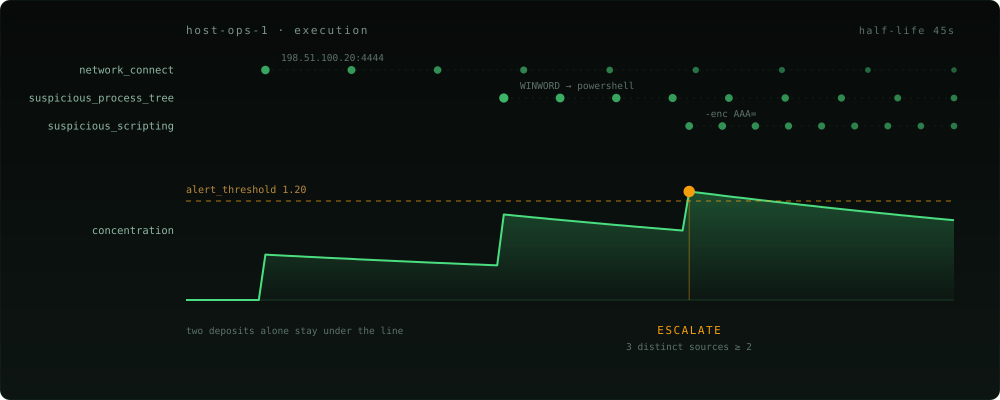
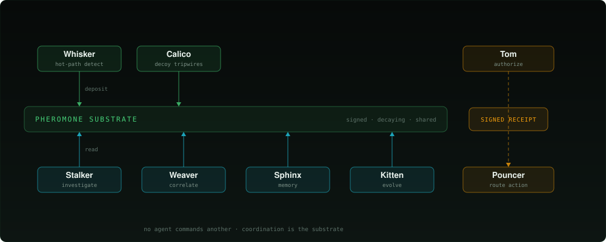
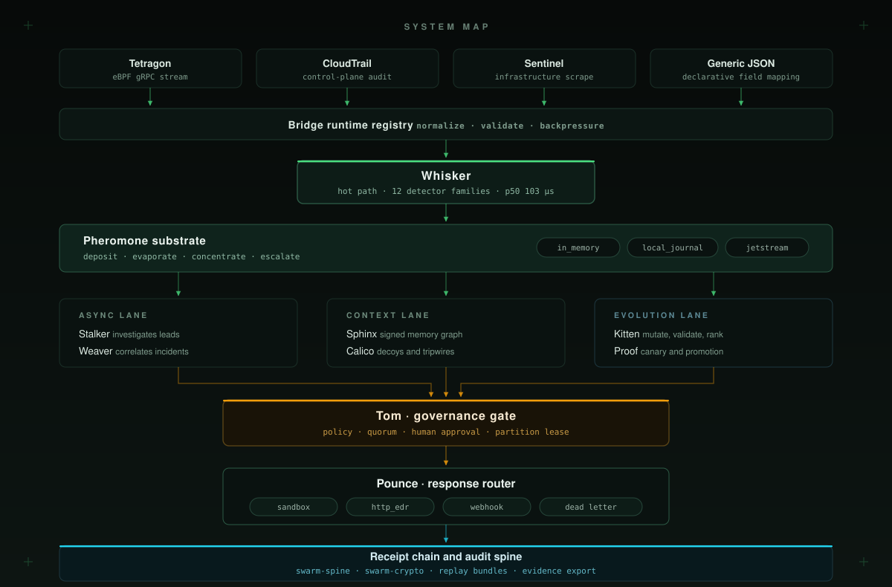
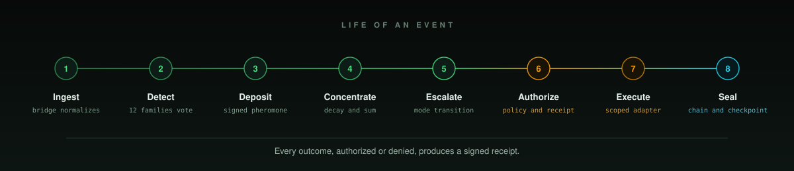
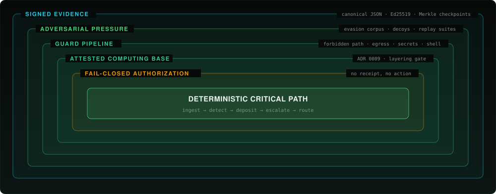
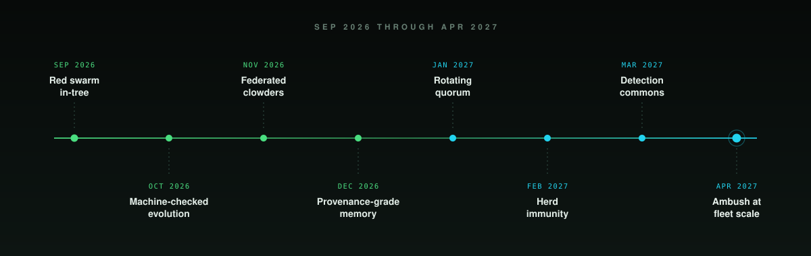
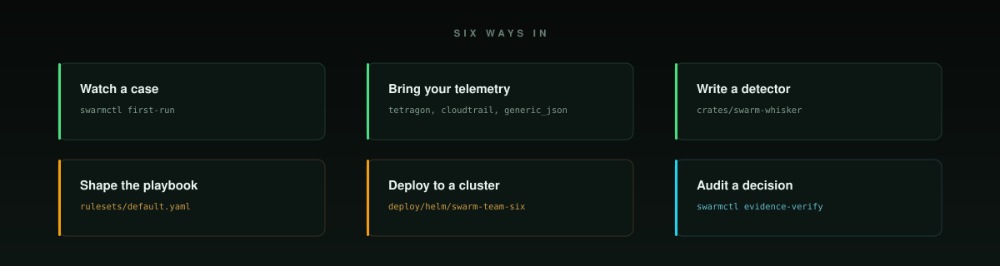

<p align="center">
  <picture>
    <source media="(max-width: 500px)" srcset="docs/assets/hero-mobile-v2.svg" />
    
  </picture>
</p>

<p align="center">
  <a href="LICENSE"></a>
  
  
  
  <a href="docs/ARCHITECTURE.md"></a>
  <a href="docs/CONSENSUS.md"></a>
</p>

<p align="center">
  <strong>Beat one detector. The swarm still has you.</strong>
</p>

<p align="center">
  <picture>
    <source media="(max-width: 500px)" srcset="docs/assets/subhead-mobile.svg" />
    
  </picture>
</p>

<p align="center">
  <a href="#see-it-hunt">See it hunt</a>&nbsp;&nbsp;&middot;&nbsp;&nbsp;
  <a href="#the-swarm-is-the-runtime">The swarm</a>&nbsp;&nbsp;&middot;&nbsp;&nbsp;
  <a href="#the-colony">The Colony</a>&nbsp;&nbsp;&middot;&nbsp;&nbsp;
  <a href="#bring-your-own-agent">BYO agent</a>&nbsp;&nbsp;&middot;&nbsp;&nbsp;
  <a href="#the-swarm-evolves-too">Evolution</a>&nbsp;&nbsp;&middot;&nbsp;&nbsp;
  <a href="#why-you-can-let-it-act">Why let it act</a>&nbsp;&nbsp;&middot;&nbsp;&nbsp;
  <a href="#prove-it-yourself">Prove it</a>&nbsp;&nbsp;&middot;&nbsp;&nbsp;
  <a href="#detection-coverage">Coverage</a>&nbsp;&nbsp;&middot;&nbsp;&nbsp;
  <a href="#quickstart">Quickstart</a>&nbsp;&nbsp;&middot;&nbsp;&nbsp;
  <a href="#architecture">Architecture</a>&nbsp;&nbsp;&middot;&nbsp;&nbsp;
  <a href="#benchmarks">Benchmarks</a>&nbsp;&nbsp;&middot;&nbsp;&nbsp;
  <a href="docs/ARCHITECTURE.md">Docs</a>
</p>

---

```sh
cargo install --git https://github.com/backbay-labs/ambush swarm-runtime-http --bin swarmctl
```

## What Ambush does

> A SIEM tells you what happened.<br>
> An XDR tells you what it blocked.<br>
> **Ambush proves what it saw, what it was allowed to do, and why it was allowed to do it.**

Ambush is a cyber swarm of agents that hunt like a colony and answer like a court.

Eight typed agents share one substrate. **No agent holds the picture.** Each one
deposits what it saw as a signed, decaying trace onto the host it saw it on, and
the threat assembles itself out of what accumulates. There is no central
correlator, no saved search, and no orchestrator handing out work. Detection is
what the substrate does.

The court half is literal. Every destructive action routes through a gate that will
not open without a signed authorization the dispatcher revalidates, and every
decision seals into a receipt that verifies offline.

Detect-only is the default. Live response is one config line, and the runtime
will refuse to enable it on a substrate that cannot survive a restart.

## See it hunt

```sh
swarmctl first-run --scenario scenarios/office-dropper-correlation.yaml
```

An Office document spawns two suspicious children (`T1204.002`, `T1059.001`, `T1105`).
Two detectors land on the same host, cross the escalation threshold together, and
correlate into one incident. **Neither hit would have escalated alone.**

```text
Incident:           incident:evt-first-run-1:...
Trigger strategy:   suspicious_process_tree
Threat class:       execution
Severity:           CRITICAL
Receipt pack:       approval-receipt-pack:...
Proof Merkle root:  0x...
```

That bundle verifies offline, by someone with no access to your runtime:

```sh
swarmctl evidence-export --kind replay-bundle --id <run-id>
swarmctl evidence-verify --bundle-id <bundle-id>
```

## The swarm is the runtime

The agents coordinate through **stigmergy**: cooperation by leaving marks in a shared
environment instead of by messaging each other. It is how ant colonies route around
obstacles. No individual holds the plan.

So a detector that sees something raises no alert and notifies nobody. It deposits a
**pheromone** — an Ed25519-signed observation bound to a host, a threat class, and the
detector that saw it, carrying a half-life. **Concentration** sums whatever is still
live. Posture changes when it crosses the threshold *and* enough distinct sources agree.

<p align="center">
  <picture>
    <source media="(max-width: 500px)" srcset="docs/assets/stigmergy-mobile.svg" />
    
  </picture>
</p>

|  |  |
| --- | --- |
| **Correlation without a correlation engine** | No windowed join, no saved search, no rule that says *if A and B within five minutes*. Accumulation is the correlation, and it works on pairings nobody wrote down in advance. |
| **Weak signals stop being wasted** | The medium-confidence hit you would never page on, and would never write a rule for, still deposits. The next detector to land on that host finds it already there. |
| **Evasion is priced against the whole swarm** | Beating one detector leaves the escalation intact. An adversary has to stay under the aggregate across every family at once, while the traces they already left are still decaying rather than gone. |
| **A noisy detector cannot page you** | One source never satisfies the distinct-source requirement, however loud it gets. Suppressing it means moving a threshold. |
| **It degrades instead of failing** | Lose a detector, a node, or a bridge and the substrate still holds what everything else deposited. |
| **No central brain to compromise** | Nothing pushes content or commands to your fleet. Each runtime activates locally on evidence it can verify. |

Substrate is pluggable: `in_memory` for the hot path, `local_journal` for durable
single-node, NATS JetStream when several runtimes share one set of trails.
Depth in [docs/PHEROMONES.md](docs/PHEROMONES.md).

## The Colony

<p align="center">
  <picture>
    <source media="(max-width: 500px)" srcset="docs/assets/colony-mobile.svg" />
    
  </picture>
</p>

Today's build compiles eight agents into one process, sharing one dispatcher, one
substrate, and one health model. No agent commands another. Only Tom can authorize a
destructive action, and only against a signed receipt.

<details>
<summary><b>The eight agents, their lanes, and what turns each one on</b></summary>

| Agent | Lane | What it owns | Enabled when |
| --- | --- | --- | --- |
| **Whisker** | Critical | Hot-path detection, threat-intel enrichment, signed pheromone deposit | Always, once admitted |
| **Pouncer** | Critical | Playbook matching, response request creation, veto emission | Always, once admitted |
| **Tom** | Governance | Governance health, receipts, vetoes, contingency leases, partition reports | Always, once admitted |
| **Stalker** | Async | Replay-backed investigation, bounded queue claims, persisted bundles | `investigation.enabled` |
| **Weaver** | Async | Time-windowed correlation of investigations into durable incidents | `correlation.enabled` |
| **Sphinx** | Memory | Typed knowledge graph, signed memory answers, retention and collection | `memory.enabled` |
| **Calico** | Deception | Decoy lifecycle, file, port, and credential tripwires, high-confidence findings | `deception.enabled` |
| **Kitten** | Evolution | Mutation cycles, population and lineage, ranking, proof and canary handoff | `evolution.enabled` |

</details>

## Bring your own agent

The eight roles ship in Rust. The substrate accepts anything that satisfies the agent
contract in [`swarm-core`](crates/swarm-core/src/agent.rs):

```rust
#[async_trait]
pub trait SwarmAgent: Send + Sync {
    fn identity(&self) -> &VerifyingKey;   // an admitted Ed25519 key
    fn id(&self) -> &AgentId;
    fn role(&self) -> AgentRole;
    async fn tick(&mut self, env: &SwarmEnvironment) -> Result<Vec<SwarmAction>, SwarmError>;
    fn health(&self) -> AgentHealth;
}
```

Anything that holds a key and returns actions on a tick satisfies it. Coordination runs
through the substrate, so an agent integrates by reading trails and returning signed
observations. That is the entire surface.

Which is what makes a model-backed agent — Claude, Codex, Hermes, or your own — tractable
to admit into a runtime that can isolate production hosts:

- **It deposits a signed observation.** `DepositPheromone` lands as one source among many,
  weighted and decaying like every other.
- **It cannot escalate alone.** The distinct-source rule that holds back a noisy detector
  holds back a confident hallucination.
- **It cannot authorize.** The strongest action available to any agent is
  `RequestResponse`. Tom issues the receipts, in deterministic Rust.
- **It cannot widen the hot path.** Whisker is the only role on the critical lane, so a
  four-second model call runs on an async lane.
- **It cannot take the runtime down.** A tick that panics is caught at the agent boundary
  and attributed to a role.

This works because the swarm never trusts any single agent. The same property that keeps
one detector from paging you at 3am is what makes a probabilistic agent safe to admit.

> **In flight.** The out-of-process host and its wire contract are what we are building
> now. Until they land, agents compile in and `AgentRole` is closed, so a third-party
> agent claims one of the eight roles. Tracked in the roadmap below.

## The swarm evolves too

Stigmergy is the coordination axis. Selection pressure is the second one, and it runs on
the detector population itself. Kitten scores live detectors against an adversarial
corpus, mutates the ones losing ground, and moves survivors through gates:

```text
pressure → mutate → replay-validate → rank → proof (Z3) → canary → promote
                                                    ↘ halt / rollback
```

Every stage persists an artifact, so a promoted detector is auditable back to the
pressure that produced it. See [docs/EVOLUTION.md](docs/EVOLUTION.md).

## Why you can let it act

A swarm that can isolate your production fleet has to be governable. Both properties
below are enforced in code.

**Destructive action requires a signed receipt.** Fifteen typed response actions are
available to the playbook. Three are destructive — `BlockEgress`, `IsolateHost`,
`RevokeCredential` — and none can execute without a signed governance receipt from Tom,
revalidated by the dispatcher before the request reaches an adapter, plus human approval
above your configured severity. Invalid config is rejected at load, degraded quorum
blocks destructive response, and an action the runtime cannot seal into a receipt is an
action it does not take.

**Containment has a timer on it.** Every enforced containment opens a lease with a
bounded life, a declared blast radius, and a real inverse. When it expires, the sweep
releases the containment; an operator can cut it short through the daemon's operator API,
co-signed on the governance chain. If the swarm is wrong at 3am and nobody is watching,
the containment lapses on its own.

## Prove it yourself

```sh
bash tools/run-integration-proof.sh
```

A bounded Compose stack runs the whole loop against mocked external systems: it detects an
encoded PowerShell child launched from `winword`, selects `isolate_host`, clears policy,
exchanges OAuth with a **CrowdStrike Falcon RTR** endpoint and calls isolate-device,
forwards the finding to **Splunk HEC**, and persists a replay bundle whose receipt names
both the adapter and the action. The script verifies four independent surfaces:
`/healthz`, `/metrics`, the mock sinks, and the bundle.
Details in [docs/INTEGRATION-PROOF.md](docs/INTEGRATION-PROOF.md).

## Detection coverage

**14 detector families · 32 ATT&CK techniques · 22 recorded scenarios · 4 curated suites.**
A detector set is a YAML list, not a code change, and per-strategy profiles tune
thresholds without touching Rust.

```sh
swarmctl replay-evaluate --suite scenario-suites/evasion-breadth-v1.yaml
```

Benign traffic is a corpus member, so a detector cannot win by alerting on everything.

<details>
<summary><b>All fourteen families and their profile knobs</b></summary>

| Family | Catches | Notable profile knobs |
| --- | --- | --- |
| `suspicious_process_tree` | Office and PDF dropper chains, LOLBin execution, unexpected parentage | Confidence thresholds |
| `suspicious_scripting` | Encoded PowerShell, obfuscated interpreters, script-host abuse | Encoding and entropy limits |
| `fileless_execution` | Injection into privileged targets, reflective loads, memory-only payloads | `min_region_size_bytes`, `privileged_target_processes` |
| `credential_access` | LSASS access, credential store harvesting | Target process set |
| `lateral_movement` | WMI, remote service stagers, remote admin paths | Auth and process correlation |
| `dns_exfiltration` | Tunneling and staged exfiltration over DNS | Query volume and entropy |
| `network_connect` | Suspicious ports, process and port mismatch, C2 beacons | `suspicious_ports`, `process_port_allowlist` |
| `persistence` | Autostart entries, scheduled tasks, service installation | Location allowlists |
| `supply_chain` | Compromised build and dependency execution paths | Provenance signals |
| `infrastructure_anomaly` | Sustained resource anomalies correlated with host activity | `min_sustained_high_cpu_samples`, `correlation_window_secs` |
| `behavioral_anomaly` | Novelty against a per-host baseline, rare role-tool pairings | `min_host_observations`, `baseline_half_life_secs`, `rare_role_tools` |
| `kill_chain_sequence` | Multi-stage sequences across a temporal event window | `rules_path`, window retention and match span |
| `cloudtrail` | AWS control-plane abuse from CloudTrail records | Event and principal filters |
| `kubernetes_audit` | Cluster control-plane abuse from Kubernetes audit logs | Verb, resource, and subject filters |

</details>

### What we do not catch, and why

[`attack-technique-catalog.yaml`](rulesets/evasion/attack-technique-catalog.yaml) records
**18 ATT&CK techniques across 11 detectors that Ambush deliberately does not cover**, each
with the technical reason:

> `T1550.002` · `lateral_movement` · Pass-the-hash behavior is not directly encoded in the current `AuthenticationEvent` normalization.

It is a checked-in file that CI reads. Gaps here are declared rather than discovered
during an incident.

## What's in the box

| | |
| --- | --- |
| **190,000+ lines of Rust** | 20 crates, one workspace, `unwrap_used` and `expect_used` denied across all of them |
| **1,200+ tests** | Plus 23 integration suites covering the critical path, dispatch, escalation, governance resilience, and multi-agent pipelines |
| **126 `swarmctl` subcommands** | Validation, replay, evidence export and verification, approval ledgers, canary and promotion gates, operator review |
| **14 CI gate scripts** | A trusted-computing-base layering gate, a runtime panic contract, a hot-path regression guard, and a gate that fails the build if any other gate stops being wired |
| **10 architecture decision records** | [`docs/decisions/`](docs/decisions/), including the TCB boundary stated in negative space |
| **160KB config reference** | [`docs/CONFIGURATION.md`](docs/CONFIGURATION.md), field by field |

## Quickstart

### 1. Install

```sh
cargo install --git https://github.com/backbay-labs/ambush swarm-runtime-http --bin swarmctl
```

<sub>Or from source: <code>git clone https://github.com/backbay-labs/ambush && cd ambush && cargo build --release</code>, then use <code>./target/release/swarmctl</code>. A Docker path is in <a href="docs/QUICKSTART.md">docs/QUICKSTART.md</a>.</sub>

### 2. Watch a hunt, then check your config

Configuration is repo-owned YAML under `rulesets/`, validated fail-closed.
Unknown fields are rejected, invalid values are rejected at load, and a bad
ruleset never reaches a running detector.

```sh
swarmctl first-run --scenario scenarios/office-dropper-correlation.yaml
swarmctl validate                     # parse and check rulesets/default.yaml
swarmctl validate --check-endpoints   # also probe configured adapter endpoints
swarmctl init --mode detect_only --output rulesets/mine.yaml
```

Preview what the playbook would do for a finding, without running anything:

```sh
swarmctl playbook-preview --threat-class execution --severity HIGH --confidence 0.95
```

### 3. Point it at your telemetry

Sources are declared, not compiled. Add a bridge to `runtime.telemetry_sources`:

```yaml
runtime:
  telemetry_sources:
    - name: tetragon-primary
      bridge: { kind: tetragon, endpoint: http://tetragon.kube-system:54321 }
    - name: cloudtrail-primary
      bridge: { kind: cloud_trail, path: data/cloudtrail.jsonl }
```

Anything that emits JSON works without writing Rust. The `generic_json` bridge
takes a declarative field mapping, so you point it at your existing log shape
rather than reshaping your pipeline to suit the tool. Mapping syntax and the
full source catalog are in [docs/CONFIGURATION.md](docs/CONFIGURATION.md).

Then serve it:

```sh
swarmctl readiness   # environment and dependency preflight
swarmctl serve       # start the runtime
swarmctl status      # runtime, lane, and governance state
```

The served runtime exposes `POST /v1/ingest/events` for direct submission,
`/v1/events/stream` for live runtime events, `/readyz`, `/healthz`, `/livez`,
`/startupz`, and `/prestop` for lifecycle, and `/metrics` for the request,
stage-latency, heap-pressure, bridge-health, and ingest-rate series operators
alert on.

### 4. Turn on live response

```yaml
runtime:
  mode: live_response
  require_durable_live_response: true

policy:
  human_gate_severity: HIGH
  lease_ttl_ms: 60000

response_adapter:
  kind: sandbox                      # or http_edr, crowdstrike_rtr, or webhook
```

---

**More:** `swarmctl identity rotate` (per-role key rotation) &middot;
`swarmctl evolution status` (evolution lane state) &middot; `swarmctl canary-start`
and `swarmctl promotion-start` (rollout gates) &middot;
`swarmctl review-session-create` (operator review workbench) &middot;
`deploy/helm/swarm-team-six` (cluster deployment with bundled NATS).

## Architecture

Telemetry enters through bridges that normalize it into one typed event. Whisker
is the only role on the critical latency path for every event. Everything
downstream reads the substrate rather than the wire, so async lanes enrich
operator understanding without widening the hot path or the safety boundary.

<p align="center">
  <picture>
    <source media="(max-width: 500px)" srcset="docs/assets/architecture-mobile.svg" />
    
  </picture>
</p>

The critical lane is deterministic: the same event and the same config produce
the same verdict, every time. The async, context, and evolution lanes are
optional, individually gated by config, and bounded by queue limits and time
budgets. **None of them can authorize a response, and none of them can block
ingest.**

### Life of an event

<p align="center">
  <picture>
    <source media="(max-width: 500px)" srcset="docs/assets/lifecycle-mobile.svg" />
    
  </picture>
</p>

| Step | What happens |
| --- | --- |
| **1 &middot; Ingest** | A bridge reads its source, normalizes the record into a typed `TelemetryEvent`, validates it, and applies backpressure. Malformed records are rejected at the edge. |
| **2 &middot; Detect** | The configured detector set evaluates the event. Composite mode runs several strategies over the same event and combines their verdicts into one scored finding. |
| **3 &middot; Deposit** | The finding becomes a pheromone: an Ed25519-signed deposit bound to host, threat class, and source, written by an admitted identity. |
| **4 &middot; Concentrate** | The monitor sums live evidence for that host and class, applying each deposit's half-life. Signals nothing reinforces fall below the evaporation threshold. |
| **5 &middot; Escalate** | Concentration crossing the alert or incident threshold, backed by the required number of distinct sources, moves the swarm mode up and publishes the transition. |
| **6 &middot; Authorize** | Pounce matches the escalated finding to the playbook and asks Tom. Tom returns a signed governance receipt, a veto, or a contingency lease. Human approval applies above the configured severity. |
| **7 &middot; Execute** | The dispatcher revalidates the governance artifact, then the response router runs the action through the configured adapter under lease and policy checks, with retry, circuit breaking, and a dead-letter path. |
| **8 &middot; Seal** | The outcome is written into the receipt chain, folded into a checkpoint, and made available to replay, evidence export, and operator review. |

Authorized or denied, every outcome produces a signed receipt.

### The codebase

| Crate | What lives there |
| --- | --- |
| `swarm-core` | Shared domain types, telemetry and pheromone contracts, verdicts, and the full config surface |
| `swarm-whisker` | Detection strategies, the composite detector, and the stream runtime |
| `swarm-pheromone` | The substrate: deposit, evaporation, concentration, and the JetStream backend |
| `swarm-policy` | The deterministic gate, static and configurable, with lease and approval context |
| `swarm-response` | Adapters (sandbox, EDR, CrowdStrike RTR, webhook), SIEM forwarding, containment leases, rollback, resilience, and dead letters |
| `swarm-runtime` | Composition root: dispatcher, config, control, approval, and replay |
| `swarm-agents` | Role implementations behind the sealed `swarm_core::agent` boundary |
| `swarm-spine` | Envelopes, receipt chain, checkpoints, investigation and incident stores |
| `swarm-crypto` | Ed25519 signing, canonical JSON, hashing, and Merkle helpers |
| `swarm-consensus` | Quorum primitives for the governance lane |
| `swarm-guard` | Forbidden paths, path normalization, egress allowlists, secret-leak and shell-command checks |
| `swarm-evolution` | Evidence, governance prep, operator maintenance, and portfolio |
| `swarm-ingest-*` | Tetragon eBPF, CloudTrail and generic JSON, Sentinel metrics, STIX/TAXII, and the bridge runtime |
| `swarm-runtime-http` | The authenticated operator HTTP surface and the `swarm_detect` and `swarmctl` binaries |
| `swarm-cli` | The operator CLI command surface over runtime-owned service APIs |
| `swarm-runtime-workbench` | The offline review workbench |

Contracts live in [docs/ARCHITECTURE.md](docs/ARCHITECTURE.md),
[docs/AGENTS.md](docs/AGENTS.md), [docs/CONSENSUS.md](docs/CONSENSUS.md),
[docs/EVOLUTION.md](docs/EVOLUTION.md), and
[docs/CONFIGURATION.md](docs/CONFIGURATION.md).

## Integrations

| Layer | Surfaces |
| --- | --- |
| **Telemetry in** | Tetragon (eBPF, gRPC) &middot; AWS CloudTrail &middot; Kubernetes audit &middot; Prometheus and Sentinel scrape &middot; STIX/TAXII intel &middot; Generic JSON with declarative field mapping &middot; `POST /v1/ingest/events` |
| **Substrate** | In-memory &middot; local journal &middot; NATS JetStream for multi-instance runtimes |
| **Response out** | CrowdStrike Falcon RTR &middot; generic HTTP EDR &middot; webhook &middot; sandbox, each with timeout, retry, circuit breaker, lease, and dead-letter handling |
| **Findings out** | Splunk HEC &middot; Elastic bulk &middot; Google Chronicle &middot; canonical `swarm_finding` forwarding &middot; replayable notification routing |
| **Observability** | Prometheus `/metrics` &middot; OpenTelemetry OTLP traces &middot; structured JSON logs &middot; `/v1/events/stream` |
| **Operator** | `swarmctl` &middot; authenticated local review routes &middot; versioned platform APIs under `/v2/api/*` |
| **Deployment** | Helm chart with bundled NATS subchart &middot; Docker &middot; production values &middot; SBOM release workflow |
| **Clients** | Python platform client under `clients/python` |

Adapter credentials resolve through `@secret:<name>` references against
`runtime.secret_dir`, so no secret is written into a ruleset.

## Security and trust

<p align="center">
  <picture>
    <source media="(max-width: 500px)" srcset="docs/assets/security-mobile-v2.svg" />
    
  </picture>
</p>

Detection may be permissive. Action may not. The critical lane sits at the core and
five layers wrap it, each failing closed.

- **Deterministic critical lane.** Ingest, detect, deposit, escalate, and route
  stay in one language and one type system, with `unwrap` and `expect` denied
  workspace-wide and a CI gate that enforces the runtime panic contract.
- **Fail-closed authorization.** Invalid config is rejected at load. Destructive
  actions require a signed receipt that the dispatcher revalidates. Degraded
  quorum blocks destructive response while leaving observability and recovery
  inspection open.
- **A named trusted computing base.** [ADR 0009](docs/decisions/0009-trusted-computing-base-boundary.md)
  states what the TCB may never link, and `tools/check-workspace-layering.sh`
  fails the build from `cargo metadata` if that boundary is crossed.
- **Guard pipeline.** Forbidden-path and path-normalization checks, egress
  allowlists, secret-leak detection, and shell-command screening run before
  anything crosses a boundary.
- **Signed evidence.** Canonical JSON, Ed25519 signatures, Merkle checkpoints,
  and content-addressed bundles, so a receipt verifies offline and independently
  of the runtime that produced it.

Governance modes bound what any of this can reach:

| Mode | Applies to | Requires |
| --- | --- | --- |
| Observation | Detection, investigation, correlation, memory, deception, status | Signed deposits and ordinary audit |
| Guarded response | Escalation, decoy deployment, other non-destructive actions | Policy validation and audit trail |
| Receipt-backed response | `BlockEgress`, `IsolateHost`, `RevokeCredential` | Signed governance receipt, policy validation, human approval when configured |
| Partition contingency | Destructive response while quorum is partitioned | Valid pre-staged lease, blast-radius cap, later reconciliation |
| Maintenance-only | Operator review, export, replay, bounded upkeep | Authenticated operator access and maintenance audit |

Each role and slot holds a persisted Ed25519 seed and a stable
`swarm:ed25519:<hex>` identity. An identity the registry has not admitted never
joins the dispatcher and never deposits trusted pheromones.

Supply chain is gated in CI with `cargo deny` and `cargo audit`, and releases
publish an SBOM. Report vulnerabilities privately per [SECURITY.md](SECURITY.md).

## Benchmarks

Numbers come from shipped benchmark targets in the repo, not from projections.
The hot-path figures below are the tracked baseline that
`tools/check-hot-path-regression.sh` gates against in CI. Rerun them on your own
host before making a capacity claim.

**Hot path**, `cargo bench -p swarm-runtime --bench hot_path`, 20,000 iterations
after 1,000 warmup, covering ingest parse, detector evaluation, signed deposit,
persistence, and concentration evaluation:

| Backend | p50 | p95 | p99 | Throughput |
| --- | --- | --- | --- | --- |
| `in_memory` | 132.79 &micro;s | 153.25 &micro;s | 224.54 &micro;s | 6,364 events/sec |

**End to end over HTTP**, `cargo run -p swarm-runtime --release --example end_to_end_ingest_bench`,
covering loopback `POST /v1/ingest/events`, parse and validation, detection,
policy, replay persistence, and a `local_journal` deposit:

| Profile | p50 | p95 | p99 | Throughput |
| --- | --- | --- | --- | --- |
| `local_journal` steady state | 6.64 ms | 8.14 ms | 9.75 ms | 3,645 events/sec |

The same example ships a `ramp_until_shed` mode that doubles concurrency until
`/readyz` returns `503`, so the first readiness-shedding stage is measured on the
same runtime path rather than estimated. Full method and reference host in
[docs/benchmarks/](docs/benchmarks/).

## Roadmap

<p align="center">
  <picture>
    <source media="(max-width: 500px)" srcset="docs/assets/roadmap-mobile.svg" />
    
  </picture>
</p>

The runtime is in place. What follows is the frontier it opens: a defense that
gets harder to evade every time someone tries. Monthly cadence, targeting April
2027; the windows are indicative.

- **Red swarm in-tree.** Adversary operators land as a first-class lane, so every
  detector is scored against something that adapts instead of against a fixture.
  Blue fitness and red fitness degrade each other, and the arms race runs in CI.
- **Machine-checked evolution.** Z3 and Lean 4 gates on the promotion path, so a
  promoted detector carries a proof of its safety invariants rather than a
  passing test run.
- **Open agent protocol.** An out-of-process agent host and a published deposit
  contract, so an agent written in any language, or backed by a model, joins the swarm
  as an admitted identity over the wire instead of being compiled into the runtime. The
  trust argument does not change: it deposits evidence, and it still cannot authorize.
- **Federated colonies.** Cross-operator pheromone and receipt exchange, where
  each operator activates locally and shares evidence rather than control.
- **Provenance-grade memory.** Four parallel graphs, temporal, causal, entity, and
  semantic, replacing flat correlation with kill-chain reconstruction that
  survives across hunts.
- **Rotating quorum.** VRF-selected Byzantine-fault-tolerant governance
  committees, so destructive authority is never anchored to a fixed set of
  long-lived keys.
- **Herd immunity.** Deception, information-flow control, and reversible
  quarantine composed into a fleet-wide immune response.
- **The detection commons.** A published receipt and pheromone protocol, a
  conformance suite, and certification for third-party runtimes: an interoperable
  detection substrate owned by no one.
- **Ambush at fleet scale.** Autonomous containment across a whole estate, where
  every action is authorized, priced against blast radius, and provable after the
  fact.

Full detail in [docs/ROADMAP.md](docs/ROADMAP.md). The research this builds on,
from DARPA CHASE through the HOLMES and ATLAS provenance work, is in
[docs/RESEARCH.md](docs/RESEARCH.md).

## Where to start

<p align="center">
  <picture>
    <source media="(max-width: 500px)" srcset="docs/assets/paths-mobile.svg" />
    
  </picture>
</p>

- **Watch a hunt** &rarr; `swarmctl first-run --scenario scenarios/office-dropper-correlation.yaml`
- **Prove the response loop** &rarr; `bash tools/run-integration-proof.sh`
- **Bring your own telemetry** &rarr; [docs/CONFIGURATION.md](docs/CONFIGURATION.md)
- **Write a detector** &rarr; [crates/swarm-whisker](crates/swarm-whisker)
- **Shape the response playbook** &rarr; [rulesets/default.yaml](rulesets/default.yaml)
- **Attack your own detectors** &rarr; `swarmctl replay-evaluate --suite scenario-suites/evasion-breadth-v1.yaml`
- **Deploy to a cluster** &rarr; [deploy/helm/swarm-team-six](deploy/helm/swarm-team-six)
- **Audit a decision** &rarr; [docs/CONSENSUS.md](docs/CONSENSUS.md) and `swarmctl evidence-verify`
- **Recover from an incident** &rarr; [docs/DR-RUNBOOK.md](docs/DR-RUNBOOK.md)

## Contributing

Contributions are welcome. Read [CONTRIBUTING.md](CONTRIBUTING.md) for the
workflow and [CODE_OF_CONDUCT.md](CODE_OF_CONDUCT.md) for community
expectations. The fast local loop before opening a pull request is:

```bash
cargo fmt --all -- --check && \
cargo clippy --workspace --all-targets -- -D warnings && \
cargo build --workspace --all-targets && \
cargo test --workspace
```

That is a **subset**, not the gate. CI also runs the repo-owned
`tools/check-*.sh` scripts plus `tools/verify-release-hardening.sh` on the
release workflow. [CONTRIBUTING.md](CONTRIBUTING.md) lists all of them with
their prerequisites and the order to run them in, and `tools/check-gates-wired.sh`
fails the build if any of them stops being invoked by a workflow.

`vendor/reference/` holds source trees copied from ClawdStrike, Hellcat, and
Cyntra for adaptation. They are inspiration and provenance, not runtime
dependencies. `.planning/` holds milestone history. Neither is part of the active
contract; see [docs/REFERENCE-STATUS.md](docs/REFERENCE-STATUS.md).

## License

Apache-2.0. See [LICENSE](LICENSE).
