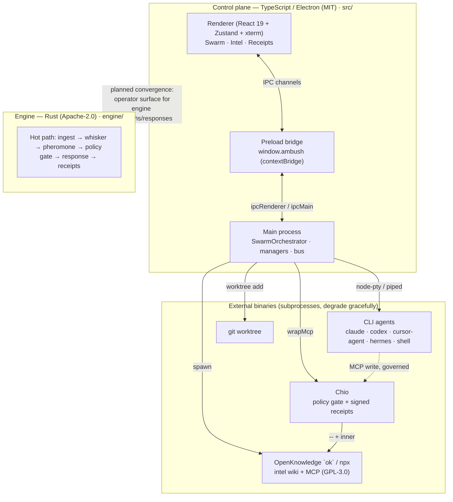
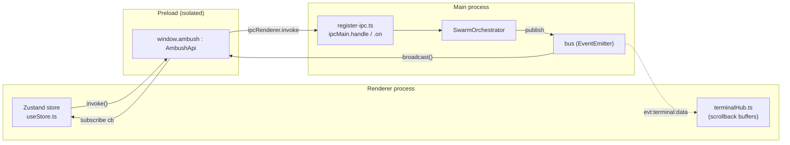
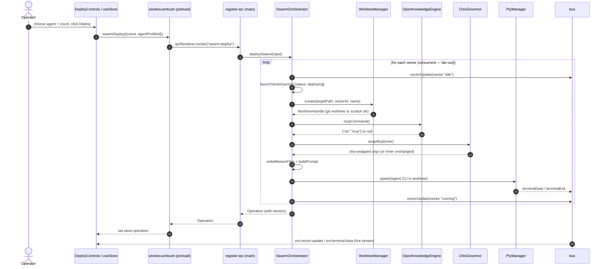
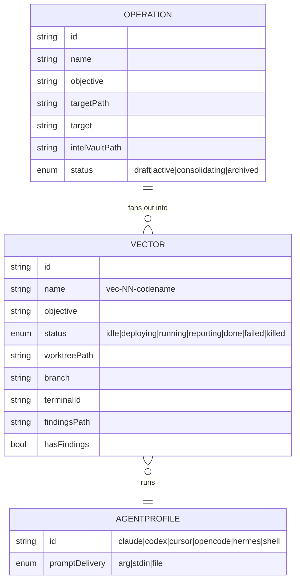
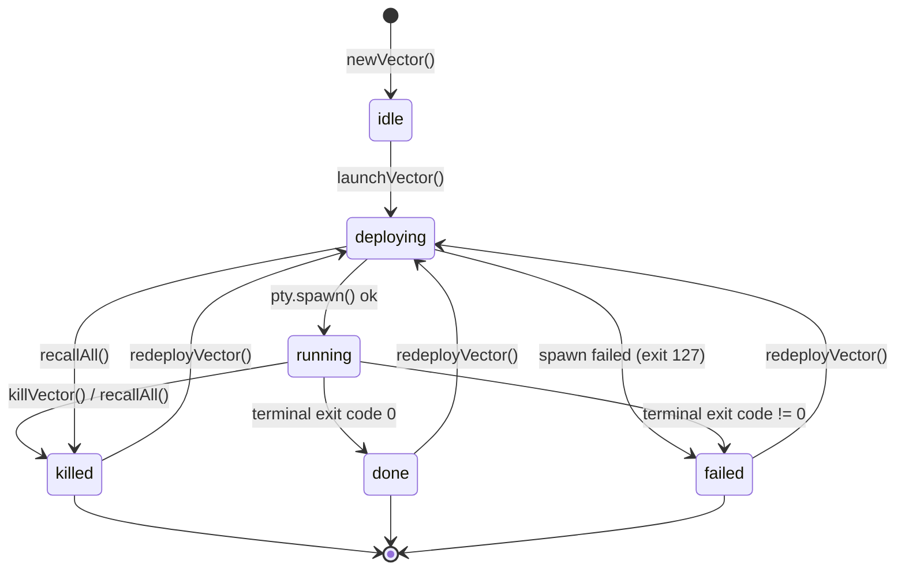
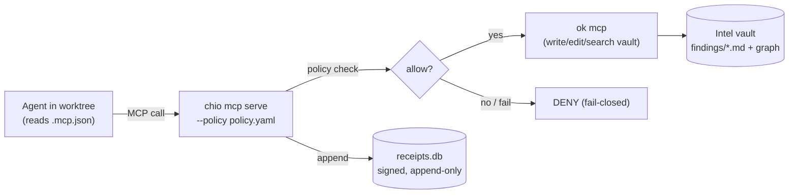
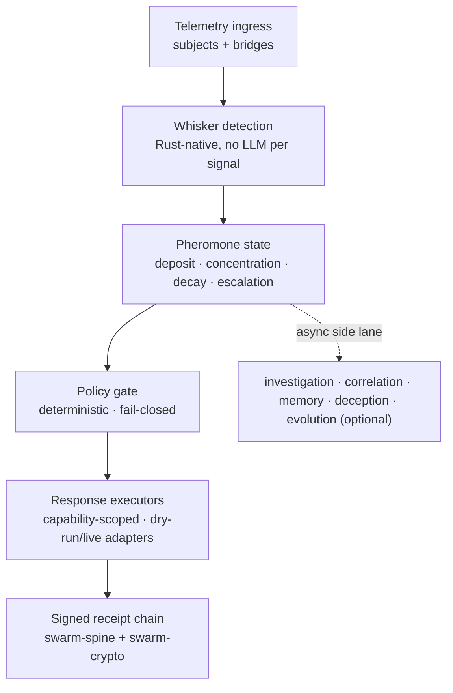

# Ambush Architecture

> **Codename:** Vector Swarm — a cybersecurity agent-swarm operations desktop app.

Ambush turns a single mission (an **Operation**) into many parallel agents
(**Vectors**), each running a CLI coding/red-team agent inside its own isolated
git worktree and live terminal. Findings stream into a shared **OpenKnowledge**
intel vault (a markdown wiki + graph), and every governed agent tool call is
recorded as a signed, fail-closed **Chio** receipt. The hero capability is
spinning up massive agentic horsepower on a dime — emergency-response style — and
CTF solving is the proving ground.

This document covers both halves of the project, the control-plane process model,
the domain model, the major subsystems, the Rust engine, the cross-cutting
principles, and a file-path map.

---

## 1. System Overview: Two Halves

Ambush is two distinct codebases that share a worldview (fan-out, fail-closed
governance, signed receipts) but ship and run independently today.

| Half | Path | Language / Stack | License | Role |
| --- | --- | --- | --- | --- |
| **Control plane** | [`src/`](../src) | TypeScript · Electron · `electron-vite` · React 19 · Tailwind 4 · Zustand · xterm · node-pty | MIT | Operator surface: deploy/observe/govern a live agent swarm. Mirrors Orca's structure. |
| **Engine** | [`engine/`](../engine) | Rust workspace (`cargo`) | Apache-2.0 | Autonomous detection + live-response runtime ("Swarm Team Six / ClawdStrike Ambush"). |

They are **separate processes / separate build systems**. The control plane is
the shipping product; the Rust engine is a parallel runtime whose planned
convergence is described in [§5](#5-the-rust-engine).



---

## 2. Control-Plane Process Model

Electron's three-context model is strictly enforced. The renderer never touches
Node APIs directly — everything crosses through the preload `contextBridge`.

- **Main** ([`src/main/index.ts`](../src/main/index.ts)) — Node/Electron. Owns
  the `BrowserWindow`, constructs the long-lived managers, and wires IPC.
- **Preload** ([`src/preload/index.ts`](../src/preload/index.ts)) — exposes a
  single typed object, `window.ambush`, via `contextBridge.exposeInMainWorld`.
- **Renderer** ([`src/renderer/src/`](../src/renderer/src)) — React 19 + Zustand.
  Reaches the main process only through `window.ambush`.



### 2.1 The IPC contract pattern

[`src/shared/ipc.ts`](../src/shared/ipc.ts) is the **single source of truth** for
the IPC surface. It declares two things, both imported by preload *and* renderer:

1. The `IPC` channel-name map — request/response channels (`swarm:deploy`,
   `operation:create`, …) and event channels (`evt:vector:update`,
   `evt:terminal:data`, …).
2. The `AmbushApi` interface — the exact typed shape of `window.ambush`.

The contract is honored in three places, which must stay in lockstep
(this is the rule called out in [`AGENTS.md`](../AGENTS.md)):

| Step | File | What it does |
| --- | --- | --- |
| Declare | [`src/shared/ipc.ts`](../src/shared/ipc.ts) | Add a channel to `IPC` and a method to `AmbushApi`. |
| Implement | [`src/main/ipc/register-ipc.ts`](../src/main/ipc/register-ipc.ts) | `ipcMain.handle`/`.on` the channel, delegate to a manager. |
| Expose | [`src/preload/index.ts`](../src/preload/index.ts) | Map the `AmbushApi` method to `ipcRenderer.invoke`/`.send`/subscribe. |

Two transport styles are used:

- **Request/response** via `ipcRenderer.invoke` → `ipcMain.handle` (e.g.
  `swarmDeploy`, `operationCreate`, `receiptsList`).
- **Fire-and-forget** via `ipcRenderer.send` → `ipcMain.on` for hot terminal I/O
  (`terminalWrite`, `terminalResize`), avoiding promise overhead per keystroke.

### 2.2 The event bus

Main-process managers don't hold `webContents` references. Instead they publish to
an in-process `EventEmitter` — the bus ([`src/main/util/bus.ts`](../src/main/util/bus.ts)).
The IPC layer subscribes once and **broadcasts every bus event to all renderer
windows** ([`register-ipc.ts`](../src/main/ipc/register-ipc.ts), the
`broadcast()` loop). The bus exposes typed helpers: `bus.log`, `bus.terminalData`,
`bus.terminalExit`, `bus.vectorUpdate`, `bus.operationUpdate`, `bus.engineUpdate`,
`bus.governorUpdate`. This keeps managers decoupled from Electron windowing.

One bus event also loops back into domain state: `register-ipc.ts` listens for
`evt:terminal:exit` and calls `orchestrator.onTerminalExit(...)` so vector status
follows the underlying process lifecycle.

### 2.3 Sequence: "deploy swarm"



Note that `deploySwarm` launches each lane with `void this.launchVector(...)`
**without awaiting** — concurrency of fan-out is the whole point
([`swarm-orchestrator.ts`](../src/main/swarm/swarm-orchestrator.ts), `deploySwarm`).

---

## 3. Domain Model

The authoritative types live in [`src/shared/types.ts`](../src/shared/types.ts).

- An **Operation** is the mission/incident. It has a target (`targetPath` for a
  repo/dir, or free-form `target` for a host/URL/CTF endpoint), an
  `intelVaultPath`, a status, and a list of `vectors`.
- A **Vector** is one work lane owned by a single agent. It carries its
  `agentProfileId`, an isolated `worktreePath` + `branch`, a `terminalId`, and a
  `findingsPath` (relative to the intel vault).
- An **AgentProfile** ([`src/shared/agents.ts`](../src/shared/agents.ts)) describes
  a CLI runtime: its `command`, how the prompt is delivered (`arg` | `stdin` |
  `file`), and a lucide icon. Built-ins: `claude`, `codex`, `cursor`, `opencode`,
  `hermes`, and `shell` (the always-works default).



### 3.1 Vector lifecycle

`VectorStatus` transitions are driven by
[`swarm-orchestrator.ts`](../src/main/swarm/swarm-orchestrator.ts)
(`setVectorStatus`, `launchVector`, `onTerminalExit`, `killVector`,
`redeployVector`).



Notes:

- `reporting` is defined in the type union but is not yet a distinct
  orchestrator-driven transition; agents report continuously while `running`.
- On restart, `loadPersisted()` downgrades any `running`/`deploying` vectors to
  `idle` and clears `terminalId` (the old processes are gone). Operations persist
  to `<userData>/operations/current.json`.
- `hasFindings` is recomputed on terminal exit via `checkFindings()` (the findings
  file exists and is non-empty).

---

## 4. Subsystems

### 4.1 Worktree isolation

[`src/main/swarm/worktree-manager.ts`](../src/main/swarm/worktree-manager.ts)
gives every vector its own working directory:

- If the target is a **git repo**, each vector gets a dedicated
  `git worktree add -b <branch> <dest> <baseRef>` rooted at
  `<target>/.ambush/worktrees/<vectorId>` (Orca-style isolation). If the branch
  already exists (redeploy), it retries `worktree add` without `-b`.
- If the target is **not** a repo (CTF endpoint, host, empty dir) or worktree
  creation fails, it falls back to a plain per-vector scratch directory so the
  mechanism still works everywhere. The returned `WorktreeHandle` records
  `isGit` so `remove()` can choose `git worktree remove` vs `rmSync`.

### 4.2 PTY management + fallback

[`src/main/terminal/pty-manager.ts`](../src/main/terminal/pty-manager.ts) spawns
each agent and bridges its I/O to the bus:

- Primary path: **node-pty** real TTYs, so TUI agents render correctly. node-pty
  is a native module that needs a rebuild against Electron (`pnpm run rebuild`).
- It is loaded **lazily** (`import('node-pty')`). If the import or spawn fails,
  `PtyManager` transparently falls back to a piped `child_process` (no TTY) so the
  swarm still runs headlessly.
- Output is published as `bus.terminalData`; exit as `bus.terminalExit`. On the
  renderer side, [`terminalHub.ts`](../src/renderer/src/lib/terminalHub.ts) buffers
  per-terminal scrollback (capped) so switching panes replays history, and
  [`TerminalPane.tsx`](../src/renderer/src/components/TerminalPane.tsx) attaches a
  live xterm instance.

### 4.3 OpenKnowledge engine embedding (subprocess + MCP wrap)

[`src/main/engine/openknowledge-engine.ts`](../src/main/engine/openknowledge-engine.ts)
embeds OpenKnowledge as the swarm's shared intel brain. **OpenKnowledge is
GPL-3.0; Ambush is MIT**, so it is invoked *strictly as a subprocess* and never
imported (see [`AGENTS.md`](../AGENTS.md) external-tool rules).

- **Resolution order:** a local `ok` binary, else `npx -y @inkeep/open-knowledge@latest`
  (`resolveInvoker()`); otherwise `source: 'none'` and the engine reports
  unavailable.
- `configure(vaultPath)` initializes the vault as an OK project once (`ok init
  --no-mcp`, idempotent via a `.ok` marker).
- `start()` spawns the OK web UI (with `PORT`), parses the URL from stdout, and the
  renderer embeds it through an Electron `<webview>`
  ([`IntelPane.tsx`](../src/renderer/src/components/IntelPane.tsx)). Window
  creation enables `webviewTag: true` in [`index.ts`](../src/main/index.ts).
- `mcpCommand()` returns the **argv** an agent uses to reach the vault over MCP
  (`[ok, mcp]`), returned as an array precisely so Chio can wrap it.

### 4.4 Chio governance (policy + receipts)

[`src/main/governance/chio-governor.ts`](../src/main/governance/chio-governor.ts)
wraps the intel MCP server so every agent action against the vault produces a
signed, append-only receipt.

- `configure(opsDir)` looks for `chio` on PATH. If absent, the swarm runs
  **ungoverned** (degrades gracefully). If present, it writes a default
  fail-closed HushSpec-style `policy.yaml` (allow the intel tools — `search`,
  `write`, `edit`, `move`, `exec`, … — and explicitly `deny: delete`) and points
  at a `receipts.db`.
- `wrapMcp(inner)` composes the governed launch command:
  `chio --receipt-db <db> mcp serve --policy <policy.yaml> --server-id
  open-knowledge -- <inner ok mcp argv>`. If Chio is unavailable, it returns
  `inner` unchanged.
- The orchestrator writes the wrapped command into each worktree's `.mcp.json`
  ([`mission.ts`](../src/main/swarm/mission.ts), `writeMissionFiles`) so harness
  agents (Claude/Cursor/Codex) auto-wire the governed `open-knowledge` server.
- `listReceipts()` shells `chio … receipt list --admin-all --json` and normalizes
  results (tolerant of JSONL or a single JSON array; verdicts ALLOW/DENY/
  CANCELLED/INCOMPLETE/UNKNOWN) for the
  [`ReceiptsPane.tsx`](../src/renderer/src/components/ReceiptsPane.tsx).



### 4.5 Consolidation into RUNBOOK.md

`SwarmOrchestrator.consolidate()` rolls every vector's findings file into a single
linked kill-chain runbook. It sets the operation to `consolidating`, reads
`<intelVault>/findings/*.md`, and writes `<intelVault>/RUNBOOK.md` with a vector
checklist (`[[wiki-links]]` to each finding) plus the collected intel inline, then
returns the path. Triggered from the Intel pane's "Consolidate" button
([`IntelPane.tsx`](../src/renderer/src/components/IntelPane.tsx)).

---

## 5. The Rust Engine

The engine under [`engine/`](../engine) is **Swarm Team Six / ClawdStrike
Ambush** — a Rust-first autonomous detection and live-response runtime
(Apache-2.0). Its product proof point is *fast detection with safe live response*,
not a full multi-agent platform.

### 5.1 Hot path

Per [`engine/README.md`](../engine/README.md) and
[`engine/docs/ARCHITECTURE.md`](../engine/docs/ARCHITECTURE.md), the critical lane
that must stay deterministic and safe is:



### 5.2 Crates

The active Rust workspace ([`engine/crates/`](../engine/crates)):

| Crate | Responsibility |
| --- | --- |
| [`swarm-core`](../engine/crates/swarm-core) | Core domain types, traits, pheromone primitives. |
| [`swarm-whisker`](../engine/crates/swarm-whisker) | Streaming detection agents — Rust-native, no LLM per signal. |
| [`swarm-pheromone`](../engine/crates/swarm-pheromone) | Pheromone substrate: deposit/query/decay (optionally over NATS JetStream). |
| [`swarm-policy`](../engine/crates/swarm-policy) | Deterministic live-response policy gate + capability issuance. |
| [`swarm-response`](../engine/crates/swarm-response) | Live-response execution traits, adapters, and receipts. |
| [`swarm-runtime`](../engine/crates/swarm-runtime) | Composition root wiring detection, substrate, policy, response; HTTP/operator surfaces. |
| [`swarm-spine`](../engine/crates/swarm-spine) | Signed envelopes, checkpoints, Merkle audit trail. |
| [`swarm-crypto`](../engine/crates/swarm-crypto) | Ed25519, SHA-256, Merkle trees, canonical JSON. |

Adjacent crates also present: `swarm-guard` (safety rules), `swarm-consensus`
(deferred/optional governance), `swarm-evolution`, `swarm-cli`, and the
`swarm-ingest-*` bridges (json, tetragon, sentinel).

### 5.3 Relationship to the control plane

- **Current state: separate.** The control plane (TypeScript/Electron) and the
  engine (Rust) are independent codebases with independent build systems and
  licenses (MIT vs Apache-2.0). The control plane orchestrates *CLI coding/red-team
  agents*; the engine performs *autonomous telemetry detection + response*. They
  are not wired together at runtime today.
- **Planned convergence.** The intended direction is for the control plane to
  become the **operator surface** for engine detections and responses — i.e., the
  same Electron app that today deploys agent vectors would also visualize whisker
  detections, pheromone state, and the engine's response/receipt chain, and let an
  operator approve receipt-backed (destructive) responses. The two halves already
  share the same primitives (fail-closed gates, capability scoping, signed
  receipt chains), which is what makes the convergence natural.

---

## 6. Cross-Cutting Principles

1. **Fan-out at scale.** Deploying a swarm launches lanes concurrently and
   non-blockingly (`void launchVector(...)`); count is clamped 1–100 in
   `deploySwarm`/`scale`. The product promise is emergency-response horsepower on
   demand; the `shell` profile guarantees the mechanism is demonstrable even with
   zero agent CLIs installed.
2. **Fail-closed governance.** Chio's default policy denies anything not
   explicitly allowed, and the engine fails closed for destructive response when
   quorum/authorization is unavailable. Action is gated; observation is permissive.
3. **Signed receipts / non-repudiation.** Every governed intel write becomes a
   signed, append-only Chio receipt (control plane); the engine builds a signed
   Merkle receipt chain via `swarm-spine` + `swarm-crypto`. The mission brief tells
   agents that their writes are receipt-logged.
4. **Graceful degradation.** Every external binary is optional and detected at
   runtime, logging its state to the bus:
   - missing **node-pty** → piped `child_process` fallback (no TTY);
   - missing **agent CLI** → vector `failed` with exit 127, swarm stays usable;
   - missing **ok / OpenKnowledge** → agents still write plain-markdown findings to
     the vault; the live wiki just isn't browsable;
   - missing **chio** → swarm runs *ungoverned*, surfaced clearly in the UI
     (Receipts pane + status bar) rather than blocking.

---

## 7. Where Things Live

```text
ambush/
├─ src/                                  # Control plane (TypeScript / Electron, MIT)
│  ├─ shared/
│  │  ├─ types.ts                        # Domain types: Operation, Vector, statuses, EngineStatus...
│  │  ├─ ipc.ts                          # SINGLE SOURCE OF TRUTH: IPC channel map + AmbushApi
│  │  └─ agents.ts                       # Built-in AgentProfiles + DEFAULT_PLAYBOOK
│  ├─ main/                              # Node/Electron main process
│  │  ├─ index.ts                        # App bootstrap, BrowserWindow, manager wiring
│  │  ├─ ipc/register-ipc.ts             # ipcMain handlers + bus→renderer broadcast
│  │  ├─ swarm/
│  │  │  ├─ swarm-orchestrator.ts        # Operation/Vector lifecycle, deploy/scale/consolidate
│  │  │  ├─ worktree-manager.ts          # git worktree isolation + scratch-dir fallback
│  │  │  └─ mission.ts                   # AMBUSH_MISSION.md + .mcp.json + prompt
│  │  ├─ terminal/pty-manager.ts         # node-pty with piped fallback
│  │  ├─ engine/openknowledge-engine.ts  # OpenKnowledge subprocess + MCP command
│  │  ├─ governance/chio-governor.ts     # Chio policy + wrapMcp + receipts
│  │  └─ util/{bus.ts,run.ts}            # event bus; subprocess helper + which()
│  ├─ preload/index.ts                   # contextBridge → window.ambush
│  └─ renderer/src/                      # React 19 + Zustand + Tailwind + xterm
│     ├─ App.tsx                         # Swarm / Intel / Receipts tab shell
│     ├─ store/useStore.ts               # Zustand store + IPC subscriptions
│     ├─ lib/terminalHub.ts              # global terminal scrollback buffers
│     └─ components/                     # DeployControls, SwarmView, VectorCard,
│                                        #   TerminalPane, IntelPane, ReceiptsPane,
│                                        #   TopBar, StatusBar, OperationSetup
│
└─ engine/                               # Rust detection/response runtime (Apache-2.0)
   ├─ README.md                          # "Swarm Team Six / ClawdStrike Ambush"
   ├─ docs/ARCHITECTURE.md               # canonical Rust runtime architecture
   └─ crates/                            # swarm-core, -whisker, -pheromone, -policy,
                                         #   -response, -runtime, -spine, -crypto,
                                         #   -guard, -consensus, -evolution, -cli,
                                         #   -ingest-{json,tetragon,sentinel}
```

**Runtime artifacts** (created per operation, not in the repo):

- `<target>/.ambush/intel/` — OpenKnowledge vault (`findings/*.md`, `RUNBOOK.md`).
- `<target>/.ambush/worktrees/<vectorId>/` — per-vector isolated working dirs.
- `<target>/.ambush/chio/{policy.yaml,receipts.db}` — governance policy + receipts.
- `<userData>/operations/current.json` — persisted active operation.
