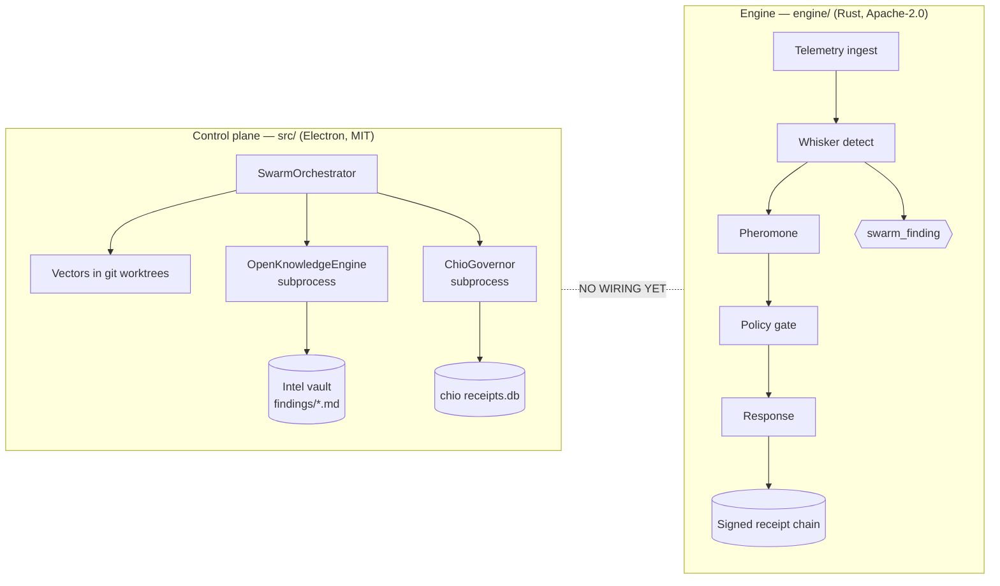
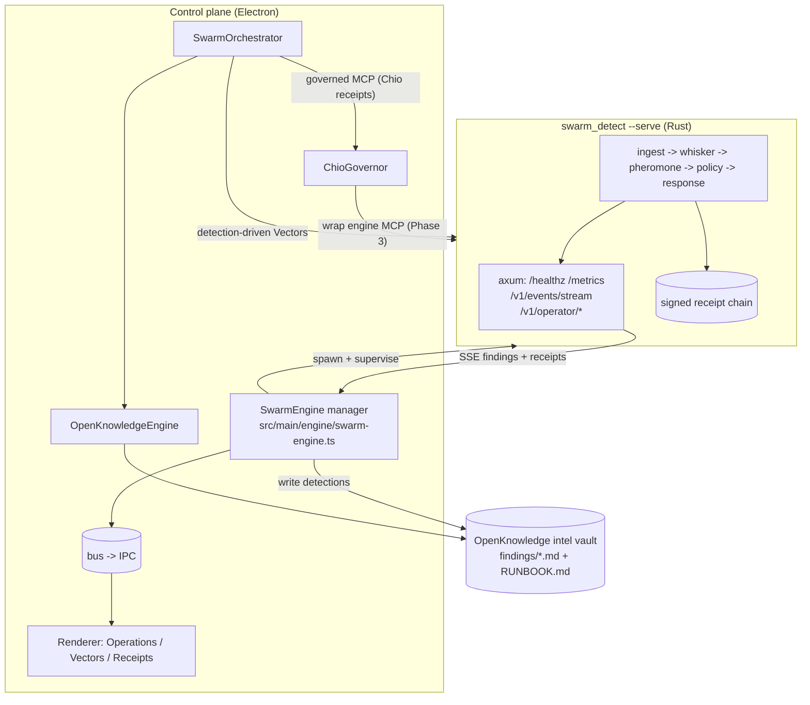
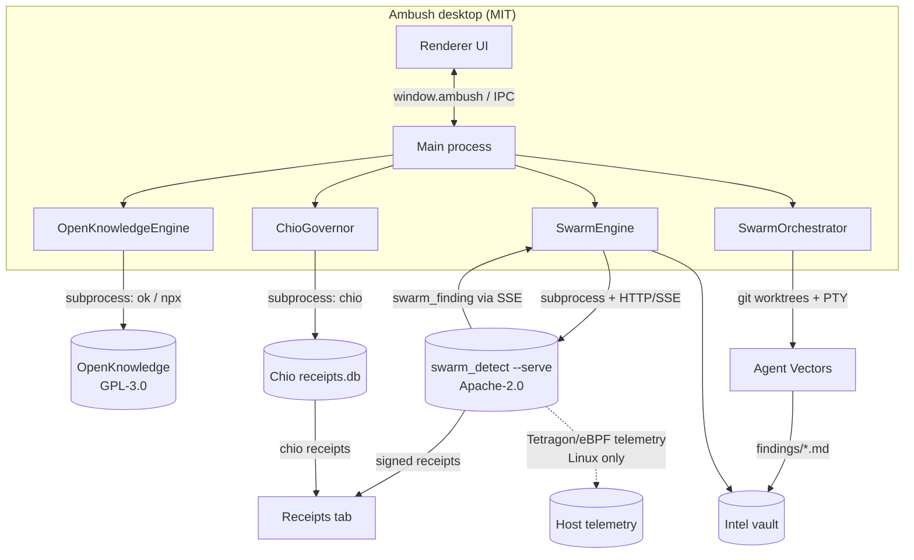

# Engine Integration — Converging the Control Plane and the Rust Engine

> Status: design proposal. No code in this document has been wired yet; it describes the
> current state of the two halves of Ambush and a concrete, phased plan to connect them.

Ambush ("Vector Swarm") currently ships as **two independent halves that never talk to each
other**:

1. A **TypeScript/Electron control plane** (`src/`) that fans one mission out into parallel
   agent "Vectors" running in git worktrees, embeds an OpenKnowledge intel vault, and governs
   tool calls with Chio.
2. A **Rust detection + live-response engine** (`engine/`, codenamed *Ambush Engine*) that ingests telemetry, fires detections, deposits pheromones,
   authorizes response through a deterministic policy gate, and emits signed receipts.

This document maps what each half provides, the gap between them, the integration-surface
options with trade-offs, the data contracts that must line up, and a phased plan with concrete
first tasks and new `src/shared` types/IPC channels.

---

## 1. Current State

### 1a. Control plane (Electron / TypeScript)

The control plane is wired up in [`src/main/index.ts`](../src/main/index.ts), which constructs
five managers and registers IPC:

- `OpenKnowledgeEngine` — [`src/main/engine/openknowledge-engine.ts`](../src/main/engine/openknowledge-engine.ts)
- `ChioGovernor` — [`src/main/governance/chio-governor.ts`](../src/main/governance/chio-governor.ts)
- `WorktreeManager`, `PtyManager`, `SwarmOrchestrator` — under `src/main/swarm/` and `src/main/terminal/`

The orchestrator ([`src/main/swarm/swarm-orchestrator.ts`](../src/main/swarm/swarm-orchestrator.ts))
owns the domain model: an **Operation** (a mission/incident) has many **Vectors** (work lanes).
Each Vector is launched into an isolated git worktree, given a mission prompt, and run by an
agent CLI inside a PTY. Vectors write findings to `findings/<vector-id>.md` inside the
operation's OpenKnowledge intel vault, and `consolidate()` rolls them into a single
`RUNBOOK.md`.

Two patterns matter for integration:

- **Everything external is a subprocess.** OpenKnowledge (GPL-3.0) is invoked strictly as a
  child process — `ok` or `npx @inkeep/open-knowledge` — via the helpers in
  [`src/main/util/run.ts`](../src/main/util/run.ts) (`run()` to capture output, `which()` to
  resolve a binary on `PATH`). External tools **degrade gracefully when missing** (status flips
  to unavailable, the app stays usable). This is the template the Rust engine should follow.
- **Tool calls are governed by Chio.** `ChioGovernor.wrapMcp()` wraps an inner MCP command as
  `chio --receipt-db … mcp serve --policy … --server-id … -- <inner>`, and `listReceipts()`
  shells out to `chio receipt list --admin-all --json`, normalizing each row into a
  `ReceiptSummary` ([`src/shared/types.ts`](../src/shared/types.ts)). Chio is fail-closed.

The renderer only ever talks to main through `window.ambush`, whose contract is the single
source of truth in [`src/shared/ipc.ts`](../src/shared/ipc.ts) (the `IPC` channel map + the
`AmbushApi` interface), implemented in
[`src/main/ipc/register-ipc.ts`](../src/main/ipc/register-ipc.ts). Managers publish to the
in-process `bus` (`src/main/util/bus.ts`); the IPC layer forwards bus events to all windows.

**What the control plane provides:** mission decomposition, parallel agent orchestration,
git-worktree isolation, terminal multiplexing, an embedded intel wiki, Chio-signed receipts for
agent tool calls, and a desktop UI (Operations, Vectors, Receipts tabs).

### 1b. Engine (Rust / Ambush Engine)

The engine is a Rust workspace ([`engine/Cargo.toml`](../engine/Cargo.toml)) of focused crates.
Its README and [`engine/docs/ARCHITECTURE.md`](../engine/docs/ARCHITECTURE.md) describe a
Rust-first **critical lane**:

```
telemetry ingest → Whisker detection → pheromone substrate → deterministic policy gate
                 → response executors → signed receipt chain
```

Crate map (skimmed):

| Crate | Role |
| --- | --- |
| `swarm-core` | Shared domain types (`DetectionFinding` inputs, `ResponseAction`, `Severity`, `ThreatClass`, config). |
| `swarm-whisker` | Detection primitives + stream runtime; produces `DetectionFinding` ([`engine/crates/swarm-whisker/src/detector.rs`](../engine/crates/swarm-whisker/src/detector.rs)). |
| `swarm-ingest-tetragon` / `-json` / `-sentinel` | Telemetry bridges (Tetragon/eBPF is **Linux-only**; JSON + Sentinel are portable feeds). |
| `swarm-pheromone` | Stigmergic substrate + concentration queries (in-memory or NATS JetStream). |
| `swarm-policy` | Deterministic, fail-closed response authorization (`ActionRequest`, verdicts). |
| `swarm-response` | Response adapters + the canonical `swarm_finding` envelope and `ResponseReceipt` ([`engine/crates/swarm-response/src/lib.rs`](../engine/crates/swarm-response/src/lib.rs), [`.../siem.rs`](../engine/crates/swarm-response/src/siem.rs)). |
| `swarm-spine` + `swarm-crypto` | Signed envelopes and the receipt/audit chain (Ed25519, SHA-256, canonical JSON — [`engine/crates/swarm-spine/src/envelope.rs`](../engine/crates/swarm-spine/src/envelope.rs)). |
| `swarm-runtime` | Composition root; ships two binaries (below) and the HTTP/operator surface. |
| `swarm-cli` | The `swarmctl` operator control surface ([`engine/crates/swarm-cli/src/core.inc`](../engine/crates/swarm-cli/src/core.inc)). |

Two binaries ship from `swarm-runtime` ([`engine/crates/swarm-runtime/src/bin/`](../engine/crates/swarm-runtime/src/bin/)):

- **`swarm_detect`** — the primary runtime. Without `--serve` it replays scenarios and prints
  per-event findings/deposits (great for a one-shot CLI bridge). With `--serve --bind
  127.0.0.1:9090` it runs the full tokio service: agent dispatcher, concentration monitor,
  telemetry bridges, config hot-reload, graceful SIGTERM drain, and an axum HTTP surface.
- **`swarmctl`** — the operator CLI. Global `--config rulesets/default.yaml` and `--json`;
  subcommands include `validate`, `init --mode {detect_only|live_response}`, `readiness`,
  `first-run`, `status`, `serve`, `replay`, evidence export/verify, approval ledgers, and the
  evolution/review surfaces.

The serve surface (per `ARCHITECTURE.md` and [`engine/crates/swarm-runtime/src/http/core.inc`](../engine/crates/swarm-runtime/src/http/core.inc)):
lifecycle probes `/startupz /readyz /livez /healthz /prestop`, `/metrics`, a Server-Sent-Events
firehose at `/v1/events/stream`, authenticated reads under `/v1/operator/*`, demo routes under
`/v1/demo/*`, and versioned platform APIs under `/v2/api/*`. The dependency set in
`Cargo.toml` confirms `axum`, `tonic` (gRPC), and `async-nats` are all available transports.

**What the engine provides:** autonomous detection, stigmergic correlation, deterministic +
human-gated response authorization, capability-scoped live response, and a cryptographically
signed, replayable audit chain — plus a live HTTP/SSE operator surface.

### 1c. The gap

There is **no wiring** between the halves today:

- `src/main/index.ts` instantiates `OpenKnowledgeEngine` and `ChioGovernor` but nothing that
  knows about `swarm_detect` / `swarmctl`.
- No `src/shared` type represents a `swarm_finding`, an engine receipt, or engine status.
- The Receipts tab only renders **Chio** receipts (`governor.listReceipts()`); engine spine
  receipts never appear.
- Engine detections never become Vectors or intel pages; the intel vault is populated only by
  agent-written `findings/*.md`.



A licensing note that shapes the options: the control plane is **MIT**, OpenKnowledge is
**GPL-3.0** (hence subprocess-only), and the engine is **Apache-2.0**. Apache-2.0 is
MIT-compatible, but the engine is Rust and the control plane is TypeScript, so a process
boundary is the natural seam regardless.

---

## 2. Integration Surface Options

### Option A — Spawn `swarm_detect` / `swarmctl` as a subprocess from `src/main`

Mirror [`src/main/engine/openknowledge-engine.ts`](../src/main/engine/openknowledge-engine.ts):
a new `SwarmEngine` manager resolves the binary with `which()`, runs commands with `run()`, and
parses `--json` output.

- Detection: `swarm_detect --scenario … --json` (or `--scenarios-dir`) prints per-event
  finding/deposit JSON that the manager parses into `swarm_finding` records.
- Operator reads: `swarmctl status --json`, `swarmctl readiness --json`,
  `swarmctl validate --json`, evidence/approval reads for receipts.

| Pros | Cons |
| --- | --- |
| Matches the existing, proven OpenKnowledge pattern exactly (`run`/`which`, graceful degrade). | One-shot/batch: no live telemetry stream, only scenario replay + polled reads. |
| No new network surface, ports, or auth tokens. | Parsing stdout JSONL is brittle vs. a typed API; schema drift risk. |
| Trivial cross-platform story (replay works anywhere a binary exists). | Long-running detection doesn't fit a request/response shell call. |
| Easiest license/process boundary; lowest risk Phase 1. | No push of findings/receipts; the UI must poll. |

### Option B — Engine runs as a local service (HTTP / SSE / gRPC / NATS)

Spawn `swarm_detect --serve --bind 127.0.0.1:<port>` once and have the control plane talk to it
over the network. The engine already exposes everything needed:

- `GET /healthz` `/readyz` `/startupz` for lifecycle; `/metrics` for telemetry.
- `GET /v1/events/stream` (SSE) for a live firehose. `RuntimeEvent`
  ([`engine/crates/swarm-runtime/src/runtime_events.rs`](../engine/crates/swarm-runtime/src/runtime_events.rs))
  already includes `Finding { finding: SwarmFindingEnvelope }` and `ResponseExecution {
  receipt_id, policy_verdict, … }` — exactly the two streams the UI wants.
- `GET /v1/operator/*` for authenticated reads (status, replay, incidents, evidence).

| Pros | Cons |
| --- | --- |
| Real-time: findings and receipts **push** into the UI via SSE → bus → renderer. | New lifecycle to own: port allocation, supervision/restart, graceful shutdown on app quit. |
| Typed, versioned contract (`output_schema_version`, response envelopes) vs. stdout scraping. | Auth/secrets: `/v1/operator/*` wants bearer tokens; `/v2/api/*` wants an API key. |
| Reuses the engine's own drain/health/metrics machinery. | Heavier deps may be needed at runtime (NATS/JetStream for the pheromone substrate). |
| Can embed `/v1/operator/review` directly in a `<webview>` like the OK intel UI. | Slightly more to get right on macOS/Windows where live telemetry is limited. |

NATS/gRPC are available but are overkill for a single desktop↔engine hop; **HTTP + SSE is the
right transport** here. Keep gRPC/NATS in reserve for multi-host fleets.

### Option C — Engine as an MCP / tool server governed by Chio

Expose engine capabilities (query detections, request a response action, fetch a replay bundle)
as MCP tools, and wrap that MCP command with `ChioGovernor.wrapMcp()` exactly like the
OpenKnowledge intel MCP. Then **desktop agents (Vectors) can drive detection/response**, and
every engine action a Vector triggers gets a Chio receipt in addition to the engine's own spine
receipt.

| Pros | Cons |
| --- | --- |
| Unifies governance: one HushSpec policy + signed Chio receipts across intel **and** engine. | Requires an MCP server façade in front of the engine (new code in `engine/` or a thin shim). |
| Lets the swarm *act through* the engine (e.g. "isolate host") under fail-closed policy. | **Double governance**: engine's `swarm-policy` gate *and* Chio both authorize — must define precedence. |
| Receipts flow through the existing Receipts tab path with no new parser. | Most complex; only valuable once Phase 1/2 prove the data contracts. |
| Natural home for destructive actions (block/isolate/revoke) needing approval. | Engine MCP surface does not exist yet; it's net-new surface area. |

**Recommendation:** these are not mutually exclusive — they are phases. Start with **A** (lowest
risk, proven pattern), graduate to **B** for live streaming, and layer **C** on top once a
governed *operator* surface is warranted. See §4.

---

## 3. Data Contracts

Two engine artifacts must map cleanly into control-plane concepts.

### 3a. `swarm_finding` → intel vault + Vectors

The canonical envelope is `SwarmFindingEnvelope`
([`engine/crates/swarm-response/src/siem.rs`](../engine/crates/swarm-response/src/siem.rs)),
built from a `DetectionFinding`
([`engine/crates/swarm-whisker/src/detector.rs`](../engine/crates/swarm-whisker/src/detector.rs)):

```jsonc
{
  "schema": "swarm_finding",
  "finding_id": "…",
  "event_id": "…",
  "strategy_id": "suspicious_process_tree",
  "threat_class": { "…": "…" },
  "severity": "high",
  "confidence": 0.92,
  "evidence": { /* arbitrary JSON */ }
}
```

Proposed mapping into the intel vault (which today holds `findings/<vector-id>.md`):

- Write each detection to `findings/detections/<finding_id>.md` with YAML front-matter
  (`schema`, `finding_id`, `strategy_id`, `threat_class`, `severity`, `confidence`) and the
  `evidence` rendered as a fenced JSON block. This keeps it consolidate-able by
  `SwarmOrchestrator.consolidate()` (it globs `findings/**.md`) and linkable with `[[…]]`
  wikilinks like agent findings.
- **Detection-driven Vectors (Phase 3):** a high-severity `swarm_finding` can seed a new Vector
  whose `objective` is "investigate/respond to `<strategy_id>` on `<host>`" and whose
  `findingsPath` points back at the detection page — turning autonomous detections into governed
  agent work lanes. This is the convergence payoff: the engine *finds*, the swarm *acts*.

A new shared type:

```ts
// src/shared/types.ts
export interface SwarmFinding {
  schema: 'swarm_finding'
  findingId: string
  eventId: string
  strategyId: string
  threatClass: string
  severity: 'low' | 'medium' | 'high' | 'critical'
  confidence: number
  evidence: unknown
  hostId: string | null
  emittedAtMs: number
}
```

### 3b. Engine receipts → `ReceiptSummary` and the Receipts tab

The engine produces two receipt artifacts: `ResponseReceipt`
([`engine/crates/swarm-response/src/lib.rs`](../engine/crates/swarm-response/src/lib.rs)) and
the signed spine envelope (`swarm.spine.envelope.v1`, Ed25519-signed,
[`engine/crates/swarm-spine/src/envelope.rs`](../engine/crates/swarm-spine/src/envelope.rs)).
The live `ResponseExecution` runtime event carries `receipt_id`, `policy_verdict`, `rule_name`,
`action_kind`, and `governing_agent_id`.

The existing `ReceiptSummary` ([`src/shared/types.ts`](../src/shared/types.ts)) is close enough
to reuse — extend it with a `source` discriminator so Chio and engine receipts coexist in one
tab:

```ts
// src/shared/types.ts — additive
export interface ReceiptSummary {
  id: string
  verdict: 'ALLOW' | 'DENY' | 'CANCELLED' | 'INCOMPLETE' | 'UNKNOWN'
  tool: string
  server: string
  policyHash: string | null
  timestamp: number | null
  source?: 'chio' | 'engine'   // NEW: defaults to 'chio'
  raw?: unknown
}
```

Field mapping for engine → `ReceiptSummary`:

| `ReceiptSummary` | Engine source |
| --- | --- |
| `id` | `ResponseReceipt.receipt_id` / `ResponseExecution.receipt_id` |
| `verdict` | `policy_verdict` (`Allow`→`ALLOW`, `Deny`→`DENY`) |
| `tool` | `action_kind` (e.g. `block_egress`, `isolate_host`) |
| `server` | constant `"swarm-engine"` |
| `policyHash` | spine `envelope_hash` (or `rule_name` until the hash is exposed) |
| `timestamp` | `emitted_at_ms` / spine `issued_at` |
| `source` | `"engine"` |
| `raw` | the full `ResponseReceipt` / envelope JSON |

The Receipts tab then merges `governor.listReceipts()` (Chio) with the engine receipt stream/
read, sorted by `timestamp`, filterable by `source`. Verifying Ed25519 signatures client-side
is an optional hardening step (the public key is embedded in the `swarm:ed25519:<hex>` issuer).

---

## 4. Recommended Phased Plan

### Phase 1 — Subprocess / CLI bridge (Option A)

Goal: the engine becomes a *resolvable, optional* tool that produces findings and receipts the
UI can render, with zero new network surface.

Concrete first tasks:

1. Add `src/main/engine/swarm-engine.ts`, a `SwarmEngine` manager modeled on
   `OpenKnowledgeEngine`: `resolveInvoker()` via `which('swarm_detect')` /
   `which('swarmctl')`, `configure()`, and a `status()` that runs `swarmctl status --json`.
   Degrade gracefully when the binaries are absent (status `unavailable`, app still usable).
2. Add `runDetection(scenarioPath)` that calls `swarm_detect --config … --scenario … --json`
   via `run()`, parses the JSONL into `SwarmFinding[]`.
3. Add `writeDetectionsToVault()` that converts `SwarmFinding[]` into
   `findings/detections/<finding_id>.md` in the active operation's `intelVaultPath`.
4. Add `listEngineReceipts()` that reads engine evidence/approval output via `swarmctl … --json`
   and normalizes to `ReceiptSummary` with `source: 'engine'`.
5. Instantiate `SwarmEngine` in `src/main/index.ts` and clean it up in `before-quit`.

New `src/shared` additions (Phase 1):

```ts
// src/shared/types.ts
export interface EngineSwarmStatus {
  available: boolean
  source: 'local-swarm' | 'none'
  mode: 'detect_only' | 'live_response' | 'unknown'
  running: boolean
  detail: string
}

// src/shared/ipc.ts — IPC map + AmbushApi
engineSwarmStatus:   'engineSwarm:status'
engineSwarmReplay:   'engineSwarm:replay'      // run a scenario, returns SwarmFinding[]
engineSwarmReceipts: 'engineSwarm:receipts'    // ReceiptSummary[] (source:'engine')
```

### Phase 2 — Live service + streaming receipts (Option B)

Goal: real-time findings and receipts pushed into the UI.

Concrete first tasks:

1. Extend `SwarmEngine` to spawn `swarm_detect --serve --bind 127.0.0.1:<port>` (allocate a
   free port; store it in `EngineSwarmStatus.url`), polling `/healthz` + `/readyz` for
   readiness — analogous to how `OpenKnowledgeEngine.start()` waits for its UI URL.
2. Add a `SwarmEngineClient` (main-process `fetch`/`EventSource`) that subscribes to
   `GET /v1/events/stream`, filtering for `finding` and `response_execution` event kinds.
3. Bridge stream → `bus`: emit `evt:engineSwarm:finding` and `evt:engineSwarm:receipt`, which
   `register-ipc.ts` already forwards to all windows by listing the channels.
4. On each `finding` event, append to the vault (reuse Phase 1 writer) and update Vector
   `hasFindings` where a detection is linked.
5. Merge engine receipts into the Receipts tab live, deduped by `id`.
6. Optionally embed `/v1/operator/review` in a `<webview>` (already enabled in
   `src/main/index.ts` via `webviewTag: true`).

New `src/shared` additions (Phase 2):

```ts
// src/shared/ipc.ts — events (main -> renderer)
evtEngineSwarmFinding: 'evt:engineSwarm:finding'   // SwarmFinding
evtEngineSwarmReceipt: 'evt:engineSwarm:receipt'   // ReceiptSummary (source:'engine')
evtEngineSwarmMode:    'evt:engineSwarm:mode'      // EngineSwarmStatus
```

### Phase 3 — Unified governed operator surface (Option C)

Goal: one governance plane, and detections that become governed agent action.

Concrete first tasks:

1. Stand up an engine MCP façade (query detections, request a response action, fetch replay
   bundles) and wrap it with `ChioGovernor.wrapMcp()` so Vector agents can drive the engine
   under the HushSpec policy — destructive verbs (`block`, `isolate`, `revoke`) added to the
   policy's `allow`/`deny` with human-gate semantics.
2. Define precedence between the engine's own `swarm-policy` gate and Chio (recommended:
   **both must allow** — Chio governs the agent's *intent*, `swarm-policy` governs the engine's
   *execution*; fail-closed if either denies).
3. Implement detection-driven Vectors: a high-severity `swarm_finding` auto-proposes a Vector
   (operator confirms) with the detection page as its briefing.
4. Single Receipts tab spanning Chio receipts and engine spine receipts, with cross-links from a
   receipt to the originating detection/Vector.



---

## 5. Converged Architecture (target)



Net effect: the engine becomes the **autonomous sensor + actuator**, OpenKnowledge remains the
**intel memory**, Chio remains the **non-repudiation layer**, and the orchestrator remains the
**human-driven swarm operator** — all over clean subprocess/HTTP boundaries.

---

## 6. Open Questions & Risks

**Process lifecycle.** `swarm_detect --serve` is a long-running tokio service with graceful
SIGTERM drain and a 30s shutdown timeout (see `bin/swarm_detect.rs`). The control plane must
own supervision: free-port allocation, restart-on-crash, and a clean stop in
`app.on('before-quit')`/`window-all-closed` (alongside the existing `engine.stop()` /
`pty.killAll()`). Decide whether the engine is per-Operation (like the OK vault) or a single
app-lifetime daemon shared across Operations.

**Platform builds.** The engine is **Linux-telemetry oriented**: `swarm-ingest-tetragon` is
eBPF/Tetragon (Linux-only), and `anti_tamper.fail_closed_live_response` only fails closed on
supported Linux live-response runtimes (other platforms report `unsupported`). On macOS/Windows
dev hosts, scenario **replay** and `--serve` work, but live host telemetry and live response do
not. Plan: gate live-response UI behind a Linux runtime check; ship JSON/Sentinel ingest as the
cross-platform path; treat Tetragon as a Linux-only capability.

**Distribution.** Decide how the Rust binaries reach users: bundle per-platform
`swarm_detect`/`swarmctl` with the Electron app, or detect-and-degrade via `which()` like
OpenKnowledge/Chio. The latter matches existing conventions and keeps the DMG/installer light,
but means the engine is optional at runtime.

**Dependencies.** The production pheromone substrate is NATS JetStream; there is a
`local_journal` fallback for single-node use. The desktop default should use the in-memory/local
journal substrate to avoid shipping a NATS server. Confirm `swarm_detect --serve` runs without a
reachable NATS in local mode.

**Auth & secrets.** `/v1/operator/*` expects a bearer token and `/v2/api/*` an API key; signing
keys come from env (`SWARM_EVIDENCE_SIGNING_KEY`, `SWARM_VOTER_SIGNING_KEY`). The control plane
must generate/store these in `userData` (never in repo config) and inject them when spawning the
engine. For a loopback-only bind this can be a generated per-session token.

**Governance precedence.** In Phase 3, both `swarm-policy` (engine) and Chio (HushSpec) can
authorize the same action. Define the contract explicitly — recommended **AND** semantics,
fail-closed — and reconcile the two receipt chains so an action has one auditable story.

**Schema / contract drift.** Pin `swarm_finding` and the spine envelope schema versions
(`output_schema_version`, `swarm.spine.envelope.v1`) in `src/shared`, and validate on ingest so
an engine upgrade can't silently corrupt the intel vault or Receipts tab.

**Trust boundary.** Engine receipts are Ed25519-signed; decide whether the control plane merely
displays them or verifies signatures (and pins the issuer key) before treating them as
authoritative in the Receipts tab.
