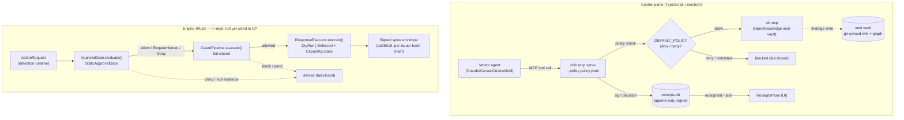
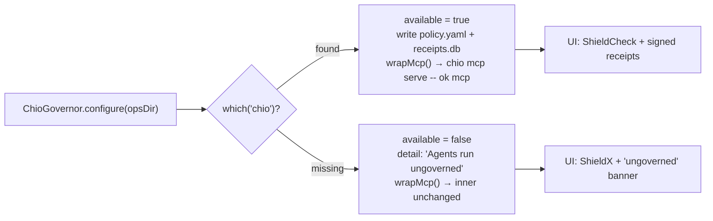
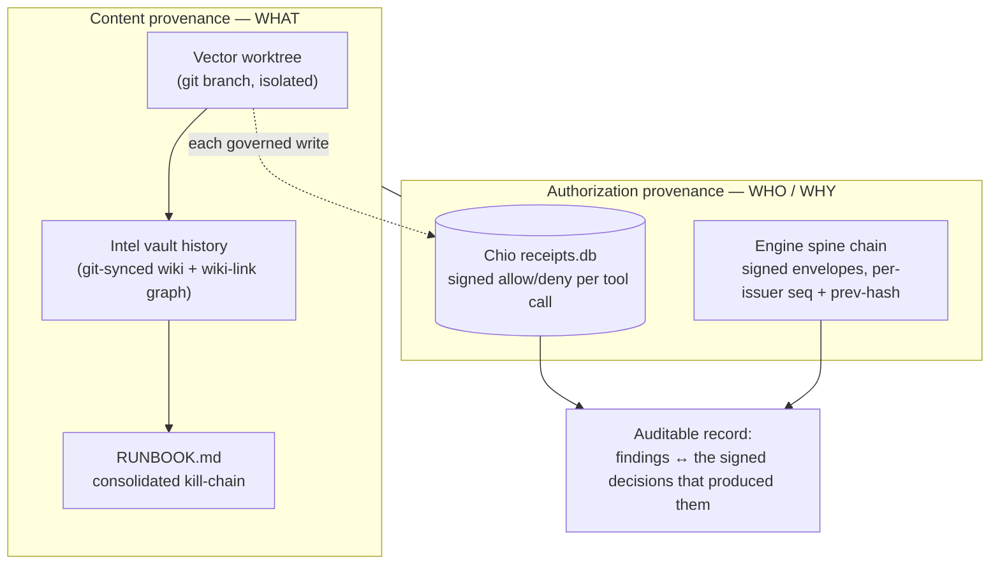

# Ambush — Governance & Security

> How Vector Swarm keeps autonomous offensive/security agents safe, accountable, and
> auditable. This document describes what exists in the code today, names the files
> that implement it, and is explicit about current gaps.

Ambush runs **swarms of autonomous agents** doing security and offensive work. Governance
and safety are first-class, not bolted on. There are **two governance planes**, sharing one
philosophy — *fan-out + fail-closed policy + signed receipts*:

| Plane | Where | Language | What it governs | Status |
|---|---|---|---|---|
| **Control plane** | `src/main/governance/chio-governor.ts` | TypeScript / Electron | Agent tool calls against the OpenKnowledge intel vault, wrapped by **Chio** | Wired end-to-end |
| **Engine** | `engine/crates/swarm-policy`, `swarm-response`, `swarm-guard`, `swarm-spine`, `swarm-crypto` | Rust | Live detection→response actions, with a deterministic policy gate + signed receipt chain | Self-contained Cargo workspace in-repo; **not yet invoked by the control plane** (the two "will converge" per [`README.md`](../README.md)) |

Both planes are **fail-closed**: when a decision can't be made safely, the default is *deny*.

---

## 1. The dual governance story

### Control plane: Chio wraps the intel MCP → signed receipts

Each Vector (one agent in an isolated git worktree) reaches the shared intel vault over MCP.
Instead of talking to OpenKnowledge's `ok mcp` server directly, the agent talks to a
**Chio-wrapped** server: Chio is a capability-based runtime that policy-checks every tool call
and signs an append-only receipt for the decision.

- The inner MCP command is produced by `OpenKnowledgeEngine.mcpCommand()` in
  [`src/main/engine/openknowledge-engine.ts`](../src/main/engine/openknowledge-engine.ts).
- `ChioGovernor.wrapMcp(inner)` in
  [`src/main/governance/chio-governor.ts`](../src/main/governance/chio-governor.ts) wraps it.
- `SwarmOrchestrator.launchVector()` in
  [`src/main/swarm/swarm-orchestrator.ts`](../src/main/swarm/swarm-orchestrator.ts) composes
  the two and injects the result as a project `.mcp.json` via `writeMissionFiles()` in
  [`src/main/swarm/mission.ts`](../src/main/swarm/mission.ts), so harness agents
  (Claude/Cursor/Codex) auto-wire the governed server with no manual setup.

### Engine: deterministic Rust policy gate + signed receipt chain

The Rust engine (`engine/`) is the hot path for live security response. A request to act is
evaluated by a **deterministic** approval gate, optionally screened by a **guard pipeline**,
executed under a **capability lease** (dry-run or enforced), and recorded as a **signed,
hash-chained receipt**.

### Tool call → policy → receipt



---

## 2. The control-plane policy

### What `DEFAULT_POLICY` allows/denies today

`DEFAULT_POLICY` is a hard-coded HushSpec-style YAML string in
[`chio-governor.ts`](../src/main/governance/chio-governor.ts) (lines ~10–29):

```yaml
version: 1
tool_access:
  allow:
    - search
    - links
    - history
    - config
    - palette
    - workflow
    - write
    - edit
    - move
    - checkpoint
    - skills
    - exec
  deny:
    - delete
```

- **Allowed:** the OpenKnowledge intel tools (`search`, `links`, `history`, `write`, `edit`,
  `move`, `checkpoint`, `skills`, `workflow`, `palette`, `config`) plus `exec`.
- **Explicitly denied:** `delete`.
- **Fail-closed default:** Chio denies anything **not** on the allow list. The explicit `delete`
  entry is belt-and-suspenders. So the swarm can create and revise intel but cannot delete it —
  important for non-repudiation, since findings can't be silently erased.

> ⚠️ **Gap:** `exec` is on the allow list, which is broad for an offensive-agent fleet, and the
> policy is a single hard-coded constant — it is not per-operation configurable yet. See the
> [hardening roadmap](#8-hardening-roadmap).

### How `wrapMcp` composes the command

`ChioGovernor.configure(opsDir)` resolves the `chio` binary with `which('chio')`, writes the
policy to `<opsDir>/chio/policy.yaml`, and points the receipt DB at `<opsDir>/chio/receipts.db`.
`wrapMcp(inner)` then returns:

```bash
chio --receipt-db <opsDir>/chio/receipts.db \
     mcp serve \
     --policy <opsDir>/chio/policy.yaml \
     --server-id open-knowledge \
     -- <inner: ok mcp>
```

The `--` separates Chio's own args from the inner MCP server argv. The result is the `command` +
`args` written into each worktree's `.mcp.json` by `writeMissionFiles()`.

### How receipts are read back

`ChioGovernor.listReceipts()` shells out to:

```bash
chio --receipt-db <db> receipt list --admin-all --json
```

`parseReceipts()` accepts either JSONL (one object per line) or a single JSON array, and
`normalize()` maps each row to a `ReceiptSummary` (`src/shared/types.ts`): a `verdict`
(`ALLOW` / `DENY` / `CANCELLED` / `INCOMPLETE` / `UNKNOWN`), `tool`, `server`, `policyHash`, and
`timestamp`. The IPC handler `IPC.receiptsList` in
[`src/main/ipc/register-ipc.ts`](../src/main/ipc/register-ipc.ts) exposes this, and
[`src/renderer/src/components/ReceiptsPane.tsx`](../src/renderer/src/components/ReceiptsPane.tsx)
renders the table with color-coded verdicts.

---

## 3. Fail-closed principles & graceful degradation

**Fail-closed** is enforced at multiple layers:

- *Control plane policy:* Chio denies any tool not on the allow list.
- *Engine policy gate:* `StaticApprovalGate` rejects requests with null evidence and denies
  destructive actions that don't meet severity/rate constraints (see §4).
- *Engine guards:* `GuardPipeline.evaluate()` in
  [`swarm-guard/src/lib.rs`](../engine/crates/swarm-guard/src/lib.rs) returns a **`block`** result
  with `Severity::Critical` if a guard *panics* or returns an invalid (empty-name) result — a
  crash is treated as a denial, never an allow.

**Graceful degradation — the "ungoverned" mode.** Every external binary (`chio`, `ok`, agent
CLIs) must degrade gracefully when missing. For Chio specifically:

- If `which('chio')` returns nothing, `configure()` sets
  `available: false` with detail `"chio not found on PATH. Agents run ungoverned."`
- `wrapMcp(inner)` then **returns `inner` unchanged** — agents talk to `ok mcp` directly, with no
  receipts. This is the deliberate trade-off: the app stays usable, but the operator loses the
  audit trail.
- The orchestrator reflects this on the engine via `engine.setGoverned(governor.getStatus().available)`
  in `createOperation()`.
- The UI surfaces it honestly: `ReceiptsPane` shows a `ShieldX` icon and the banner
  *"Chio isn't on PATH, so the swarm runs ungoverned"*, prompting the operator to install Chio.



---

## 4. The engine's safety model

The engine encodes the live-response safety story as four cooperating crates.

### Capability-scoped response actions (`swarm-policy`)

[`swarm-policy/src/lib.rs`](../engine/crates/swarm-policy/src/lib.rs) defines the request/decision
shapes:

- `ActionRequest { hunt_id, requested_by, action, severity, evidence }`
- `ApprovalContext { live_mode, receipt_chain, correlation_id, now_ms }`
- `PolicyDecision { verdict, rule_name, reason }` with `PolicyVerdict ∈ { Deny, Allow, RequireHuman }`
- `CapabilityLease { capability_id, expires_at_ms, action, scope }` — a **short-lived,
  scope-bound** authorization minted only for authorized requests.

`StaticApprovalGate` ([`static_gate.rs`](../engine/crates/swarm-policy/src/static_gate.rs)) is the
deterministic default gate. Its rules, in order:

1. **Validate request** — reject when `evidence` is null or required action fields are empty
   (`ApprovalError::InvalidRequest`).
2. **Minimum severity** — destructive actions (`BlockEgress`, `IsolateHost`, `RevokeCredential`,
   `SinkholeDns`, `TerminateUserSession`, `InjectFirewallRule`, `QuarantineFile`, `KillProcess`,
   `SuspendProcess`, `DisableUserAccount`, `ForcePasswordReset`, `RemoveScheduledTask`) at
   `Severity::Low` are **denied** (`static.minimum_severity`); `DeployDecoy` likewise.
3. **Scope rate limit** — a per-scope sliding window (`max_actions_per_scope_per_minute`) denies
   bursts against the same target (`static.scope_rate_limit`).
4. **Human gate** — destructive actions at/above `human_gate_severity` return
   **`RequireHuman`** (`static.human_gate`) — authorized but held for a human.
5. **Default** — otherwise `Allow` (`static.default_allow`).

Leases (`issue_lease`) carry the action name, the derived `scope` (e.g. `host_id:process_name`),
and an `expires_at_ms = now + lease_ttl_ms`.

### Dry-run vs live (`swarm-response`)

[`swarm-response/src/lib.rs`](../engine/crates/swarm-response/src/lib.rs) defines:

- `ExecutionMode ∈ { DryRun, Enforced }` — `DryRun` logs intent and returns a *synthetic* receipt
  without changing the world; `Enforced` performs the side effect.
- `ResponseExecutor.execute(request, lease, mode)` — a capability-scoped executor; an action only
  runs under a valid `CapabilityLease`.
- `ResponseReceipt` carries `ResponseReceiptAudit` with optional `policy` (verdict/rule/reason)
  and `governance` (governing agent + reason) attribution, so every receipt records *why* it was
  allowed.

`ApprovalContext.live_mode` gates whether the runtime may ever issue live actions or is restricted
to dry-run — the engine can run **detect-only** (see [`engine/docs/DR-RUNBOOK.md`](../engine/docs/DR-RUNBOOK.md) §7.2).

### Safety guards (`swarm-guard`)

[`swarm-guard/src/lib.rs`](../engine/crates/swarm-guard/src/lib.rs) runs an ordered, fail-closed
`GuardPipeline`. The `default_pipeline()` is four guards; the first to block wins:

| Guard | File | Blocks |
|---|---|---|
| `forbidden_path` | [`forbidden_path.rs`](../engine/crates/swarm-guard/src/forbidden_path.rs) | Access to `**/.ssh/**`, `**/id_rsa*`, `**/.aws/**`, `**/.env*`, `**/.git-credentials`, `**/.gnupg/**`, `**/.kube/**`, `/etc/shadow`, `/etc/passwd`, … |
| `shell_command` | [`shell_command.rs`](../engine/crates/swarm-guard/src/shell_command.rs) | `rm -rf /`, `curl … \| bash`, reverse shells (`nc … -e`, `bash -i >& /dev/tcp/…`), `mkfs`, `dd of=/dev/…`, base64-pipe exfil |
| `secret_leak` | [`secret_leak.rs`](../engine/crates/swarm-guard/src/secret_leak.rs) | File writes / response actions containing AWS keys (`AKIA…`), GitHub tokens/PATs, OpenAI/Anthropic keys, private keys, npm/Slack/Stripe tokens, generic api-key/secret patterns |
| `egress_allowlist` | [`egress_allowlist.rs`](../engine/crates/swarm-guard/src/egress_allowlist.rs) | Network egress to hosts not on the allowlist |

The **secret-leak** guard scans content with regexes, ranks matches by severity, **blocks** at or
above its `severity_threshold` (default `Error`) and **redacts** the matched value
(`AKIA************CDEF`) in its details so the secret never lands in a log or receipt verbatim.
`GuardPipeline` short-circuits on the first block and treats a guard panic as a critical block.

### Receipt / merkle chain (`swarm-spine` + `swarm-crypto`)

[`swarm-crypto/src/lib.rs`](../engine/crates/swarm-crypto/src/lib.rs) provides the primitives:
ed25519 signing (`Keypair`/`Signer`), SHA-256 hashing, a `MerkleTree` with `MerkleProof`, and
**canonical JSON** serialization (`canonicalize_json`) so signatures are deterministic regardless
of map ordering.

[`swarm-spine/src/envelope.rs`](../engine/crates/swarm-spine/src/envelope.rs) builds the audit
record — a **signed envelope**:

- Schema `swarm.spine.envelope.v1` with `issuer` (`swarm:ed25519:<pubkey-hex>`), `seq`,
  `prev_envelope_hash`, `issued_at`, `capability_token`, and `fact`.
- `sign_envelope()` signs the **canonical JSON bytes** of the unsigned envelope and stores both
  the `envelope_hash` (SHA-256) and the ed25519 `signature`.
- `verify_envelope()` recomputes the hash, rejects any tampered `fact` (`HashMismatch`), and
  verifies the signature against the issuer's public key.

[`swarm-spine/src/chain.rs`](../engine/crates/swarm-spine/src/chain.rs) enforces a **per-issuer
hash chain**: `verify_chain_link()` requires the first envelope to have `seq = 1` and a null
`prev_envelope_hash`, each subsequent envelope to have `seq = head.seq + 1` and
`prev_envelope_hash = head.envelope_hash`, and the issuer to match — catching replays
(`SequenceMismatch`), forks (`HashMismatch`), and cross-issuer splicing
(`InvalidChainHead`). `swarm-spine` ties these into `AuditTrail` / `ReplayBundle`
([`lib.rs`](../engine/crates/swarm-spine/src/lib.rs)) so a handled event — detection, policy
decision, lease, response — can be replayed and verified end to end.

---

## 5. Threat model for Ambush itself

Running offensive agents *at scale* is the core risk. The swarm is fast and autonomous by
design (`deploySwarm` launches up to 100 lanes concurrently in
[`swarm-orchestrator.ts`](../src/main/swarm/swarm-orchestrator.ts)), which amplifies any single
agent's mistake or compromise.

| # | Threat | Current mitigation | Gap |
|---|---|---|---|
| T1 | **Prompt injection** — a target's content steers an agent into unintended actions | Intel writes are governed by Chio (allow/deny + receipts); `delete` is denied so injected "erase your tracks" can't silently destroy intel | No content-sanitization of target data before it reaches the agent; the control-plane policy doesn't inspect *arguments*, only tool names |
| T2 | **Runaway agents** — a lane loops, spawns, or burns resources | Operator can `killVector` / `recallAll` / `scale`; per-vector live PTY for observation; engine has per-scope rate limits (`static.scope_rate_limit`) | No automatic runaway detection or global budget/quota in the control plane; no wall-clock or token ceiling per vector |
| T3 | **Destructive actions** — irreversible changes to a target | Engine denies low-severity destructive actions and routes high-severity ones to `RequireHuman`; dry-run mode; guard pipeline blocks `rm -rf /`, `mkfs`, `dd of=/dev/…` | Those guards live in the **engine**, which is not yet wired to the control-plane swarm; control-plane agents in shell/CLI runtimes are **not** passed through `swarm-guard` |
| T4 | **Data exfiltration via agents** — agent ships data to an attacker endpoint | Engine `egress_allowlist` + `secret_leak` guards; shell guard blocks `curl\|bash` and reverse shells | Same wiring gap as T3; no network egress control around control-plane agent processes themselves |
| T5 | **Secrets in worktrees** — agents read or write credentials in their isolated worktree | Each vector runs in an **isolated git worktree** (`WorktreeManager`); engine `forbidden_path` blocks `.ssh`/`.aws`/`.env`/etc. and `secret_leak` redacts matches | Worktree isolation is git-branch isolation, not a filesystem sandbox — a shell agent can still `cat ~/.ssh/id_rsa` outside the worktree; engine forbidden-path guard isn't in the control-plane path |
| T6 | **Lost accountability** — can't prove who did what | Signed, append-only Chio receipts (control plane) + signed hash-chained envelopes (engine) | Only meaningful **when Chio is present**; ungoverned mode produces no receipts |

The honest summary: the control plane's strongest live control today is **Chio governance of intel
tool calls**; the deep action-level safety (guards, capability leases, dry-run, human gate)
currently lives in the **engine** and is not yet enforced on control-plane swarm agents. Closing
that wiring gap is the headline roadmap item.

---

## 6. Non-repudiation & audit

Ambush separates **content provenance** (what was recorded) from **authorization provenance**
(who was allowed to do it), and combines them for a complete, tamper-evident story.



- **Content provenance:** every Vector reports into the git-synced OpenKnowledge vault via the
  `write` tool to `findings/<vector>.md` (see the briefing in
  [`mission.ts`](../src/main/swarm/mission.ts)); `consolidate()` rolls findings into a single
  linked `RUNBOOK.md`. Git history + wiki-link graph give a navigable record of *what was learned*.
- **Authorization provenance:** Chio receipts record *who was allowed to write/search/edit and
  when*, signed and append-only. In the engine, the spine envelope chain records the
  detection→policy→response decision trail, signed and hash-chained per issuer.
- **Combined:** a finding in the vault can be tied back to the signed receipt of the tool call
  that produced it, and (in the engine) to the signed, replayable `AuditTrail` of the decision
  that authorized any response — non-repudiation across both planes.

---

## 7. Licensing & security boundary

This is a hard architectural constraint, enforced in [`AGENTS.md`](../AGENTS.md) and
[`README.md`](../README.md):

- **OpenKnowledge is GPL-3.0** → invoked **subprocess-only** (`ok` CLI / MCP / local web server)
  via [`openknowledge-engine.ts`](../src/main/engine/openknowledge-engine.ts). Ambush **never
  imports or vendors** OpenKnowledge source, so the GPL copyleft does not reach the control plane.
- **Control plane (`src/`) is MIT.**
- **Engine (`engine/`) is Apache-2.0** — see `license = "Apache-2.0"` in
  [`engine/Cargo.toml`](../engine/Cargo.toml). Both MIT and Apache-2.0 are permissive and
  compatible.
- **Chio governance is preferred but optional** — all external binaries (`ok`, `chio`, agent CLIs)
  must degrade gracefully when missing (see §3).
- **`vendor/` is intentionally excluded.** The engine was seeded with porting *references* from
  private upstreams — ClawdStrike, Hellcat, Cyntra, Arc (see
  [`engine/docs/VENDOR-REFERENCES.md`](../engine/docs/VENDOR-REFERENCES.md) and
  [`engine/docs/ARC-UPSTREAM.md`](../engine/docs/ARC-UPSTREAM.md)). Those copies are **not** runtime
  dependencies and must not be checked in here: do not leak private upstream code. Any promoted
  concept is rewritten in local crates with local terminology.

---

## 8. Hardening roadmap

Recommended next controls, roughly in priority order:

1. **Wire the engine guard pipeline into the control plane.** Pass control-plane agent file
   writes / shell commands / egress through `swarm-guard` (or an equivalent), so T3–T5
   mitigations actually protect swarm agents — not just the engine's own response path.
2. **Make the control-plane policy configurable and least-privilege.** Replace the hard-coded
   `DEFAULT_POLICY` with a per-operation policy, and reconsider blanket `exec` allow; scope tools
   to what each Vector's objective needs.
3. **Argument-level policy, not just tool-name.** Inspect MCP call arguments (paths, payloads) in
   the control-plane policy to catch injection that abuses an allowed tool.
4. **Runaway/budget controls.** Per-vector wall-clock, token, and action budgets; automatic kill
   on anomaly; a global concurrency/quota ceiling above the current 1–100 fan-out.
5. **Filesystem sandboxing for agent processes.** Back worktree isolation with an OS sandbox
   (containers / namespaces / seccomp) so agents can't read host secrets outside the worktree.
6. **Surface a human-approval UI for `RequireHuman`.** The engine already emits `RequireHuman`;
   the operator surface should let a human approve/deny held destructive actions.
7. **Verify receipts client-side.** The control plane currently trusts `chio receipt list`;
   verify signatures/chain integrity in-app and alert on gaps, mirroring `swarm-spine`'s
   `verify_chain_link` semantics.
8. **Egress controls around the agent processes themselves**, independent of the engine
   allowlist, plus secret-scanning of worktrees before findings sync.
9. **Receipt durability & retention** — back up `receipts.db` and the intel vault per the patterns
   in [`engine/docs/DR-RUNBOOK.md`](../engine/docs/DR-RUNBOOK.md), and document retention for audit.
