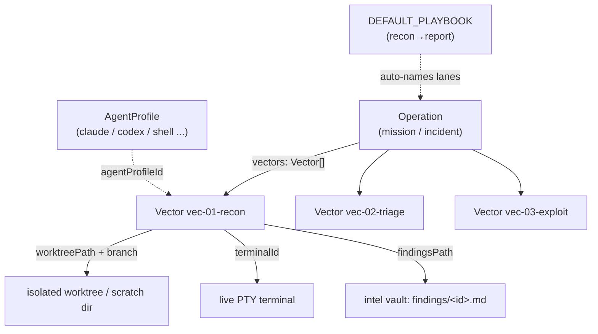
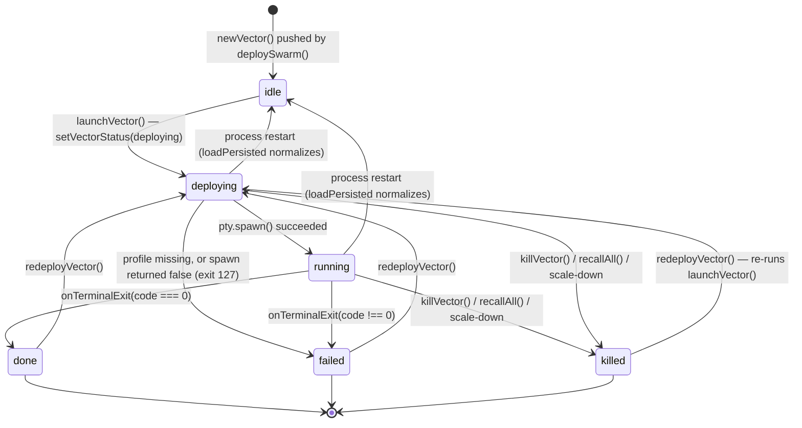
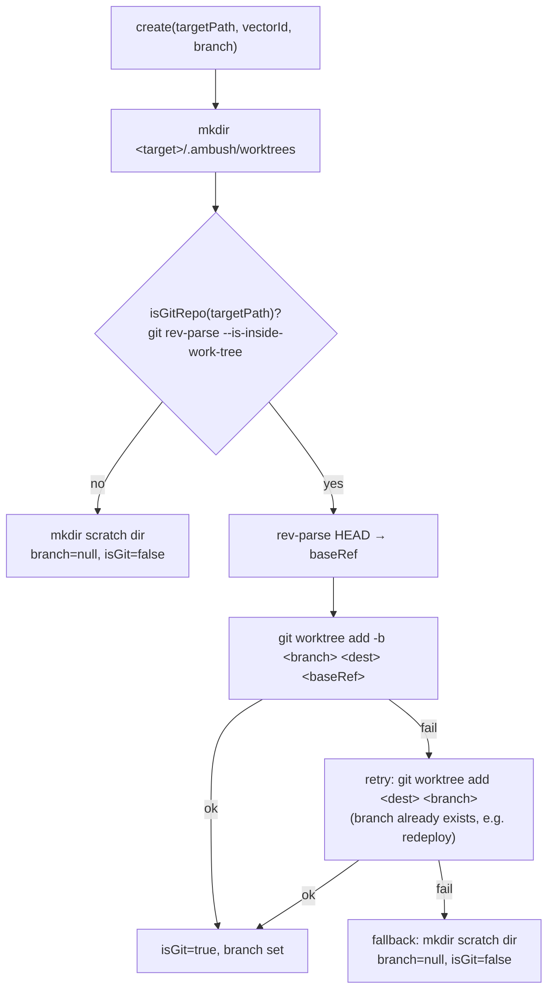
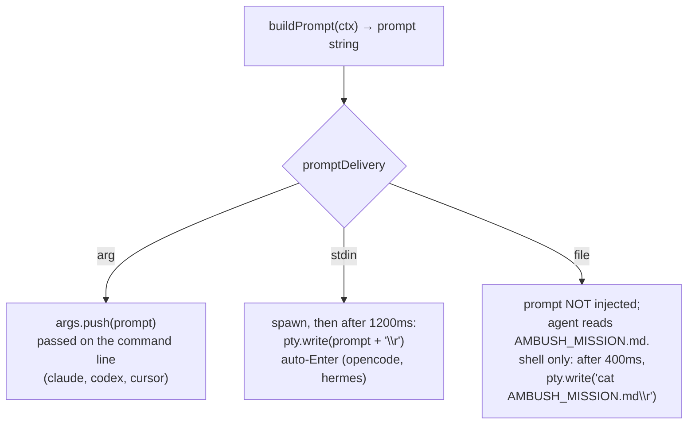
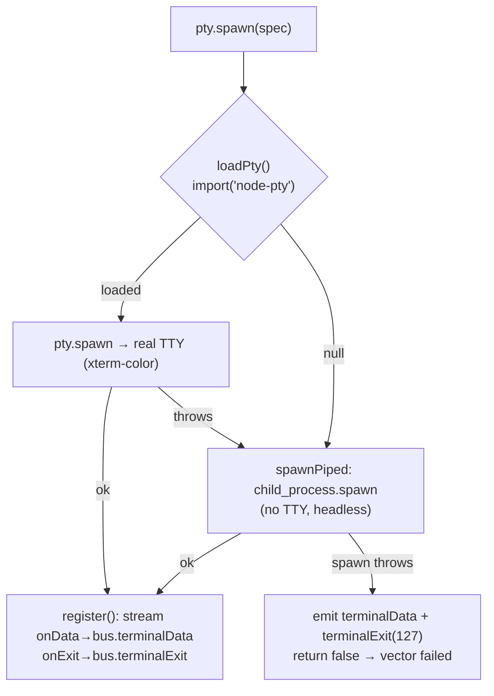
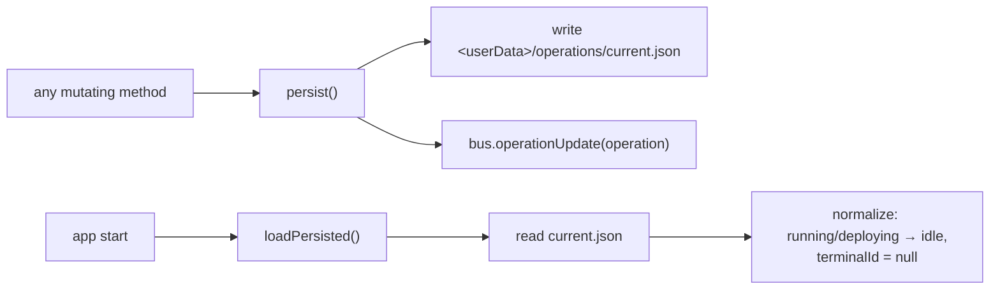

# Ambush Swarm Orchestration Model

> Deep spec for **Vector Swarm**: how Ambush fans one mission ("Operation") out
> into many parallel agents ("Vectors"), each running a CLI agent in its own
> isolated git worktree + live terminal, reporting findings into an
> OpenKnowledge intel vault and governed by Chio receipts.

This document is descriptive, not prescriptive — it traces the code as written.
Primary sources:

- `src/shared/types.ts` — domain types
- `src/shared/agents.ts` — agent profiles + playbook
- `src/main/swarm/swarm-orchestrator.ts` — the orchestrator
- `src/main/swarm/worktree-manager.ts` — isolation
- `src/main/swarm/mission.ts` — briefing + prompt + `.mcp.json`
- `src/main/terminal/pty-manager.ts` — terminal runtime
- Supporting: `src/main/engine/openknowledge-engine.ts`,
  `src/main/governance/chio-governor.ts`, `src/main/ipc/register-ipc.ts`

---

## 1. Concepts & data shapes

The model has five nouns. Four are persisted state (`Operation`, `Vector`); one
is config (`AgentProfile`); two are conceptual (`Swarm`, `Playbook`).



### Operation

An incident/mission. One is "current" at a time in the orchestrator
(`SwarmOrchestrator.operation`). Shape — `src/shared/types.ts`:

```58:71:src/shared/types.ts
export interface Operation {
  id: string
  name: string
  objective: string
  /** Target repo or directory the swarm operates against. May be empty for CTF/host targets. */
  targetPath: string
  /** Free-form target descriptor for non-filesystem targets (host, URL, CTF endpoint). */
  target: string
  /** Where the OpenKnowledge intel vault lives. */
  intelVaultPath: string
  status: OperationStatus
  vectors: Vector[]
  createdAt: number
}
```

`OperationStatus = 'draft' | 'active' | 'consolidating' | 'archived'`. In
practice the orchestrator creates operations as `'active'`
(`createOperation`), flips to `'consolidating'` transiently inside
`consolidate()`, then back to `'active'`.

### Vector

One attack/work lane: a single agent in a single isolated directory with a
single terminal, reporting to a single findings file. Shape:

```38:56:src/shared/types.ts
export interface Vector {
  id: string
  /** Short codename, e.g. "vec-01-recon". */
  name: string
  /** What this lane is trying to accomplish. */
  objective: string
  status: VectorStatus
  agentProfileId: string
  worktreePath: string | null
  branch: string | null
  terminalId: string | null
  /** Path (relative to the intel vault) where this vector reports findings. */
  findingsPath: string
  createdAt: number
  updatedAt: number
  exitCode: number | null
  /** Whether this lane has produced a non-empty findings file yet. */
  hasFindings: boolean
}
```

`id` and `name` are minted in `SwarmOrchestrator.newVector`: `id` is
`vec-<NN>-<hex>` (zero-padded index + 4-byte hex from `shortId()`), `name` is
`vec-<NN>-<codename>`, and `findingsPath` is always `findings/<id>.md`
(relative to the vault).

### Swarm

Not a type — it's the *act* of fanning out. A "swarm" is the set of `Vector`s
attached to the current `Operation`, deployed together via
`deploySwarm(DeploySwarmInput)`:

```105:110:src/shared/types.ts
export interface DeploySwarmInput {
  count: number
  agentProfileId: string
  /** Optional explicit vector objectives; if omitted, generated from a playbook. */
  vectorObjectives?: string[]
}
```

### Playbook

`DEFAULT_PLAYBOOK` in `src/shared/agents.ts` is a 7-step offensive/IR sequence
used to auto-name and auto-objective lanes when the operator doesn't pass
explicit `vectorObjectives`. Each entry is `{ codename, objective }`:

```65:73:src/shared/agents.ts
export const DEFAULT_PLAYBOOK: { codename: string; objective: string }[] = [
  { codename: 'recon', objective: 'Enumerate the target surface, map assets, services, and entry points.' },
  { codename: 'triage', objective: 'Identify the highest-severity weaknesses and rank them by exploitability.' },
  { codename: 'exploit', objective: 'Develop a proof-of-concept for the top candidate weakness.' },
  { codename: 'lateral', objective: 'Explore lateral movement and privilege-escalation paths.' },
  { codename: 'persist', objective: 'Assess persistence and post-exploitation footholds.' },
  { codename: 'harden', objective: 'Propose concrete remediations and detection signatures.' },
  { codename: 'report', objective: 'Synthesize a clear, evidence-backed writeup of what was found.' },
]
```

The playbook is indexed modulo its length (`(index - 1) % DEFAULT_PLAYBOOK.length`
in `deploySwarm`), so swarms larger than 7 wrap around and reuse the cycle.

### Agent Profile

A runtime descriptor for "any CLI agent". Shape:

```18:36:src/shared/types.ts
export interface AgentProfile {
  /** Stable id, e.g. "claude", "codex", "shell". */
  id: string
  /** Human label shown in the UI. */
  name: string
  /** Short description of the runtime. */
  description: string
  /** Executable + base args. The mission prompt is appended/typed separately. */
  command: string[]
  /**
   * How the initial mission prompt is delivered to the CLI:
   *  - "arg": appended as a final argument
   *  - "stdin": typed into the PTY after launch (orca-style auto-Enter)
   *  - "file": only written to MISSION.md in the worktree (agent reads it)
   */
  promptDelivery: 'arg' | 'stdin' | 'file'
  /** lucide-react icon name used by the renderer. */
  icon: string
}
```

Built-ins in `AGENT_PROFILES` (`src/shared/agents.ts`):

| id | command | promptDelivery |
| --- | --- | --- |
| `claude` (Claude Code) | `claude` | `arg` |
| `codex` (Codex) | `codex` | `arg` |
| `cursor` (Cursor Agent) | `cursor-agent` | `arg` |
| `opencode` (OpenCode) | `opencode` | `stdin` |
| `hermes` (Hermes, fleet default) | `hermes` | `stdin` |
| `shell` (manual) | `bash` / `powershell.exe` | `file` |

`DEFAULT_AGENT_ID = 'shell'` — the shell profile is the always-works fallback
(it needs no installed agent), so the swarm mechanism is demonstrable out of the
box. The `shell` `command` branches on `process.platform` (`powershell.exe` on
Windows, `bash` elsewhere). `findAgentProfile(id)` looks up by id.

---

## 2. Vector lifecycle

`VectorStatus` (`src/shared/types.ts`):

```7:14:src/shared/types.ts
export type VectorStatus =
  | 'idle'
  | 'deploying'
  | 'running'
  | 'reporting'
  | 'done'
  | 'failed'
  | 'killed'
```

State transitions, with the orchestrator method that triggers each:



Transition detail:

- **`idle`** — set in `newVector` when `deploySwarm` constructs the vector and
  pushes it onto `operation.vectors`.
- **`idle → deploying`** — first thing `launchVector` does after resolving the
  profile (`setVectorStatus(vector, 'deploying')`). If `findAgentProfile`
  returns nothing, it goes straight to **`failed`** instead.
- **`deploying → running`** — `launchVector` creates the worktree, writes
  mission files, builds the prompt, mints `terminalId = term-<vector.id>`, then
  calls `pty.spawn(...)`. On success (`ok === true`) →
  `setVectorStatus(vector, 'running')`.
- **`deploying → failed`** — if `pty.spawn` returns `false`,
  `setVectorStatus(vector, 'failed', 127)` (exit code 127 = command not
  launchable).
- **`running → done` / `running → failed`** — driven by `onTerminalExit`, which
  the IPC layer calls on the `evtTerminalExit` bus event
  (`src/main/ipc/register-ipc.ts:41-43`). `code === 0 ? 'done' : 'failed'`, and
  `vector.hasFindings` is recomputed via `checkFindings` first.
- **`→ killed`** — `killVector`, `recallAll`, or a scale-down (`scale(to)` calls
  `killVector` on the trimmed lanes). `killVector` always sets `killed`;
  `recallAll` only sets `killed` for lanes currently `running`/`deploying`.
- **`reporting`** — defined in the type union but **not currently assigned** by
  the orchestrator. Reporting happens implicitly while a lane is `running`
  (agents stream findings into the vault continuously); no code path sets the
  `'reporting'` status today. (See Limits.)
- **Process-restart normalization** — `loadPersisted` rewrites any
  `running`/`deploying` vector to `idle` and clears `terminalId`, because the
  PTYs from the previous process are gone.

`setVectorStatus` stamps `updatedAt`, optionally records `exitCode`, and emits
`bus.vectorUpdate(vector)` so the renderer live-updates.

---

## 3. Fan-out mechanics

`deploySwarm` is the fan-out engine (`swarm-orchestrator.ts`):

```127:147:src/main/swarm/swarm-orchestrator.ts
  async deploySwarm(input: DeploySwarmInput): Promise<Operation> {
    if (!this.operation) throw new Error('no active operation')
    const profile = findAgentProfile(input.agentProfileId) ?? AGENT_PROFILES[AGENT_PROFILES.length - 1]
    const count = Math.max(1, Math.min(input.count, 100))
    const startIndex = this.operation.vectors.length

    for (let i = 0; i < count; i++) {
      const index = startIndex + i + 1
      const playbook = DEFAULT_PLAYBOOK[(index - 1) % DEFAULT_PLAYBOOK.length]
      const objective = input.vectorObjectives?.[i] ?? playbook.objective
      const codename = input.vectorObjectives?.[i] ? `lane${index}` : playbook.codename
      const vector = this.newVector(index, objective, codename, profile.id)
      this.operation.vectors.push(vector)
      bus.vectorUpdate(vector)
      // Launch lanes concurrently — speed of fan-out is the whole point.
      void this.launchVector(vector)
    }
    this.persist()
    bus.log('info', 'swarm', `Deploying ${count} vector(s) with ${profile.name}`)
    return this.operation
  }
```

Key behaviors:

- **Count clamp:** `count = Math.max(1, Math.min(input.count, 100))` — at least
  1, at most 100 per deploy call.
- **Profile fallback:** an unknown `agentProfileId` falls back to the *last*
  profile in `AGENT_PROFILES` (which is `shell`).
- **Append semantics:** `startIndex = operation.vectors.length`, so repeated
  `deploySwarm` calls keep appending lanes with continuing index numbers (they
  don't replace existing vectors).
- **Objective/codename source:** explicit `vectorObjectives[i]` win and get a
  generic codename `lane<index>`; otherwise the lane takes its objective and
  codename from the playbook slot `(index - 1) % 7`.
- **Concurrency:** each `launchVector` is fired with `void` (not awaited) inside
  the loop, so all lanes spin up in parallel. Fan-out speed is the design goal.

### Worktree-per-vector isolation

Each lane gets its own working directory via
`WorktreeManager.create(targetPath, vectorId, branch)`
(`src/main/swarm/worktree-manager.ts`). The branch argument passed is
`vector.name` (e.g. `vec-01-recon`):

```32:69:src/main/swarm/worktree-manager.ts
  async create(targetPath: string, vectorId: string, branch: string): Promise<WorktreeHandle> {
    const root = this.worktreeRoot(targetPath)
    mkdirSync(root, { recursive: true })
    const dest = join(root, vectorId)

    const isGit = await this.isGitRepo(targetPath)
    if (!isGit) {
      mkdirSync(dest, { recursive: true })
      bus.log('info', 'worktree', `Created scratch dir for ${vectorId} (target is not a git repo)`)
      return { path: dest, branch: null, isGit: false }
    }

    // Resolve a base commit to branch from.
    const head = await run('git', ['-C', targetPath, 'rev-parse', 'HEAD'])
    const baseRef = head.code === 0 ? head.stdout.trim() : 'HEAD'

    const res = await run('git', [
      '-C',
      targetPath,
      'worktree',
      'add',
      '-b',
      branch,
      dest,
      baseRef,
    ])
    if (res.code !== 0) {
      // Branch may already exist (redeploy). Try without -b.
      const retry = await run('git', ['-C', targetPath, 'worktree', 'add', dest, branch])
      if (retry.code !== 0) {
        bus.log('warn', 'worktree', `git worktree failed for ${vectorId}: ${res.stderr.trim()}`)
        mkdirSync(dest, { recursive: true })
        return { path: dest, branch: null, isGit: false }
      }
    }
    bus.log('info', 'worktree', `Worktree ${branch} ready at ${dest}`)
    return { path: dest, branch, isGit: true }
  }
```



- **Worktree root:** `<targetPath>/.ambush/worktrees` (or `<cwd>/.ambush/...`
  when `targetPath` is empty) — `worktreeRoot()`. Each lane's directory is
  `root/<vectorId>`.
- **Branch naming:** the branch is the vector `name` (`vec-<NN>-<codename>`),
  created from the target's current `HEAD` commit (`baseRef`).
- **Redeploy collision handling:** if `git worktree add -b` fails (branch
  exists, e.g. from a prior deploy of the same vector), it retries without `-b`
  to reattach the existing branch.
- **Scratch-dir fallback:** for non-git targets (CTF endpoints, hosts, empty
  dirs) — or if both worktree attempts fail — the lane gets a plain directory
  with `branch: null, isGit: false`. The mechanism works everywhere; only the
  git isolation is conditional.
- **`WorktreeHandle`** (`{ path, branch, isGit }`) is cached in the
  orchestrator's `handles` map keyed by `vector.id`, and `vector.worktreePath` /
  `vector.branch` are set from it. `WorktreeManager.remove` reverses git
  worktrees (`worktree remove --force` + `branch -D`) or `rmSync`s scratch dirs.

---

## 4. Agent runtime model

`launchVector` is where "any CLI agent" becomes a live process
(`swarm-orchestrator.ts`):

```183:216:src/main/swarm/swarm-orchestrator.ts
    const terminalId = `term-${vector.id}`
    vector.terminalId = terminalId

    const args = [...profile.command.slice(1)]
    if (profile.promptDelivery === 'arg') args.push(prompt)

    const ok = await this.pty.spawn({
      terminalId,
      command: profile.command[0],
      args,
      cwd: handle.path,
      env: {
        ...process.env,
        AMBUSH_VECTOR_ID: vector.id,
        AMBUSH_FINDINGS: findingsAbsPath,
        AMBUSH_VAULT: this.operation.intelVaultPath,
      },
    })

    if (!ok) {
      this.setVectorStatus(vector, 'failed', 127)
      this.persist()
      return
    }

    this.setVectorStatus(vector, 'running')

    // Deliver the prompt for runtimes that read it interactively (auto-Enter).
    if (profile.promptDelivery === 'stdin') {
      setTimeout(() => this.pty.write(terminalId, `${prompt}\r`), 1200)
    } else if (profile.promptDelivery === 'file' && profile.id === 'shell') {
      setTimeout(() => this.pty.write(terminalId, `cat AMBUSH_MISSION.md\r`), 400)
    }
```

### Launch sequence

1. Resolve `AgentProfile` from `vector.agentProfileId`.
2. `worktrees.create(...)` → set `vector.worktreePath` / `vector.branch`.
3. Compute `findingsAbsPath = join(intelVaultPath, vector.findingsPath)`.
4. Build the governed MCP command (see below) and `writeMissionFiles(...)`.
5. `buildPrompt(...)` → the one-line mission prompt.
6. `command = profile.command[0]`, `args = profile.command.slice(1)` (base
   args). The PTY's `cwd` is the lane's worktree.

### Three `promptDelivery` modes



- **`arg`** — the prompt is appended as the final CLI argument before spawn.
  Used by harness CLIs that take a prompt positionally (`claude`, `codex`,
  `cursor`).
- **`stdin`** — the process is spawned first, then after a **1200 ms** delay the
  prompt is *typed* into the PTY followed by `\r` (carriage return). This is the
  "orca-style auto-Enter" trick: it waits for the interactive TUI to come up,
  then submits the prompt as if the operator typed it (`opencode`, `hermes`).
- **`file`** — the prompt is **not** injected at all; the agent is expected to
  read `AMBUSH_MISSION.md` from its worktree. As a convenience for the `shell`
  profile specifically, the orchestrator types `cat AMBUSH_MISSION.md\r` after
  **400 ms** so the operator immediately sees the briefing.

### Injected environment variables

Every lane's process inherits `process.env` plus three Ambush vars (used by
agents/hook scripts to locate their reporting target):

- `AMBUSH_VECTOR_ID` = `vector.id`
- `AMBUSH_FINDINGS` = absolute path to this lane's findings file
- `AMBUSH_VAULT` = the operation's `intelVaultPath`

### Mission briefing + `.mcp.json` wiring

`writeMissionFiles` (`src/main/swarm/mission.ts`) drops two files into the
worktree:

1. **`AMBUSH_MISSION.md`** — a markdown briefing with the operation name +
   objective, target, the vector's own objective, and the reporting protocol
   (write findings to `findingsPath`, prefer the governed `open-knowledge` MCP
   `write` tool, use `[[wiki-links]]`, print `DONE` when complete).

2. **`.mcp.json`** — written **only when a governed MCP command exists**. This
   auto-wires the intel server for harness agents (Claude/Cursor/Codex) without
   manual setup:

```52:60:src/main/swarm/mission.ts
  if (governedMcpCommand && governedMcpCommand.length > 0) {
    const [command, ...args] = governedMcpCommand
    const mcpConfig = {
      mcpServers: {
        'open-knowledge': { command, args },
      },
    }
    writeFileSync(join(worktreePath, '.mcp.json'), JSON.stringify(mcpConfig, null, 2))
  }
```

The `governedMcpCommand` is computed in `launchVector` as
`this.engine.mcpCommand()` (→ `[<ok-bin>, ...base, 'mcp']`, or `null` if
OpenKnowledge isn't resolvable) wrapped by `this.governor.wrapMcp(inner)`. When
Chio is available, `wrapMcp` prepends the `chio … mcp serve --policy … --
` prefix (`src/main/governance/chio-governor.ts:83-98`) so every MCP tool call
is policy-checked and signed into the receipt DB; when Chio is unavailable the
inner command is returned unchanged (ungoverned). If OpenKnowledge itself is
absent, `governedMcpCommand` is `null` and no `.mcp.json` is written — the
briefing tells the agent to write the findings file directly instead.

`buildPrompt` (`src/main/swarm/mission.ts:63-73`) produces the one-line summary
prompt used for `arg`/`stdin` delivery; it names the vector, restates its
objective + the operation goal, points at `AMBUSH_MISSION.md`, instructs use of
the `open-knowledge` MCP `write` tool, and ends with "Print DONE when your lane
is complete."

### The terminal runtime (`PtyManager`)

`pty.spawn` (`src/main/terminal/pty-manager.ts`) tries `node-pty` first for real
TTYs (so TUI agents render); if `node-pty` can't be imported (not rebuilt
against Electron) or its spawn throws, it falls back to a piped
`child_process.spawn`:



Both paths funnel through `register()`, which streams output to
`bus.terminalData` and, on exit, deletes the session and emits
`bus.terminalExit` — the event that ultimately drives `onTerminalExit` and the
`running → done/failed` transition. In the piped fallback, `resize` is a no-op
and `kill` sends `SIGKILL`; in the node-pty path `resize` proxies to the PTY and
`kill` calls `proc.kill()`.

---

## 5. Reporting & consolidation

### Findings paths

- Per-vector relative path: `vector.findingsPath = findings/<vector.id>.md`
  (set in `newVector`).
- Absolute path: `join(operation.intelVaultPath, vector.findingsPath)` — passed
  to the agent as `AMBUSH_FINDINGS` and into the briefing.
- The vault itself lives at `Operation.intelVaultPath`
  (`<opsDir>/intel`, where `opsDir` is `<targetPath>/.ambush` or, for
  target-less operations, `<userData>/operations/<id>/.ambush`). `createOperation`
  also configures the governor over `opsDir` and runs `engine.configure(vault)`
  + `engine.start()`.

### How `hasFindings` is detected

`checkFindings(vector)` simply checks the findings file exists and is non-empty:

```229:237:src/main/swarm/swarm-orchestrator.ts
  private checkFindings(vector: Vector): boolean {
    if (!this.operation) return false
    const abs = join(this.operation.intelVaultPath, vector.findingsPath)
    try {
      return existsSync(abs) && statSync(abs).size > 0
    } catch {
      return false
    }
  }
```

It's recomputed and cached onto `vector.hasFindings` in `onTerminalExit` (when
a lane finishes) and re-evaluated live during `consolidate()`.

### `consolidate()` — building the kill-chain RUNBOOK

`consolidate()` rolls every lane's findings into one linked runbook
(`swarm-orchestrator.ts:286-334`):

```mermaid
sequenceDiagram
  participant Op as Operation
  participant C as consolidate()
  participant FS as intel vault / findings
  C->>Op: status = 'consolidating' (bus.operationUpdate)
  C->>FS: readdir(findings/) → *.md entries
  C->>C: header (name, timestamp, count, objective, target)
  loop each vector
    C->>C: "- ✅/· **name** — status — [[findings/&lt;id&gt;]]"
    C->>C: "  - objective"
  end
  loop each *.md finding
    C->>FS: readFileSync → append under "### file"
  end
  C->>FS: writeFileSync RUNBOOK.md
  C->>Op: status = 'active' (persist)
```

Structure of `RUNBOOK.md` (written to `<intelVaultPath>/RUNBOOK.md`):

- **Header:** `# Kill-Chain Runbook — <operation.name>`, a consolidated
  timestamp + finding-file count, plus `**Objective:**` and `**Target:**`.
- **`## Vectors`** — one bullet per vector with a `✅` (if `hasFindings` *or* a
  live `checkFindings`) or `·` marker, the lane name + status, and an Obsidian-
  style wiki-link `[[findings/<id>]]` (the `.md` suffix stripped), then the
  objective as a sub-bullet:

```309:313:src/main/swarm/swarm-orchestrator.ts
    for (const v of this.operation.vectors) {
      const mark = v.hasFindings || this.checkFindings(v) ? '✅' : '·'
      lines.push(`- ${mark} **${v.name}** — ${v.status} — [[${v.findingsPath.replace(/\.md$/, '')}]]`)
      lines.push(`  - ${v.objective}`)
    }
```

- **`## Collected Intel`** — each finding file's raw contents inlined under a
  `### <filename>` heading (unreadable files render `_(unreadable)_`).

The status is set to `'consolidating'` for the duration and restored to
`'active'` at the end. The function returns `{ runbookPath }`.

---

## 6. Scaling & lifecycle controls

All exposed over IPC in `src/main/ipc/register-ipc.ts` (`swarmDeploy`,
`swarmScale`, `swarmRecallAll`, `vectorKill`, `vectorRedeploy`,
`vectorOpenWorktree`).

### `scale(to)`

Computes "active" as lanes currently `running` or `deploying`, clamps the target
to `[0, 100]`, then either deploys the difference or recalls the overflow:

```259:273:src/main/swarm/swarm-orchestrator.ts
  async scale(to: number): Promise<Operation> {
    if (!this.operation) throw new Error('no active operation')
    const active = this.operation.vectors.filter(
      (v) => v.status === 'running' || v.status === 'deploying',
    )
    const target = Math.max(0, Math.min(to, 100))
    if (target > active.length) {
      const lastProfile = this.operation.vectors.at(-1)?.agentProfileId ?? 'shell'
      await this.deploySwarm({ count: target - active.length, agentProfileId: lastProfile })
    } else if (target < active.length) {
      const toRecall = active.slice(target)
      for (const v of toRecall) await this.killVector(v.id)
    }
  }
```

- **Scale up:** deploys `target - active.length` new lanes, reusing the *last*
  vector's `agentProfileId` (default `shell`). New lanes are appended (existing
  ones aren't reused).
- **Scale down:** kills the tail of the active list (`active.slice(target)`) via
  `killVector`.

### `recallAll()`

Kills every lane's terminal and marks any `running`/`deploying` lane `killed`
(leaves already-terminal lanes alone). Then persists.

### `killVector(id)`

Kills the lane's terminal (if any) and unconditionally sets status `killed`.

### `redeployVector(id)`

Kills the existing terminal then re-invokes `launchVector(vector)` on the same
vector object — which re-runs the whole deploy path (new worktree attempt,
fresh mission files, fresh spawn). Because the branch already exists, the
worktree manager's "retry without `-b`" path handles reattachment.

### Persistence / restore (`current.json`)



- **`persist()`** writes the whole `Operation` to
  `<userDataDir>/operations/current.json` (pretty-printed) and emits
  `bus.operationUpdate`. It's called after virtually every state change.
- **`loadPersisted()`** reads `current.json` if present and rehydrates
  `this.operation`. Crucially, it **normalizes stale state**: any vector left
  `running`/`deploying` from a previous process is reset to `idle` and its
  `terminalId` cleared (the underlying PTYs are gone). Findings on disk and the
  vault survive; only live process handles don't.

There is exactly one persisted operation slot (`current.json`) — the model
tracks a single "current operation" at a time, not a history.

---

## 7. Limits, current constraints & future work

### Current constraints (as coded)

- **Single active operation.** The orchestrator holds one `operation` and one
  `current.json`; creating a new operation overwrites the previous current.
- **Count caps.** Both `deploySwarm` and `scale` clamp to **100** lanes (and a
  floor of 1 / 0 respectively). A single `deploySwarm` call also has a floor of 1.
- **`'reporting'` status is unused.** It exists in `VectorStatus` but no
  orchestrator path assigns it; reporting is implicit during `running`.
- **Exit-code = success heuristic.** `done` vs `failed` is decided purely by
  process exit code (`code === 0`), independent of whether findings were
  actually produced. A lane can be `done` with `hasFindings: false`.
- **`stdin`/`shell` prompt delivery uses fixed timers** (1200 ms / 400 ms) to
  wait for the TUI — there's no readiness detection, so very slow-starting
  agents could miss the auto-Enter.
- **Worktree fallback is silent-ish.** Non-git targets and failed
  `git worktree add` both degrade to scratch dirs (`branch: null`), so lanes
  lose git isolation without failing.
- **No automatic worktree cleanup.** `WorktreeManager.remove` exists but isn't
  called by the orchestrator's kill/recall/consolidate paths; worktrees and
  branches accumulate under `.ambush/worktrees`.
- **Governance/engine are best-effort.** If OpenKnowledge or Chio is missing,
  `.mcp.json` may be omitted or the MCP runs ungoverned; the swarm still runs.
- **No prompt isolation between agents** beyond the worktree boundary; all lanes
  share the same vault and findings directory namespace.

### Future work (suggested, not implemented)

- **SSH / remote worktrees** — run lanes against remote hosts, not just local
  git repos.
- **Diff review & "merge-the-winner"** — let the operator review each worktree's
  diff and merge the best lane's branch back into the target (the per-vector
  branch model already sets this up).
- **Findings-aware completion** — gate `done` on `hasFindings`, or add an
  explicit `reporting` transition driven by findings-file growth.
- **Multiple concurrent operations / operation history** beyond a single
  `current.json`.
- **Adaptive prompt delivery** — detect TUI readiness instead of fixed timers.
- **Automatic worktree GC** — wire `WorktreeManager.remove` into recall/archive.
- **Heterogeneous swarms** — per-lane agent profiles within one deploy (today a
  deploy uses one profile for all `count` lanes).
