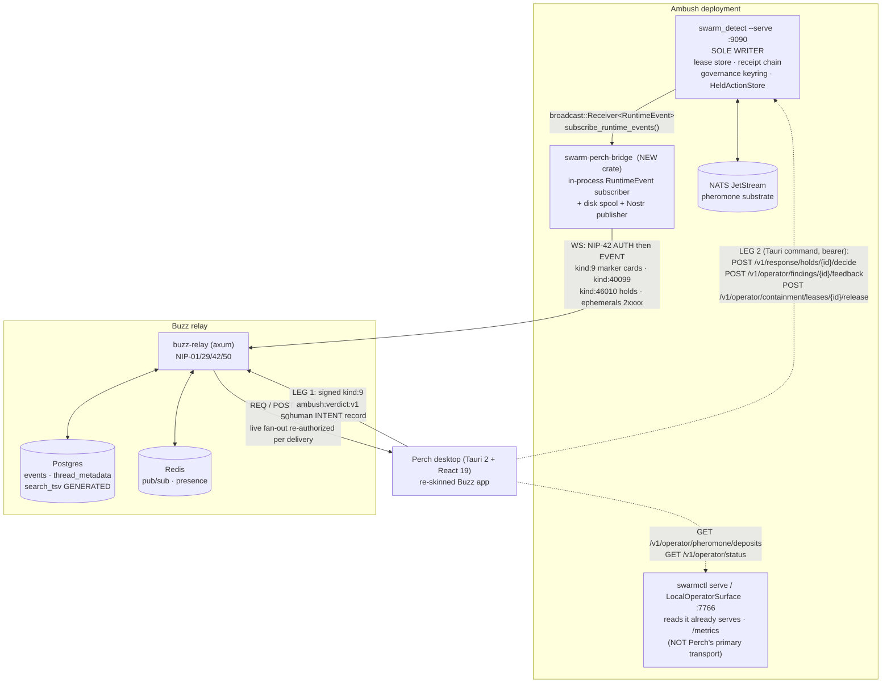

# Perch — Master Brief

**Status:** settled direction. Nine parallel documents build from this file.
**Decided by:** synthesis over five concepts and three judge panels.
**Repos:**
`BUZZ` = `/Users/connor/Medica/backbay/buzz` (block/buzz, Apache-2.0)
`AMBUSH` = `/Users/connor/Medica/backbay/standalone/swarm-team-six` (backbay-labs/ambush, Apache-2.0)

Every load-bearing claim below is cited `path:line` and was read from source during
synthesis. **Read §13 before citing §3, §4.3, §4.5, §6 or §7 — ten amendments have been
ratified since the nine documents were written, and the text has been edited to match them.** Where a claim is inherited rather than re-verified it says **unverified**.
Three claims that the judge panel asserted are corrected in §11; read that section
before you cite anything about destructive-action taxonomies or the TCB crate list.

---

## 1. The product

**Perch** — Ambush's operator console.

> A shift-shaped verdict queue where every human decision is a typed, signed act that
> becomes the swarm's next tuning input and the quarter's audit artifact.

**Ten-second pitch.** Ambush already decides, acts, and proves. What it cannot do is
*receive an answer from a human*. Perch is the door. It is the Buzz desktop app —
mature, agent-native, keyboard-fast — re-pointed at the swarm, organized around the one
thing an analyst does most: look at something the swarm surfaced, decide, and move on.
The decision is signed, it lands in the audit chain, and by Friday it is why the
detector got retuned.

**Why the name.** A perch is where a predator waits before an ambush. It is the
operator's seat, not the swarm's — which is exactly the relationship the console models.
It is also the only vocabulary invention we permit ourselves; everywhere else the UI uses
the domain's own words (§7.4).

### 1.1 Who the user is

| | Primary | Secondary | Tertiary |
|---|---|---|---|
| Who | **Watch analyst.** On shift, 8 hours, one or two screens, keyboard-first. Arrives mid-story. | **Detection engineer.** Weekly, not hourly. Tunes detectors, reads the rules file, owns false-positive rate. | **Auditor / governance reviewer.** Quarterly. Asks "show me every destructive action in Q3 and who approved it." |
| Needs | Fastest path from "something happened" to "I understand and I acted." Resumption after a break. Handoff at 06:00. | Evidence that this week's verdicts should change next week's thresholds. | Enumeration, search, export, and a chain they can verify without trusting the console. |
| Fails when | The queue admits everything; the row jumps under the cursor; the console disagrees with `swarmctl`. | Recommendations are computed from nothing because no human verdict ever reached the engine. | Artifacts are only reachable by filesystem grep. |

Design the solo operator first. Ambush declares "internet-exposed or multi-tenant operator
governance" an explicit non-goal (`AMBUSH docs/CONSENSUS.md:312`) and states it is not a
"PKI or multi-tenant operator system" (`:199`); many deployments are one person and a
laptop. The rota is the elaboration, not the base case — otherwise "End watch" is a button
nobody presses.

---

## 2. The argument

### 2.1 Two repos each built half of a triage loop, and neither built the join

Ambush computes the answer to "was that alert real?" and cannot be told. The tuning engine
is real and shipped: `build_alert_tuning_report` ranks `HostExclusionReview` /
`DetectorThresholdReview` / `DetectorRuleReview` off `FalsePositiveMeasurement` records
against live thresholds — `HOST_EXCLUSION_MIN_RATE = 0.75`,
`DETECTOR_THRESHOLD_MIN_RATE = 0.50`, `DETECTOR_RULE_MIN_RATE = 0.34`
(`AMBUSH crates/swarm-runtime/src/alert_tuning.rs:6-15, 84`). The report ships inside
`OperatorStatusReport` (`AMBUSH crates/swarm-runtime/src/service/types.rs:206`).

The only writers of a `FalsePositiveMeasurement` are two HMAC-signed external webhooks:
`providence_handlers.rs:170` and `soar_verdict_handlers.rs:151`
(`AMBUSH crates/swarm-ingest-runtime/src/ingest/`). The operator surface registers **49**
routes (`AMBUSH crates/swarm-runtime-http/src/http/state.rs`, 49 `.route(` calls) and grep
for `feedback|providence` across that file returns **nothing**. Ambush has a typed analyst
verb set — `ProvidenceFeedbackAction = Confirm | Dismiss | Investigate`
(`AMBUSH crates/swarm-core/src/types.rs:112`) — and no route by which an analyst sitting
in front of Ambush can use it. The tuning loop is a closed circuit missing its input.

Buzz has the mirror-image hole. Its Home inbox is a finished two-pane triage queue, and
its `needs_action` lane is literally `e.kind IN (46010, 40007)` scoped to channels you can
still see (`BUZZ crates/buzz-db/src/store/feed.rs:192-199`). Kind 46010 is defined
(`BUZZ crates/buzz-core/src/kind.rs:578`), listed in `ALL_KINDS` (`:745`), and rejected at
ingest because it is absent from `required_scope_for_kind`, whose default arm is
`Err("restricted: unknown event kind")` (`BUZZ crates/buzz-relay/src/handlers/ingest.rs:545`).
The producer is a stub: `// TODO (WF-08): create approval record in DB, emit kind:46010`
(`BUZZ crates/buzz-workflow/src/executor.rs:727`). The desktop card says, in shipped code,
`"Approval actions are not yet available in Desktop."`
(`BUZZ desktop/src/features/workflows/ui/WorkflowApprovalCard.tsx:27`).

The consumer half is production-grade. `handle_approval_grant` resolves a token hash from
the `d` or `e` tag, checks pending status and expiry, validates the approver spec, flips
status race-safely and resumes from `step_index + 1`
(`BUZZ crates/buzz-relay/src/handlers/command_executor.rs:1020+`). `grant_approval` and
`deny_approval` are registered Tauri commands (`BUZZ desktop/src-tauri/src/lib.rs:773-774`).

That join is real, cited, and cheap. It is the reason this project exists.

### 2.2 The hold does not exist yet, and that is the bill

`PolicyVerdict::RequireHuman` in `RuntimeMode::LiveResponse` returns
`ApprovalError::Denied` (`AMBUSH crates/swarm-runtime/src/lib.rs:979-981`) and records
`AuditResponseRecord::Skipped` (`:1133-1145`). The human gate is a **refusal, not a queue**.
The one human-approved execution path,
`audit_authorize_and_execute_human_approved_instrumented`
(`AMBUSH crates/swarm-runtime/src/lib.rs:1085`), is called from exactly two places, both in
the demo lane (`AMBUSH crates/swarm-ingest-runtime/src/ingest/demo.rs:725, 1369`), behind
`state.demo_mode_enabled()` (`demo.rs:1284`).

So Perch's central artifact — a held destructive action with a lease countdown and four
keys — has nothing behind it today. Building the daemon-side hold store is the one
substantial backend item and it is **not** two thin routes. Budget it first. A queue
shipped ahead of it is a beautiful empty inbox.

### 2.3 Why the Buzz relay stays, and why the fork must stay at two lines

The contrarian's year-two argument is correct and is adopted as a constraint, not as a
conclusion. Buzz moves fast, `desktop/src` is 322,393 LOC, and the repo maintains three
hand-synced kind registries. Every new *stored* kind forks `buzz-core/src/kind.rs`,
`buzz-relay`, possibly `schema/schema.sql`'s `search_tsv` CASE plus its migration
(`BUZZ schema/schema.sql:224`), `desktop/src/shared/constants/kinds.ts` and
`mobile/lib/shared/relay/nostr_models.dart`. Six new kinds is a wound that reopens on
every rebase.

Two mechanisms make the fork almost nothing:

- **Marker-prefixed kind:9 bodies.** Buzz already ships a content-sniffing renderer path:
  `WAVE_MESSAGE_MARKER = "<!-- buzz:wave:v1 -->"`
  (`BUZZ desktop/src/features/messages/lib/waveMessage.ts:1`), sniffed in
  `MessageRow.renderBody()`'s default arm
  (`BUZZ desktop/src/features/messages/ui/MessageRow.tsx:413-427`). An Ambush evidence card
  is a kind:9 whose body starts `<!-- ambush:finding:v1 -->` followed by JSON and a
  one-line human fallback. It renders as a card in Perch and degrades to readable text in
  the Flutter app, the web client, `buzz messages thread`, and a search snippet — with
  **zero** additions to three kind registries.
- **Ephemeral kinds 20000–29999.** They take a separate ingest path with only a
  `MessagesWrite` scope check and no per-kind allowlist
  (`BUZZ crates/buzz-relay/src/handlers/event.rs:694-707`). Live pheromone telemetry, agent
  health and mode gauges need no registry entry at all. Note ephemerals are rejected on the
  HTTP bridge (`BUZZ crates/buzz-relay/src/handlers/ingest.rs:2193-2196`), so the bridge must
  hold a WebSocket.

What Ambush gets in exchange is the entire backend project it would otherwise have to
build: enumeration, filtering, keyset pagination with a server-authoritative `has_more`,
NIP-50 full-text search where the row write *is* the index update
(`BUZZ schema/schema.sql:224-227`), resumable live fan-out, and per-case compartments
re-authorized on every single delivery (`BUZZ crates/buzz-relay/src/handlers/event.rs:116-217`).
Ambush's own surface has none of it — `/v1/operator/replay|investigation|incident` reject
anything but exactly one selector, and `limit_*` overwrites `total_count` with the truncated
length, so "50 of 4000" is unimplementable (`AMBUSH .../http/helpers.rs:51-123, 243-260`,
per recon).

### 2.4 What we overrule from the tally, and why

The aggregate favoured `operators-day` (127) over `incident-is-a-channel` (118). We take
**operators-day's product spine on incident-is-a-channel's substrate**, which is what the
staff-frontend judge argued for explicitly: *architecture constrains, framing travels*.
Perch's framing grafts cleanly onto Clowder's integration; Clowder's integration does not
graft onto anyone else's. This is a graft, not a reversal — the winning name, thesis,
operator story and organizing metric are `operators-day`'s.

We **reject** the contrarian's conclusion (delete the relay, build ~6k LOC from scratch)
and **adopt** its constraint list wholesale (§8). We reject `watch-the-colony`'s topology
(delete the relay, keep only Tauri) and adopt its physics view as an *ambient* surface,
its "N sources / M agents" rule as a hard render law, and its derived-vs-served marking as
a doctrine. We reject `trust-the-trigger`'s six-new-stored-kinds and adopt its safety
reasoning, its fixed-order warrant pane, its lease board, and its rule-shadowing
annotation — the single best affordance any concept produced.

---

## 3. The settled surface list

Fourteen surfaces. Nothing else ships in v1. Snooze and the colony rail are mechanisms
inside surfaces, not routes.

| # | Surface | Route | Buzz origin | Purpose |
|---|---|---|---|---|
| 1 | **The Watch** | `/` | `desktop/src/features/home` (HomeView two-pane, `lib/inbox.ts`, `useFeedItemState.ts`, `useResizableInboxListWidth`) | The shift queue. Four lanes remapped from `FeedItemCategory`: `needs_action` (holds + due snoozes), `mention` (an Escalate naming you), `activity` (movement on cases you took), `agent_activity` (swarm digest). The only screen a shift starts on. |
| 2 | **The Verdict Row** | detail pane of `/` | `features/home` `InboxDetailPane` + `features/workflows/ui/WorkflowApprovalCard` + `shared/ui/{Badge,AlertDialog}` | Approval and disposition in the row, never a separate screen. Fixed field order (§7.1). Keys `C` / `D` / `I` on a finding and `G` / `R` on a hold (§13, amendment A1; normative map in `04` §3.0). Findings carry Confirm / Dismiss / Investigate. |
| 3 | **Case** | `/cases/$caseId` | `features/channels` + `features/messages` timeline, threads, members sidebar | One private, TTL-renewing NIP-29 channel per promoted hunt or `CorrelatedIncident`. Agents post as members. Correlation is a NIP-10 reply thread. The case id **is** the channel UUID. |
| 4 | **Lanes** | sidebar, `/lanes/$threatClass` | `features/channels` + `features/sidebar` | Twelve standing open channels, one per entry in `standard_threat_classes()` (`AMBUSH crates/swarm-runtime/src/escalation.rs:315-330`). Topic rewritten on each `ConcentrationSnapshot`. The swarm's resting state; zero domain invention, because `RuntimeEvent::Escalation` carries `threat_class` and nothing else. |
| 5 | **Case Canvas** | inside a case | `features/channels/ui/ChannelCanvas.tsx` (kind 40100) | The running IR notes that *are* the post-incident write-up. Seeded from a template on case open. Today Ambush's whole narrative capacity is one `Option<String>` set at review-session creation. |
| 6 | **Leases** | `/leases` | NEW, thin (`shared/ui/progress`, `AnimatedCount`, `Badge`) | Open containments. `remaining_ms` and `expired` rendered as **two separate facts**. Release reads `lease_closed` from the body, never the status code. |
| 7 | **Policy** | `/policy` | `features/workflows` YAML document view + `CronExpressionInput` human-description pattern | `policy.rules` in file order, with `this rule means no human will be asked` on every allow rule outranking `human_gate_severity`, and shadowed rules dimmed. Read-only in v1. |
| 8 | **Watchfloor** | `/watch-floor` | `features/pulse` reshaped + `features/agents/ui/AgentStatusBadge` + NEW substrate view | Ambient wall screen: client-computed decay field, threshold rules, crossing rings, agent colony, mode. Reads ephemeral telemetry only. Deliberately not the homepage. |
| 9 | **Governance strip** | persistent chrome | `app/RelayConnectionOverlay` + `shared/api/useRelayConnection` (2 s debounce) | The four `PartitionState` values in front of the operator at the moment of decision. Renders `committee of 1 (solo transport)`, never a quorum fraction. |
| 10 | **Ledger** | `/ledger` | `features/search` (`lib/parseSearchOperators.ts`) over NIP-50 Postgres FTS | One query bar across findings, receipts, leases, canvases and human verdicts. `from:whisker-7a3f in:case-0042 after:2026-08-01 block_egress`. Export a filtered set. |
| 11 | **Tuning bench** | `/tuning` | `features/moderation` review-queue UI (signals-are-never-triggers model) | Ranked `AlertTuningRecommendation` cards with reviewed count, FP count, rate, and `supporting_signals`. Click through to the underlying verdicts. Next step is a config-diff proposal, never auto-apply. |
| 12 | **Handoff** | `/handoff` | NEW, composed from `app/AppShellContext.tsx:33-48` read frontiers + `features/reminders` + Ambush `ReviewSession` | One button: End watch. Composes a `ReviewSession` from every case touched, attaches canvases and open leases with remaining TTLs, lists snoozes and when they return, and passes the three read frontiers. |
| 13 | **Gaps** | `/gaps` | NEW, thin | The 18 intentionally-uncovered ATT&CK techniques across 11 detectors, with their written rationale, from `rulesets/evasion/attack-technique-catalog.yaml`. **Every empty state in the app links here instead of saying "no data".** |
| 14 | **swarmctl terminal** | panel, case-scoped | `features/terminal` + `src-tauri/src/terminal_runtime.rs` | A real PTY pinned to the open case, pre-scoped with case id and the right `--*-results-dir` flags. ~124 of 126 swarmctl subcommands are not HTTP clients (3 `reqwest::` sites in 5,750 lines of `crates/swarm-cli/src/core.inc`); hosting them honestly is the only non-fiction answer. |

---

## 4. Integration decision

### 4.1 The commitment

**The Buzz relay stays as the read / subscribe / search substrate. `swarm_detect --serve`
remains the only writer of Ambush state. Perch is the Buzz Tauri desktop app, re-skinned.
The relay fork is two match arms. All other Ambush artifacts ride existing kinds.**

### 4.2 Process topology



### 4.3 Data flow, in words

1. **Ingress is in-process, never SSE.** The bridge calls
   `IngestState::subscribe_runtime_events()`
   (`AMBUSH crates/swarm-ingest-runtime/src/ingest/mod.rs:1875`). This deletes four problems
   at once: the absent CORS layer (verified — `tower-http`, `CorsLayer` and any
   `Access-Control` header are **absent from every crate**), the unauthenticated
   `/v1/events/stream`, the ALPN-pinned HTTP/1.1 with `keep_alive(false)` that is hostile to
   long-lived SSE, and one network hop.
2. **The receive loop spools to disk before any Nostr I/O.** `DEFAULT_RUNTIME_EVENT_CAPACITY`
   is 1024 and a lagged `BroadcastStream` receiver drops silently. For this product a dropped
   frame is a correctness bug, not a performance one. The bridge must never be the slow
   consumer.
3. **Every published envelope carries a monotonic per-issuer sequence.** A gap renders as a
   gap. This is non-negotiable and is the mechanism behind §8.2.
4. **Durable evidence rides kind:9 with a versioned marker comment**
   (`<!-- ambush:finding:v1 -->`, `ambush:receipt:v1`, `ambush:lease:v1`, `ambush:hold:v1`,
   `ambush:rollback:v1`). The Ed25519-signed Ambush artifact goes verbatim in the body; the
   Nostr envelope adds a second, independent secp256k1 signature. `h` = case or lane channel
   UUID. Single-letter tag budget is spent deliberately: `t` = threat class slug, `l` =
   severity, `e`/`p` = NIP-10 threading and agent mentions. `strategy_id`, `host_id`,
   `receipt_id`, `lease_id` live in the body and are reachable via NIP-50 FTS only, never as
   a `#filter` — NIP-01 indexes only single-letter tags. That is a real, named, permanent
   cost, because the events are signed.
5. **Live telemetry rides ephemeral kinds 20000–29999** and is never stored: concentration
   snapshots, agent health, ingest rate, mode. Coalesce `ConcentrationSnapshot` to 1 Hz
   before it crosses the IPC boundary — the runtime ticks at 100 ms while the pheromone clock
   is whole seconds, so nine of ten frames carry no new information, and a 10 Hz × 12-class
   stream through React Query walks straight into Buzz's documented `React.memo` trap
   (`BUZZ CLAUDE.md`, gotcha 6).
6. **Writes are two-legged and never conflated.** Leg 1 is a signed `kind:9` card carrying the
   `ambush:verdict:v1` marker into the case channel: a **human intent record**, never an
   authorization. (Not 46030/46031 — those are Buzz *command* kinds that never reach storage;
   `03` §5.5 has the trace and §13 amendment A2 records the change.) Leg 2 posts the decision to
   the daemon, the only process holding the lease store `Arc`, the receipt counter and
   `previous_commit_hash`. The daemon re-evaluates policy and governance from scratch and
   mints the `CapabilityLease` at **decision** time, never at hold time — the shipped
   `lease_ttl_ms` is 60000 (`AMBUSH rulesets/default.yaml:94`), so a lease minted when the
   hold is created is dead before a human finishes reading the page.

### 4.4 The relay fork, exactly

Two match arms in `BUZZ crates/buzz-relay/src/handlers/ingest.rs`:

1. `required_scope_for_kind`: add `KIND_WORKFLOW_APPROVAL_REQUESTED => Ok(Scope::MessagesWrite)`
   before the default arm at `:545`.
2. `requires_h_channel_scope` (`:703-732`): add `KIND_WORKFLOW_APPROVAL_REQUESTED`, so a hold
   is channel-scoped and compartmentalization applies to it.

Verified: 46010 is in neither list today, and is not in `is_global_only_kind` either. **No
`search_tsv` change is needed** — 46010 is not one of the privacy-gated kinds in the
`CASE` at `BUZZ schema/schema.sql:224`. This is upstreamable to block/buzz as a bug fix:
the kind is defined, in `ALL_KINDS`, and queried by the desktop needs-action feed, and
nothing can emit it.

**Rule: any proposal to add a third stored kind must be argued in writing against the
marker-comment alternative and must name who maintains the three-registry sync.**

### 4.5 The Ambush backend bill, in build order

| # | Item | Where | Why it is required |
|---|---|---|---|
| 1 | **`HeldActionStore` + `RuntimeEvent::ResponseHeld`** | daemon (`swarm-runtime`) | `RequireHuman` is a refusal today (`lib.rs:979-981`, `:1133-1145`). Without this the queue is empty. Keyed `{hold_id, action_request, rehearsal, policy_decision, held_at_ms, expires_at_ms, decision}`. Persist a hold instead of `Skipped`. |
| 2 | **`POST /v1/response/holds/{hold_id}/decide`** | daemon, `OperatorScope::Approve` | The decision door. Re-evaluates policy + governance, then calls the existing `audit_authorize_and_execute_human_approved_instrumented` (`lib.rs:1085`), which today is reachable only behind `demo_mode_enabled()`. |
| 3 | **`POST /v1/operator/findings/{finding_id}/feedback`** | daemon, `OperatorScope::Approve` | `Confirm \| Dismiss \| Investigate`, writing the same `FalsePositiveMeasurement` the Providence webhook writes at `providence_handlers.rs:170`. This is the loop. |
| 4 | **`GET /v1/operator/pheromone/deposits`** | operator surface, read | Pass-through of `query_deposits(DepositQuery)`. **Must return the post-suppression, post-evaporation slice plus the resolved `ThreatClassPolicy`** (§8.3). |
| 5 | **Gate `/v1/events/stream`** | daemon | It is unauthenticated today and leaks tamper alerts, receipt ids and arbitrary agent details. Fix it regardless of Perch. |

Item 1 is the largest and gates everything. Do not describe it as "two thin routes."

### 4.6 Where the new code lives, and the TCB rule

New crate **`swarm-perch-bridge`**, a sibling of `swarm-ingest-runtime`, strictly downstream
of the trusted computing base. `tools/check-workspace-layering.sh:181` defines
`TCB = ("swarm-crypto", "swarm-policy", "swarm-spine")` and bans `axum`, `clap`, `hyper`,
`reqwest` from them in **every** dependency kind including dev- and build-deps.
`swarm-core` is inside the TCB *closure* and enforced by rule 1 but is not itself named TCB
(`docs/decisions/0009-trusted-computing-base-boundary.md:133-134`). `swarm-ingest-runtime`
already names `axum` and `reqwest`, so a sibling may name `tokio-tungstenite`, `nostr` and
`buzz-ws-client` without touching the gate. **No document may propose a change that puts a
transport into a TCB crate.**

Egress uses `buzz-ws-client` — 314 lines in `connection.rs`: connect, wait for the AUTH
challenge, sign kind:22242, EVENT, read OK.

### 4.7 Identity: two chains, never conflated

Ambush signs Ed25519 (`swarm-crypto`); Nostr requires secp256k1 BIP-340 Schnorr. They are
disjoint. Each agent instance gets a second, Nostr-only keypair, bound to its
`swarm:ed25519:<hex>` identity by a NIP-OA owner attestation
(`BUZZ crates/buzz-sdk/src/nip_oa.rs`) so the relay learns the owner with no DB round-trip
and a ban on the operator cascades to every agent key
(`BUZZ crates/buzz-relay/src/handlers/auth.rs:106-184`).

**Every verification surface must say which chain it checked.** Verification runs against
the Ed25519 chain, locally, and never against the Nostr envelope it travelled in.
Otherwise "trust the bridge" silently replaces "trust the receipt."

---

## 5. Take verbatim / re-skin / replace / delete

### 5.1 Take verbatim

- `desktop/src/shared/ui` (69 tsx + 15 ts + 20 markdown sub-components), `shared/layout`,
  `shared/hooks`, `shared/features` (flag manifest + `FeatureGate`).
- `shared/theme` adaptive engine: `createThemeVars` derives **38** tokens from three hex
  colors (`adaptive-theme.ts:191`). An Ambush palette is one theme entry.
- `PubKey` and its CI guard (`desktop/scripts/check-pubkey-truncation.mjs`). Its doctrine —
  a truncated key is grindable, so security decisions are made against the whole key — is
  Ambush's own threat model already written down as a component contract.
- The rem type ramp and `check-px-text` (`desktop/scripts/check-px-text.mjs`). A 24/7
  wallboard under Cmd +/- needs this; a frozen px literal is an illegible severity label
  at 02:00.
- Deep-link queue-with-explicit-ack across three Rust-held queues, fail-closed during a
  community switch (`shared/deep-link.ts`, `src-tauri/src/deep_link.rs`).
- `features/terminal` + `src-tauri/src/terminal_runtime.rs`.
- The three read frontiers — channel, thread, per-message — and forced-unread
  (`app/AppShellContext.tsx:33-48`, `getMessageReadAt` / `markMessageRead`).
- `shouldNotify` (`features/notifications/lib/shouldNotify.ts:28-76`): broadcast and mention
  are unconditional; everything else is opt-in.
- Snooze: `features/reminders` `TIME_PRESETS` (30 m / 1 h / 3 h / tomorrow 9am / next Monday
  9am, `lib/timePresets.ts:30-44`) and the `{eventId, channelId, preview, authorPubkey}`
  target record.
- The community rail, keyed remount and `resetCommunityState()` — **converted to a typed
  registry with an exhaustiveness check in the same change that adds the first Ambush
  singleton** (§8.4).
- The E2E mock-bridge *architecture* (one `switch(command)` behind `mockIPC`) and
  `just desktop-screenshot`. The Buzz fixtures are worthless; split the 14,620-line file
  before reusing it.

### 5.2 Re-skin

- Palette: add `ambush` / `ambush-dark` via `resolveShikiThemeName`'s existing alias
  indirection (`theme-loader.ts:55`) — Buzz itself is already an alias. Three hex values.
- Lower `--radius` (one root token) and turn off `useSmoothCorners` on data surfaces.
- Home → The Watch; channel → Case / Lane; member list → Colony; workflow approval card →
  Verdict Row; moderation review queue → Tuning bench; pulse → Watchfloor.
- **Caution:** the Buzz brand cascade selects on `data-testid` values
  (`app-sidebar`, `stream-list`, `dm-list`, `community-rail`, …). Renaming a Buzz concept
  without updating those silently breaks theming with no compile error.

### 5.3 Replace

- `WorkflowApprovalCard`'s body (a 30-line stub) with the fixed-order verdict pane.
- The Buzz workflow **executor** as the approval producer. Keep `WorkflowRunTrace`,
  `StepProgress` and the card as pure presentation over Ambush's own state machine.
- The `/settings` fake-route pattern (`routes/settings.tsx:29-34` renders `null` while
  `AppShell` swaps the whole layout). Make it a real route **before** adding surfaces.
- Buzz's `workflow_approvals` table as the hold's durable home. It has hard FKs to
  `workflows` and `workflow_runs`; an Ambush hold would need a synthetic workflow and run
  per action. The hold lives in the daemon where the authority lives; kind 46010 and the
  `ambush:verdict:v1` card are the *conversation and notification* about it.

### 5.4 Delete

Ordered by how much surgery each is.

| What | Cost | Why |
|---|---|---|
| Huddle (45 Rust files, `AppHuddleShell` wrapping the whole layout, `useHuddlePresentation` 15.8 KB, `huddleWindowChannelId()` branched on in `main.tsx`/`App.tsx`, 10 `--huddle-*` theme vars) | **Surgery, not deletion. Budget it.** | A voice war room is a v3 idea; carrying it means the shell's outermost wrapper is a feature we do not ship. |
| `EmojiBurstProvider`, `PoofBurstProvider`, `SpoilerParticles`, sprite PNGs, `plop.m4a`, 24 chime files | Provider-hierarchy surgery (`main.tsx:93-94`) | Confetti when you isolate a production host is a category error. |
| The user-selectable 10-swatch accent palette (`ThemeProvider.tsx:44-55, 198-237`) | Low | It overwrites `--primary` and includes Green, Orange and Red. In a console where those carry severity and authority, a user-chosen red primary destroys severity legibility. **Pin the accent.** |
| `card-texture*.png` (~3.4 MB nine-slice), the bee mark, the two-stop brand gradient | Low | Pure Buzz identity; rebranding is mandatory anyway. |
| GIFs (Klipy third-party API), custom emoji, remote link-preview fetching | Low | Egress from an analyst workstation is a threat-model question, not a UX one. |
| Projects / NIP-34 git forge (279 files) and the web repo browser | Low (route + gate) | Ambush's rulesets are a signed, sha256-pinned bundle whose key is deliberately absent from the repo. A second review-and-merge path would create a config-edit route startup verification rejects. |
| Forum (45001–45003), Pulse-as-social | Low | A post-mortem is a case canvas. A slow discussion board is ceremony a night-shift analyst will never open. |
| `/messages/new` DM composer as a top-level route | Low | Operator side channels outside the case are exactly what makes an incident unauditable. DMs collapse into the case or they do not exist. |
| The process-management half of `features/agents` (ACP subprocess harness, vendor-CLI discovery, persona catalogs, `switch_model` / `cancel_turn`) | Medium | Ambush's `AgentRole` is a closed 8-variant in-process enum. There are no subprocesses to manage. **Keep the roster, `AgentStatusBadge`, and the 15 activity render classes** — those are load-bearing. |
| `mesh-compute` / `mesh-llm-*` (git-URL dependency, license unverified) + `iroh` | Low | An unpinned third-party dependency reached over the network is a supply-chain finding in a security product's first pentest. |
| Mobile (Flutter) for v1 | Low | Parity is already thin, and it removes one of three hand-synced kind registries. Marker-prefixed kind:9 means mobile comes back for free later. |
| `/reminders` as a top-level route | Low | The mechanism stays and becomes Snooze. A separate reminders page is a second inbox. |
| Community moderation as a social feature (bans, timeouts) | Low | Keep the queue UI and the signals-are-never-triggers doctrine as the Tuning bench; delete the enforcement path. Ambush's analogue is `ConsensusExclusionReceipt`, not a channel ban. |
| Onboarding's key-generation-as-identity ceremony (13.4 kLOC) | Medium | Reduce to: pair this workstation to this colony, then back up the key. Keep the encrypted-backup test-restore step; it is the one part worth keeping. |
| The "zero-notification" marketing line | — | True of subscription semantics, false of shipped toast defaults (7 of 8 sound slots default on). Reset the defaults; do not repeat the claim. |

---

## 6. The contrarian's objections, converted to binding constraints

These are constraints, not footnotes. A document that violates one is wrong.

**C1 — Fork hygiene is a shipping constraint.** The relay fork is capped at the two match
arms in §4.4. Any new stored kind requires written justification against the
marker-comment path. Buzz upstream must keep flowing in.

**C2 — Trust boundary must be argued, not assumed.** Postgres, Redis and 40 migrations
enter a product that ships two containers. Every doc that touches deployment must state
this cost in its own words and must not bury it. The relay runs inside the operator's
network boundary, not on the internet.

**C3 — Three destructive facts, rendered separately — but they are not the three the panel
claimed.** See §11.1. Render: (a) **destructive / human-gated / receipt-required** — the
same 12 actions in all three definitions; (b) **reversible / irreversible / unmapped** — 3
actions have an executable `ContainmentInverse`; (c) **which rule decided** — allowed
outright by a named policy rule, or held by the static gate. Buzz has one `--destructive`
token; this needs deliberate token work.

**C4 — No Deny button on the approval-ledger path.** `validate_and_append_vote` hardcodes
`ApprovalVote::Approve` (`AMBUSH crates/swarm-runtime/src/approval.rs:1341`). There is no
signed reject path in the ledger. Render abstain-by-silence, or make building the signed
reject path an explicitly budgeted backend item. A Deny button whose rejection is silently
discarded is the exact class of falsehood this product cannot survive. (This is separate
from a refusal on a *hold*, which is ours to define and rides the `ambush:verdict:v1` card.)

**C5 — Show the bytes before any signature.** Wherever Perch touches the approval ledger it
renders the literal RFC 8785 canonical JSON of `{approval_set_id, ledger_id, voter_id}` —
three strings the client already holds — with the voter id at full 64 hex characters.
Carry the caveat: the handler enforces `voter_id == principal.operator_id`, so
`operator_id` must literally be `swarm:ed25519:<hex>` — a deployment convention, not a code
change.

**C6 — Adopt the two CI guards into Ambush.** `check-pubkey-truncation.mjs` (extended to
64-hex Ed25519 identities) and `check-px-text.mjs`, wired into Ambush's `tools/check-*.sh`
culture which `tools/check-gates-wired.sh` already enumerates. Discipline that is not a
gate is one rebase from gone.

**C7 — Fix `/v1/events/stream` regardless.** It is a live unauthenticated disclosure. Perch
does not consume it (§4.3), which is a reason to fix it, not a reason to leave it.

**C8 — No charting library is assumed.** Buzz ships zero charting; `--chart-1..5` exist as
shadcn leftovers and `createThemeVars` does not emit them. The Substrate is hand-authored
SVG sourcing color from CSS custom properties. Any chart must survive `check-px-text`.

**C9 — Instrument the claim.** Perch is sold on time-to-acted and on feeding the tuning
loop. Ship three counters from day one: median seconds from page to verdict;
`FalsePositiveMeasurement` records written per week; and what fraction of Friday's
recommendations are built from this week's own human verdicts. If they do not move in a
quarter, the console is decoration.

---

## 7. Render laws

Every document must obey these. They are not style preferences.

### 7.1 The verdict pane has a fixed field order that never varies by action type

```
ACTION          typed ResponseAction variant and params — never a string
BLAST RADIUS    ResponseBlastRadiusPreview: scope_kind / scope_value / impact /
                max_affected_scopes / affected_capabilities
IF YOU UNDO     the executable ContainmentInverse, or "irreversible", or "unmapped" —
                three states, never a uniform Undo
WHY WE ARE      the named policy rule, or "no rule matched → static gate at
ASKING          human_gate_severity"; then the evidence and the source expansion
WHAT GRANTING   the CapabilityLease that would open, with its TTL
OPENS
```

At 02:41 an operator reads by position. A pane that reshuffles by action type forces a
re-read at the moment re-reading is most expensive.

### 7.2 Never render a bare source count

`findings_to_deposits` sets `agent_id: strategy_scoped_agent_id(agent_id, &finding.strategy_id)`,
which is `"{agent}:{strategy}"` (`AMBUSH crates/swarm-whisker/src/stream.rs:20-22, 46`), and
`concentration_for` does `sources.insert(deposit.agent_id.0.clone())`
(`AMBUSH crates/swarm-pheromone/src/substrate.rs:1294`). So `distinct_sources` counts
**strategy-scoped ids**: one Whisker running four detectors satisfies a
`min_sources_for_escalation` of 4. The anti-flooding guard is defeatable by a single agent.

**Law:** every place a source count appears it reads `N sources / M agents` and expands to
the actual ids grouped by real agent. A count must never launder itself as corroboration.

### 7.3 Honest badges, mechanized

- `attestation_verified: true` renders as **"attestation matches this body"**, never a green
  shield. `ConsensusGovernanceReceipt::verify` checks the signature against a public key
  carried *inside the receipt*: there is no trust anchor, nothing compares the signer to the
  configured governor set, and a full re-attestation is not caught
  (`AMBUSH docs/decisions/0010-containment-release-goes-through-the-daemon.md:115-139`).
  `governance_attestation: None` renders as **UNATTESTED**, not as fine.
- Rollback renders `Reversed / Simulated / Irreversible / Unsupported / Failed`, never
  collapsed. `fully_reversed()` is strict on purpose.
- A `200` on lease release is not "released". Read `lease_closed` and `fully_reversed`
  separately; `lease_closed: false` is a failure and the lease stays open by design
  (ADR 0010 consequences).
- `remaining_ms` saturates at zero, so it alone cannot distinguish "expires in an instant"
  from "expired an hour ago and the sweep failed". `expired: true` on a still-listed lease
  is a **loud** state: a host is still contained
  (`AMBUSH crates/swarm-runtime-http/src/http/containment.rs:70-88`).
- Governance renders `committee of 1 (solo transport)`, never `3 of 5 approved`.
- Promotion showing 0 promoted is **correct by design** with the shipped ruleset, and must
  say so. The four solver states — proved / disabled-stub / absent-null / unproved — render
  as four visually distinct things, never one grey chip.

### 7.4 Derived-vs-served marking, and the vocabulary rule

Anything the console computes that the runtime does not carries a visible marker naming the
function it evaluated. Per-host concentration does not exist in the runtime —
`concentration_for` sums by threat class only. The runtime's own `ConcentrationSnapshot` is
what a header displays; a client curve is explicitly the interpolation between authoritative
samples. When a snapshot disagrees with the client prediction beyond epsilon, the curve
snaps **visibly** and the trail gets a row saying why. Never a silent correction.

Wherever the domain has a typed word, the UI uses that word: `RequireHuman`,
`Confirm / Dismiss / Investigate`, `Reversed / Simulated / Irreversible`, `distinct_sources`,
`lease_closed`. The moment Dismiss becomes a thumbs-down, the tuning loop is fed by an emoji
and the audit artifact is a reaction.

### 7.5 Dismiss is never a gesture

`is_suppressed_by_feedback` removes every deposit at or before a Dismiss marker
**retroactively** from the concentration sum (`AMBUSH crates/swarm-pheromone/src/substrate.rs:1282`,
`concentration_for` skipping suppressed deposits). Dismiss does not merely stop future
accumulation — it deletes past evidence from the number that drives escalation. A mis-keyed
`D` at 03:00 can silently lower a host below threshold and suppress the escalation that
would have paged the next shift.

**Law:** the row shows what the dismissal will retroactively suppress before it is
committed, and the suppression renders as an explicit timeline row — never as a curve that
quietly steps down.

### 7.6 The grant button says what it is

`record my decision and send it to the daemon`. Never `approve`. Put that copy in a
component that cannot be styled as a primary action without failing a check, the way
`check-pubkey-truncation.mjs` mechanizes the key rule. "Perch never authorizes" is a
sentence, not a type; make it a gate.

### 7.7 Empty states name what is deliberately not covered

Every empty state links to `/gaps` and, where relevant, names the techniques that would not
have made noise. `rulesets/evasion/attack-technique-catalog.yaml` declares **18**
intentionally-uncovered ATT&CK techniques across **11** detectors, each with a written
rationale (verified by count). "Everything looks good!" is off-brand for this product
specifically.

---

## 8. The four risks that must be mechanized, not managed

### 8.1 The relay must not become the record

The relay copy of every finding and receipt will be faster to query, prettier to render,
and searchable. An operator under time pressure will start treating it as the record. If
the bridge drops frames, the console shows a coherent, signed, **incomplete** story with
nothing marking the gap — which directly contradicts "Ambush proves what it saw" and Buzz's
own activity doctrine ("never go dark — if you didn't show it, it didn't happen").

Non-negotiable mitigations: per-issuer monotonic sequence so a gap renders as a gap; a
disk-backed spool in the bridge's receive loop; and every rendered receipt carrying a verify
affordance that reads **the daemon**, not the relay.

### 8.2 The case-promotion bar has no in-tree precedent

Ambush has three grains and none of them is a case. `hunt_id` in the hot path is literally
the telemetry event id (`AMBUSH crates/swarm-runtime/src/service/runtime_service.rs:391`,
per recon) — thousands an hour. `CorrelatedIncident` is recomputed on every correlation run
with a fresh `incident:{hunt_id}:{created_at_ms}` id and has no status, no assignee, no
merge. Escalation is per threat class and carries no host and no hunt.

So the case is our one domain invention, and the bar for opening one is a **configured,
instrumented threshold with a promoted/suppressed counter visible in the console from day
one** — never a constant someone picked. Promote too much and you flood a partitioned
`events` table and become the SIEM Ambush positions against. Promote too little and the case
room is empty and the evidence stays in `data/*`.

Default bar for v1: a held destructive action, **or** a `CorrelatedIncident` with ≥ 2
included members, **or** an analyst promoting a finding by hand.

### 8.3 The client curve must not disagree with `swarmctl`

`concentration_for` skips evaporated deposits, skips retroactively feedback-suppressed
deposits, and resolves a per-class `ThreatClassPolicy` before summing
(`AMBUSH crates/swarm-pheromone/src/substrate.rs:1268-1302`). A naive client that fetches
raw deposits and evaluates `confidence * 0.5^(Δt/half_life)` will show a different number.
If an operator catches Perch disagreeing with `swarmctl`, the console is finished — for
this product that is a disqualification, not a bug report.

Hard contract: the new deposits route returns the **post-suppression, post-evaporation**
slice plus the resolved policy; the header shows the runtime's authoritative
`total_strength`; the client curve is labelled as interpolation; disagreement snaps visibly
with a reason row (§7.4).

### 8.4 `resetCommunityState` is an inventory maintained by discipline

`BUZZ desktop/src/features/communities/useCommunityInit.ts:54-84` is ~20 hand-maintained
singleton resets. Forget one and the previous colony's data leaks forward. In a chat app
that is a stale cache; here it is cross-tenant disclosure caught by nothing.

**Convert it to a typed registry with an exhaustiveness check in the same change that adds
the first Ambush singleton.** Not later.

Related discipline: `shared/api/relayQueryInvalidation.ts` is a hardcoded allowlist of 34
query-key roots used by reconnect healing. A new surface that forgets to register goes stale
after every reconnect, silently.

---

## 9. Non-goals

1. Perch is never an authorization path. It publishes a signed intent record and posts a
   decision; the daemon re-evaluates and dispatches.
2. No writes to any Ambush store from the console process. Ever.
3. No second audit chain. The Nostr envelope is transport plus a second independent
   signature; the Ed25519 chain is the record.
4. No shared-tenancy claim. The colony rail answers "which deployment am I looking at",
   never "these tenants share a governance domain" — that is a declared Ambush non-goal.
5. No social layer: no likes, no contact-list feeds, no kind:1 threat-intel wire, no DMs
   outside a case, no custom emoji, no GIFs.
6. No git forge, no ruleset editing UI, no promotion/canary write path in v1. Those reach
   the operator through the terminal, and the docs say so.
7. No mobile app in v1.
8. No auto-apply of tuning recommendations. The next step after a recommendation is a
   config-diff proposal a human signs.
9. No charting library dependency.
10. No claim that Perch replaces `swarmctl`. ~124 of 126 subcommands have no HTTP surface;
    the console hosts them honestly and says so.
11. No role-based UI gating claims until `OperatorScope::Read` is actually enforced —
    it is checked on no `/v1/operator/*` handler today. Say so on the settings page.
12. No huddle, no video, no voice in v1.

---

## 10. Open questions, each with a recommended default

| # | Question | Recommended default | Trigger to revisit |
|---|---|---|---|
| 1 | Does the daemon-side hold store land before the console, or do we ship a mocked queue first? | **Hold store first.** Develop the UI against the E2E mock bridge with Ambush fixtures; do not ship a demo that implies a working gate. | If the daemon work slips past the console by more than one milestone, ship `/watch-floor` + `/ledger` + `/gaps` as v0 and label the queue "not yet wired". |
| 2 | Where does the case-promotion bar sit? | The three-clause default in §8.2, as config, with a promoted/suppressed counter on `/` (§13, A6). | Any week where `suppressed` exceeds `promoted` by 20× or the case list exceeds ~30 open. |
| 3 | Marker-comment cards versus one new stored kind family? | **Marker comments.** Two-arm fork, honest degradation, no three-registry sync. | If typed `#filter` queries over `strategy_id` / `host_id` become a real operator need that FTS cannot serve. |
| 4 | Case channel visibility: private by default or open? | **Private**, with membership re-authorized on every delivery. Lanes are open. | If operators report friction adding people mid-incident faster than the compartment buys. |
| 5 | Is the hold's durable state in the daemon or the relay? | **Daemon.** The relay carries the conversation and the notification. | Never, without revisiting ADR 0010's single-writer argument. |
| 6 | Does the desktop hold a bearer token for the daemon, and where? | OS keyring via the existing `secret_store`, injected by a Tauri command; never in the webview. | If a browser-hosted Perch is required, this becomes a same-origin gateway question (C7 and the contrarian's design). |
| 7 | One relay per colony, or one relay with many communities? | **One relay per colony** in v1. Buzz's host-derived fence supports both; one-per-colony has the smaller blast radius. | An MSSP deployment with many small estates. |
| 8 | Are lanes twelve fixed channels or dynamic on `ThreatClass::Custom`? | **Twelve fixed**, from `standard_threat_classes()`. `Custom(String)` findings land in the nearest lane and say so. | If a deployment ships custom threat classes in production. |
| 9 | Which four notification classes may wake someone at 03:00? | Mode transition to `Incident` (broadcast), a held destructive action naming you (mention), a lease that failed to release, and a due snooze. Everything else silent by default. | Any request for a fifth. Refuse the first four times. |
| 10 | Does Perch ship an approval-ledger voting surface in v1, or only the hold decision? | **Hold decision only.** The ledger surface is v2 and carries C4 and C5 with it. | If a deployment runs a real multi-governor committee — today `SoloGovernorTransport` serves a committee of one. |
| 11 | Where does `AppShell.tsx` grow, given it is 997/1000 lines? | **Split it before adding the first Perch surface.** `MessageRow.tsx` is 998/998 and the renderer registry must be lifted out of it before the first evidence card lands. | Immediately. Both files are at the cap. |
| 12 | Do we keep the Buzz `web/` client as a second, browser-hosted Perch? | **Not in v1**, but preserve the option: it is 49 files / 4,259 LOC and is precedent that the design harvests cleanly. | If browser-side WebCrypto ledger signing becomes the priority (its "the key never left this browser" property is one a Tauri app signing in Rust cannot claim). |

---

## 11. Corrections to the panel's assertions

Read this before citing anything in this area.

### 11.1 There is no "3 receipt-gated actions" set

All three judges asserted three destructive taxonomies including "3 actions need a signed
receipt (dispatcher.rs:1279)"; two said they verified it. It is wrong.
`response_action_requires_governance_receipt`
(`AMBUSH crates/swarm-runtime/src/dispatcher.rs:1276-1292`) enumerates **twelve** variants —
the same twelve as `StaticApprovalGate::destructive_action`
(`AMBUSH crates/swarm-policy/src/static_gate.rs:37-53`) and
`tom_agent::destructive_action_kinds() -> [&str; 12]`
(`AMBUSH crates/swarm-agents/src/tom_agent.rs:1276-1291`). The sets are identical:
`block_egress, isolate_host, revoke_credential, sinkhole_dns, terminate_user_session,
inject_firewall_rule, quarantine_file, kill_process, suspend_process, disable_user_account,
force_password_reset, remove_scheduled_task`.

The set that genuinely differs is `ContainmentInverse`, which has exactly **three** variants:
`ReleaseQuarantinedFile`, `ResumeProcess`, `RestoreHostConnectivity`
(`AMBUSH crates/swarm-response/src/rollback.rs:66-78`). Note the mapping is non-obvious —
`SuspendProcess` is reversible, `KillProcess` is not.

**Render two badge families, not three,** and make the third axis "which rule decided"
(§6, C3). A document that ships a "1 of 3 receipt-gated" badge ships a false claim.

### 11.2 The TCB is three named crates, not four

`tools/check-workspace-layering.sh:181` — `TCB = ("swarm-crypto", "swarm-policy", "swarm-spine")`.
`swarm-core` is inside the TCB closure and enforced by rule 1, but is not itself named TCB, and
ADR 0009 lists "decide whether `swarm-core` should be named TCB" as an open follow-up
(`docs/decisions/0009-trusted-computing-base-boundary.md:133-134, 278`).

### 11.3 The 46010 fix is two match arms, not one

Adding only `required_scope_for_kind` would admit 46010 as a **global** event with no `h`
tag, since it is in neither `requires_h_channel_scope` (`ingest.rs:703-732`) nor
`is_global_only_kind`. A global hold defeats the compartment. Add both. No `search_tsv`
change is required (verified against the `CASE` at `BUZZ schema/schema.sql:224`).

### 11.4 Smaller corrections

- The operator router registers **49** `.route(` calls, not 45 or 47. The material fact —
  none of them accepts analyst feedback — holds.
- `web/` is **49 files / 4,259 LOC** of ts/tsx/css by direct count. Judges quoted 48/4,259
  and 52/4,671.
- `crates/swarm-cli/src/core.inc` contains **3** `reqwest::` call sites in 5,750 lines,
  consistent with "~124 of 126 subcommands are not HTTP clients". State it as "~124", not
  "exactly 124", unless someone counts the subcommand list directly.

---

## 12. How the nine documents use this brief

- This file is the constitution. Where a document disagrees with it, the document is wrong;
  raise the conflict rather than routing around it. **Ten such conflicts were raised and
  adjudicated; they are §13, and §1–§11 above have been edited to match.**
- **`APPENDIX-NORMATIVE.md` is the registry.** The route table, the key map, the marker and tag
  registry, the ephemeral kind block, the backend-bill labels and the shared constants live
  there, once. A document cites it rather than restating it, and changing it is an amendment
  under this section.
- Cite `path:line` for anything load-bearing. If you did not read it, write **unverified**.
- The surface list in §3 is closed for v1. Adding a surface requires deleting one.
- The render laws in §7 apply to every document that describes a screen.
- The constraints in §6 apply to every document that describes architecture, deployment or
  visual design.
- Neither repo is modified by any of these documents. The only writable locations are the
  scratchpad and `AMBUSH docs/plans/ambush-ui/`.

---

## 13. Amendments ratified after the nine documents were written

§12 says a document that disagrees with this file is wrong and must raise the conflict rather
than route around it. Nine documents did raise conflicts, the panel's cross-document
reconciliation pass adjudicated them, and the brief is amended here rather than left to be
contradicted in nine places. Each row names the amending document and the evidence that forced it.
**These amendments are binding and the text above has been edited to match them.**

| # | Amendment | Was | Is | Forced by |
|---|---|---|---|---|
| **A1** | **The verdict keymap** | `A` / `D` / `E` / `S` (§3 row 2) | `C` / `D` / `I` on a finding; `G` / `R` on a hold; `S` on findings only; `E` = promote to a case, one meaning | `04` §3.0 (normative map) and `08` decision 9. `A` is the word render law 6 forbids; `D` cannot mean both Refuse and Dismiss when holds and findings interleave in one pane, and Dismiss retroactively deletes deposits. |
| **A2** | **Leg 1's carrier** | a signed `46030` / `46031` (§4.3 item 6) | a signed `kind:9` card with the `<!-- ambush:verdict:v1 -->` marker | `03` §5.5. `is_command_kind` (`BUZZ buzz-core/src/kind.rs:815-826`) routes 46030/46031 to `command_executor::handle_command`, which rejects them with `"invalid: approval not found"` absent a `workflow_approvals` row. The event would never be stored. This *shrinks* the fork: the relay change is 46010 and nothing else. |
| **A3** | **The Watchfloor route** | `/watch` (§3 row 8) | `/watch-floor` | `04` §1.1. `/watch` collides with The Watch at `/`, which every other document already treats as the shift queue. |
| **A4** | **The marker registry** | five markers named in §4.3 item 4 | **seven**: `finding`, `escalation`, `hold`, `verdict`, `receipt`, `lease`, `rollback` | `03` decision 2 and §4.4. `verdict` is a consequence of A2, not a new appetite; `escalation` earned its own justification. An eighth needs `03` §4.4's argument shape. |
| **A5** | **`hold_ttl_ms`** | unstated | **3,600,000 ms (60 minutes)**, configurable per threat class | `08` §3.6. The 15-minute figure that briefly circulated disabled every snooze preset on every hold while `08` §7.1 simultaneously named snooze the anti-habituation valve. Snooze is now disabled on holds for a *safety* reason, not an arithmetic one. |
| **A6** | **The C9 counters' home** | unstated (§6 C9) | **The Watch (`/`)**, the only Phase-1 surface. `/tuning`, `/handoff` and `/watch-floor` restate them read-only and link back | `01` §8, `04` §3.0, `07` §12, `08` §3.6, `09` D14. Instrumentation whose home is a Phase-3 surface ships two phases after the claim it falsifies. |
| **A7** | **The Ambush backend bill** | five items (§4.5) | **eleven** under one label set — `B1`, `B2`, `B2r`, `B2g`, `B2o`, `B3`, `B3i`, `B3r`, `B4`, `B5`, `B6` — normative in `09` §3.1 | `02` §14, `04` §6.1, `08` §8, and the reconciliation pass, which found **B3i** (promote-to-case must mint the `IncidentRecord` a verdict attaches to) budgeted by nobody. |
| **A8** | **What "signed" may claim** | "The Ed25519-signed Ambush artifact rides verbatim in the body" (§4.3 item 4) | Four of the seven marker card types — `finding`, `escalation`, `hold`, `lease` — carry **no** Ed25519 signature under any condition today. `receipt` and `rollback` carry one conditionally; `verdict` only after `B2o`. Verification renders a **tier** (`08` §6.2), never a check | `01` §2.3, `02` §13.1, `03` §2.1, `04` §2.2, `05` §2.6, `06` §5.10, `07` §5.4, `08` §0.2(c). `build_signed_envelope` has exactly one non-test caller in the workspace; `verify_chain_link` has zero. |
| **A9** | **The word for the three-hue taxonomy** | — | **pillar** (`--pillar-substrate`, …), after `docs/assets/pillars.svg`. *family* is spent on the two badge families; *lane* is spent on the twelve threat-class channels; *queue* is the four inbox categories; *stream* is the bridge's four transport classes | `05` §2.1, overriding the *family* that `04` §6.2, `06` §2.4 and `07` §0 first proposed. |
| **A10** | **The normative appendix exists** | — | `APPENDIX-NORMATIVE.md`, drafted. Route table, key map, marker registry, tag budget, ephemeral block, bill labels and shared constants live there. **Changing it is a brief amendment under §12** | `09` R5 and item 0.11. Five things crossed all nine documents and were re-decided independently in three or four of them; a registry is the structural fix, not more prose. |

Two amendments the reconciliation pass **declined** to make, recorded so they are not re-raised:

- **The watch claim was not deleted.** `03` §5.4 and `04` §2.11 read like rivals and are not: the
  `p` tag decides whose *queue* the row enters (every `OperatorScope::Approve` principal, because
  the bridge has no relay read path), and the watch claim decides whose *phone rings* (a
  client-side filter on wake classes 1–3). Both ship. Only the v2 daemon field
  `on_shift_operator_pubkeys` can narrow the `p` tag itself.
- **Lanes were not cut.** `04` §6.3 rebuts the cut on one surviving ground: lanes are the durable
  `h`-scoped home for escalation cards that were never promoted. The 1 Hz topic rewrite that made
  them expensive *was* cut (`03` §7.1) — it cost two durable rows plus three addressable
  replacements per write, ~2M rows/day at twelve lanes, against a 120/min per-pubkey quota.
