# Roadmap, sizing, risks, and decisions

**Status:** plan of record for Perch v1. Binding on sequencing, sizing and cut order.
**Depends on:** `00-BRIEF.md` (constitution). Surfaces and the normative route table are
`04-SURFACES-AND-UX.md` §1.1; integration mechanics `02-ARCHITECTURE-INTEGRATION.md`; wire format
`03-DOMAIN-EVENT-MAPPING.md`; safety invariants `08-TRUST-AND-GOVERNANCE-UX.md`. This document does
not restate them — it sequences them, prices them, and says what we drop when the schedule bites.

Five tracks: **Ground** (prove the seam and pay the blocking housekeeping debt), a **background
deletion track** that runs beside everything, **The Hold** (the one thing that makes Perch a
product), **Operator-complete** (the other surfaces plus packaging), **Ambient** (the wall screen
and the hardening). Total **95 engineer-weeks**, of which **19 are Rust work in Ambush's daemon**
and every one of those nineteen is serial through one engineer.

Two numbers changed materially in this revision and both changed in the same direction: the
deletion programme was measured bottom-up instead of estimated (4 ew → 14 ew across two tracks), and
the Ambush backend bill grew from five items to ten once `02`, `04` and `08` finished their own
revisions (11 Rust ew → 18). The headline moved from 72 ew to 94. That is what an estimate is
for. The cross-document reconciliation pass then added an eleventh item — **B3i**, the
incident-minting write that promote-to-case needs and that nobody had budgeted — taking it to
**95 ew / 19 Rust ew**.

---

## Revision note: what this document accepts, and what it keeps

Eleven findings landed against this document. Nine are correct and are fixed below; two are
corrected in the other direction, with the evidence added so the objection does not recur.

| Finding | Verdict | Where |
|---|---|---|
| Phase-0 exit criterion 1 asserts an Ed25519-signed artifact that does not exist for four of the seven card types | **Accepted.** Verified in source: `DetectionFinding` (`swarm-whisker/src/detector.rs:50-59`) has seven fields and no signature; `build_signed_envelope` has exactly one non-test caller in the workspace. Exit criterion rewritten; **B6** added to the bill and priced | §2, §3.1 |
| Deletion sizing (4 ew) is off by a large multiple | **Accepted.** Re-measured bottom-up: 1,940 huddle references across 115 files, 45 `.rs`/15,779 LOC in `src-tauri`, 3,210 LOC in `buzz-voice`. Split into a blocking track (6 ew) and a background track (8 ew); K1 re-derived | §2.3, §8 |
| Presence justification is wrong | **Accepted.** Verified: `kind:20001` falls through to `publish_event(…, EventTopic::Global, …)` (`BUZZ crates/buzz-relay/src/handlers/event.rs:843-847`, publish at `:877-891`). The real reason is the **180 s TTL lie-window** (`buzz-pubsub/src/presence.rs:16`) | O2 |
| The keymap is specified two incompatible ways; this document ships the banned one | **Accepted.** `C`/`D`/`I` + `G`/`R` adopted from `04` §3.0 and `08` decision 9 | §3, §3.4 |
| "Lane" is four incompatible things | **Accepted.** This document now uses **lane** only for the twelve threat-class channels, **queue** for the four Watch categories, and **track** for its own parallel workstreams | throughout |
| No operator identity reaches the audit chain | **Accepted.** Verified: `audit_authorize_and_execute_human_approved_instrumented` takes `(detection, request, context)` and nothing else (`swarm-runtime/src/lib.rs:1085-1092`); `ActionRequest` has five fields, none an operator (`swarm-policy/src/lib.rs:47-58`). **B2o** added and priced | §3.1 |
| The C9 counters have four homes and no Phase-1 surface | **Accepted.** The Watch (`/`) owns them per `04` §3.0; exit criterion 6 rewritten | §3.3 |
| `clients/python/` and `/v2/api` have no disposition | **Accepted, and already closed by `02` §15** (frozen, not a Perch dependency). O4 now names the shipped client and the residual cost | O4 |
| Deployment packaging is unbudgeted | **Accepted.** Verified: Ambush ships `deploy/helm/swarm-team-six/` (single image, port 9090, bundled `charts/nats/`) and a two-service `docker-compose.yml`. **0.9** and **P2 packaging** added and priced; the chart rename added | §2, §4 |
| `swarm-governance-witness` is a workspace member | **Rejected — this document was wrong.** `Cargo.toml`'s `[workspace] members` lists exactly **20** paths and does not include it; `find crates/swarm-governance-witness -type f` returns nothing. Corrected to match `02` §14 | §14 |
| `invokeTauri` has 209 call sites | **Accepted; re-measured here.** 264 call-shaped occurrences of `invokeTauri(` across `desktop/src` (263 calls plus the declaration at `shared/api/tauri.ts:296`), across 57 files, with 205 distinct same-line command literals. Agrees with `02` §7. The brief's 209 is inherited and wrong | F3, §14 |

---

## Decisions made here

1. **Four phases in this order, plus one background track.** Ground → Hold → Operator-complete →
   Ambient, with the non-blocking deletions (`0.3b`) running beside all of them. The wall screen
   ships last even though it demos best, because it is the only surface that can ship against
   telemetry that already exists and therefore has the lowest option value early.
2. **The `HeldActionStore` is item one of Phase 1 and blocks the queue.** No mocked hold ever ships
   to a user. (Brief open question 1, settled.)
3. **v0 fallback if the daemon slips more than one milestone:** `/watch-floor` + `/ledger` +
   `/gaps`, with The Watch present at `/` and labelled *not yet wired*. Named, not improvised.
4. **The desktop app is a hard fork; the relay crates are a soft-tracked two-arm patch** offered
   upstream to `block/buzz` as a bug fix. Different strategies for different blast radii.
5. **Monthly rebase, one named owner, fork point recorded in-tree.** Rebase cost is a tracked metric
   with a kill threshold (< 8 engineer-hours/month; three consecutive months over is a decision
   point).
6. **Do not split `e2eBridge.ts`.** Add Ambush fixtures as a delegated module. Splitting a
   14,620-line upstream file is the single most expensive rebase you can buy.
7. **Unsigned internal builds in v1.** The macOS/iOS signing chain lives in a private repo we do not
   have (`squareup/buzz-releases`). Signing is a separately budgeted project, named now so it is not
   discovered at launch.
8. **Deletions split into a blocking track and a background track.** Only the deletions that gate
   another Phase-0 item are in Phase 0: huddle (it wraps the layout and owns theme vars), the
   burst/poof/sound providers (they sit in the provider hierarchy), the accent picker (it defeats
   the severity ramp `0.5` builds), and animated avatars (they are the reason the CSP cannot be
   pinned). Everything else — projects, the agent process-management half, the eleven small social
   directories, mobile — is a background track that must finish before Phase 2 exit and blocks
   nothing before it.
9. **The Ambush backend bill is eleven items under one label set,** reconciled here from the
   brief's five, `02`'s eight, `04`'s two route asks, `08`'s three, and one item — **B3i**, the
   incident-minting write that promote-to-case needs — that the cross-document reconciliation pass
   found nobody had budgeted at all. §3.1 is the single ordered table; documents proposing daemon
   work cite a label from it.
10. **Estimates are engineer-weeks of effort** at an assumed 3.5 FTE with a 25% gate tax. The
    assumptions are stated in §6 and are falsifiable; if Phase 0 overruns, the whole number is wrong
    by roughly the same multiple, and §8 says what we do about it.
11. **Three written kill criteria** (§8) under which we concede the contrarian's argument and stop.
    A plan without a stopping rule is a commitment, not a decision.
12. **Success metrics ship in Phase 1 on The Watch (`/`), not bolted on later** (brief C9). If the
    counters are not in the first shipped build they will never be in any build.
13. **Roadmap-proofing is three mechanical rules,** not a principle: no `switch (role)` in a
    component, the governance committee string is computed never constant, and reversibility is read
    from the typed `ContainmentInverse` variant never a hardcoded list (§10).
14. **Every backend-bill item's acceptance names three things** before it is estimated: who calls
    the function, which process it runs in, and what it does to the data. §3.1 carries all three per
    row. This is a direct response to the review's systemic finding, and it is cheap: it is a column,
    not a phase.

---

## 1. Why this order, and the two orderings we rejected

The obvious plan is **demo-first**: build `/watch-floor` — the hand-authored substrate view with the
decay curve, the crossing rings and the agent colony — because it is the prettiest thing in the deck
and it reads only ephemeral telemetry that the runtime already broadcasts
(`AMBUSH crates/swarm-runtime/src/runtime_events.rs:212-305`, eleven variants including
`ConcentrationSnapshot`, `AgentHealth`, `ModeTransition`). It needs **zero** new Ambush routes. That
is exactly why we rejected it. A wall screen built first becomes the product, the hold store never
gets prioritised because the demo already lands, and Perch ends up as a nicer rendering of
`GET /v1/events/stream` — which is the thing Ambush already has, at
`crates/swarm-ingest-runtime/src/ingest/demo.rs:1644`, and which the shipped dashboard already
consumes. Building the easy half first is how a console that was supposed to close the tuning loop
becomes a screensaver.

The second rejected ordering is **backend-first, in isolation**: build the whole bill before any UI.
It fails on feedback. `HeldActionStore`'s schema — what a hold carries, how long it lives, what a
decision record looks like — is decided by what the Verdict Row has to render in a fixed order at
02:41 (brief §7.1). `03` §5.3 makes this concrete: the hold body's JSON field order *is* the verdict
pane's render order. Designing that store without a consumer produces a store that needs a migration
in Phase 2.

So: **the walking skeleton proves the seam end-to-end with one card and no hold**, the vertical slice
builds the hold and the queue *together*, and everything else follows. The skeleton exists to
falsify the architecture cheaply. If in-process `subscribe_runtime_events()` → disk spool →
`buzz-ws-client` → relay → React does not work in three weeks, we learn it before we have spent
ninety-four.

---

## 2. Phase 0 — Ground

**Goal:** one real `RuntimeEvent` leaves the daemon in-process, arrives as a marker-prefixed kind:9
card in a Buzz channel, and renders in a re-skinned desktop app with huddle, the burst providers and
the accent picker gone, both capped files split, and the CSP pinned.

### 2.1 Scope

| # | Item | Repo | Notes |
|---|---|---|---|
| 0.1 | Fork `block/buzz`, rebrand build identity | Perch | `productName: "Buzz"`, `identifier: "xyz.block.buzz.app"` (`BUZZ desktop/src-tauri/tauri.conf.json:3,5`, read directly), the `buzz` deep-link scheme, the bee mark, `externalBin`. Apache-2.0 §4 attribution: Buzz ships **no `NOTICE` at root** — verified — so we author one. |
| 0.2 | Split `AppShell.tsx` and `MessageRow.tsx` | Perch | 997 and 998 lines, re-counted with `wc -l` this session. The gate is a *ratchet*: `allowedLineCount` grandfathers an over-limit file at its base size and forbids growth (`BUZZ scripts/check-file-sizes-core.mjs:31`). Lift the renderer registry out of `MessageRow` in the same change — the marker sniff goes in its `default` arm. |
| **0.3a** | **Blocking deletions** | Perch | Huddle, burst/poof/sound, the accent picker, animated avatars. Each gates another Phase-0 item. Measured in §2.3. |
| 0.4 | `resetCommunityState` → typed registry | Perch | `BUZZ desktop/src/features/communities/useCommunityInit.ts:54-84`. Exhaustiveness check lands in the same PR as the first Ambush singleton, per brief §8.4. |
| 0.5 | `ambush` / `ambush-dark` theme + severity token split | Perch | Through the existing `resolveShikiThemeName` alias indirection (`BUZZ desktop/src/shared/theme/theme-loader.ts:55`). The two badge families (brief C3) need real token work; `05-DESIGN-SYSTEM.md` owns the palette. Depends on 0.3a. |
| 0.6 | Relay fork: two match arms | Perch relay | `required_scope_for_kind` before the default `Err("restricted: unknown event kind")` arm (`BUZZ crates/buzz-relay/src/handlers/ingest.rs:545`) and `requires_h_channel_scope` (`:703-732`) — 46010 is in neither list and is not in `is_global_only_kind`, so the scope arm alone would admit a global hold with no `h` tag. |
| 0.7 | `swarm-perch-bridge` walking skeleton | Ambush | Sibling of `swarm-ingest-runtime`. `IngestState::subscribe_runtime_events()` (`AMBUSH crates/swarm-ingest-runtime/src/ingest/mod.rs:1875`) → disk spool → `buzz-ws-client` (314 lines) → one `ambush:finding:v1` kind:9 card. Per-issuer monotonic sequence from the first commit. |
| 0.8 | Ambush fixtures in the E2E bridge | Perch | Delegated module, not a rewrite of the 14,620-line switch. |
| **0.9** | **Dev deployment: relay + Postgres + Redis in compose** | Ambush | New. Ambush's `docker-compose.yml` has exactly **two** services (`swarm-detect`, `nats`, verified). Buzz's relay auto-applies its 40 migrations on startup (repo `CLAUDE.md`; `migrations/` holds 40 `.sql` files, counted), so no migration job — but the services, the volumes and the relay key material are new. Dev-only here; the chart is Phase 2. |
| **0.10** | **CSP pin + `sign_event` kind allowlist** | Perch | `08` INV-29 and INV-30. Today `security.csp` (`tauri.conf.json:39`, read directly) carries bare `https: http: wss: ws:` in `connect-src` and a remote `script-src` host `https://cdn.jsdelivr.net/npm/@mediapipe/`. That host exists for animated-avatar capture (`desktop/src/features/profile/lib/animatedAvatarCapture.ts:114`, which also fetches a model from `storage.googleapis.com` at `:116`) — which is why deleting animated avatars is a *blocking* deletion, not a taste call. |
| **0.11** | **The normative appendix** | both | **Drafted — `APPENDIX-NORMATIVE.md` in this directory.** One short file the nine documents reference instead of restate: the route table (`04` §1.1), the keymap (`04` §3.0), the seven marker slugs and the single-letter tag budget (`03` §3, §13), the ephemeral kind block 26000–26006, the backend-bill label set (§3.1 below), and the shared constants (`PERCH_HOLD_TTL_MS`, `PERCH_QUEUE_DEPTH_ALARM`, the C9 counters' home). Phase 0's remaining work is to *wire* it — replace the restatements in the nine documents with citations to it. Changing it requires a brief amendment. |

`swarm-ingest-runtime` already names `axum`, `clap` and `reqwest` in its `[dependencies]`
(`crates/swarm-ingest-runtime/Cargo.toml:12-19`), and the layering gate names only
`TCB = ("swarm-crypto", "swarm-policy", "swarm-spine")`
(`AMBUSH tools/check-workspace-layering.sh:181`, read directly). A sibling crate naming
`tokio-tungstenite`, `nostr` and `buzz-ws-client` does not touch the gate.

### 2.2 Exit criteria (observable behaviour, not tasks)

1. `swarm_detect --serve` runs unmodified except for the bridge task; a `DetectionFinding` produced
   by a scenario replay appears in a Perch channel in under two seconds, and the card renders at the
   **verification tier the daemon actually produced** — which for `ambush:finding:v1` is `08` §6.2
   **tier 0**: a secp256k1 Nostr signature over the transport event and nothing over the body,
   labelled `TRANSPORT-SIGNED ONLY · the daemon is the record`. *If B6 has landed by Phase 0 exit,
   the same criterion is asserted at tier 2 instead: the spine envelope's `envelope_hash` recomputes,
   `verify_envelope` passes, and `verify_chain_link` accepts it against the previous envelope from
   the same issuer.* The criterion names which tier it ran at; it may never say "Ed25519-signed
   artifact" without one.
2. Killing the relay for 60 seconds and restarting it loses **zero** cards; the spool replays and the
   per-issuer sequence has no gaps.
3. Deliberately lagging the bridge past the 1024-slot broadcast buffer
   (`AMBUSH crates/swarm-runtime/src/runtime_events.rs:13`) renders a visible gap row, not a silent
   hole.
4. `just ci` is green on the fork with the blocking deletions applied.
5. `AppShell.tsx` and `MessageRow.tsx` are each under 700 lines and a new surface can be added
   without touching either beyond one route entry.
6. `grep -ri "huddle\|poofburst\|emojiburst\|klipy\|mediapipe" desktop/src` returns nothing outside
   tests — measured against the **1,940 occurrences in 115 files** that exist today (§2.3). The
   background track's targets (`projects`, the agent process half, the eleven social directories) are
   explicitly **not** in this criterion; they are gated at Phase 2 exit instead.
7. `security.csp` matches a pinned string with no bare `https:`/`http:`/`wss:`/`ws:` `connect-src`
   source and no remote `script-src` host (INV-30), and a Rust test asserts `sign_event` rejects
   `kind:46010` and any `kind:9` whose first content line is an `ambush:*:v1` marker (INV-29).

### 2.3 The deletion programme, measured bottom-up

The first draft priced this line at 4 ew with one sentence of justification. It is the single number
most worth watching (§6), so it is now measured. Every count below was produced this session.

**0.3a — blocking (Phase 0).**

| Target | Measured surface | ew |
|---|---:|---:|
| **Huddle** | `grep -ri huddle desktop/src` → **1,940 occurrences across 115 files**. `desktop/src/features/huddle` is **27** `.ts`/`.tsx` files / **5,932 LOC**, so ~88 files outside it carry references. `AppHuddleShell` wraps the whole layout. `desktop/src-tauri/src/huddle` is **45** `.rs` files / **15,779 LOC**. `crates/buzz-voice` is **6** `.rs` / **3,210 LOC**. The relay hosts audio at `crates/buzz-relay/src/audio/{mod,join,room}.rs` with references in `lib.rs`, `config.rs`, `router.rs`, `main.rs`, `state.rs`, `mesh_boot.rs` and `tunnel/directory.rs`. **10** distinct `--huddle-*` vars, all ten emitted by `adaptive-theme.ts`. Five kind constants in `shared/constants/kinds.ts:39-43`, appearing again in three kind **sets** (`:109-112`, `:148`, `:164-167`). One `renderBody` arm at `MessageRow.tsx:406` plus its import at `:31`. | **5** |
| Burst / poof / sound providers | Provider surgery at `main.tsx:93-94` (verified in the brief; the providers wrap the tree). | 0.5 |
| 10-swatch accent picker | It overwrites `--primary` with Red/Green/Orange and destroys severity legibility; `0.5` cannot build a severity ramp on top of it. | 0.25 |
| Animated avatars | `features/profile/lib/animatedAvatarCapture.ts` — the only reason the CSP carries a remote `script-src` host and a `storage.googleapis.com` model fetch. Gates 0.10. | 0.25 |
| **0.3a total** | | **6** |

**0.3b — background track (runs beside Phases 0–2; must finish before Phase 2 exit).**

| Target | Measured surface | ew |
|---|---:|---:|
| `features/projects` | **279 files** total; **212** `.ts`/`.tsx` / **37,267 LOC**. A whole git-forge product. Nothing in Perch imports it. | 2 |
| `features/agents`, process-management half | **228** `.ts`/`.tsx` / **45,522 LOC** total, of which the roster, `AgentStatusBadge` and the 15 `AgentActivityRenderClass` presenters are **kept**. This is surgery on the largest feature directory in the tree, not a delete, which is why it is the most expensive line here. | 3 |
| Eleven small social directories | `forum` 1,973 · `community-members` 2,539 · `mesh-compute` 1,081 · `agent-memory` 851 · `custom-emoji` 676 · `gifs` 488 · `user-status` 462 · `channel-templates` 278 · `chat` 191 · `identity-archive` 186 LOC — **8,725 LOC across 59 files**, plus their routes, sidebar entries and kind-set members. | 2 |
| `mobile/` + `admin-web/`, and unwiring them | **695 files** (537 `.dart`). The delete is trivial; unwiring `just ci`'s `mobile-test` (`BUZZ justfile:304`, read directly), the pre-push Flutter hook, the Hermit flutter/dart pins and the two CI jobs is not. | 1 |
| **0.3b total** | | **8** |

Total deletion programme: **14 ew**, against 4 budgeted in the first draft — a 3.5× miss, and the
reason K1's threshold is re-derived in §8. The retained desktop surface is roughly 100–110k of
322,393 LOC (`find desktop/src -name '*.ts' -o -name '*.tsx' | xargs cat | wc -l`, verified).

### 2.4 Sizing

| Item | ew | Assumption behind the number |
|---|---:|---|
| 0.1 fork + rebrand | 3 | Rebranding touches `deep_link.rs`, macOS tray/notification code and the CSP allowlist. Excludes signing. |
| 0.2 splits | 2 | Two files, both hot upstream; the cost is re-testing, not typing. |
| **0.3a blocking deletions** | **6** | §2.3, measured. |
| 0.4 typed reset registry | 1 | ~20 entries, mechanical, plus the exhaustiveness type. |
| 0.5 theme + severity tokens | 2 | Palette is one day; the destructive/severity token split is the rest. |
| 0.6 relay fork | 0.5 | Two arms, two tests, one upstream PR. |
| 0.7 bridge skeleton | 3 | New crate, spool format, sequence, NIP-42 handshake, first marker card. |
| 0.8 E2E fixtures | 2 | The switch is hostile; delegation keeps it survivable. |
| **0.9 dev compose** | **0.5** | Three services onto a two-service file; migrations self-apply. |
| **0.10 CSP pin + sign_event allowlist** | **1** | The pin is a string; finding every fetch that the bare `https:` source was silently permitting is the work. |
| **0.11 normative appendix** | **0.5** | Assembly and cross-linking, not authorship — every entry already has a declared owner. |
| **Phase 0 (blocking)** | **21.5** | |
| **0.3b background track** | **8** | Parallel; gated at Phase 2 exit. |

### 2.5 What gets cut first

In order: **0.5's severity token split** (ship on Buzz's `--destructive` and accept one wrong badge
family for one milestone — a known, written debt), then **0.8 down to three fixtures**, then
**0.1's deep-link rebrand** (keep `buzz://` internally for a milestone). Nothing else is cuttable:
0.2, 0.4, 0.6, 0.10 and 0.11 are gates, and 0.7 is the phase. **0.3a is not cuttable either** — it
is already the minimum blocking set; the cuttable deletions are the ones we moved to 0.3b.

---

## 3. Phase 1 — The Hold

**Goal:** an analyst opens Perch, sees a held destructive action in the **needs-action queue**, reads
five fields in a fixed order, presses **`G`** and confirms, and a real `CapabilityLease` is minted by
the daemon at decision time. Separately, they press **`D`** on a finding and a
`FalsePositiveMeasurement` lands in the same store the Providence webhook writes to.

This is the phase that makes Perch a product. Everything before it is plumbing; everything after it
is more surfaces.

### 3.1 The Ambush backend bill — one reconciled table

The brief's §4.5 listed five items. `02` §13–§14 added three (a hold read route, the approver, the
signing call), `04` §6.1 added two (A10, A11), `08` §8 added three under its own labels, and the
cross-document reconciliation pass added **B3i**. They are the same programme under four naming
schemes. **This table is normative** and `APPENDIX-NORMATIVE.md` carries the label list; the "who calls it /
what process / what it does to the data" columns are decision 14 made mechanical.

| # | Item | Who calls it | Process | What it does to the data | Verified state today | Phase |
|---|---|---|---|---|---|:-:|
| **B1** | `HeldActionStore` + `RuntimeEvent::ResponseHeld` | the runtime's `RequireHuman` arm, in place of `AuditResponseRecord::Skipped` | `swarm_detect --serve` | writes a durable hold row; broadcasts a twelfth `RuntimeEvent` variant | **Absent.** `grep -rn "HeldAction\|ResponseHeld" crates/` returns nothing. `RequireHuman` in `RuntimeMode::LiveResponse` returns `ApprovalError::Denied` (`swarm-runtime/src/lib.rs:979-981`, read directly) and audits `Skipped` (`:1133-1145`). The human gate is a refusal. | 1 |
| **B2** | `POST /v1/response/holds/{id}/decide`, `OperatorScope::Approve` | the Tauri process, leg 2 of the two-legged write | `swarm_detect --serve` | re-runs policy, mints the `CapabilityLease`, dispatches or refuses | `audit_authorize_and_execute_human_approved_instrumented` exists at `lib.rs:1085` but is called from exactly two sites, both `demo.rs` (`:725`, `:1369`), behind `state.demo_mode_enabled()` (`:1284`). Mint the lease **here**: `lease_ttl_ms: 60000` (`rulesets/default.yaml:94`, read directly). | 1 |
| **B2r** | `GET /v1/response/holds` + `GET /v1/response/holds/{id}` (`02` bill 6a) | the queue's reconciliation read; every receipt's verify affordance | `swarm_detect --serve` | reads only | Absent. The relay carries the notification; **something** must read the record, and at tier 0 this *is* the only integrity check that exists. | 1 |
| **B2g** | Governance + partition re-evaluation on the decide path (`08` B1.5) | B2, before dispatch | `swarm_detect --serve` | can turn a grant into a typed `RefusedLate` | `missing_governance_receipt_reason` (`dispatcher.rs:1294-1310`) and `authorize_partition_request` (`:1014`) are private to the **dispatcher**, one layer above the runtime that B2 enters. The human path today reaches neither. Twelve actions require a receipt (`dispatcher.rs:1276-1292`, read directly — the same twelve as `static_gate.rs:37-53`). | 1 |
| **B2o** | `approved_by: Option<OperatorApproval>` through to `ResponseReceiptAudit` (`08` B1.6, `02` step 3.5) | B2 | `swarm_detect --serve` | puts `{operator_id, decided_at_ms, hold_id, ed25519_signature}` in the receipt | **No such field anywhere.** `ActionRequest` has five fields (`swarm-policy/src/lib.rs:47-58`), `ApprovalContext` four (`:61-72`), `ResponseGovernanceAudit` carries `governing_agent_id` — Tom, not the human (`swarm-response/src/lib.rs:136-142`), and `audit_…_human_approved_instrumented` takes `(detection, request, context)` (`lib.rs:1085-1092`). Until this lands, a granted destructive action is byte-indistinguishable from an autonomous one except that `policy.verdict` reads `require_human`. | 1 |
| **B3** | `POST /v1/operator/findings/{id}/feedback` | the Verdict Row's `C`/`D`/`I` | `swarm_detect --serve` | writes the same `FalsePositiveMeasurement` the Providence webhook writes | The operator router registers **49** `.route(` calls (`grep -c` on `crates/swarm-runtime-http/src/http/state.rs`, verified) and none accepts feedback. Carries `04` A10: an uncorrelated finding has no `incident_id`, so the route either mints a single-finding incident or ships an explicit `not-yet-correlated` state. Silence is not an option. | 1 |
| **B3i** | **`POST /v1/operator/incidents` (or an `incident_id: null` arm on B3) — mint a single-member `IncidentRecord` when an analyst promotes a finding to a case** | the `E` key on The Watch and on a lane, and `04` §2.1's `not-yet-correlated` → enabled transition | `swarm_detect --serve` | creates the `IncidentRecord` a `FalsePositiveMeasurement` has to be upserted onto | **Absent, and this is a gap the first nine documents left open.** `04` §2.1 says "promoting creates the case and the incident", `03` §4.3 says "make *promote-to-case* create the incident record", and `06` §4.2 ships a string for it — but no route exists, `CorrelatedIncident` is produced only by the correlation engine, and `08` INV-01's write allowlist did not include it, so the invariant would have failed the build on the first promotion. Without B3i the third arm of the case-promotion bar (`00` §8.2) cannot run and the tuning loop closes only for findings Weaver happened to correlate. **Either** this route **or** an `incident_id: null` arm on B3 that mints on demand; `03` §4.3 rejects implicit promotion on Dismiss, so it must be the explicit `E`. | 1 |
| **B3r** | `GET /v1/operator/findings/reviewed?since_ms=` (`04` A11) | the Watch's done-overlay and C9 counter 2 | `swarm_detect --serve` | reads only | Absent. Without it "measurements written this week" is unmeasurable and the queue cannot show what the shift already reviewed. | 1 |
| **B5** | Gate `/v1/events/stream` | nobody in Perch | `swarm_detect --serve` | closes a leak | Unauthenticated today; leaks tamper alerts, receipt ids and agent detail. Perch does not consume it, which is a reason to fix it, not to leave it (brief C7). | 1 |
| **B4** | `GET /v1/operator/pheromone/deposits` | the Watchfloor curve and `/tuning` | `swarm_detect --serve` | reads the **post-suppression, post-evaporation** slice plus the resolved `ThreatClassPolicy` and the served `total_strength` | Absent. `query_deposits` takes no `now`; `filter_deposits` applies suppression but not evaporation (`07` §, verified there). A naive pass-through produces a curve that disagrees with `swarmctl`. | 2 |
| **B6** | Wrap each published fact in `build_signed_envelope` before it leaves the daemon (`02` bill 6b, `08` B1.7) | the bridge's publish path | `swarm_detect --serve` | adds a real Ed25519 signature, `seq` and `prev_envelope_hash` over the body | **This is the finding that forced this table.** `DetectionFinding` has seven fields and no signature (`swarm-whisker/src/detector.rs:50-59`); `SwarmFindingEnvelope` eight and none (`swarm-response/src/siem.rs:17-27`); `ResponseReceipt` none (`swarm-response/src/lib.rs:100-116`); `AuditTrail` none (`swarm-spine/src/lib.rs:114-122`). `build_signed_envelope` (`swarm-spine/src/envelope.rs:71`) has **exactly one** non-test caller in the workspace — `approval.rs:1810` — and `verify_chain_link` has **zero** consumers outside its own module. B6 is one call per fact and it is what makes tier 2 exist. | 2 |

**The exception worth naming, because a blanket "nothing is signed" is also wrong.**
`RollbackReceipt.governance_attestation` holds a serialized `ConsensusGovernanceReceipt` — payload
plus a `DetachedSignature` (`swarm-consensus/src/lib.rs:379-383`) — and `verify_release_attestation`
already checks the signature *and* the subject binding. Rollback receipts and pheromone deposits are
tier 1 today with no new work. `04` §6.3 has the full rebuttal; the badge taxonomy is `08` §6.2's.

**Ordering.** B2g and B2o are the same edit to the same function signature and land together. B6 is
separable — tier 0 is a *rendered honest state*, not a blocker — which is why it sits in Phase 2 and
why exit criterion 1 names whichever tier shipped.

### 3.2 Frontend scope

The Watch (four **queues** remapped from `FeedItemCategory`, over Buzz's `needs_action` feed which is
literally `e.kind IN (46010, 40007)` scoped to visible channels —
`BUZZ crates/buzz-db/src/store/feed.rs:192-199`, verified); the Verdict Row with the fixed field
order and the **`C`/`D`/`I` + `G`/`R`** keymap; the two-legged write; case channels with the
promotion bar and its promoted/suppressed counter; the governance strip; the C9 strip.

`WorkflowApprovalCard.tsx` is a 30-line stub whose body is a `
` reading
`"Approval actions are not yet available in Desktop."`
(`BUZZ desktop/src/features/workflows/ui/WorkflowApprovalCard.tsx:27`, read directly). Replacing it
is the smallest high-leverage edit in the whole project.

### 3.3 Exit criteria

1. A destructive `RequestResponse` that hits `RequireHuman` **persists a hold** and broadcasts
   `ResponseHeld`; `swarmctl` and Perch agree on the open-hold list, read through B2r.
2. **`G` + confirm** on a hold produces a lease whose `expires_at_ms − issued_at_ms` is the
   configured TTL measured from the **decision**, provable from the receipt.
3. **`R`** on a hold produces a signed `ambush:verdict:v1` card in the case channel *and* a daemon-side decision record;
   the two are separately visible and neither is described as the other.
4. **`D`** on a *finding* increments `false_positive_tracking` inside `OperatorStatusReport`
   (`AMBUSH crates/swarm-runtime/src/service/types.rs:227`), reachable from `/v1/operator/status`.
5. Killing the daemon mid-decision leaves the hold open and the UI says so; nothing shows a
   half-authorized state.
6. **The three C9 counters are emitted and visible on The Watch (`/`)** — its Phase-1 home per
   `04` §3.0. `/tuning` and `/handoff` restate and link to it; the Watchfloor does not exist yet and
   is not where they live. This replaces the first draft's criterion, which named a Phase-3 route.
7. The Verdict Row renders the same five fields, in the same order, for all fifteen
   `ResponseAction` variants — verified by a snapshot test per variant, not by inspection.
8. A grant that B2g turns into `RefusedLate` renders as a normal outcome naming the rule, not as a
   client error (`08` INV-28).
9. No verdict control binds `a`/`A` and the string `Approve` appears nowhere in the shipped bundle
   (`08` INV-31, enforced by `tools/check-copy-banned-terms.sh`).

### 3.4 Sizing

| Item | ew | Assumption |
|---|---:|---|
| B1 `HeldActionStore` + `ResponseHeld` | 5 | The largest single item. Touches `lib.rs` (2,211 lines), the audit record path, and must adopt the daemon-single-writer discipline ADR 0010 established for containment release (`AMBUSH crates/swarm-runtime-http/src/http/containment.rs:1-39`). Includes persistence, expiry at `hold_ttl_ms: 3_600_000` (`08` decision 7), and tests. |
| B2 `/decide` + lease-at-decision | 2 | Re-evaluate policy; reach the existing human-approved path; un-gate it from demo mode without widening demo mode. |
| **B2r** hold read routes | **1** | Two reads over the store B1 builds. Cheap only because B1 exists. |
| **B2g** governance + partition on decide | **2** | Lifting two private dispatcher functions into a shared pre-routing check, or routing `/decide` through `route_request`. `swarm-runtime` is a *named product crate*, not trust-sensitive (`tools/check-workspace-layering.sh:183-190`), so the layering gate does not fire — but this is the agent-turn loop and the review burden is real. |
| **B2o** approver in the receipt | **1.5** | Same signature edit as B2g, plus the type, the serialization, the spine field and per-variant tests. |
| B3 `/feedback` route | 1.5 | Mirrors an existing writer (`providence_handlers.rs:478-479`, the only non-test `FalsePositiveMeasurement` constructor). Cheapest item with the highest product value. |
| **B3i** promote-to-case mints an incident | **1** | New line. `IncidentRecord` and `upsert_false_positive_measurement` already exist (`swarm-spine/src/incident.rs:46-61`, `:136`); the work is a create path, an id scheme that does not collide with the correlation engine's `incident:{hunt_id}:{created_at_ms}`, and deciding what `included_members` holds for a one-finding incident. |
| **B3r** reviewed-since read | **0.5** | A read over the same store. |
| B5 gate the stream | 0.5 | Bearer + scope, matching the containment router's existing middleware. |
| **Rust subtotal** | **15** | all serial through one engineer |
| F1 The Watch | 3 | `features/home` is 7,131 LOC (verified); most survives. Cost is the queue remap and Ambush item shapes. |
| F2 Verdict Row | 4 | Fixed field order × 15 action types, two badge families, the two-stroke blast-radius-gated grant (`08` §3.5), the keymap registry with `08` INV-32's no-collision table test, and the "record my decision and send it to the daemon" control that cannot be styled primary. |
| F3 Two-legged write + keyring bearer | 2 | Leg 1 through the existing signing path; leg 2 through `invokeTauri` — **264 call-shaped occurrences across 57 files, 205 distinct command literals**, one wrapper (`BUZZ desktop/src/shared/api/tauri.ts:296`, measured this session; agrees with `02` §7 and corrects the brief's inherited 209). Token in `secret_store`. |
| F4 Case channels + promotion bar + counter | 3 | Channel create; TTL renewal already exists in Postgres (`BUZZ schema/schema.sql:960-998`, the `refresh_channel_ttl_after_event_insert` trigger, read directly); membership; the configured three-clause bar. |
| F5 Governance strip | 1 | `RelayConnectionOverlay` + `useRelayConnection`'s 2 s debounce, repointed at `PartitionState`. |
| **Phase 1** | **28** | of which **15 ew Rust in the Ambush daemon** |

### 3.5 What gets cut first

**F5** (the strip becomes a static "committee of 1 (solo transport)" chip with no live partition
state — honest, just less useful), then **F4's promotion counter** (keep the bar, lose the
instrumentation for one milestone — this violates brief §8.2, so it is a written, time-boxed
exception), then **B5** (a pre-existing hole, not a regression we introduce), then **B2g**, which is
the only newly-added Rust item that is cuttable — and cutting it has a *rendered* consequence, not a
silent one: per `08` §0.2(a) the verdict pane may not display `RECEIPT REQUIRED` as an enforced fact
until it lands. **B1, B2, B2r, B2o, B3, B3i, B3r, F1, F2, F3 are not cuttable.** B3i in particular looks small and
is load-bearing: without it, `E` promotes a finding into a case whose verdict controls stay
disabled forever, which is a queue the operator can work but not close. Cutting B2o in
particular ships the audit artifact the whole product is sold on with no answer to "who approved
this" — which is a positioning claim we would then have to withdraw from `01` and `08` §6.4 rather
than a feature we deferred.

---

## 4. Phase 2 — Operator-complete

**Goal:** the other nine surfaces, the deposits route, the signing call, and a chart somebody can
actually deploy. After this phase a shift can be worked end to end and handed off.

### 4.1 Scope and sizing

| Surface / item | ew | Reuse basis / why the number |
|---|---:|---|
| Lanes (12 standing threat-class channels) | 1.5 | Zero domain invention: `standard_threat_classes()` returns exactly twelve (`AMBUSH crates/swarm-runtime/src/escalation.rs:315-330`, read directly). Per `04` A13 the topic rewrite is **change-triggered, not 1 Hz** — a topic write emits a durable relay-signed event, and 720/min is 6× a 120/min quota. Live numbers ride ephemerals. |
| Case Canvas | 1.5 | Kind 40100 + `ChannelCanvas.tsx` exist. Cost is template seeding on case open. |
| Leases `/leases` (nav label "Containments") | 1.5 | Thin, but the honesty rules are the work: `remaining_ms` and `expired` as two facts (`AMBUSH crates/swarm-response/src/containment.rs:70-88`), release read from `lease_closed` not the status code. |
| Ledger `/ledger` | 2 | `features/search` is 2,675 LOC (verified) and `parseSearchOperators.ts` already does `from:`/`in:`/`after:`. NIP-50 → Postgres FTS; the row insert *is* the index update. |
| Tuning bench `/tuning` | 2.5 | `features/moderation` is only 940 LOC (verified) — less reuse than the brief's framing suggests; most of this is new cards over `AlertTuningRecommendation`. |
| Gaps `/gaps` | 1 | 18 techniques across 11 detectors, both counts re-verified this session against `AMBUSH rulesets/evasion/attack-technique-catalog.yaml`. Static render plus wiring the empty states. |
| Handoff `/handoff` | 3 | Fully new. Composes an Ambush `ReviewSession` from three read frontiers in `AppShellContext` (`BUZZ desktop/src/app/AppShellContext.tsx:33-48`), open leases, snoozes, and the watch claim `04` §2.11 adds. Needs one Ambush-side create call. |
| Policy `/policy` | 2.5 | Rendering YAML in file order is cheap; **shadowing analysis is not**. The shipped default depends on it — `command-and-control-emergency-block` allows `block_egress` at CRITICAL while `human_gate_severity: HIGH` (`AMBUSH rulesets/default.yaml:93-97`, read directly). Getting "this rule means no human will be asked" right is the cost. |
| swarmctl terminal | 1.5 | `features/terminal` is 3,329 LOC (verified) and `terminal_runtime.rs` exists. Cost is pre-scoping the case id and the right `--*-results-dir` flags. |
| **B4** deposits route | 2 | Must return the **post-suppression, post-evaporation** slice plus the resolved `ThreatClassPolicy` and the served `total_strength` (brief §8.3). This is where a naive pass-through produces a curve that disagrees with `swarmctl`. |
| **B6** sign the facts | 2 | Per-issuer `seq` and `prev_envelope_hash` need durable state; the daemon's signing keypair needs provisioning (**not** the derived `Keypair::from_seed(sha256("approval-ledger-envelope:…"))` pattern at `approval.rs:1808-1812`, whose seed is a public value and therefore proves chain integrity, not authorship). Includes the cross-repo contract test of `02` §13.1. |
| **Deployment packaging** | **2.5** | New line, previously unbudgeted. Ambush ships `deploy/helm/swarm-team-six/` — one image, one service on port 9090, a bundled `charts/nats/` subchart, `pdb`/`pvc`/`configmap`/`secret` templates — and a two-service `docker-compose.yml` (all verified). Buzz ships a mature chart at `deploy/charts/buzz/` (v0.1.8, optional `postgres`/`redis` subcharts, ingress/httproute/servicemonitor/hpa/pdb), which Perch inherits and renames, so this is *composition*, not authorship: make the relay chart a conditional dependency or a second release, wire secrets (relay keys, the daemon bearer token, PG/Redis passwords), and write the network policy brief C2 requires. No migration Job — the relay auto-applies its 40 migrations on startup. Owner repo: **Ambush** for the umbrella chart and compose; **Perch** for the relay chart it inherits. |
| **Chart rename `swarm-team-six` → `ambush`** | **0.5** | `deploy/helm/swarm-team-six/Chart.yaml:2` — the legacy codename `01` §10 says Perch must never render *is the deployment identity an operator types*. This is a breaking release-name change (`helm upgrade` will not follow it), not a string swap, and it needs a migration note in the release. |
| C9 instrumentation, completed | 1 | Median page-to-verdict, measurements/week, this-week fraction — restated on `/tuning` and `/handoff`, owned by `/`. |
| **Phase 2** | **25** | of which **4 ew Rust** |

### 4.2 Exit criteria

1. An analyst can start a shift on `/`, work three cases, snooze two findings, and press **End
   watch**; the incoming analyst resumes on exactly the three read frontiers (channel, thread,
   per-message) the outgoing one left.
2. `/ledger` returns the same finding by `from:`, by `in:`, and by a free-text substring of the
   evidence body, and the row inserted one second ago is already findable.
3. `/policy` correctly marks every allow rule that outranks `human_gate_severity` in the shipped
   `rulesets/default.yaml`, and correctly dims a rule shadowed by an earlier match. A deliberately
   shadowed test ruleset is part of the acceptance.
4. Every **swarm-produced-nothing** empty state links to `/gaps` (`04` A14 scopes this — a filtered
   list with no matches is not a coverage gap and must not pretend to be one). The **phrase ban is
   universal**: zero occurrences of "no data", "all clear" or "everything looks good" in the shipped
   bundle, enforced by a string check in CI.
5. `/tuning`'s total-strength header equals `swarmctl`'s number for the same class at the same
   instant, through B4.
6. `helm install` brings up daemon + NATS + relay + Postgres + Redis in one command, and
   `docker compose up` does the same locally. The chart is named `ambush`.
7. **The background deletion track (0.3b) is complete**: `grep -ril "projects/\|forum\|klipy"` across
   `desktop/src` returns nothing outside tests, and `mobile/` is gone from the tree and from
   `just ci`.

### 4.3 What gets cut first

**Policy `/policy` drops to read-only-without-shadowing** (rules in file order, no shadow analysis,
with a banner naming the limitation), then **Handoff drops to an export** (compose the
`ReviewSession`, skip the read-frontier transfer), then **the terminal moves to Phase 3**, then
**B6** (rendered consequence: every card stays at tier 0, the export bundle's `envelopes/` is empty
and `VERIFY.md` says why — `08` §6.4). Ledger, Leases, Tuning, Gaps and the packaging do not move:
Ledger and Tuning are why the auditor and the detection engineer open the app, Gaps is what every
empty state depends on, and unpackaged software cannot produce the C9 numbers this plan is
falsified by.

---

## 5. Phase 3 — Ambient and hardening

| Item | ew | Note |
|---|---:|---|
| Watchfloor `/watch-floor` | 4 | Route renamed from the brief's `/watch`, which collides with The Watch at `/` (`04` §1.1, ratified). Hand-authored SVG, no charting library (brief C8 — Buzz ships none, and `--chart-1..5` are shadcn leftovers `createThemeVars` does not emit). Must survive `check-px-text`, which rejects arbitrary rem *and* px literals. |
| Ephemeral telemetry end-to-end + 1 Hz coalescing + perf | 2 | 12 classes × 10 Hz through React Query is Buzz's documented `React.memo` trap (`BUZZ CLAUDE.md` gotcha 6). Measure with DevTools closed. |
| CI guards adopted into Ambush | 1 | `check-px-text.mjs`, `check-pubkey-truncation.mjs` (extended to 64-hex Ed25519) and `06`'s `check-copy-banned-terms.sh` become `tools/check-*.sh`. **Each must also be named by a real `run:` step in a workflow in the same PR**, because `AMBUSH tools/check-gates-wired.sh` enumerates every `tools/check-*.sh` — tracked or untracked — and fails on any not named by a workflow step (read directly, header at `:1-25`). Two-part change. |
| Verify affordance on every receipt | 1.5 | Reads the daemon through B2r, never the relay (brief §8.1). Renders the tier (`08` §6.2), and at tier 0 the affordance *is* the re-fetch. |
| Deployment docs + stated costs | 1 | Postgres, Redis, 40 migrations and a chat relay entering a two-container product (brief C2), stated plainly, not buried. Includes the `/v2/api` polling note (O4). Documentation only — the packaging itself is Phase 2. |
| Hardening / buffer | 3 | |
| **Phase 3** | **12.5** | |

### Exit criteria

1. `/watch-floor` runs for 72 hours on a spare monitor without a memory climb, and the decay curve is
   labelled *interpolation* while the header shows the runtime's authoritative `total_strength`.
2. `check-px-text`, `check-key-truncation` and `check-copy-banned-terms` are green in Ambush CI *and*
   `check-gates-wired.sh` passes, proving they actually run.
3. Every rendered receipt has a verify affordance that names its tier; pressing it with the daemon
   down says the daemon is down, and never says "verified".

---

## 6. Sizing: the assumptions, stated so they can be falsified

| Assumption | Value | If wrong |
|---|---|---|
| Estimate unit | 1 engineer-week = one person, five days, this project only | — |
| Team | 2 frontend, 1 Rust engineer with Ambush commit rights, 0.5 design ≈ **3.5 FTE** | **This is now the binding constraint.** See below. |
| Gate tax | **+25%** already baked into every frontend number | `just ci` runs repo-wide fmt/lint, Rust + Tauri + desktop + mobile tests, and desktop *and* web builds (`BUZZ justfile:304`, read directly), plus a pre-push hook set and mandatory DCO sign-off. |
| Reuse ratio | ~70% of retained frontend surface is re-skin, not rewrite | The LOC we keep is real: `features/home` 7,131, `channels` 24,444, `messages` 40,447, `sidebar` 10,617, `workflows` 10,892, `terminal` 3,329, `search` 2,675, `moderation` 940 (all re-counted this session, tests excluded). |
| Rebase | one owner, one day a month | §9 T1. This is the assumption most likely to break. |
| Signing | excluded | The chain is in a private repo. |
| Discovery | excluded | These are build numbers over a settled design; `01`–`08` are the design. |

**Total: 21.5 + 8 + 28 + 25 + 12.5 = 95 engineer-weeks.** At 3.5 FTE with a 20% coordination tax
that is roughly **32 calendar weeks — about seven and a half months**. (94 before the
reconciliation pass added B3i.)

**The Rust chain is now the schedule.** Nineteen of the 95 weeks are Rust in Ambush's daemon
(B1 5, B2 2, B2r 1, B2g 2, B2o 1.5, B3 1.5, B3i 1, B3r 0.5, B5 0.5, B4 2, B6 2) and they are
serial through one engineer: B2 needs B1's store, B2g and B2o are the same edit to the function B2 calls, B2r reads
what B1 wrote, B6 needs the bridge B1's event feeds. Nineteen serial weeks against a ~32-week
schedule is **59%** of the calendar on one person. That is the strongest argument in this document
for a second Rust engineer, and it is a staffing decision, not an estimating one. If the answer is
"one Rust FTE", then the honest plan is that Phase 1 takes fourteen calendar weeks and the frontend
runs ahead of it against the E2E bridge — which is exactly what decision 2's "never a mocked gate"
constrains, so say it out loud rather than discovering it in month four.

The single number most worth watching remains **the deletion programme**, now 14 ew across two
tracks instead of 4 in one. It is the cheapest available proxy for how entangled the Buzz shell
actually is, and the first draft's miss on it — 3.5× — is itself the best available evidence about
the confidence interval on everything else here. That is kill criterion K1.

---

## 7. Dependency graph

```mermaid
flowchart TD
  subgraph P0["Phase 0 — Ground (21.5 ew)"]
    A02["0.2 split AppShell + MessageRow"]
    A03a["0.3a blocking deletions (huddle, bursts, accent, avatars)"]
    A04["0.4 typed reset registry"]
    A05["0.5 theme + severity tokens"]
    A06["0.6 relay: two match arms"]
    A07["0.7 swarm-perch-bridge skeleton"]
    A08["0.8 Ambush E2E fixtures"]
    A09["0.9 dev compose: relay + PG + Redis"]
    A10["0.10 CSP pin + sign_event allowlist"]
    A11["0.11 normative appendix"]
    A03a --> A02
    A03a --> A05
    A03a --> A10
  end

  subgraph BG["Background track (8 ew, gated at Phase 2 exit)"]
    A03b["0.3b projects · agents process half · 11 social dirs · mobile"]
  end

  subgraph P1["Phase 1 — The Hold (27 ew, 14 Rust)"]
    B1["B1 HeldActionStore + ResponseHeld  ⟵ CRITICAL PATH"]
    B2["B2 POST /holds/{id}/decide"]
    B2r["B2r GET /holds[/{id}]"]
    B2g["B2g governance + partition on decide"]
    B2o["B2o approved_by in the receipt"]
    B3["B3 POST /findings/{id}/feedback"]
    B3i["B3i mint incident on promote-to-case"]
    B3r["B3r GET /findings/reviewed"]
    B5["B5 gate /v1/events/stream"]
    F1["F1 The Watch"]
    F2["F2 Verdict Row"]
    F3["F3 two-legged write + keyring"]
    F4["F4 Case channels + promotion bar"]
    F5["F5 Governance strip"]
    B1 --> B2 --> F3
    B2 --> B2g
    B2 --> B2o
    B1 --> B2r --> F1
    B1 --> F1 --> F2
    F2 --> F3
    B3 --> F2
    B3i --> B3
    B3i --> F4
    B3r --> F1
    F4 --> F1
  end

  subgraph P2["Phase 2 — Operator-complete (25 ew)"]
    L["Lanes"]; CV["Case Canvas"]; LE["Leases"]; LD["Ledger"]
    TU["Tuning bench"]; GA["Gaps"]; HA["Handoff"]; PO["Policy"]; TE["Terminal"]
    B4["B4 GET /pheromone/deposits"]
    B6["B6 build_signed_envelope on publish"]
    PK["Deployment packaging + chart rename"]
    C9["C9 counters complete"]
    B3 --> TU
    B3r --> TU
    F4 --> HA
    F4 --> CV
    F4 --> TE
    GA --> LD
    A07 --> B6
    A09 --> PK
    A03b --> PK
  end

  subgraph P3["Phase 3 — Ambient (12.5 ew)"]
    W["Watchfloor /watch-floor"]; TL["ephemeral telemetry + perf"]
    CIG["CI guards into Ambush"]; VF["verify affordance"]; DOC["deployment docs"]
  end

  A02 --> F1
  A04 --> F4
  A06 --> F2
  A11 --> F2
  A07 --> A08
  A07 --> F1
  A08 --> F2
  A05 --> F2
  A10 --> F3
  B4 --> W
  B6 --> VF
  B2r --> VF
  TL --> W
  PK --> DOC
  P1 --> P2 --> P3
```

Four hard serializations to protect:

- **0.2 before any new surface.** Both capped files are at the ratchet. Adding a surface costs
  eleven touch points including `AppShell` prop threading, and `AppShell` has three lines of
  headroom.
- **0.3a (huddle) before 0.5 (theme).** `createThemeVars` emits ten `--huddle-*` vars. Re-skin
  first and you re-skin a feature you then delete.
- **0.3a (animated avatars) before 0.10 (CSP pin).** The remote `script-src` host exists for exactly
  one feature; pinning the CSP with it still present pins the hole.
- **B1 before F1's needs-action queue means anything.** Everything else in Phase 1 can proceed
  against fixtures; the queue cannot be *demonstrated* against fixtures without becoming the mocked
  gate the brief forbids.

The background track deliberately has **no** edge into Phase 0 or Phase 1. That is the change: the
first draft made a 279-file git-forge deletion and an entire Flutter app prerequisites for a walking
skeleton that touches neither.

---

## 8. Kill criteria — the conditions under which the contrarian was right

The contrarian's position (rejected as a conclusion, adopted entirely as a constraint list) is that
forking a 322,393-LOC app that moves at 20.7 commits a day costs more over two years than rebuilding
~6k LOC. That is an empirical claim, so we make it falsifiable and check it on a schedule rather than
arguing about it.

| # | Kill criterion | Measured | Decision if tripped |
|---|---|---|---|
| **K1** | **Blocking** split + deletion (0.2 + 0.3a) exceeds **16 ew** against **8** budgeted | End of Phase 0 | Stop. Re-estimate the whole plan at the observed multiple and re-run the build-vs-fork comparison with real numbers instead of the contrarian's estimate and ours. The threshold is re-derived from the measured 8, not the first draft's 6; the first draft's own 3.5× miss on this line is the reason the multiple, not the absolute, is the trigger. |
| **K1b** | Background track (0.3b) exceeds **16 ew** against **8** budgeted, or is not complete by Phase 2 exit | Phase 2 exit | Not a stop — a scope decision. Either accept a Perch that still ships dead social surfaces behind a feature flag and say so in the release notes, or freeze Phase 3 until it lands. Do not let it drift into Phase 3 unnamed. |
| **K2** | Monthly rebase costs **> 8 engineer-hours, three consecutive months** | Monthly, tracked in-tree | Freeze the upstream track: pin a fork point, take security fixes only by cherry-pick, and accept that Perch is now a hard fork forever. A legitimate outcome, but it must be *chosen*, not drifted into. |
| **K3** | We need a **third stored kind** within two quarters of Phase 1 | Per proposal, per brief C1 | The marker-comment bet failed. Re-open open question 3 and price a proper kind family against three hand-synced registries (`buzz-core/src/kind.rs`, `desktop/src/shared/constants/kinds.ts`, `mobile/lib/shared/relay/nostr_models.dart`) — the third of which we delete in the background track, which is a hidden argument *for* the fork and should be said out loud. |

A fourth, softer signal worth naming: if by the end of Phase 2 the C9 counters show **fewer than five
`FalsePositiveMeasurement` records written per week** in a live deployment, the problem is not the
console's architecture, it is that operators do not want a queue. That is a product kill, not a
technical one, and it is cheaper to learn at Phase 2 than at Phase 3.

---

## 9. Risk register

Likelihood and impact are H/M/L. "Early warning" is the thing you would actually notice first.

### Technical

| # | Risk | L | I | Early warning | Mitigation |
|---|---|:-:|:-:|---|---|
| T1 | **Upstream drift.** `block/buzz` landed **1,867 commits in 90 days** (~20.7/day) and **520 in 30**; `AppShell.tsx` was touched **103 times in 90 days**, `shared/api/tauri.ts` 65, `handlers/ingest.rs` 40 (all re-counted with `git log --since` this session). | **H** | **H** | The first rebase that takes more than a day. | Split the fork by blast radius: desktop is a hard fork (we delete a third of it anyway); relay crates stay a two-arm patch and the patch goes upstream as a bug fix so it stops being a patch. Named owner, monthly cadence, cost tracked with K2 attached. Counter-evidence worth keeping: `buzz-ws-client/src/connection.rs` saw **2** commits in 90 days and `shared/theme/adaptive-theme.ts` **1** — the two pieces we depend on most heavily are the two that barely move. |
| T2 | **The 1000-line ratchet blocks the fork's first move.** 997 and 998 lines, and `allowedLineCount` grandfathers over-limit files at base size — it never grants headroom. | H | M | The first PR that wants one more hook in `AppShell`. | Phase 0 item 0.2, non-negotiable and sequenced before every surface. |
| T3 | **`e2eBridge.ts` is 14,620 lines in one `switch`** and 162 Playwright specs depend on it. Every backend shape change must be mirrored or the suite goes red. | H | M | A one-line DTO change that costs an afternoon. | Delegate Ambush fixtures to a module the switch calls; budget the mirror in every backend story; **do not split the upstream file**. |
| T4 | **Silent frame loss.** `DEFAULT_RUNTIME_EVENT_CAPACITY = 1024` and a lagged `BroadcastStream` receiver drops without erroring. | M | **H** | A nonzero sequence-gap counter. | Disk spool inside the receive loop before any Nostr I/O; per-issuer monotonic sequence; a gap renders as a gap. Treated as a correctness bug, so a nonzero gap counter is a P0. |
| T5 | **The client curve disagrees with `swarmctl`.** `concentration_for` skips evaporated and retroactively feedback-suppressed deposits and resolves a per-class policy before summing. | M | **H** | An operator screenshots two different numbers. | B4 returns the post-suppression, post-evaporation slice plus the resolved policy; the header shows the runtime's `total_strength`; the client curve is labelled interpolation; disagreement snaps visibly with a reason row. |
| T6 | **Render perf** on a 12-class × 10 Hz telemetry stream through React Query. | M | M | Keystroke latency in the case composer, measured with DevTools closed. | 1 Hz coalescing before the IPC boundary; `useStableReference` for derived Maps; depend on `mutation.mutateAsync`, never the mutation object. |
| T7 | **Forked design-system maintenance.** The token contract is duplicated three times (desktop/web/mobile) with nothing enforcing agreement, and ~780 lines of `theme.css` select on `data-testid` values, so renaming a Buzz concept silently breaks theming. | M | M | A re-skin that looks right in dev and wrong in one panel. | We delete mobile and defer web in v1, collapsing three copies to one. Keep the `data-testid` values even where the concept is renamed; a written rule, not taste. |
| **T8** | **Citation credulity.** The review's systemic finding, and it landed four times in this set: `build_signed_envelope` exists but has one caller; the 49 operator routes exist but run in a different process than the bridge; NIP-OA `conditions` exists but is never evaluated. *This document was wrong the same way twice* — the Ed25519 exit criterion and `swarm-governance-witness`. Verifying that a name exists is not verifying what it does. | **H** | **H** | Any estimate justified by a citation with no caller named. | Decision 14: every backend-bill row names who calls it, which process it runs in, and what it does to the data (§3.1 carries all three). The same three columns are required on any future bill item. Cost: one column. |

### Product

| # | Risk | L | I | Early warning | Mitigation |
|---|---|:-:|:-:|---|---|
| P1 | **The hold store slips and the queue ships empty.** | M | **H** | B1 not code-complete by the end of week 6 of Phase 1. | The named v0: `/watch-floor` + `/ledger` + `/gaps`, with The Watch present at `/` and labelled *not yet wired*. Never a mocked gate. |
| P2 | **The case-promotion bar is wrong in either direction.** No in-tree precedent: `hunt_id` in the hot path is the telemetry event id, `CorrelatedIncident` is recomputed per run. | H | M | The promoted/suppressed counter on `/`, live from day one. | Configured, not constant; three-clause default; revisit when suppressed exceeds promoted 20× or open cases exceed ~30. |
| P3 | **Scope explosion.** Fourteen surfaces is a small number and every stakeholder has a fifteenth. | **H** | M | The first "can we also…". | Closed list; add-one-delete-one; `04` §1.1's route table is a hand-declared list a reviewer can count; the feature-flag manifest stages *within* a phase and never admits a surface. Brief §12 makes this constitutional. |
| P4 | **Nobody presses End watch,** because many deployments are one person and a laptop. | M | M | Handoff usage near zero at Phase 2 + 4 weeks. | Design solo first (brief §1.1): the `ReviewSession` is a personal end-of-day artifact before it is a rota handoff. |
| P5 | **The relay becomes the record.** It is faster, prettier and searchable; an operator under time pressure will trust it. | M | **H** | Anyone verifying a receipt from the relay copy. | Verify affordance on every receipt reads the daemon through B2r; sequence gaps render; the badge names its tier so tier 0 cannot be mistaken for tier 2. **Until B6 lands this risk is at its maximum**, because at tier 0 the relay copy and the daemon copy are cryptographically indistinguishable to the client. |
| **P6** | **The audit artifact cannot answer "who approved this".** Until B2o lands, a granted destructive action is byte-indistinguishable in the chain from an autonomous one except that `policy.verdict` reads `require_human`; `operator_id` lives only in `HeldActionStore`, which is not hash-linked. | **H** until B2o | **H** | Any quarter-end export that claims an approver. | B2o is uncuttable (§3.5). Until it lands, `08` §6.4's `MANIFEST.json` carries `"answers_who_approved": false` and `01`'s positioning says the chain answers *"a human was asked"*, not *"who approved this"*. |

### Security

| # | Risk | L | I | Early warning | Mitigation |
|---|---|:-:|:-:|---|---|
| S1 | **Two identity chains conflated.** Ambush is Ed25519, Nostr is secp256k1 BIP-340. A badge saying "verified" without naming a chain silently replaces "trust the receipt" with "trust the bridge". Compounded by ADR 0010: `attestation_verified: true` means *this attestation matches this body*, with no trust anchor. | M | **H** | Any UI string containing "verified" with no chain **and tier** named. | Render law: every verification surface names the chain and the `08` §6.2 tier. CI string check alongside the empty-state phrase check. |
| S2 | **`resetCommunityState` miss = cross-tenant disclosure.** ~20 hand-maintained resets; in a chat app a miss is a stale cache, here it is one colony's evidence in another colony's window. | M | **H** | Any new module-level Map merged without a reset. | Typed registry with an exhaustiveness check, landed in the same change as the first Ambush singleton (0.4). |
| S3 | **A chat relay inside a security product's trust boundary.** Postgres, Redis, 40 migrations and a NIP-42 relay enter a two-container product. | H | M | Anyone proposing to expose the relay for remote access. | Relay lives inside the operator's network boundary, never on the internet, enforced by the network policy the Phase-2 packaging item ships and stated in every deployment doc (brief C2). One relay per colony in v1 — smaller blast radius than one relay with many communities. |
| S4 | **Ambush's own unauthenticated surfaces.** `/v1/events/stream` (leaks tamper alerts, receipt ids, agent detail), `GET /prestop`, `POST /v1/ingest/events`. Perch consumes none of them, but its existence makes exposing port 9090 more likely. | M | **H** | A deployment diagram that routes 9090 anywhere an operator can reach. | B5 gates the stream regardless (brief C7); the packaging item's network policy states that daemon ports are never routable from the operator LAN. |
| S5 | **Bearer token in the webview.** | L | H | Any `fetch` in `desktop/src` carrying an `Authorization` header, or the literal `9090`. | OS keyring via the existing `secret_store`, injected by a Tauri command; leg 2 never leaves Rust; 0.10's CSP pin removes the bare `https:`/`http:` `connect-src` sources that make an accidental direct call silent today. |
| S6 | **A Deny button whose rejection is discarded.** `ApprovalVote::Reject` exists (`AMBUSH crates/swarm-runtime/src/approval.rs:21`) but `validate_and_append_vote` (`:1296`) hardcodes `ApprovalVote::Approve` at `:1344`, and `Reject` is constructed only inside `mod tests`. | L | **H** | Any v2 ledger design that draws two buttons. | No approval-ledger voting surface in v1. When it lands it carries C4 (abstain-by-silence, or a budgeted signed reject path) and C5 (the RFC 8785 bytes and the untruncated 64-hex voter id) with it. |

### Operational

| # | Risk | L | I | Early warning | Mitigation |
|---|---|:-:|:-:|---|---|
| O1 | **Two message buses.** Relay Redis pub/sub plus the NATS JetStream pheromone substrate. Two durability stories, two failure modes, two runbooks — and after Phase 2, two subcharts. | H | M | The first incident where "the events stopped" has two possible causes. | Accepted and stated. Collapsing them means reimplementing deposit key layout and GC — out of scope, and the brief settles it. |
| O2 | **Presence lies.** Nostr `kind:20001` is a **TTL-decayed status, not a liveness signal**: `set_presence` writes with `PRESENCE_TTL_SECS = 180` — documented as three 60 s heartbeat windows (`BUZZ crates/buzz-pubsub/src/presence.rs:3,16`) — so a crashed agent reads `online` for up to three minutes. | M | M | An agent shown online whose last health frame is minutes old. | Agent liveness is read from the ephemeral 26002 `AgentHealth` stream, **never** from Nostr presence. Written rule. **Correction:** the first draft justified this with "single-node, no Redis `PUBLISH`". That is false — a `kind:20001` update writes Redis presence and then falls through to the shared channel-less ephemeral path, which does `publish_event(&conn.tenant, EventTopic::Global, &event)` before local fan-out; the code comment says so explicitly (`BUZZ crates/buzz-relay/src/handlers/event.rs:843-847`, publish at `:877-891`, read directly). The decision is unchanged; the reason was wrong and a wrong reason in a risk register is the kind of thing a reviewer inherits. |
| O3 | **Unsigned desktop builds.** The signing/notarization pipeline is in `squareup/buzz-releases`, which we do not have. | **H** | M | The first person who tries to install a build on a managed Mac. | Named now, budgeted separately, outside the 95 ew. v1 ships internal unsigned builds. |
| O4 | **`/v2/api` melts under polling — and it already has a client.** `load_platform_findings` calls `store.recent(usize::MAX)` and does per-record bundle, rehearsal and incident lookups before applying the cursor (`platform_api.rs:720`, `:1021`, `:1121`). Ambush ships a generated OpenAPI client against those six routes: `clients/python/swarm-platform-client/` — **53 `.py` files**, plus `smoke_platform_client.py` (verified). Perch not polling it does not stop that client polling it. | M | M | Anyone wiring a dashboard to `/v2/api/findings`; or a `.recent(usize::MAX)` latency spike with no Perch traffic. | `02` §15 settles the scope question: `/v2/api` is **frozen at its current shape** and the Python client is **frozen and explicitly not a Perch dependency** — it is regenerated from the OpenAPI document `tools/check-platform-openapi.sh` already guards, so freezing the surface freezes the client for free. Perch's one dependency is an **on-demand, never-polled** read of `GET /v2/api/runtime/status` for `alert_tuning` on `/tuning`. The deployment doc must state that the daemon serves both surfaces and that the `.recent(usize::MAX)` cost is paid per caller. If `/tuning` ever needs a poll, that is the trigger for a narrow `GET /v1/operator/tuning/recommendations` as an eleventh bill item — not for loosening the freeze. |
| **O5** | **Packaging is a two-repo change with two release identities.** The relay chart lives in Perch; the umbrella chart and compose live in Ambush; the chart rename `swarm-team-six` → `ambush` breaks `helm upgrade` for anyone already deployed. | M | M | The first `helm upgrade` that installs a second release instead of upgrading. | Budgeted in Phase 2 (2.5 + 0.5 ew) with the owner repo named per artifact. The rename ships with a migration note and a `helm uninstall`/`install` runbook, not as a string swap. |

### Organizational

| # | Risk | L | I | Early warning | Mitigation |
|---|---|:-:|:-:|---|---|
| R1 | **Two CI cultures.** Ambush's `check-gates-wired.sh` fails on any `tools/check-*.sh` not named by a real workflow `run:` step, tracked or untracked. Adopting Buzz's guards is therefore a two-part change, and forgetting the second part fails CI in a way that looks like the guard is broken. | M | L | A red build on the PR that adds the guard. | Both parts in one PR. Documented in Phase 3 scope. |
| R2 | **Bus factor of one** — one person holding a 20-crate Rust runtime and a 322k-LOC React app in their head. | **H** | **H** | Any week where one person reviews every PR in both repos. | These nine documents are the mitigation. Beyond them: pair the Rust engineer on F2 and the frontend engineers on B1's schema review, deliberately, once each. **And see §6: the eighteen serial Rust weeks make this a staffing risk, not only a knowledge one.** |
| R3 | **Apache-2.0 §4 attribution and trademark.** Buzz is © Block, Inc. with **no `NOTICE` at repo root** (verified); the "Buzz" name and bee mark are trademark-adjacent; `desktop/public/harness-logos/CREDITS.md` documents nominative-use-only third-party marks. | M | M | Anyone shipping a build with the bee still in it. | Author a `NOTICE`, state changes, delete every mark. Legal review before the first external build, not after. |
| R4 | **Ambush's own velocity.** **203 commits in 90 days** (re-counted this session) against Buzz's 1,867 — the daemon is the slower repo, so the ten bill items land into a stable base. | L | L | — | No mitigation needed; recorded because the asymmetry is the reason the backend estimates are more trustworthy than the frontend ones. |
| **R5** | **Nine documents, no registry.** The coherence review's finding: the route table, the keymap, the marker registry, the tag budget and the shared constants are each re-decided in three or four documents, and later ones override earlier ones silently. This produced a keymap specified two incompatible ways and a safety invariant written against the banned key. | **H** | M | Any document citing another document rather than the appendix. | Item 0.11: one normative appendix, assembled in Phase 0 from the already-declared owners, that the nine documents reference instead of restate. Changing it requires a brief amendment under §12. |

---

## 10. Alignment with Ambush's own roadmap

Ambush's product roadmap runs September 2026 → April 2027 (`AMBUSH README.md:543-585`, read
directly). Perch's ~seven and a half months lands inside that window, which means the console must
not encode today's shape as permanent. Nine items, and what each forbids.

| Roadmap item | What Perch must not paint itself into | Mechanical rule |
|---|---|---|
| **Red swarm in-tree** | A colony roster that assumes every agent is defending. The brand palette has no red-team hue — green, amber and cyan are spent, and the only red (`#e05252`) means *fail-closed*, which is a **good** state. | Reserve a fourth semantic hue slot in the token file now; do not spend it on anything in v1. |
| **Machine-checked evolution (Z3 + Lean 4)** | Collapsing proof state into a checkmark. Four solver states already render as four distinct things (brief §7.3); Lean adds a fifth. | The solver-state renderer is a table lookup with an exhaustive `satisfies` type, never a boolean. |
| **Open agent protocol** | `AgentRole` is a **closed 8-variant enum** today. A roster keyed on the role enum needs a UI change for every third-party agent that lands. | **No `switch (role)` in any component.** Key on `AgentId`; role is a rendered label with an unknown fallback. |
| **Federated colonies** | Claiming that colonies in the rail share a governance domain — a declared Ambush non-goal. Cross-colony evidence also means more than one issuer. | The colony rail answers "which deployment am I looking at". The per-issuer sequence is per *issuer*, not per bridge, from the first commit — and B6's `prev_envelope_hash` chain is per issuer for the same reason. |
| **Provenance-grade memory (4 graphs)** | Hardcoding "one NIP-10 root, N replies" as the only correlation shape. | The case timeline reads a correlation *relation*, not a thread shape; the four `IncidentEvidenceLink` dimensions (Temporal/Causal/Entity/Semantic) are already typed and are the seam. |
| **Rotating quorum (VRF BFT)** | The governance strip hardcoding `committee of 1 (solo transport)`. The day a real committee lands, a constant string is a lie. | The string is **computed** from the committee and the transport, and renders "committee of N" only when N governors are actually registered. |
| **Herd immunity (reversible quarantine)** | A reversibility badge built from a hardcoded three-item list. `ContainmentInverse` has exactly three variants today and the mapping is non-obvious — `SuspendProcess` is reversible, `KillProcess` is not. | Read the typed variant from the runtime. If a fourth inverse lands, the badge is correct with no UI change. |
| **The detection commons** | Un-versioned evidence bodies. | The marker comments are already versioned (`ambush:finding:v1` …). Bumping to `v2` must be a renderer registry entry, not an edit — which is exactly why the registry gets lifted out of `MessageRow` in 0.2. |
| **Ambush at fleet scale** | Reading "fleet" as "multi-tenant". Multi-tenant operator governance is a declared non-goal. | Scale is *deployments*, plural, each with its own relay. One relay per colony in v1 keeps that honest — and the Phase-2 chart makes one-per-colony the default install, not a deployment convention nobody reads. |

One tension worth naming rather than hiding: **Buzz's posture and Ambush's contract point in opposite
directions.** Buzz is multi-community, internet-facing and identity-federating by design; Ambush
declares internet-exposed and multi-tenant operator governance out of scope, and OIDC/SSO out of
scope. We resolve it by using Buzz's multi-tenancy purely as an isolation mechanism (one relay per
colony, host-derived fence, per-delivery re-authorization) and never as a federation claim. If a
future MSSP deployment wants one relay with many communities, that reopens open question 7 *and* a
`CONSENSUS.md` non-goal, in that order.

---

## 11. Decision log

| # | Decision | Rationale | What would reverse it |
|---|---|---|---|
| D1 | Four phases: Ground → Hold → Operator-complete → Ambient, plus a background deletion track | Building the wall screen first makes it the product; building the backend in isolation produces a store that needs a migration in Phase 2 | A stakeholder decision that Perch's first job is a demo, not a queue — in which case say so and re-plan, don't reorder silently |
| D2 | `HeldActionStore` is Phase 1 item 1 and gates the queue | `RequireHuman` is a refusal today, not a queue; without the store The Watch is an empty inbox | Nothing. This is the project. |
| D3 | Named v0 fallback: `/watch-floor` + `/ledger` + `/gaps`, queue labelled *not yet wired* | A labelled gap is honest; a mocked gate is the falsehood this product cannot survive | Only if B1 is genuinely finished, in which case the fallback is moot |
| D4 | Desktop is a hard fork; relay crates are a soft-tracked two-arm patch | The two arms are a real upstream bug (kind defined, in `ALL_KINDS`, queried by the desktop feed, unpublishable); the desktop we delete a third of | K2 tripping, which converts the relay track to a hard fork too |
| D5 | Monthly rebase, one named owner, cost tracked | 20.7 commits/day; unowned rebases become quarterly, then never | K2 |
| D6 | Do not split `e2eBridge.ts`; delegate fixtures | Splitting a 14,620-line upstream file maximises rebase pain for a file we do not own | A decision to freeze the upstream track entirely (K2), after which splitting is free |
| D7 | Unsigned internal builds in v1; signing is a separate project | The chain is in a repo we do not have | A managed-device deployment requirement, which makes signing a Phase 2 blocker rather than a parallel project |
| D8 | No approval-ledger voting surface in v1 | `validate_and_append_vote` hardcodes `Approve`; `SoloGovernorTransport` serves a committee of one | A real multi-governor committee, which arrives with the rotating-quorum roadmap item |
| D9 | CI guards land as `tools/check-*.sh` **and** a workflow step in the same PR | `check-gates-wired.sh` fails otherwise, and a gate that never runs is a file that looks like one | Nothing |
| D10 | Sizing unit is engineer-weeks at 3.5 FTE with a 25% gate tax | Makes the number falsifiable against a specific team shape | A different team shape — recompute, don't reinterpret |
| D11 | Cut order per phase is written before the phase starts | Cut decisions made under schedule pressure default to cutting the honest-rendering work, which is the product | Nothing |
| D12 | Three written kill criteria with numbers (§8) | The contrarian's argument is empirical and deserves an empirical answer | K1/K1b/K2/K3 tripping — that *is* the reversal |
| D13 | Three roadmap-proofing rules: no `switch (role)`, computed committee string, typed reversibility | Each is a one-line rule today and a multi-surface refactor in a year | Only if the corresponding roadmap item is cancelled |
| D14 | C9 counters ship in Phase 1, on The Watch (`/`) | Instrumentation added later is instrumentation never added; and `/` is the only Phase-1 surface, so naming any other home made the deliverable unschedulable | Nothing |
| D15 | The fourteen-surface list is closed; add one, delete one | Brief §12; `04` §1.1's route table is the countable artifact | Brief amendment, in writing |
| D16 | Phase 2 cut order: Policy's shadow analysis → Handoff's frontier transfer → terminal to Phase 3 → B6 | Ledger and Tuning are why the auditor and the detection engineer open the app; Gaps is what every empty state depends on; packaging is what makes the C9 numbers measurable at all | Evidence that operators open `/policy` more than `/ledger` |
| D17 | Watchfloor ships in Phase 3, at `/watch-floor`, after the queue works | §1; and `/watch` belongs to The Watch (`04` §1.1) | See D1 |
| **D18** | **Deletions split into a blocking track (0.3a, 6 ew) and a background track (0.3b, 8 ew)** | Measured bottom-up (§2.3): the first draft's 4 ew was 3.5× low. Deleting a 279-file git forge and a 537-file Flutter app is not a prerequisite for a walking skeleton that touches neither | A measurement showing 0.3b actually blocks something — in which case move that one item, not the track |
| **D19** | **The Ambush backend bill is eleven items under one label set (§3.1), each carrying caller / process / data-effect** | Four documents were independently growing the same bill under three naming schemes; and the review's systemic finding is that citations were verified for existence, not behaviour. The eleventh, B3i, was found by walking promote-to-case end to end across `04`, `03` and `08` — no single document owned it | An item being added or deleted, which is a brief amendment under §12 |
| **D20** | **B6 (`build_signed_envelope` on the publish path) is adopted, in Phase 2, and until it lands every card renders `08` §6.2 tier 0** | Verified: four of the seven card types carry no signature, and the chain machinery has one caller. Either sign the facts or stop claiming an Ed25519 chain over them; we choose to sign, because the alternative silently downgrades every badge, export bundle and exit criterion | Evidence that daemon re-fetch (B2r) is sufficient for the auditor — in which case delete the Ed25519 claim from every render law in the same change, not just from the roadmap |
| **D21** | **B2o (`approved_by` in the receipt) is uncuttable** | The product spine says every human decision becomes the quarter's audit artifact. No field on the path carries an operator today. Shipping without it means withdrawing the positioning claim, which is more expensive than 1.5 ew | Nothing short of dropping "who approved this" from `01` and `08` §6.4 in writing |
| **D22** | **Deployment packaging is a budgeted Phase-2 line item (3 ew including the chart rename), with the owner repo named per artifact** | Ambush ships a two-service compose and a single-image chart; the relay, Postgres and Redis are three new services, new secrets and a network policy. `02` explicitly declines orchestration, so without this line nobody owns it | A decision that Perch ships only as a desktop app against an externally-managed relay — which is a different product and needs its own deployment story anyway |

---

## 12. Open questions carried forward

The brief's twelve open questions stand with their recommended defaults. Four are re-owned here
because they are sequencing decisions and this is the sequencing document.

| Brief Q | Default (unchanged) | Owner | When it must be answered |
|---|---|---|---|
| 1 — hold store before the console? | Hold store first; E2E-bridge fixtures for UI development; never a mocked gate | Rust engineer | End of Phase 0. If B1 has no design by then, invoke D3 immediately rather than at Phase 1 exit. |
| 2 — case-promotion bar | Held destructive action, **or** `CorrelatedIncident` with ≥ 2 included members, **or** manual promotion — as config, with a counter on `/` | Frontend lead + Rust engineer jointly | Phase 1 F4. Revisit at Phase 2 exit with four weeks of counter data. |
| 6 — daemon bearer token location | OS keyring via `secret_store`, injected by a Tauri command | Frontend lead | Phase 1 F3, with 0.10's CSP pin as the mechanical backstop. A browser-hosted Perch turns this into a same-origin gateway design and reopens Q12. |
| 11 — where `AppShell` grows | Split before the first surface | Frontend lead | Phase 0, immediately |

Two questions this document adds, both consequences of this revision:

| Q | Default | Owner | When |
|---|---|---|---|
| **Q13 — one Rust FTE or two?** | One, with the schedule stated honestly: eighteen serial Rust weeks against a ~32-week calendar (§6) | Whoever staffs it | Before Phase 1 starts. Deciding this late does not make the chain shorter; it only makes the surprise later. |
| **Q14 — does B6 land before or after the first external demo?** | After. Tier 0 is a *rendered honest state*, not a lie, so a demo at tier 0 is showable as long as the badge says so | Rust engineer + `08`'s owner | Phase 2 planning. The failure mode to avoid is a demo whose badge says tier 2 because nobody re-read `08` §6.2. |

The remaining eight brief questions (marker comments vs a stored kind family; case-channel
visibility; hold durable state; relay-per-colony; twelve fixed lanes; the four 03:00 notification
classes; ledger voting in v1; keeping `web/`) sit with the documents that own their surfaces and
change only through a brief amendment.

One question the brief left open that this document settles: **what happens if Ambush ships the open
agent protocol mid-build.** Answer: nothing, because of D13's first rule. The colony roster keys on
`AgentId`, not on the closed 8-variant `AgentRole` enum, so an admitted third-party agent renders
with its declared role as a label and an unknown-role fallback, on the day it connects, with no UI
change. That rule costs nothing now and is the difference between "Perch supports the open agent
protocol" and a rewrite.

---

## 13. Success metrics — what a working product looks like in numbers

Brief C9 requires three counters. They live on **The Watch (`/`)** from the first shipped build
(D14); `/tuning` and `/handoff` restate and link. Here they are with targets, baselines and the
reason each is falsifiable rather than flattering.

| Metric | Baseline today | Phase 1 exit | Phase 2 + 8 weeks | Why this number |
|---|---|---|---|---|
| **Median seconds, page open → verdict recorded** | Undefined — there is no verdict path, so the true baseline is *the verdict never happens* | instrumented, any value | **p50 < 90 s, p90 < 8 min** | The hold's own TTL is 60 minutes (`08` decision 7), so the clock is not the constraint — comprehension is. If p50 exceeds 3 min the fixed field order is not working and `08` §3 needs rework, not more training. And a p50 under ~15 s is *also* a failure signal: that is habituation, not fluency. |
| **`FalsePositiveMeasurement` records written per operator per week** | **0** from operators — the only non-test constructor is the Providence webhook (`providence_handlers.rs:478-479`) | > 0, from a real analyst | **≥ 20/week** in a single-analyst deployment | The tuning thresholds are low by design: `HOST_EXCLUSION_MIN_REVIEWED = 2`, `DETECTOR_RULE_MIN_REVIEWED = 3`, `DETECTOR_THRESHOLD_MIN_REVIEWED = 4` (`AMBUSH crates/swarm-runtime/src/alert_tuning.rs:7-15`, re-read this session). Twenty verdicts a week moves real recommendations — which is also the reason to watch that one analyst is not quietly steering a detector alone. |
| **Fraction of this Friday's `AlertTuningRecommendation` supporting signals sourced from this week's own human verdicts** | 0 | n/a | **≥ 0.5** | This is the whole thesis in one number. If it stays near zero while metric 2 is healthy, verdicts are being recorded but not reaching the ranker, and the loop is broken somewhere we can point at. |

Five more that guard against shipping something that *looks* like it works.

| Metric | Target | Failure meaning |
|---|---|---|
| **Sequence-gap count across all issuers** | **0**, always | Any nonzero value is a P0: the console is showing a coherent, signed, incomplete story. Brief §8.1. |
| **Perch/`swarmctl` disagreement reports** | **0** | One reproducible disagreement on a concentration number is disqualifying for this product, not a bug report. Brief §8.3. |
| **Case promoted ÷ suppressed** | between 1:5 and 5:1 | Outside that band the bar is wrong; below it the case room is empty, above it we are becoming the SIEM Ambush positions against. |
| **Rebase cost, engineer-hours/month** | **< 8** | Three consecutive months over is K2. |
| **Cards rendering above tier 0** | 0 before B6; **100% of finding/escalation/hold/rollback cards after** | Before B6 this is correct and the badge says so. After B6, any card still at tier 0 means the publish path has an unsigned branch, which is the exact defect B6 exists to remove. |

And four build-hygiene numbers checked in CI rather than reported:

- Shipped surfaces: **exactly 14** across the eleven routes of `04` §1.1.
- Occurrences of "no data", "all clear", "everything looks good" in `desktop/src`: **0**.
- Occurrences of "verified" in a rendered string without a named chain **and** tier: **0**.
- Occurrences of `Approve` as a control label, a verdict control bound to `a`/`A`, or bare `lane`
  outside the twelve-channel nav sense: **0** (`tools/check-copy-banned-terms.sh`).

---

## 14. Marked unverified

Everything above is cited to a file read during this session except the following, which are
proposals, judgements or inherited claims. Where the first draft got a fact wrong, the correction is
recorded here rather than quietly fixed above.

- **All engineer-week figures are estimates**, not measurements. They are proposals with stated
  assumptions (§6), offered so they can be argued with. The revised total (94) rests on a
  deletion line that *is* measured (§2.3) and a backend bill whose *state today* is measured (§3.1)
  but whose *cost* is not.
- The **3.5 FTE team shape** is assumed; no staffing decision has been read anywhere. Q13 makes it a
  question rather than an assumption.
- The claim that `features/moderation` (940 LOC) provides meaningful reuse for the Tuning bench is a
  **judgement** — the LOC count is verified, the reuse ratio is not.
- The **~32-week** conversion assumes a 20% coordination tax that is conventional, not measured. The
  eighteen-serial-Rust-weeks observation underneath it is arithmetic on the §3.4 estimates, so it is
  only as good as they are.
- The assertion that **rebase cost will exceed 8 engineer-hours/month without a named owner** is a
  prediction, not an observation; the commit-velocity numbers underneath it are re-verified
  (1,867/90d, 520/30d, `AppShell.tsx` 103, `tauri.ts` 65, `ingest.rs` 40, `connection.rs` 2,
  `adaptive-theme.ts` 1; Ambush 203/90d).
- **Correction, and the first draft was wrong.** The first draft said `ls crates/` returns 21 and
  that `swarm-governance-witness` "is a workspace member with zero `.rs` files, per recon". Verified
  this session: `Cargo.toml`'s `[workspace] members` lists exactly **20** paths and
  `crates/swarm-governance-witness` is **not** among them; `find crates/swarm-governance-witness
  -type f` returns nothing. So: **20 workspace members, plus one untracked empty directory** that
  `ls` counts and cargo does not. This matches `02` §14. The first draft cited a recon note instead
  of the file — which is the same failure mode as T8, at a smaller scale, and it is recorded here
  rather than silently deleted.
- **Correction.** The first draft carried the brief's "209 `invokeTauri` call sites" into F3's
  estimate without re-measuring. Measured this session across `desktop/src`: **264 call-shaped
  occurrences** of `invokeTauri(` in **57 files** (263 calls plus the declaration at
  `shared/api/tauri.ts:296`) and **205 distinct same-line command literals**. A regex permitting the
  literal on a following line finds more distinct names; 205 is the conservative figure and is the
  one `02` §7 uses. The brief's 209 should be corrected at source.
- The **`hold_ttl_ms: 3_600_000`** default cited in B1's sizing is `08`'s settled proposal, not an
  in-tree constant. No hold TTL exists today because no hold exists.
- The **packaging estimate (2.5 ew)** assumes Buzz's `deploy/charts/buzz` composes cleanly as a
  dependency or sibling release of Ambush's chart. Both charts were read; neither was rendered, and
  no `helm template` was run against a merged values file.
- The claim that the relay's **40 migrations auto-apply on startup** is taken from the Buzz repo's
  own `CLAUDE.md`; the migration runner itself was not read. The count (40 `.sql` files) is verified.
- The **B2g estimate (2 ew)** assumes that lifting `missing_governance_receipt_reason` and
  `authorize_partition_request` out of the dispatcher is a refactor rather than a redesign. Both
  functions were read; the call graph around them was not traced exhaustively. `08` §8 owns the
  design; this document only prices it.
- The claim that Buzz's `externalBin` list and `deep_link.rs` sizes drive the rebrand cost is partly
  inherited; the `tauri.conf.json` fields (`productName`, `identifier`, `csp`) were read directly
  this session, the `deep_link.rs` byte sizes were not.
- The characterization of the contrarian's **"~6k LOC rebuild"** figure is inherited from the brief,
  not independently verified.
- The assertion that Perch's ~7.5 months "lands inside" Ambush's Sept 2026 → April 2027 roadmap
  window assumes a start date that no source states.
