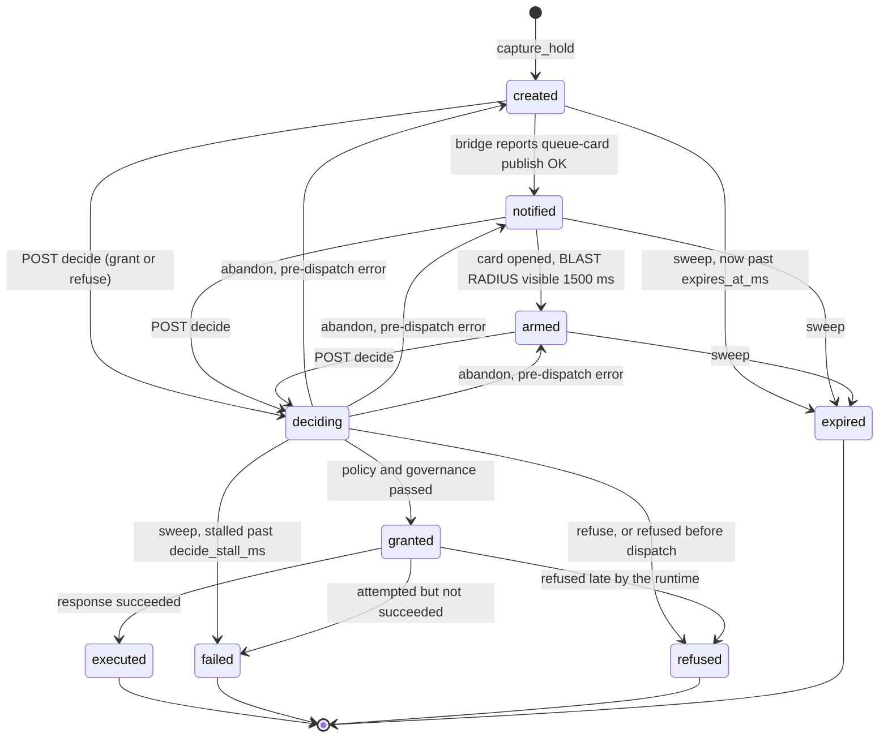

# 12 — Backend bill API specification

**Artifact.** The eleven items of `APPENDIX-NORMATIVE.md` §5 — B1, B2, B2r, B2g, B2o, B3, B3i, B3r,
B4, B5, B6 — as routes, Rust types, status codes, state machines and a CI-legal OpenAPI document.

**Revision 2.** Rewritten after a four-critic audit. Seven findings against this artifact were
upheld and are fixed here — §3.3/§4.3 (the compare-and-set ran before signature verification and
`deciding` had no exit), §3.3/§4.4 (a hold in `created` could not even be refused), §4.8 (nothing
handled two operators deciding one hold), §5 (B2g named a check the moved function does not perform),
§4.3/§6 (the operator's own words and the leg-1 pointer sat outside the signed preimage), §11.2 (this
file had `distinct_sources` backwards), §14 (the CI contract could not be satisfied by the committed
file). One was upheld in part and answered with a mechanical test rather than a note (§1.4). §18
lists every change with the finding it answers.

**Companion files.** Three, and which one CI gates is a decision this revision makes (§14):

| File | Role |
|---|---|
| [`openapi/perch-operator-v1.yaml`](openapi/perch-operator-v1.yaml) | **Authoring source.** Human-written, commented, reviewable. Not the gated artifact. |
| [`openapi/perch-operator-v1.json`](openapi/perch-operator-v1.json) | **The gated artifact**, byte-shaped exactly as `generate_perch_openapi` must emit it. Destined for `docs/openapi/perch-operator-v1.json`. |
| [`openapi/render-perch-openapi.py`](openapi/render-perch-openapi.py) | Renders one from the other and proves its own byte shape against the real platform spec. Run by hand; never a CI gate. |

Plus the two gate scripts, written out and exercised in §14: `openapi/check-perch-openapi.sh` and
`openapi/generate-perch-openapi.sh`, drop-ins for Ambush's `tools/`.

This file is the argument, the state machines, and everything OpenAPI cannot express (which
transition fires which side effect, which function the handler must call and from where, what an
idempotent retry does to the store). **Both** spec files validate today under the exact validator CI
pins:

```
$ uvx --from "openapi-spec-validator==0.9.0" openapi-spec-validator \
    docs/plans/ambush-ui/build/openapi/perch-operator-v1.yaml
docs/plans/ambush-ui/build/openapi/perch-operator-v1.yaml: OK
$ uvx --from "openapi-spec-validator==0.9.0" openapi-spec-validator \
    docs/plans/ambush-ui/build/openapi/perch-operator-v1.json
docs/plans/ambush-ui/build/openapi/perch-operator-v1.json: OK
```

(Version pin from `tools/check-platform-openapi.sh:28`, `VALIDATOR_VERSION="0.9.0"`.)

**Values.** Shared constants, bill labels, route table, key map, marker registry, vocabulary and the
render laws are `APPENDIX-NORMATIVE.md`'s. This file cites them; it does not restate them. Where it
believes one is wrong it says so in §16 as a proposed brief amendment.

**Reading order.** §1 is the decision everything else depends on. §2 is the shared contract every
route inherits. §3 (B1) and §4 (B2) are the two that gate the product; the rest are short.

---

## 0. What this file decides

The plan set left ten things open that a builder cannot start without. This file closes them and
records each as a commitment.

| # | Decision | §  |
|---|---|---|
| D1 | The engine functions live in `swarm-ingest-runtime`; the routes and auth live in `swarm-runtime-http/src/http/perch.rs`, mounted by `swarm_detect`. Nothing goes in `state.rs`. | §1 |
| D2 | `nostr_intent_event_id` — the id of the leg-1 verdict card — **is** the idempotency key for `POST /decide`. No `Idempotency-Key` header. | §4.4 |
| D3 | The hold state machine has **nine** states with an explicit `deciding` state, and the compare-and-set into it happens **before** any policy evaluation. | §3.3 |
| D4 | The decide body says `grant` / `refuse`. Not `deny`. | §16 A12 |
| D5 | Read routes check `OperatorScope::Read` — the first routes in the workspace to do so — and the daemon warns at boot about any principal holding `Approve` without `Read`. | §2.3 |
| D6 | B2g re-verifies through a **new `pub` module** `swarm_runtime::governance_gate`, which `dispatcher.rs` then calls. Not by widening a `pub(crate)` item. | §5 |
| D7 | B2o threads `approved_by` as a **fourth parameter** on the human-approved variant, and `OperatorApproval` lives in `swarm-core`. | §6 |
| D8 | B3 requires bearer + `Approve` and stamps `request_signature` as `operator-bearer:{operator_id}`; only B2 requires a detached Ed25519 signature. | §8.3 |
| D9 | B3i's incident id is `incident:perch-case:{case_id}` and the route **refuses** to mint a degraded incident rather than minting one silently. | §9 |
| D10 | Every list response that is computed over `incident_store.recent(limit)` carries `window_is_truncated` and `store_durable`. A short answer never reads as a quiet week. | §10, §11 |
| D11 | **Signature verification precedes the compare-and-set**, and `deciding` has an exit on every path: `abandon_decision` on every pre-dispatch error, and a stall sweep to `failed`. One malformed signature can no longer destroy a hold. | §3.3, §3.4, §4.3 |
| D12 | **A hold in `created` is decidable**, grant and refuse alike. `notified` records only that the relay accepted the queue card; the daemon's store is what makes a hold real. | §3.3, §4.4 |
| D13 | **The signature preimage is four members, not three**: `rationale_sha256` is inside it, so free text cannot be substituted under a replayed signature. `nostr_intent_event_id` is an unsigned pointer by construction, and the checkable join between the two legs is the signature bytes themselves. | §4.3, §6.5 |
| D14 | **The gated OpenAPI artifact is JSON, not the commented YAML.** A byte-identity assertion is unsatisfiable over a document with comments, and byte-identity is the only half of the platform gate that catches drift. | §14 |
| D15 | **B2g's re-derivation is extended past the verbatim move** with four checks the shipped gate does not perform, and the one it still cannot perform is named on the record in `GovernanceClearance` rather than implied away. `RECEIPT REQUIRED` does not become an enforced fact. | §5 |

---

## 1. Where this code lives — the decision the plan set got wrong

### 1.1 Two processes, not one

`09` §3.1 assigns every bill item to `swarm_detect --serve` and separately cites
`crates/swarm-runtime-http/src/http/state.rs:293-497` (49 `.route(` calls) as "the operator router".
Both statements are individually true and jointly impossible.

- **`LocalOperatorSurface::router()`** (`crates/swarm-runtime-http/src/http/state.rs:292-488`) is
  built by `Command::Serve` in `crates/swarm-cli/src/core.inc:3344-3400` and served on
  `config.operator.bind_addr`, default `127.0.0.1:7766` — **process `swarmctl serve`**. It builds its
  own `DefaultControlPlane` from config.
- **`detect_http_router`** (`crates/swarm-ingest-runtime/src/ingest/mod.rs:2540-2576`) plus the merged
  `containment_operator_router` is served on `cli.bind` by `swarm_detect --serve`, whose
  operator-facing default base URL is `http://127.0.0.1:9090`
  (`crates/swarm-core/src/config/defaults.rs:215-217`) — the value `swarmctl quarantine` already
  targets (`crates/swarm-cli/src/core.inc:3005-3010`).

The argument for which one gets the new routes is already written down, in the module doc of the last
routes anyone added — `crates/swarm-runtime-http/src/http/containment.rs:19-33`:

> `LocalOperatorSurface` builds its own `DefaultControlPlane` in its own process and therefore has
> exactly that problem, which is why these routes are NOT merged into it. `swarm_detect` — the
> process that opens leases, sweeps them, and holds the governance authority — mounts them with the
> object it already has.

Adding B2/B2r/B3/B3i/B3r/B4 to `state.rs` puts them in a process holding a **different**
`IngestState`, a **different** incident store (`BundleStoreConfig` defaults to `Memory`,
`crates/swarm-core/src/config/storage.rs:63,:69-71`, so a second instance is a different map) and
**no** `RuntimeEventBroadcaster`. It would answer "no such hold" for every hold the daemon holds.

**Commitment C1: every route in this file is mounted by `swarm_detect --serve`. None is added to
`state.rs`.**

### 1.2 The crate split, and why it is not optional

`containment_operator_router` gets away with living entirely in `swarm-runtime-http` because it takes
one explicit handle — `Arc<ContainmentSweep>` — and calls one public method on it. The bill's routes
cannot: they need the incident store, the runtime-event broadcaster, the service stack, the request
runtime and the governance authority, and **every field of `IngestState` is private**
(`crates/swarm-ingest-runtime/src/ingest/mod.rs:1352-1379`). The dependency runs
`swarm-runtime-http → swarm-ingest-runtime` (`crates/swarm-runtime-http/Cargo.toml:31`), never the
reverse, so a route module in `swarm-ingest-runtime` cannot reach `require_bearer_auth` /
`require_operator_api_scope` / `OperatorApiError`, all `pub(super)` inside
`swarm-runtime-http::http` (`crates/swarm-runtime-http/src/http/auth.rs:154,:182`,
`.../error.rs:22`). Duplicating an auth layer for a route that can isolate a host is not acceptable.

So the split is forced:

```
crates/swarm-ingest-runtime/src/ingest/perch_ops.rs      NEW.  The engine.  pub fns over &IngestState.
                                                               Same module tree as demo.rs and
                                                               providence_handlers.rs, so private
                                                               fields and existing private helpers
                                                               (apply_providence_feedback,
                                                               resolve_feedback_target,
                                                               false_positive_measurement,
                                                               enrich_feedback_target) are reachable.
crates/swarm-ingest-runtime/src/ingest/held_actions.rs   NEW.  B1: HeldAction, HeldActionStore,
                                                               MemoryHeldActionStore,
                                                               FileHeldActionStore, HoldSweep.
crates/swarm-runtime-http/src/http/perch.rs              NEW.  The routes, the auth, the DTOs, the
                                                               status codes.  Sibling of
                                                               containment.rs, same two layers.
crates/swarm-runtime-http/src/bin/generate_perch_openapi.rs  NEW.  The spec generator (§14).
```

This is the shape `containment.rs` already argues for one level up: the CLI is a client, the daemon is
the only writer, and the HTTP module owns "the operator-facing routes and their authorization" and
explicitly *does not own* the thing being done
(`crates/swarm-runtime-http/src/http/containment.rs:35-39`).

### 1.3 The router, and where it is merged

```rust
// crates/swarm-runtime-http/src/http/perch.rs  (NEW)

/// State the Perch operator routes run against.
///
/// Holds `IngestState` itself rather than rebuilt components, for the reason
/// `ContainmentHttpState` holds the process's one `Arc<ContainmentSweep>`
/// (containment.rs:19-33): a store rebuilt from config is a different map, and a
/// handler answering over a region it never inspected is worse than no handler.
#[derive(Clone)]
pub(super) struct PerchHttpState {
    ingest: swarm_ingest_runtime::ingest::IngestState,
}

/// Build the authenticated Perch operator routes over the daemon's own `IngestState`.
///
/// Owns: the hold, feedback, incident and deposit routes and their authorization.
///
/// Does not own: holding an action (that is `ingest::perch_ops::capture_hold`),
/// deciding one (`ingest::perch_ops::decide_hold`), or writing a measurement
/// (`ingest::perch_ops::record_finding_feedback`).
pub fn perch_operator_router(
    config: &SwarmConfig,
    ingest: IngestState,
) -> Result<Router, OperatorHttpError> {
    let auth = OperatorAuthState::from_config(config)?;
    let rate_limiter = HttpRateLimiter::new("operator-perch", config.operator.rate_limit.clone());
    let state = PerchHttpState { ingest };
    Ok(Router::new()
        .route("/v1/response/holds", get(hold_list_handler))
        .route("/v1/response/holds/{hold_id}", get(hold_detail_handler))
        .route("/v1/response/holds/{hold_id}/decide", post(hold_decide_handler))
        .route(
            "/v1/operator/findings/reviewed",
            get(reviewed_findings_handler),
        )
        .route(
            "/v1/operator/findings/{finding_id}/feedback",
            post(finding_feedback_handler),
        )
        .route("/v1/operator/incidents", post(incident_mint_handler))
        .route("/v1/operator/pheromone/deposits", get(deposit_list_handler))
        .with_state(state)
        .layer(middleware::from_fn_with_state(
            OperatorRequestGuardState { auth, rate_limiter },
            require_bearer_auth,
        ))
        .layer(middleware::from_fn(
            require_supported_operator_api_schema_version,
        )))
}
```

Seven `.route(` calls. Mounted beside the containment merge, with the same
loud-on-failure discipline (`crates/swarm-runtime-http/src/bin/swarm_detect.rs:1113-1143`):

```rust
// crates/swarm-runtime-http/src/bin/swarm_detect.rs, immediately after the containment merge at :1142
if config.operator.enabled {
    match swarm_runtime_http::http::perch_operator_router(&config, serve_state.clone()) {
        Ok(perch_router) => {
            tracing::info!(module = module_path!(), "perch operator routes mounted");
            router = router.merge(perch_router);
        }
        // Same reason as the containment arm: a misconfigured operator surface must
        // NOT silently ship a daemon whose verdict queue answers "no holds".
        Err(error) => tracing::error!(
            module = module_path!(),
            reason = %error,
            "perch operator routes NOT mounted; holds cannot be listed or decided"
        ),
    }
} else {
    tracing::warn!(
        module = module_path!(),
        "operator surface disabled in config; perch operator routes not mounted"
    );
}
```

`OperatorAuthState::from_config` fails with `MissingTokenEnv` when any effective principal's
`token_env` is unset (`crates/swarm-runtime-http/src/http/auth.rs:57-82`), which is exactly why the
containment arm logs rather than swallows. Same failure, same treatment.

`serve_state` is the `IngestState` built at `swarm_detect.rs:738-754` and already moved into
`detect_http_router(serve_state)` at `:1113` — so the clone above must be taken **before** that line.
`IngestState` is `#[derive(Clone)]` (`crates/swarm-ingest-runtime/src/ingest/mod.rs:1351-1352`), so
this is a clone of `Arc`s, not of state.

---

### 1.4 Prefix hygiene — and why this is a test, not a note

A critic observed that `GET /v1/operator/pheromone/deposits` (B4) shares a URL prefix with
`/v1/operator/pheromone/threat-class-configs`, which a **different process on a different port**
already serves. The observation is exactly right, and it is worth stating precisely how far it
reaches, because the answer is further than one route.

Verified at the line, in the shipped tree:

- On **7766** (`operator_surface.bind_addr`, `rulesets/default.yaml:326`),
  `LocalOperatorSurface::router()` — built by `Command::Serve` in
  `crates/swarm-cli/src/core.inc:3344-3400`, in the `swarmctl serve` process — declares 49 routes
  including `/v1/operator/pheromone/threat-class-configs`
  (`crates/swarm-runtime-http/src/http/state.rs:295-298`, `get(threat_class_config_list_handler)
  .post(threat_class_config_upsert_handler)`, reading and writing that process's own control plane).
- On **9090** (`operator_surface.runtime_base_url`, `rulesets/default.yaml:327`), the daemon already
  serves `/v1/operator/containment/leases` and
  `/v1/operator/containment/leases/{lease_id}/release`
  (`crates/swarm-runtime-http/src/http/containment.rs:263-270`), merged onto its own listener at
  `crates/swarm-runtime-http/src/bin/swarm_detect.rs:1113-1143` by `swarm_detect --serve`, acting on
  the one `Arc<ContainmentSweep>` that process owns.

So **the `/v1/operator/` prefix was already split across two processes before this document existed**,
and the split is not a Perch invention. A rename would move B4 out of one collision and would not
change the fact that a client has to know which port answers which `/v1/operator/` path.

**Commitment C10: the paths stay, and the disjointness becomes mechanical.** Renaming B4 was
considered and rejected: six peer artifacts already compile the route string into code
(`skeleton/desktop/src/shared/api/tauriPerch.ts:117`,
`skeleton/desktop/src/shared/api/perchKeys.ts:58`, plus `17`, `18`, `21`, `22` and a `$ref`
description in `schemas/card-ambush-escalation-v1.schema.json:96`), and a rename buys a cosmetic
separation while leaving the real hazard — two ports, one prefix — untouched.

What is shipped instead is a test in `crates/swarm-runtime-http/src/http/perch.rs`:

```rust
/// The two operator routers must never declare the same path.
///
/// `/v1/operator/` is served by TWO processes on TWO ports: `swarmctl serve` at
/// `operator_surface.bind_addr` (127.0.0.1:7766) and `swarm_detect --serve` at
/// `operator_surface.runtime_base_url` (127.0.0.1:9090). A path declared by both
/// answers differently depending on which port a client happened to use, with no
/// error anywhere -- the worst shape a routing bug can take. This is the only
/// mechanical check that the two sets stay apart.
#[test]
fn perch_router_paths_are_disjoint_from_the_local_operator_surface() {
    let perch = perch_operator_router_declared_paths();      // 7, this module
    let local = local_operator_surface_declared_paths();     // 49, http::state
    assert!(!perch.is_empty() && !local.is_empty(), "empty path set: the collector is broken");
    let overlap: Vec<_> = perch.intersection(&local).collect();
    assert!(overlap.is_empty(), "same path on two ports: {overlap:?}");
}
```

Both `declared_paths` collectors are `const` arrays each router builds its `.route(` calls from, so
adding a route without adding it to its array is a compile error, not a silently uncovered path. The
non-empty assertions are the refuse-to-pass-silently guard: an empty set would make the intersection
trivially empty and the gate vacuous.

The `servers` block of the OpenAPI document carries the same statement in prose, because a client
author reads the spec and not this file.

---

## 2. The shared contract every route inherits

### 2.1 Two layers, in this order

`require_bearer_auth` (`crates/swarm-runtime-http/src/http/auth.rs:182-220`) runs in the daemon on
every request to a route inside the chain and does four things in order: charges the
`HttpRateLimiter` (`:192-195`), requires an `Authorization` header (`:196-199`), requires the
`Bearer ` prefix (`:200-202`), and authenticates the token against every configured principal's
`token_env` with `!=` (`:203-216`, comparison at `:95`). On success it inserts an
`AuthenticatedOperatorPrincipal { operator_id, scopes }` into request extensions (`:217`).

**It performs no scope check.** A handler opts in by taking `Extension(principal)` and calling
`require_operator_api_scope` (`:154-166`).

`require_supported_operator_api_schema_version` (`:144-152`) rejects any
`x-swarm-schema-version` other than `1` with a 400; omitting the header is fine.

### 2.2 The error body

Every route returns `OperatorApiError`, whose serialized body is
`OperatorApiErrorBody { error: &'static str, message: String }`
(`crates/swarm-runtime-http/src/http/error.rs:16-20`, written at `:100-117`). The seven `error`
slugs are `bad_request`, `unauthorized`, `forbidden`, `not_found`, `too_many_requests`,
`bad_gateway`, `internal_error` (`:36-97`). `Retry-After` is set only by the 429 constructor
(`:90-97`, `:110-114`).

**This differs from the `/v2/api` platform spec's `ErrorResponse`**, which declares `{error}` only
(`crates/swarm-ingest-runtime/src/bin/generate_platform_openapi.rs:242-249`) because that surface
uses a different error type (`crates/swarm-ingest-runtime/src/ingest/platform_api.rs:409`, body
built at `:470`). The new spec models its own, correctly.

### 2.3 Scopes — and the first `Read` check in the workspace

`OperatorScope` is `{Read, Rehearse, Approve, Maintenance}`
(`crates/swarm-core/src/config/operator.rs:84-89`). Nine handlers check a scope today
(`approval.rs:73,:137` Approve; `containment.rs:197`, `control.rs:82,:117,:154`,
`maintenance.rs:28`, `review.rs:419` Maintenance; `review.rs:166` Rehearse). **`Read` is checked by
no handler in the workspace.**

| Route | Scope | Why |
|---|---|---|
| `GET /v1/response/holds` | `Read` | reads only |
| `GET /v1/response/holds/{id}` | `Read` | reads only |
| `POST /v1/response/holds/{id}/decide` | `Approve` | can change a host |
| `POST /v1/operator/findings/{id}/feedback` | `Approve` | writes a durable measurement that retunes a detector, and retroactively deletes deposits on `dismiss` |
| `POST /v1/operator/incidents` | `Approve` | creates the durable object a verdict attaches to |
| `GET /v1/operator/findings/reviewed` | `Read` | reads only |
| `GET /v1/operator/pheromone/deposits` | `Read` | reads only |

**Commitment C2: the four read routes check `OperatorScope::Read`.** The cost is one line each and it
makes a configured scope stop being decorative. The consequence is real and must be documented in the
release note: a deployment that narrowed a principal to `{Approve}` will newly get 403 on the reads.
`effective_principals()` synthesises a single principal holding all four scopes when `principals` is
empty (`crates/swarm-core/src/config/operator.rs:153-168`), so no shipped default breaks.

**Mitigation, in the same change:** `swarm_detect` emits one `warn!` at boot per principal holding
`Approve` without `Read`. `swarmctl`'s own endpoint resolver already fails closed with two distinct
messages for "no principal grants the scope" versus "the granting principal's token env is unset"
(`crates/swarm-cli/src/core.inc:3001-3048`), so the 403 is diagnosable from the client side too.

### 2.4 Reproducible clocks

Every route that computes a time-derived field takes `now_ms` (or `now_seconds` on the pheromone
route, whose unit is seconds). Absent means now. This is `ContainmentLeaseListQuery.now_ms` and its
stated reason, verbatim (`crates/swarm-runtime-http/src/http/containment.rs:99-110`): a test, a
replay, or an operator reconstructing an incident states the instant instead of racing the wall
clock.

**The unit split is a real hazard.** `PheromoneDeposit.timestamp` and `decay_half_life` are unix
**seconds** (`crates/swarm-core/src/pheromone.rs:219-222`); every other timestamp on this surface is
milliseconds. A client that mixes them draws a decay curve wrong by 1000×. The response therefore
names the field `now_seconds`, not `now_ms`, so the mistake is visible in the JSON.

### 2.5 Stable ordering

`containment_lease_list_handler` re-sorts its list explicitly and says why
(`crates/swarm-runtime-http/src/http/containment.rs:176-183`): "a listing whose order depends on the
store implementation makes two operators' screens disagree." Every list route here sorts:

| Route | Sort key |
|---|---|
| `GET /v1/response/holds` | `(expires_at_ms, hold_id)` ascending |
| `GET /v1/operator/findings/reviewed` | `(reviewed_at_ms DESC, finding_id ASC)` — the order `upsert_false_positive_measurement` already imposes (`crates/swarm-spine/src/incident.rs:190-199`) |
| `GET /v1/operator/pheromone/deposits` | `(timestamp DESC, event_id ASC)` — `filter_deposits` sorts by `Reverse(timestamp)` (`crates/swarm-pheromone/src/substrate.rs:1306-1334`); the tiebreak is added |

### 2.6 The honesty rule the response shapes enforce

`ContainmentReleaseResponse` returns `lease_closed: false` on a **200**
(`crates/swarm-runtime-http/src/http/containment.rs:127-145`), and `swarmctl` exits non-zero on it
(`crates/swarm-cli/src/core.inc:3101-3120`), precisely so a caller cannot read an unfinished release
as finished. Every write route here copies that: **the status code says the request was processed;
the body says what happened to the world.** `POST /decide` returns 200 with
`outcome: "refused_late"` and `dispatched: false` when the runtime refused after the grant.

---

## 3. B1 — `HeldActionStore` + `RuntimeEvent::ResponseHeld`

> Phase 1 · not cuttable · gates every hold-facing surface.

### 3.1 What exists today, verified

`RequireHuman` is a **refusal**, in two places, both read this session:

- `authorize_and_execute` (`crates/swarm-runtime/src/lib.rs:975-983`) returns
  `ApprovalError::Denied(decision.reason)` when the verdict is `RequireHuman` and
  `self.mode == RuntimeMode::LiveResponse`. No production caller.
- `audit_authorize_and_execute_instrumented_internal`
  (`crates/swarm-runtime/src/lib.rs:1097-1104`, arm at `:1133-1146`) — the one the dispatcher
  actually reaches — produces `(None, AuditResponseRecord::Skipped { reason }, None, false, false)`.
  The action is dropped. **Nothing is queued and no artifact exists beyond an audit row.**

`rg 'HeldAction|ResponseHeld|HoldStore|hold_id'` over `crates/ -g '*.rs'` returns **zero** matches.

The only production `RequireHuman` producer is `StaticApprovalGate::evaluate`
(`crates/swarm-policy/src/static_gate.rs:294-299`), which always returns
`rule_name = "static.human_gate"`, `reason = "authorized but held for human approval"`.
`ConfigurableApprovalGate` emits only allow/deny and falls through to it
(`crates/swarm-policy/src/configurable_gate.rs:172-183`). **Every hold therefore carries the same 42
characters in render law 1's WHY WE ARE ASKING slot** unless B1 captures more — which is what
`HoldRationale` below is for.

### 3.2 The record

```rust
// crates/swarm-ingest-runtime/src/ingest/held_actions.rs  (NEW)

/// One `PolicyVerdict::RequireHuman` made durable.
///
/// Modelled on `PendingDemoApproval` (ingest/demo.rs:78-84), which already carries
/// exactly the `{request, detection}` pair
/// `audit_authorize_and_execute_human_approved_instrumented` needs — and adds the
/// four things that pair lacks: an id, an expiry, a rationale, and durability.
#[derive(Debug, Clone, Serialize, Deserialize)]
pub struct HeldAction {
    /// Opaque. `format!("hold_{}", Uuid::new_v4().hyphenated())` -- the pinned
    /// format, `components.schemas.HoldId` in the OpenAPI document, section 16 A17.
    /// 41 characters. NOT `hold:{...}`: the colon form is the shape the appendix
    /// forbids (`hold:{hunt_id}:{held_at_ms}`) and an id that merely LOOKS like it
    /// costs a reviewer a parse every time. Revision 1 of this file used the colon,
    /// which is how six incompatible spellings ended up in circulation across the
    /// wave-2 artifacts.
    ///
    /// v4 AND NOT v7. UUIDv7's leading 48 bits are a Unix millisecond timestamp,
    /// which would put `held_at_ms` inside the id.
    ///
    /// NOT derived from `hunt_id`. The `26006` alarm frame carries this id on a
    /// GLOBAL ephemeral kind, and the relay does not enforce `#p` on delivery of a
    /// channel-less event (BUZZ crates/buzz-relay/src/handlers/event.rs:115-222,
    /// early return at :177-179), so every authenticated community member receives
    /// it. A hold id that embeds a hunt id leaks investigation structure to all of
    /// them.
    pub hold_id: String,
    pub state: HoldState,

    /// The full request, persisted verbatim. `AuditTrail` does NOT carry it — only
    /// `ReplayBundle` does (swarm-spine/src/lib.rs:114-135) — so the hold record is
    /// the only place the `ActionRequest` survives a restart.
    pub action_request: ActionRequest,
    /// Synthesised the same way the live path does, via
    /// `routed_detection_from_request` (ingest/mod.rs:146).
    pub detection: DetectionFinding,
    pub policy_decision: PolicyDecision,
    /// From the public `SwarmService::rehearsal_preview`
    /// (swarm-runtime/src/service/runtime_service.rs:861-868). `None` when the
    /// preview could not be built; the card renders an explicit absence, never a
    /// collapsed slot (render law 1).
    pub rehearsal: Option<ResponseRehearsalPreview>,
    pub rationale: HoldRationale,

    pub held_at_ms: i64,
    /// `held_at_ms + hold_ttl_ms`. See §3.4 for where that value comes from.
    pub expires_at_ms: i64,

    /// Set exactly once, by `complete_decision`. `None` while open.
    pub decision: Option<HoldDecisionRecord>,
    /// Set by the bridge through an in-process callback once the `kind:46010` queue
    /// notice is accepted by the relay. INFORMATIONAL: it distinguishes `created`
    /// from `notified` and GATES NOTHING. A hold whose queue card never published is
    /// still decidable (§3.3), and this field is what lets the Ledger say so.
    pub notified_at_ms: Option<i64>,

    /// Non-`None` only while `state == Deciding`, and again on the terminal record.
    /// The `nostr_intent_event_id` that won the compare-and-set, so a console that
    /// received a 409 can learn whose decision executed (§4.8).
    pub deciding_intent_event_id: Option<String>,
    /// The instant the compare-and-set succeeded. Every lease is minted from this,
    /// and `HoldSweep::fail_stalled_decisions` measures the stall against it.
    pub cas_instant_ms: Option<i64>,
    /// The state the compare-and-set moved out of, so `abandon_decision` restores
    /// the right one rather than guessing `notified`. Cleared on a terminal write.
    pub prior_state: Option<HoldState>,
}

/// The differentiating context render law 1 needs and `PolicyDecision` cannot give.
#[derive(Debug, Clone, Serialize, Deserialize)]
pub struct HoldRationale {
    pub rule_name: String,
    pub reason: String,
    pub threat_class: ThreatClass,
    pub severity: Severity,
    /// Which of these came from the requesting agent rather than the runtime.
    /// Always contains at least "severity" and "threat_class": `ActionRequest.severity`
    /// is a plain field the requester sets (swarm-policy/src/lib.rs:45-58) and
    /// `ConfigurableApprovalGate` reads the threat class out of
    /// `request.evidence["escalation"]["threat_class"]`
    /// (swarm-policy/src/configurable_gate.rs:34-56), so an agent influences which
    /// rule judges its own destructive action.
    pub request_carried_fields: Vec<String>,
    pub concentration_at_hold: Option<PheromoneConcentration>,
    pub escalation_level: Option<EscalationLevel>,
    /// Whether `evidence["governance_receipt"]` was present when the hold was
    /// created. NOT a verification result — B2g verifies at decision time and the
    /// answer can differ.
    pub governance_receipt_present: bool,
}
```

### 3.3 The state machine

Nine states. Every transition names its trigger and its side effect. `deciding` exists so a retry
after a timeout cannot double-grant (§4.4); without it, the CAS and the execution are not the same
atomic step.

**Two corrections in revision 2, both blocking, both from the same class of defect: a state with an
entrance and no exit.**

**(1) `deciding` had two ways in and only two ways out, both of them terminal.** Revision 1 put the
compare-and-set at step 2 of the decide sequence and signature verification at step 3, so a request
carrying 64 malformed bytes moved the hold to `deciding` and then returned 422 — with no
`deciding -> notified` edge, no `deciding -> expired` edge, and the 60-second stall resolution
appearing only in §3.4's *crash* table, which is a restart path. On a daemon that does not crash, the hold sat in `deciding` forever:
undecidable by anyone (§4.4 answers every other request `409`), never expired, and the destructive
action neither performed nor refused. Anything that could reach the route could do it once per hold
with one malformed field. Fixed three ways at once, because one of them alone would still leave a
hole: verification moved ahead of the CAS (§4.3), `abandon_decision` added for every path that
returns after the CAS without a terminal outcome, and the stall resolution moved into `HoldSweep`
itself so it fires on a running daemon and not only after a restart.

**(2) `created` was decidable by nobody, including for Refuse.** Revision 1 restricted
`begin_decision` to `notified|armed` and gave `created` a `409 not_decidable`, while the only trigger
for `created -> notified` was the bridge's callback after the relay accepted the `kind:46010` card.
So an unreachable relay, a bridge not yet a member of the case channel (`10-RELAY-FORK.md`'s RF-D2
failure mode), or a rejected publish left a hold that could not be granted **or refused** — the
queue-with-no-exit that `08` §5.3 forbids and that `proto-verdict` names explicitly. The premise was
wrong: `notified` is a fact about the *queue card*, and the daemon's own store is what makes a hold
real. `GET /v1/response/holds` is the authoritative read (§7), so an operator can see and act on a
hold whose card never published. `created` is now decidable, and
`HoldDecisionRecord.hold_notice_published` records which it was so the Ledger can say so.



| From | To | Trigger | Side effect |
|---|---|---|---|
| — | `created` | `perch_ops::capture_hold` sees `verdict == RequireHuman && response == Skipped` on the returned `AuditTrail` | store write; `RuntimeEvent::ResponseHeld` published; `perch_holds_created_total` |
| `created` | `notified` | the bridge's in-process callback after the relay OKs the `kind:46010` card | store write of `notified_at_ms` only. **No new `RuntimeEvent`** — the alarm already fired. **Informational: it does not gate anything** |
| `created`/`notified`/`armed` | `expired` | `HoldSweep` tick, `now_ms >= expires_at_ms` | store write; **no action is taken**; `perch_holds_expired_total`. The bridge publishes the expiry record on the same `ambush:hold:v1` marker (appendix §3: "also the expiry record") |
| `notified` | `armed` | client-side only. Reported by the client on the decide request's `armed_at_ms`; the daemon **does not enforce** the 1500 ms dwell — it is a client safety control (`08` INV-11), and a daemon that enforced it would be trusting a client clock | store write; `perch_holds_armed_total` |
| `created`/`notified`/`armed` | `deciding` | `POST /decide` compare-and-set, **after** signature verification and voter binding | store write of `{intent_event_id, cas_instant_ms, prior_state}`; **nothing else happens yet** |
| `deciding` | `created`/`notified`/`armed` | **`abandon_decision`** — any path that returns after the CAS without writing a terminal outcome: a store fault, a `governance_gate` internal error, an executor error that is not a typed refusal | store write restoring `prior_state` and clearing `deciding_intent_event_id`; `perch_holds_abandoned_total`. **The hold stays decidable** |
| `deciding` | `failed` | **`HoldSweep` tick**, `now_ms - cas_instant_ms >= decide_stall_ms` (default 60,000) | store write with `HoldRefusal { rule: "runtime.capability_lease_expired", reason: "the decision stalled; whether the action ran is unknown" }`; `perch_holds_stalled_total`. This is a *running-daemon* transition, not only a restart one |
| `deciding` | `granted` | policy re-evaluated, governance re-derived, runtime entered | see §4.7 |
| `deciding` | `refused` | `decision == "refuse"`, **or** any B2g / policy refusal raised before the runtime was entered | store write with `HoldRefusal`; `RuntimeEvent::ResponseExecution` is **not** published (nothing executed) |
| `granted` | `executed` | `RuntimeExecutionReport.response_succeeded == true` | store write with `receipt_id`; `RuntimeEvent::ResponseExecution` published, mirroring `demo.rs:1392` |
| `granted` | `failed` | `response_attempted && !response_succeeded` | store write; `RuntimeEvent::ResponseExecution` published with `error` set |
| `granted` | `refused` | `AuditResponseRecord::Skipped` from `prepare_containment` or an expired capability lease — **a refusal the runtime raised after the grant** | store write with `outcome: refused_late`; `RuntimeEvent::ResponseExecution` published with the reason |

**The invariant that makes this checkable, and the test that asserts it:** *no reachable code path
leaves a hold in `deciding` indefinitely*. Two mechanisms, and a hold needs only one of them to
survive, which is why both exist:

```rust
/// Every early return between `begin_decision` and `complete_decision` must
/// abandon. This is a source-level assertion, not a runtime one: the decide
/// engine fn is written so the CAS is taken by a guard whose Drop abandons
/// unless `complete_decision` disarmed it.
#[test]
fn every_pre_dispatch_refusal_leaves_the_hold_decidable() {
    for outcome in PRE_DISPATCH_FAILURES {   // bad signature, voter mismatch,
        let store = memory_store_with_hold(HoldState::Notified);  // store fault,
        let _ = decide_with_injected_failure(&store, outcome);    // gate error
        assert_eq!(store.get(HOLD).unwrap().unwrap().state, HoldState::Notified,
                   "{outcome:?} parked the hold in deciding");
    }
}

#[test]
fn the_sweep_resolves_a_stalled_decision_without_a_restart() {
    let store = memory_store_with_hold(HoldState::Deciding);
    HoldSweep::new(store.clone(), events()).tick(cas_instant + DECIDE_STALL_MS);
    let hold = store.get(HOLD).unwrap().unwrap();
    assert_eq!(hold.state, HoldState::Failed);
    assert!(hold.decision.unwrap().refusal.unwrap().reason.contains("whether the action ran is unknown"));
}
```

The `Drop` guard is the load-bearing half. A hand-audited list of early returns is a list that goes
stale on the next edit; a guard that abandons unless disarmed is correct for returns nobody has
written yet.

The last row is not hypothetical. `prepare_containment` returns `RuntimeError::ContainmentRefused`
when `self.containment` is `None` (`crates/swarm-runtime/src/lib.rs:836-844`), which is the shipped
default (`runtime.containment.lease_store_path: None`,
`crates/swarm-core/src/config/runtime.rs:94-103`), and the runtime records it as
`AuditResponseRecord::Skipped { reason }` rather than returning `Err`
(`crates/swarm-runtime/src/lib.rs:1175-1196`). So on a stock config **a granted `isolate_host`
returns 200 with nothing having happened**, and the console must render that as a named refusal, not
as success.

### 3.4 The store: trait, persistence, TTL sweep, crash behaviour

```rust
// crates/swarm-ingest-runtime/src/ingest/held_actions.rs  (NEW)

/// Durable home for holds.
///
/// `decide` is a COMPARE-AND-SET, not a write. It is the only method that may move
/// a hold out of `notified`/`armed`, and it returns the winning record so the
/// caller can tell "I claimed it" from "someone else already did".
pub trait HeldActionStore: Send + Sync {
    fn create(&self, hold: HeldAction) -> Result<(), HeldActionStoreError>;
    fn get(&self, hold_id: &str) -> Result<Option<HeldAction>, HeldActionStoreError>;
    /// Sorted `(expires_at_ms, hold_id)`. `include_terminal` adds decided and
    /// expired holds still inside the retention window.
    fn list(&self, include_terminal: bool, limit: usize)
        -> Result<Vec<HeldAction>, HeldActionStoreError>;
    fn mark_notified(&self, hold_id: &str, at_ms: i64) -> Result<(), HeldActionStoreError>;
    fn mark_armed(&self, hold_id: &str, at_ms: i64) -> Result<(), HeldActionStoreError>;

    /// `created|notified|armed -> deciding`, atomically. Returns `Err(NotDecidable)`
    /// carrying the CURRENT record for every other state, which is what lets the
    /// route distinguish a replay from a conflict without a second read.
    ///
    /// `created` IS ADMITTED. `notified` says the relay accepted the queue card;
    /// this store is what says the hold exists. Gating on `notified` means an
    /// unreachable relay, a bridge that is not yet a member of the case channel or
    /// a rejected publish leaves a destructive action that can be neither performed
    /// nor refused, and `08` section 5.3 makes Refuse the one control that must
    /// survive every degraded state. The prior state is recorded on the record so
    /// `abandon_decision` can restore it and so the decision record can say the
    /// queue card had not published.
    fn begin_decision(
        &self,
        hold_id: &str,
        intent_event_id: &str,
        cas_instant_ms: i64,
    ) -> Result<HeldAction, HeldActionStoreError>;

    /// `deciding -> prior_state`, releasing the claim. THE ONLY WAY OUT OF
    /// `deciding` THAT IS NOT TERMINAL, and the reason a failed decide attempt
    /// cannot destroy a hold.
    ///
    /// Called by the `DecisionClaim` guard's `Drop` unless `complete_decision`
    /// disarmed it, so it covers early returns nobody has written yet. Idempotent:
    /// abandoning a hold that is no longer `deciding`, or whose
    /// `deciding_intent_event_id` is not `intent_event_id`, is a no-op and NOT an
    /// error -- the sweep may legitimately have resolved it first.
    fn abandon_decision(
        &self,
        hold_id: &str,
        intent_event_id: &str,
    ) -> Result<(), HeldActionStoreError>;

    /// `deciding -> terminal`, with the outcome. Idempotent on an identical record.
    fn complete_decision(
        &self,
        hold_id: &str,
        decision: HoldDecisionRecord,
        state: HoldState,
    ) -> Result<(), HeldActionStoreError>;

    /// `created|notified|armed -> expired` for everything past `now_ms`.
    /// Returns what it expired so the caller can publish the records.
    fn expire_due(&self, now_ms: i64) -> Result<Vec<HeldAction>, HeldActionStoreError>;

    /// `deciding -> failed` for every claim older than `stall_ms`.
    ///
    /// ON THE SWEEP, NOT ONLY ON RESTART. A daemon that never crashes must still
    /// resolve a decision whose handler died between the compare-and-set and the
    /// outcome write -- otherwise `deciding` is an absorbing state on exactly the
    /// deployments that look healthiest. Returns what it failed so the caller can
    /// publish the records.
    fn fail_stalled_decisions(
        &self,
        now_ms: i64,
        stall_ms: u64,
    ) -> Result<Vec<HeldAction>, HeldActionStoreError>;

    fn health(&self) -> Result<HeldActionStoreHealth, HeldActionStoreError>;
}

#[derive(Debug, Clone, Serialize, Deserialize)]
pub struct HeldActionStoreHealth {
    /// FALSE for the in-memory backend. Surfaced on every list response as
    /// `store_durable`, because a restart that forgets an open hold is the same
    /// class of fact as `ContainmentSettings.lease_store_path: None` — and that
    /// one has its own written warning (swarm-core/src/config/runtime.rs:94-103).
    pub durable: bool,
    pub backend: String,
    pub open_holds: usize,
}
```

**Two implementations**, mirroring `ConfiguredIncidentStore` over
`MemoryIncidentStore`/`FileIncidentStore` (`crates/swarm-spine/src/incident.rs:341-419`):

- `MemoryHeldActionStore` — `RwLock<BTreeMap<String, HeldAction>>`. `durable: false`.
- `FileHeldActionStore` — one JSON document per hold under
  `runtime.response.hold_store_path`, written temp-then-`rename` inside a
  `std::sync::Mutex`. `durable: true`.

**Configuration.** A new block, because `rulesets/default.yaml` cannot carry it — the file is
digest-signed and the runtime block is absent from it by design
(`crates/swarm-core/src/config/runtime.rs:88-93`):

```rust
// crates/swarm-core/src/config/runtime.rs  (NEW ResponseHoldSettings)
pub struct ResponseHoldSettings {
    /// `None` keeps holds in memory only, which means a restart FORGETS every open
    /// hold: the action is not taken, no expiry record is published, and the
    /// operator's queue silently loses rows. Same failure shape, same wording, as
    /// `ContainmentSettings.lease_store_path`.
    #[serde(default)]
    pub hold_store_path: Option<String>,
    /// PERCH_HOLD_TTL_MS. Default 3_600_000 (APPENDIX-NORMATIVE.md §6, brief A5).
    #[serde(default = "default_hold_ttl_ms")]
    pub hold_ttl_ms: u64,
    /// Per-threat-class overrides. Appendix §6 says the TTL is "configurable per
    /// threat class"; this is that.
    #[serde(default)]
    pub hold_ttl_ms_by_threat_class: BTreeMap<ThreatClass, u64>,
    /// How often `HoldSweep` runs. Default 5_000, matching the containment sweep's
    /// own cadence at swarm_detect.rs:1142 (`run_until_shutdown(5, …)`).
    #[serde(default = "default_hold_sweep_interval_ms")]
    pub sweep_interval_ms: u64,
}
```

**The sweep.** One task, spawned exactly like the containment sweep
(`crates/swarm-runtime-http/src/bin/swarm_detect.rs:1061-1075`), reading the clock once per tick:

```rust
let mut hold_sweep_handle = hold_store.as_ref().map(|store| {
    let sweep = HoldSweep::new(Arc::clone(store), runtime_events.clone());
    let shutdown = shutdown_rx.clone();
    let interval_ms = settings.sweep_interval_ms;
    tracing::info!(module = module_path!(), interval_ms,
        hold_ttl_ms = settings.hold_ttl_ms, "hold sweep started");
    tokio::spawn(async move { sweep.run_until_shutdown(interval_ms, shutdown).await })
});
```

Each tick calls **two** methods and publishes one `RuntimeEvent::ResponseHeld` per row either
returns, so the bridge can publish the record without polling:

1. `expire_due(now_ms)` — `created|notified|armed -> expired`, carrying `state: expired`.
   **Expiry takes no action.** A hold that expires is a destructive action that was never performed
   and a finding still on the queue; the console says so.
2. `fail_stalled_decisions(now_ms, decide_stall_ms)` — `deciding -> failed`, carrying
   `state: failed`. This is the running-daemon half of the stall resolution; §3.4's crash table is
   the restart half, and they resolve to the same state with the same reason string so an operator
   cannot tell "the handler died" from "the process died", which is honest, because neither the
   daemon nor the operator can.

**`decide_stall_ms` (default 60,000) is chosen, not arbitrary.** It equals `policy.lease_ttl_ms`
(`rulesets/default.yaml:94`), the capability lease TTL that `ensure_active_lease` checks immediately
before execution (`crates/swarm-runtime/src/lib.rs:1369-1379`). Past that instant the lease a stalled
decision would have carried is dead anyway, so nothing is lost by resolving, and resolving sooner
would race a slow-but-live executor.

**Crash behaviour, stated for each state:**

| State at crash | Backend | After restart |
|---|---|---|
| any | memory | **The hold is gone.** No action was taken; the finding is still in the substrate; the relay's `kind:46010` card is still there and now has no daemon record. `GET /v1/response/holds` answers with `store_durable: false` and the client renders every relay-known hold as *unreconcilable*, using the divergence path the appendix §4 layer 3 already requires. |
| `created`/`notified`/`armed` | file | Reloaded. The sweep expires it if `now_ms >= expires_at_ms`, which is the correct outcome — a hold nobody decided during the outage must not become decidable an hour later. |
| `deciding` | file | **Reloaded as `deciding`, and the sweep resolves it on its next tick** — the same `fail_stalled_decisions` path a running daemon uses, not a separate restart-only rule. The daemon cannot know whether the runtime executed before the crash, so it moves to `failed` with `HoldRefusal { rule: "runtime.capability_lease_expired", reason: "the decision stalled; whether the action ran is unknown" }`. That string is the honest one and the console renders it verbatim. On a memory store there is nothing to reload, so this row is about `FileHeldActionStore` only. |
| terminal | file | Reloaded; a retry replays the stored outcome (§4.4). |

**Commitment C3: `deciding` resolves to `failed` with an explicit unknown-outcome reason — on the
sweep, on a running daemon, and again after a restart — never to `granted` and never to `refused`.**
A queue that guesses is worse than one that says it does not know. **Commitment C3b: `deciding` is
never an absorbing state.** Two independent mechanisms guarantee it (the `Drop`-driven
`abandon_decision` and the sweep), and the assertions for both are in §3.3.

### 3.5 The interception point

Two candidates. The cheaper one is already shipped, in the demo lane.

**(a) In-runtime.** Modify the arm at `crates/swarm-runtime/src/lib.rs:1133-1146`. Requires an
`Option<Arc<dyn HeldActionStore>>` field on `SwarmRuntime<P, E>`, a builder, and a change to
`ConfiguredRuntimeStack`. `swarm-runtime` is the composition root.

**(b) At the caller, post-hoc on the returned `AuditTrail`. ← chosen.** `process_demo_replay_step`
already does exactly this (`crates/swarm-ingest-runtime/src/ingest/mod.rs:1272-1278`):

```rust
if matches!(audit.policy.verdict, swarm_policy::PolicyVerdict::RequireHuman)
    && matches!(audit.response, AuditResponseRecord::Skipped { .. })
{
    state.register_pending_demo_approval(run_id, step_index, &action_request, &audit)?;
}
```

The live equivalent goes in `IngestRuntimeRequestResponseRouter::route_request`
(`crates/swarm-ingest-runtime/src/ingest/mod.rs:140-150`), the **sole production caller** of
`audit_authorize_and_execute`, reached from `AgentDispatcher` at
`crates/swarm-runtime/src/dispatcher.rs:589`:

```rust
async fn route_request(&self, request: ActionRequest) -> Result<AuditTrail, RuntimeError> {
    let runtime = self.runtime.load_full();
    let context = approval_context_now(runtime.mode() == RuntimeMode::LiveResponse);
    let detection = routed_detection_from_request(&request);
    let audit = runtime
        .audit_authorize_and_execute(&detection, &request, &context)
        .await?;
    // B1. Both clauses are mandatory: `AuditResponseRecord::Skipped { reason }` has
    // FOUR producers -- Deny (lib.rs:1124-1132), RequireHuman-in-live (:1133-1146),
    // containment-refused (:1173-1195) and the guard path -- so matching `Skipped`
    // alone captures denied actions as holds an operator could grant.
    perch_ops::capture_hold(&self.state, &request, &detection, &audit, &context).await;
    Ok(audit)
}
```

(b) keeps `swarm-runtime` untouched, puts the store on `IngestState` beside `demo_runs`
(`crates/swarm-ingest-runtime/src/ingest/mod.rs:1372`), and lands in a crate that already names
`axum` and `reqwest`.

**One consequence of (b) that must be written down:** a `RequireHuman` reached through
`authorize_and_execute` (`crates/swarm-runtime/src/lib.rs:975-983`) is *not* captured, because that
function returns `Err` rather than an `AuditTrail`. It has no production caller today
(`rg` over `crates/`), and the first one added would silently bypass the queue. **Commitment C4: a
test asserts that `authorize_and_execute` has no non-test caller, in the shape of
`tools/check-visibility-baseline.sh`'s "a stale allowlist entry also fails".** If someone gives it
one, the gate makes them move it to (a).

### 3.6 `RuntimeEvent::ResponseHeld` — six edits, plus a seventh that decides a leak

The enum has eleven variants (`crates/swarm-runtime/src/runtime_events.rs:214-305`). A twelfth costs:

| # | Edit | Location |
|---|---|---|
| 1 | `RuntimeEventKind` variant | `runtime_events.rs:127-139` |
| 2 | `RuntimeEventKind::as_str` arm → `"response_held"` | `:142-156` |
| 3 | `RuntimeEventKind::parse` arm | `:158-173` — keeps the existing `?types=` filter grammar working (`parse_runtime_event_filter`, `:348-364`, 400s on an unknown name) |
| 4 | `RuntimeEvent` variant | `:214-305` |
| 5 | `RuntimeEvent::emitted_at_ms` arm | `:308-322` |
| 6 | `RuntimeEvent::kind` arm | `:324-338` |
| **7** | **`runtime_event_matches_scope` arm** | **`crates/swarm-ingest-runtime/src/ingest/mod.rs:698-770`** |

Edit 7 is not bookkeeping. That function is an **exhaustive match with no `_` arm**, so a new variant
is a compile error there — good — and the arm the author writes decides whether the hold alarm leaks
on `GET /v1/events/stream`, which is unauthenticated today (§12).

```rust
// crates/swarm-ingest-runtime/src/ingest/mod.rs, inside runtime_event_matches_scope
RuntimeEvent::EvolutionStatus { .. }
| RuntimeEvent::AgentHealth { .. }
| RuntimeEvent::TamperAlert { .. }
// B1. Grouped with TamperAlert deliberately: a hold names a destructive action
// pending against a named host. It must never reach a Providence-scoped SSE
// reader, and until B5 lands `scope.is_empty()` at :699-701 means an ANONYMOUS
// reader too.
| RuntimeEvent::ResponseHeld { .. } => false,
```

The variant:

```rust
ResponseHeld {
    emitted_at_ms: i64,
    hold_id: String,
    hunt_id: String,
    action_kind: String,
    severity: Severity,
    expires_at_ms: i64,
    state: HoldState,
},
```

**Seven fields, and no more.** The bridge maps this onto the `26006` alarm frame
(`APPENDIX-NORMATIVE.md` §3), a **global** ephemeral with no `h` tag — and the relay does not enforce
`#p` on delivery of a channel-less event (`filter_fanout_by_access`,
`BUZZ crates/buzz-relay/src/handlers/event.rs:115-222`, early return at `:177-179`). Every
authenticated community member who opens `REQ {kinds:[26006]}` receives every alarm. `hunt_id` is on
the `RuntimeEvent` because the daemon's own SSE consumers scope on it
(`runtime_event_matches_scope`'s `ResponseExecution` arm), and the **bridge drops it** before the
frame goes out. Everything else an operator needs comes from `GET /v1/response/holds/{id}`, behind
bearer auth.

**Broadcast mechanics, verified.** `RuntimeEventBroadcaster::publish` is
`let _ = self.tx.send(event)` (`crates/swarm-runtime/src/runtime_events.rs:116-118`), capacity
`DEFAULT_RUNTIME_EVENT_CAPACITY = 1_024` (`:13`), and both subscribers drop `Lagged` silently
(`let Ok(event) = result else { return None; }` — `ingest/demo.rs:1688-1691`,
`ingest/platform_api.rs:1387-1390`; `rg 'Lagged|RecvError'` over `crates/` returns zero matches).
**The hold alarm is therefore droppable at the broadcaster.** That is why appendix §4 layer 3's
reconciliation against `GET /v1/response/holds` is mandatory and not best-effort, and why §3.3's
`created → notified` transition exists at all.

### 3.7 The audit record

B1 writes **no** `AuditTrail` of its own. The trail already exists: the runtime produced one with
`policy.verdict == require_human` and `response == Skipped { reason }`
(`crates/swarm-spine/src/lib.rs:102-122`). B1 stores `audit.trail_id` on the hold so the pair is
linkable, and the decide route produces the **second** trail when the action actually runs. Two
trails, one hold, joined by `hold_id` — which is also how the ledger reconstructs the shift.

---

## 4. B2 — `POST /v1/response/holds/{hold_id}/decide`

> Phase 1 · not cuttable · the only write on this surface that can change a host.

### 4.1 Signature

```rust
// crates/swarm-runtime-http/src/http/perch.rs
async fn hold_decide_handler(
    Extension(principal): Extension<AuthenticatedOperatorPrincipal>,
    State(state): State<PerchHttpState>,
    RoutePath(hold_id): RoutePath<String>,
    Json(request): Json<HoldDecisionRequest>,
) -> Result<Json<HoldDecisionResponse>, OperatorApiError> {
    require_operator_api_scope(&principal, OperatorScope::Approve, "approve")?;
    // ... §4.3
}
```

Note the argument order: `Extension` first, then `State`, then `RoutePath`, then the body — the exact
order `containment_lease_release_handler` uses (`crates/swarm-runtime-http/src/http/containment.rs:191-197`).
The body is `Json<T>`, not `Option<Json<T>>`: unlike a release, a decision has no meaningful default.

### 4.2 Request and response

```rust
/// Body of `POST /v1/response/holds/{hold_id}/decide`.
#[derive(Debug, Clone, Deserialize)]
#[serde(deny_unknown_fields)]
pub struct HoldDecisionRequest {
    pub decision: HoldDecision,
    /// The instant the operator signed leg 1. Carried so the signature is
    /// verifiable. The LEASES are minted from the store's compare-and-set instant,
    /// not from this, so a client cannot back-date a capability lease.
    pub decided_at_ms: i64,
    /// 32-byte lowercase hex id of the already-published `ambush:verdict:v1` card.
    /// THE IDEMPOTENCY KEY -- AND AN UNSIGNED POINTER. It is the id of the object
    /// that carries this very signature, so a preimage containing it would have to
    /// contain a hash of itself. The daemon stores it and never treats it as
    /// evidence. The checkable join between the two legs is `signature.signature_hex`,
    /// which is byte-identical on both. See section 6.5.
    pub nostr_intent_event_id: String,
    /// Detached Ed25519 signature over RFC 8785 canonical JSON of
    /// `{decided_at_ms, decision, hold_id, rationale_sha256}`.
    ///
    /// FOUR MEMBERS, NOT THREE. `rationale_sha256` is inside the preimage because
    /// `rationale` is what the receipt renders as the human's justification: with it
    /// outside, anything holding the bearer token could replay a valid signature with
    /// substituted text and the receipt would carry unsigned prose in a signed
    /// record's clothing. The daemon recomputes the digest from `rationale` and
    /// returns 422 on mismatch.
    pub signature: DetachedSignature,
    /// Free text. Covered by the signature through `rationale_sha256`. Stored,
    /// threaded into the receipt by B2o, never parsed, never interpolated.
    #[serde(default)]
    pub rationale: Option<String>,
    /// Client-reported, advisory. When the client armed the control. The daemon
    /// records it and does NOT enforce the 1500 ms dwell -- that is a client safety
    /// control (`08` INV-11), and a daemon enforcing it would be trusting a client
    /// clock to gate a destructive action.
    #[serde(default)]
    pub armed_at_ms: Option<i64>,
}

/// `grant` / `refuse`. NOT `deny`: appendix §7 rules `refuse` to the operator,
/// `deny` to the policy and `veto` to governance, and the decision record is the
/// one artifact whose whole job is telling those three apart.
#[derive(Debug, Clone, Copy, PartialEq, Eq, Serialize, Deserialize)]
#[serde(rename_all = "snake_case")]
pub enum HoldDecision { Grant, Refuse }

/// Response. Mirrors `ContainmentReleaseResponse`'s honesty
/// (containment.rs:127-145): the caller reads the BODY, never the status code, to
/// learn what happened to the world.
#[derive(Debug, Clone, Serialize)]
pub struct HoldDecisionResponse {
    pub schema_version: u32,
    pub hold_id: String,
    pub state: HoldState,
    pub decision: HoldDecisionRecord,
    /// TRUE when this body is the stored outcome of an earlier request carrying the
    /// same `nostr_intent_event_id`. Nothing new happened.
    pub replayed: bool,
    #[serde(skip_serializing_if = "Option::is_none")]
    pub receipt: Option<ResponseReceipt>,
    #[serde(skip_serializing_if = "Option::is_none")]
    pub audit_trail_id: Option<String>,
    /// The CONTAINMENT lease. Present only for the four containment actions
    /// (`is_containment_action`, swarm-runtime/src/containment.rs:54-63) and only
    /// when a lease store is configured. Default TTL 900_000 ms
    /// (swarm-core/src/config/defaults.rs:23-27) -- fifteen times the capability
    /// lease's. Never label either one bare "lease".
    #[serde(skip_serializing_if = "Option::is_none")]
    pub containment_lease_id: Option<String>,
    /// The AUTHORIZATION lease, minted at `decided_at_ms`
    /// (static_gate.rs:307-324). Present on any outcome that reached `issue_lease`.
    #[serde(skip_serializing_if = "Option::is_none")]
    pub capability_lease: Option<CapabilityLease>,
}
```

### 4.3 The authorization re-derivation, in order

Perch never authorizes. The daemon re-derives authority from scratch. This is the order, and each
step names the function that does it:

```rust
// crates/swarm-ingest-runtime/src/ingest/perch_ops.rs
pub async fn decide_hold(
    state: &IngestState,
    hold_id: &str,
    operator_id: &str,
    request: HoldDecisionRequest,
) -> Result<HoldDecisionOutcome, HoldDecisionError> {
    // 1. SCOPE. Already done by the route (require_operator_api_scope, auth.rs:154-166).

    // 2. READ. Exists, not terminal, not expired, in created|notified|armed.
    //    READ-ONLY -- no write of any kind happens in steps 1-3.
    let hold = store.get(hold_id)?.ok_or(HoldDecisionError::NotFound)?;
    hold.assert_decidable(now_ms())?;   // 404 / 409, and nothing is mutated

    // 3. SIGNATURE, BEFORE ANY WRITE. The same mechanism `validate_and_append_vote`
    //    uses (swarm-runtime/src/approval.rs:1296-1349): verify the detached
    //    signature over canonical bytes, THEN require the key to resolve to the
    //    claimed identity. Zero new crypto.
    //
    //    THE ORDER IS THE FIX. Revision 1 had the compare-and-set here and the
    //    verification below it, so one request with a malformed signature parked
    //    the hold in `deciding` and returned 422 -- and `deciding` had no
    //    non-terminal exit, so the hold could never be granted, refused or expired
    //    again. Verification is free, deterministic and needs no lock; the CAS is
    //    the point of no return. Cheap and reversible first.
    let rationale_sha256 = request.rationale.as_deref().map(sha256_hex_utf8);
    let payload = canonical_json_bytes(&HoldDecisionSignaturePayload {
        hold_id,
        decision: request.decision,
        decided_at_ms: request.decided_at_ms,
        rationale_sha256: rationale_sha256.clone(),
    })?;
    verify_detached_signature(&payload, &request.signature)
        .map_err(HoldDecisionError::InvalidSignature)?;          // 422, nothing written
    // `voter_id_from_public_key` formats `swarm:ed25519:{hex}` (approval.rs:1783-1785).
    // Binding it to the AUTHENTICATED operator is what stops a valid bearer token
    // recording someone else's decision.
    let voter_id = voter_id_from_public_key(&request.signature.public_key_hex);
    if !state.operator_binds_voter_id(operator_id, &voter_id) {
        return Err(HoldDecisionError::VoterMismatch { operator_id, voter_id });  // 403
    }

    // 4. COMPARE-AND-SET. The atomic step, and the point of no return for
    //    concurrency. Expiry is re-checked INSIDE it so a sweep racing a decide
    //    cannot both win, and the state is re-read inside it so the read at step 2
    //    being stale is a 409 rather than a lost update.
    //
    //    The claim is taken by a GUARD. `DecisionClaim::drop` calls
    //    `abandon_decision` unless `complete_decision` disarmed it, so every early
    //    return from here down -- including ones nobody has written yet -- returns
    //    the hold to `prior_state` and leaves it decidable.
    let claim = DecisionClaim::begin(
        store, hold_id, &request.nostr_intent_event_id, cas_instant_ms,
    )?;

    // 5. REFUSE short-circuits here. Nothing is evaluated, nothing is dispatched,
    //    and NOTHING ABOUT GOVERNANCE, POLICY OR TELEMETRY STATE IS CONSULTED.
    //    `08` section 5.3: Refuse survives every degraded state, because it is the
    //    exit. A Refuse that could be blocked is a queue with no exit.
    if request.decision == HoldDecision::Refuse {
        return claim.complete(refused_by_operator(&request, &voter_id, rationale_sha256));
    }

    // 6. GOVERNANCE (B2g). See §5. A typed refusal is TERMINAL (`refused`, through
    //    `claim.complete`); an internal error is not (the guard abandons and the
    //    hold stays decidable). Those are different outcomes and the code must not
    //    collapse them, which is why `reauthorize` returns
    //    Result<GovernanceClearance, GovernanceRefusal> and its own errors are a
    //    third arm rather than a refusal.
    let clearance = match governance_gate::reauthorize(authority, &hold.action_request, now_ms()) {
        Ok(clearance) => clearance,
        Err(refusal) => return claim.complete(refused_by_governance(refusal)),
    };

    // 7. POLICY + EXECUTION. The capability lease is minted from THIS instant
    //    because `issue_lease` uses `context.now_ms` (static_gate.rs:307-324) and
    //    `ensure_active_lease` (lib.rs:1369-1379) is checked immediately before
    //    execute -- a hold-time capability lease is dead before a human finishes
    //    reading. A typed runtime refusal (refused_late) is TERMINAL; a transport
    //    or store error is not, and the guard abandons on it.
    let context = ApprovalContext {
        live_mode: state.current_runtime_mode() == RuntimeMode::LiveResponse,
        receipt_chain: vec![hold.hold_id.clone()],
        correlation_id: Some(hold.hold_id.clone()),
        now_ms: cas_instant_ms,           // the CAS instant, not request.decided_at_ms
    };
    let execution = runtime
        .audit_authorize_and_execute_human_approved_instrumented(
            &hold.detection, &hold.action_request, &context, Some(approval),  // B2o's 4th param, §6
        )
        .await;

    // 8. COMMIT THE OUTCOME, then publish. Store first: a published event whose
    //    record is missing is unreconcilable; a stored record whose event is missing
    //    is found by the next reconciliation read. `claim.complete` disarms the
    //    guard, so this is the ONLY way out of `deciding` that is terminal.
    claim.complete(record_from(execution, clearance, &request, &voter_id))?;
    state.publish_runtime_event(RuntimeEvent::ResponseExecution { .. });
}
```

Steps 3, 6 and 7 are the whole point — verify, re-derive governance, re-run the policy gate: the
signed card on the relay is *evidence that a human decided*,
never *authority to act*. That guarantee is a process boundary — the relay and the daemon are
different processes with different keys and different trust roots — not a convention.

**Commitment C11: nothing is written before the signature verifies, and nothing that fails after the
compare-and-set leaves the hold undecidable.** The first half is an ordering; the second is a `Drop`
guard, because an ordering that depends on a future author reading this paragraph is not a guarantee.

`demo_approval_resume_handler` (`crates/swarm-ingest-runtime/src/ingest/demo.rs:1279-1425`) is the
working prototype for steps 7 and 8: it builds the `ApprovalContext` with the decision instant at
`:1360-1365`, calls the human-approved variant at `:1368-1375`, publishes
`RuntimeEvent::ResponseExecution` at `:1392`, and re-runs `correlate_hunt` at `:1420`. B2 is that
handler plus persistence, plus operator auth, plus B2g, minus `demo_mode_enabled()`.

**Un-gating without widening demo mode.** The two existing callers of
`audit_authorize_and_execute_human_approved_instrumented` are both behind demo gates — `demo.rs:725`
inside `run_first_run_wizard`, gated at `demo.rs:555-557`, and `demo.rs:1369` inside
`demo_approval_resume_handler`, gated at `demo.rs:1284`. (A third `rg` hit,
`crates/swarm-runtime/src/lib.rs:1719`, is inside `#[cfg(test)] mod tests`.) B2 adds a **third**
caller in `perch_ops.rs` with no demo gate. Neither existing gate moves.

### 4.4 Idempotency — the mechanism, in full

**A decide POST retried after a timeout must not double-grant.** The mechanism is a compare-and-set
keyed on the leg-1 event id, plus a stored outcome.

Why `nostr_intent_event_id` and not an `Idempotency-Key` header: the operator signs the
`ambush:verdict:v1` card **once**, publishes it to the relay, and gets back a deterministic 32-byte
event id. A retry re-sends that same id because it is a property of the artifact that already exists,
not a token the client has to remember to keep stable. It is already in the body per `09` §3.1's
sketch. Adding a header would be a second, weaker key for the same fact.

`begin_decision` is the atomic step. It happens **after** signature verification and voter binding
(§4.3 step 4) and **before** any policy or governance evaluation. Its full matrix:

| Hold state | `intent_event_id` | Result |
|---|---|---|
| `created` | any | **CAS to `deciding{id, cas_instant_ms, prior: created}`. Proceed.** The decision record carries `hold_notice_published: false` |
| `notified` / `armed` | any | **CAS to `deciding{id, cas_instant_ms, prior: …}`. Proceed.** |
| `deciding` | same | `409 decision_in_flight`, `Retry-After: 1`. **Not a 200** — the caller must not read an unfinished decision as finished |
| `deciding` | different | `409 hold_already_deciding`, `Retry-After: 1`. Re-read the hold to see who won (§4.8) |
| terminal (`granted`/`refused`/`executed`/`failed`) | same | **`200`, the stored `HoldDecisionRecord` byte-identically, `replayed: true`** |
| terminal | different | `409 hold_already_decided`. Re-read the hold to see whose decision executed (§4.8) |
| `expired` | any | `409 hold_expired` — the action was never taken and the finding is still on the queue |

**There is no `409 not_decidable`, and `created` is no longer a dead end.** Revision 1 refused a hold
in `created` on the ground that "the leg-1 card was never published; nothing to bind the decision to",
and both clauses were wrong. `created` versus `notified` is a fact about the **queue card**
(`kind:46010`), not about the verdict card the operator signs — the operator can publish leg 1 and
send leg 2 whether or not the bridge ever got the queue card out. And the binding is
`hold_id` inside the signature preimage, which exists from the instant `capture_hold` writes the
record. Refusing `created` meant an unreachable relay produced a destructive action nobody could
perform *or refuse*.

The dangerous window — CAS succeeded, execution ran, response lost — is closed by the `deciding`
state: a retry in that window gets `409 decision_in_flight` with a `Retry-After`, never a second
execution. Once `complete_decision` lands, the same retry gets the stored outcome.

**And the window is bounded.** A `deciding` claim older than `decide_stall_ms` is resolved to `failed`
by `HoldSweep::fail_stalled_decisions` on a running daemon (§3.4), and by the same call after a
restart. This is the one case the mechanism cannot resolve into a true statement about the world, and
it says "whether the action ran is unknown" rather than guessing.

`decided_at_ms` on the stored record is the **CAS instant**, not the body's value. A retry that
re-stamps its clock therefore cannot mint a fresh capability lease, because the retry never reaches
`issue_lease` at all.

### 4.5 Status codes

| Code | `error` | When |
|---|---|---|
| 200 | — | The decision was recorded. Read `outcome` and `dispatched`. |
| 400 | `bad_request` | Malformed body; unknown field (`deny_unknown_fields`); `nostr_intent_event_id` not 64 lowercase hex; empty `hold_id`; bad `x-swarm-schema-version`. |
| 401 | `unauthorized` | No `Authorization`, no `Bearer ` prefix, unknown token, expired principal (`auth.rs:196-216`). |
| 403 | `forbidden` | No `OperatorScope::Approve` (`auth.rs:154-166`), **or** the signature's `voter_id` does not bind to the authenticated `operator_id`. Like 422, this is raised **before** the compare-and-set and writes nothing. |
| 404 | `not_found` | No hold with that id, in any state, inside the retention window. |
| 409 | see §4.4 | `hold_already_decided` · `decision_in_flight` (+`Retry-After: 1`) · `hold_already_deciding` (+`Retry-After: 1`) · `hold_expired`. **No `not_decidable`** — `created` is decidable. |
| 422 | `bad_request` | The signature did not verify over the canonical payload, **or** the `rationale_sha256` recomputed from the submitted `rationale` is not the one inside the signed bytes. **Deliberately distinct from 400** so a malformed body and a bad signature are never confused in a log — the one place a 4xx split is worth a status code. **Nothing has been written when this is returned** (§4.3 step 3). |
| 429 | `too_many_requests` | `HttpRateLimiter` inside `require_bearer_auth`, `Retry-After` from `retry_after_seconds` (`error.rs:194-196`). |
| 500 | `internal_error` | Store write failure. |
| 503 | `internal_error` | No hold store configured. Never "no holds". |

### 4.6 Typed late refusals — every one reachable today

Re-running the gate at decision time can newly refuse. All of these produce **200 +
`outcome: refused_late`**, never a 5xx:

| `refusal.rule` | Source | Note |
|---|---|---|
| `governance.missing_receipt` | B2g, §5 | `evidence["governance_receipt"]` absent for one of the twelve receipt-required actions. **Shipped behaviour**, moved |
| `governance.invalid_receipt` | B2g | deserialization failed, or `ConsensusGovernanceReceipt::verify()` failed. **Shipped behaviour**, moved |
| `governance.receipt_veto` | B2g, §5.3 check G1 | `payload.decision == Veto`. **NEW.** The shipped gate never reads `decision` and accepts a Veto receipt as clearance |
| `governance.receipt_stale` | B2g, §5.3 check G2 | `issued_at_ms` is after the hold's `held_at_ms`, or older than `governance_receipt_max_age_ms`. **NEW** |
| `governance.receipt_committee_inconsistent` | B2g, §5.3 check G3 | `issued_by` is not in `committee_members`, or a tally is below `threshold`, or `threshold == 0`. **NEW.** Self-consistency only — see §5.3 for what it does *not* establish |
| `governance.receipt_subject_mismatch` | B2g, §5.4 check G4 | `proposal_id` does not match the subject canonicalized from this `ActionRequest`. **NEW and unreachable until B2g-s** ships the producer-side change |
| `governance.partition_rejected` | B2g | `GovernanceAuthority::authorize_partition_request` returned `Err` |
| `policy.minimum_severity` | `crates/swarm-policy/src/static_gate.rs:274-279` | destructive + `Severity::Low` |
| `policy.scope_rate_limit` | `static_gate.rs:290-292`, `max_actions_per_scope_per_minute: 5` (`rulesets/default.yaml:95`) | **a held action granted after four other actions on the same scope refuses.** Nothing in the plan set mentions this; the console must name it |
| `policy.time_window` | `crates/swarm-policy/src/configurable_gate.rs:150-158` | a `time_window_utc` rule that no longer contains the hour — a shift-boundary refusal, directly relevant to `/handoff` |
| `policy.empty_ruleset` | `configurable_gate.rs:136-141` | `configurable.fail_closed.empty_ruleset` |
| `policy.denied` | any configurable `Deny` rule | |
| `runtime.guard_rejected` | `crates/swarm-runtime/src/lib.rs:1157-1174` | `AuditResponseRecord::GuardRejected { guard_name, reason }` |
| `runtime.containment_refused` | `crates/swarm-runtime/src/lib.rs:836-844`, recorded at `:1175-1196` | **the shipped default.** `lease_store_path: None` means all four containment actions refuse here |
| `runtime.capability_lease_expired` | `crates/swarm-runtime/src/lib.rs:1369-1379` | builds a synthetic receipt with `receipt_id: "lease-denied:…"` and `details.status = "lease_expired"` |

### 4.7 Audit record and `RuntimeEvent` effect

| Decision path | `AuditTrail` | `RuntimeEvent` published | Hold state |
|---|---|---|---|
| `refuse` | **none** — the runtime is never entered | `ResponseHeld { state: refused }` | `refused` |
| refused by B2g | **none** — refused before dispatch. This is genuinely new behaviour: a governance rejection on the autonomous path produces `continue` + `warn!` and no artifact at all (`crates/swarm-runtime/src/dispatcher.rs:575-587`) | `ResponseHeld { state: refused }` | `refused` |
| grant → executed | one, with `response: Success(ResponseReceipt)`, `policy.verdict: require_human`, and B2o's `audit.approved_by` | `ResponseExecution { receipt_id, policy_verdict, rule_name, reason, .. }` — the same publish `demo.rs:1392` makes | `executed` |
| grant → failed | one, with `response: Failure(ResponseFailure)` | `ResponseExecution { error: Some(..) }` | `failed` |
| grant → refused_late by the runtime | one, with `response: Skipped { reason }` | `ResponseExecution { error: Some(reason) }` | `refused` |
| grant → guard rejected | one, with `response: GuardRejected { guard_name, reason }` | `ResponseExecution { error: Some(reason) }` | `refused` |

The `refused` rows are why **B2g's `RefusedLate` outcome is the only artifact that will ever exist**
for a governance rejection. §5 explains why that matters more than it sounds.

### 4.8 Two operators, one hold

This was missing from revision 1 entirely, and it is reachable on the shipped design rather than
exotic.

**Why more than one console can hold the same open hold.** Appendix §4 layer 1 `p`-tags **every**
`OperatorScope::Approve` principal on the `kind:46010` notice, and `00-BRIEF.md` §13's
declined-amendment note confirms the watch claim does not narrow that. So two operators can be looking
at the same open hold, legitimately, at the same time, and both consoles offer a grant control.

**What each leg does under concurrency.**

| | Leg 1 (relay) | Leg 2 (daemon) |
|---|---|---|
| Ordering | published **first** — leg 2 carries its event id | second |
| Concurrency control | **none.** A relay has no compare-and-set, and a `kind:9` event is immutable | `begin_decision`, an atomic CAS |
| Result of two operators | **two signed verdict cards, both permanent, both by real operators** | one winner; every other request gets `409` |

So the daemon side is settled and the relay side is not: without a rule, the case channel ends with
two "human decision" records for one hold, and a Ledger export's `holds/` directory contains both.

**The daemon half of the fix, which is this file's to make.**

**Commitment C12: a `409` on a decidable hold is answerable, not terminal, and the answer is a
re-read.** `ErrorResponse` is `{error, message}` (`crates/swarm-runtime-http/src/http/error.rs:16-20`)
and cannot carry a third field without changing the error type every route on this surface shares, so
the losing console does not learn the winner from the 409 body. It learns it from
`GET /v1/response/holds/{hold_id}`:

- `HeldActionView.deciding_intent_event_id` — the `nostr_intent_event_id` of the request that won the
  compare-and-set. Set while `deciding` and kept on the terminal record.
- `HeldActionView.decision` — the full `HoldDecisionRecord` once terminal, including `operator_id`,
  `voter_id`, `rationale_sha256` and `signature`.

Both are new in revision 2 and both are in the OpenAPI document. `hold_already_deciding` also gains
`Retry-After: 1`, because unlike `hold_already_decided` it *will* resolve.

**Commitment C13: the reconciliation rule is signature-keyed, and it is one sentence.** *A verdict
card whose `signature.signature_hex` appears on no daemon decision record for its `hold_id` is not
the decision, and no surface may render it as one.* The signature bytes are identical on both legs
(§6.5) and unforgeable, so this is checkable by a console, by the Ledger export and by a reviewer
reading a bundle — unlike the event id, which is an unsigned pointer.

**The relay half is a peer's, and it is named rather than assumed.** The losing console is the only
party that can publish an update to its own already-published card. `13-WIRE-SCHEMAS.md` owns
`schemas/card-ambush-verdict-v1.schema.json`, whose `leg2.state` enum is
`sending|recorded|acknowledged|refused_late` — none of which means "another operator's decision was
the one that executed". **Filed as required peer amendment PA-1 (§16):** add a `superseded` value
carrying the winning `nostr_intent_event_id`, published by whichever console receives the 409. A
console that is closed before it can publish leaves an unqualified record, which is exactly why C13
is signature-keyed: reconciliation must not depend on the losing console still being alive.

**Proposed P0 invariant, for `16-INVARIANT-TESTS.md`:** two consoles, one hold, both grant. Assert
exactly one daemon decision record; assert the loser received `409 hold_already_deciding` or
`409 hold_already_decided`; assert the re-read names the winner; assert the loser's card renders as
not-the-decision under C13 with no network call to the relay required to establish it.

---

## 5. B2g — governance and partition re-evaluation on the decide path

> Phase 1 · cuttable, with a **rendered** consequence.

### 5.1 The finding, verified exactly

The autonomous path, layer by layer, all in `swarm_detect --serve`:

1. `AgentDispatcher`'s tick loop handles `SwarmAction::RequestResponse`
   (`crates/swarm-runtime/src/dispatcher.rs:530-624`).
2. **Partition authorization** — `:560-574` → `AgentDispatcher::authorize_partition_request`
   (`:1014-1019`, private inherent method).
3. **Governance receipt** — `:575-587`:
   ```rust
   if !partition_authorized
       && let Some(reason) = missing_governance_receipt_reason(&request)
   {
       tracing::warn!( … "request_response action rejected before runtime routing");
       continue;
   }
   ```
4. `router.route_request(request)` at `:589` → `IngestRuntimeRequestResponseRouter::route_request`
   (`crates/swarm-ingest-runtime/src/ingest/mod.rs:140-150`) → `audit_authorize_and_execute` →
   `audit_authorize_and_execute_instrumented_internal(…, false, None)`
   (`crates/swarm-runtime/src/lib.rs:1097`).

**A decide route calling `audit_authorize_and_execute_human_approved_instrumented` enters at step 4.
Steps 2 and 3 never run.** Without B2g, a human grant is the one path in the system that bypasses the
committee.

Three facts sharpen it:

- **The gate is `!partition_authorized && missing_receipt`.** `Ok(true)` from partition
  authorization **skips the receipt check entirely** — the trait doc says so
  (`crates/swarm-policy/src/governance.rs:146-148`). A partition contingency is a receipt bypass, and
  the console must render it as one, not as an approval.
- **A governance rejection produces no artifact today.** `continue` + `warn!`: no audit trail, no
  receipt, no `RuntimeEvent`. So B2g's typed `RefusedLate` is new behaviour, not a re-surfacing.
- **The receipt travels inside `request.evidence["governance_receipt"]`**, a `serde_json::Value`
  (`crates/swarm-runtime/src/dispatcher.rs:1294-1310`). A hold persisted by B1 therefore carries its
  own governance receipt — or its absence — in a field B2g can re-verify with no new plumbing.

### 5.2 What `ConsensusGovernanceReceipt::verify()` actually establishes — and what it does not

**This subsection is new in revision 2, and it corrects the worst error in revision 1 of this file.**
Revision 1 specified B2g's receipt check as a "verbatim move of `dispatcher.rs:1294-1310`", gave the
console a typed `governance.invalid_receipt` refusal and a `GovernanceClearance::ReceiptVerified`
value, and let `20-TASK-BREAKDOWN.md` and `adr/0014` license `RECEIPT REQUIRED` as an enforced fact
once B2g landed. A critic pointed out that the moved function cannot refuse a **Veto** receipt. That
is correct, and it is worse than one missing check. Read at the line, twice:

`missing_governance_receipt_reason` (`crates/swarm-runtime/src/dispatcher.rs:1294-1310`, a private
free fn called from the `AgentDispatcher` tick loop at `:576` and `:671` inside `swarm_detect --serve`,
returning `Some(reason)` to make the loop `continue` and drop the action) does exactly three things:
returns `None` when the action is not one of the twelve; returns `Some` when
`evidence["governance_receipt"]` is absent or does not deserialize; and returns
`receipt.verify().err()` mapped to a string.

`ConsensusGovernanceReceipt::verify()` (`crates/swarm-consensus/src/lib.rs:426-448`, called only from
that function and from `verified_governance_receipt` at `crates/swarm-runtime/src/lib.rs:778-800`,
returning the `VerifyingKey` on success) does exactly two things:

1. re-canonicalizes `self.payload` and checks the detached Ed25519 signature over those bytes
   (`:427-428`);
2. decodes `signature.public_key_hex` into a `VerifyingKey`, derives
   `AgentId::from_verifying_key(&key)`, and refuses unless it equals `payload.issued_by`
   (`:441-447`).

**It reads no other field of the payload.** `ConsensusGovernanceReceiptPayload` has fifteen
(`crates/swarm-consensus/src/lib.rs:361-377`) and `verify()` touches one. In particular it never
reads:

| Field | Line | What its absence from `verify()` allows |
|---|---|---|
| `decision: GovernanceReceiptDecision` | `:364`, enum at `:353-358` with a `Veto` arm | **A `Veto` receipt clears the gate.** The workspace's own fixture builds one: `sample_governance_receipt(&action, GovernanceReceiptDecision::Veto)` (`crates/swarm-runtime/tests/dispatch_integration.rs:614-615`) |
| `proposal_id: String` | `:372` | The receipt need not be about this action, or about any action. Any valid receipt from any round clears any of the twelve kinds |
| `committee_members: Vec<AgentId>` / `threshold: usize` | `:366-367` | A committee of one, listing whoever signed, with `threshold: 0` |
| `issued_at_ms: i64` | `:376` | A receipt from any time, including one minted after the hold was captured |

And because `issued_by` is **derived from the signing key**, not compared against a registry, *any*
keypair produces a receipt that verifies as issued by itself. A self-signed receipt whose `issued_by`
is its own key, whose `decision` is `Veto` and whose `proposal_id` is the empty string passes today.

**The one place in the workspace that does bind an attestation to its subject** is
`verify_release_attestation` (`crates/swarm-runtime/src/containment.rs:235-268`, called by the
containment release path in the daemon, returning the receipt or a typed
`ReleaseAttestationError`). It calls `attestation.verify()` **and then** recomputes
`release_subject_id(receipt)` — `sha256_hex(canonical_json_bytes(release_subject(receipt)))` at
`:193-197` — and refuses on `attestation.payload.proposal_id != derived` (`:255-262`). Its own doc
says why in capitals: "BOTH CHECKS ARE LOAD BEARING AND NEITHER IMPLIES THE OTHER … that payload
names a commit, not a rollback" (`:199-206`). `GovernanceAuthority::attest_release`'s trait doc makes
it a producer obligation: "An implementation must set the attested commit's `proposal_id` to the
sha256 of the canonical `subject`" (`crates/swarm-policy/src/governance.rs:191-196`).

**And that same doc names the limit nobody can close from inside the runtime, and states exactly
what subject-binding does and does not buy** (`crates/swarm-runtime/src/containment.rs:216-234`,
verbatim):

> So an attacker who can rewrite a stored rollback receipt can also mint a fresh keypair, recompute
> `proposal_id` over the rewritten subject, sign it, and this function returns `Ok`. What the two
> checks DO buy is that a PARTIAL rewrite fails: edit the body and leave the attestation alone, or
> lift a valid attestation from another release, and verification refuses. […] Closing it needs the
> governor public keys reachable from the runtime, and `GovernanceStatusReport` does not carry them
> — so it is another sealed-trait widening rather than a small edit. Tracked as a follow-up; do not
> read `attestation_verified: true` as "a governor we trust authorized this".

`GovernanceStatusReport` (`crates/swarm-policy/src/governance.rs:63-72`) is eight scalars:
`partition_state`, `total_governors`, `healthy_governors`, `quorum_threshold`,
`active_contingency_leases`, `unauthorized_partition_actions`, `last_transition_at_ms`,
`last_reconciliation_report_id`. No keys. That is verified, not inferred.

**Two consequences this file carries forward.** First, G4 (subject binding, §5.4) buys refusal of a
*lifted or partially rewritten* receipt and nothing more — the sentence above is about
`verify_release_attestation`, which already performs G4, and it still declines to claim authenticity.
Second, and this is the reason `GovernanceClearance` has no variant named `Verified`: every clearance
value this bill can produce is a statement about *shape*, never about *who*. A console that renders
any of them as "a governor authorized this" is asserting something the daemon did not check, which is
the exact failure `08` INV-25 exists to prevent.

### 5.3 What B2g therefore does — four added checks, and one it cannot make

**Commitment C5 (D6, unchanged): B2g adds a new `pub` module `swarm_runtime::governance_gate`, and
`dispatcher.rs` calls into it.** Not a widening in place, and not a copy. The crate placement argument
below is unchanged from revision 1 and still holds.

**Commitment C14 (D15, new): `reauthorize` is NOT a verbatim move.** It performs the move plus four
checks the shipped gate does not, and it records which ones ran on the decision record rather than
implying they all did. Three are free today; one needs a producer-side change and is honestly
unreachable until that lands.

```rust
// crates/swarm-runtime/src/governance_gate.rs  (NEW, pub)

/// The twelve response actions that require a governance receipt.
///
/// This is COPY 5 of a list that exists four times already — static_gate.rs:37-53
/// (private assoc fn, enum match), dispatcher.rs:1276-1292 (private free fn, enum
/// match), tom_agent.rs:1258-1274 (private free fn, enum match) and
/// tom_agent.rs:1276-1291 (`destructive_action_kinds() -> [&'static str; 12]`, a
/// STRING array used only for governance status output at :1051). It is copy 5 only
/// in the sense that dispatcher.rs's copy MOVES here and is deleted there; the count
/// stays at four. Do not add a fifth.
pub fn response_action_requires_governance_receipt(action: &ResponseAction) -> bool { /* moved */ }

/// `Some(reason)` when the request cannot proceed on receipt grounds.
/// Verbatim move of dispatcher.rs:1294-1310. KEPT AS THE SHIPPED BEHAVIOUR so the
/// autonomous path is byte-identical after the move; `reauthorize` is what adds.
pub fn missing_governance_receipt_reason(request: &ActionRequest) -> Option<String> { /* moved */ }

/// The whole pre-routing gate, as one call, so the autonomous path and the human
/// path cannot drift.
///
/// Returns `Ok(GovernanceClearance::PartitionAuthorized)` when a contingency lease
/// covers the request — which SKIPS the receipt check, exactly as the dispatcher's
/// `!partition_authorized &&` does today (governance.rs:146-148). Callers must
/// render that as a bypass, never as an authorization.
///
/// # What this establishes, and what it does not
///
/// `ConsensusGovernanceReceipt::verify()` (swarm-consensus/src/lib.rs:426-448)
/// checks a signature and that `issued_by` derives from the signing key. IT DOES
/// NOT CHECK THAT THE SIGNER IS A GOVERNOR, and it cannot: the governor public keys
/// are inside the concrete governance agent's `Mutex<GovernanceState>` and
/// `GovernanceStatusReport` (swarm-policy/src/governance.rs:63-72) carries none of
/// them. `swarm_runtime::containment` records the identical limit at
/// containment.rs:225-234. So `GovernanceClearance` is named for what ran, and no
/// variant of it is called `Verified`.
pub fn reauthorize(
    authority: Option<&Arc<dyn GovernanceAuthority>>,
    request: &ActionRequest,
    now_ms: i64,
    bounds: GovernanceReceiptBounds,
) -> Result<GovernanceClearance, GovernanceRefusal> { /* … */ }

/// Freshness window for a receipt, from `ResponseHoldSettings`.
pub struct GovernanceReceiptBounds {
    /// The hold's `held_at_ms`. A receipt `issued_at_ms` AFTER this is refused: a
    /// receipt minted after the action was already held is a receipt minted to
    /// order, and the committee cannot have been deciding about a request it had
    /// not seen.
    pub subject_captured_at_ms: i64,
    /// PROPOSED default 86_400_000. Older than this is `receipt_stale`.
    pub max_age_ms: u64,
}

pub enum GovernanceClearance {
    /// This action is not one of the twelve. No receipt was looked for.
    ReceiptNotRequired,
    /// A contingency lease covered it. THE RECEIPT CHECK DID NOT RUN.
    PartitionAuthorized,
    /// G0 + G1 + G2 + G3 passed. The signature is good over the receipt's own
    /// payload, `issued_by` derives from the signing key, the decision is Approve,
    /// the timestamp is inside the window, and the committee fields are internally
    /// consistent. NOT bound to this action; NOT proof the signer is a governor.
    ReceiptSignatureOk,
    /// The above plus G4: `proposal_id` matched a subject canonicalized from THIS
    /// `ActionRequest`. Unreachable until B2g-s (§5.4).
    ReceiptSubjectBound,
}
```

The five checks, each with its cost and what it buys:

| | Check | Reachable today? | Refusal rule |
|---|---|---|---|
| **G0** | deserialize, `verify()` — signature over the payload, `issued_by` derives from the key | yes — **this is the whole shipped gate** | `governance.missing_receipt`, `governance.invalid_receipt` |
| **G1** | `payload.decision == Approve` | **yes, free.** The field is on the payload | `governance.receipt_veto` |
| **G2** | `issued_at_ms <= subject_captured_at_ms` and `now_ms - issued_at_ms <= max_age_ms` | **yes, free** | `governance.receipt_stale` |
| **G3** | `committee_members.contains(&issued_by)`, `threshold >= 1`, `prevote_tally >= threshold`, `precommit_tally >= threshold` | **yes, free.** All four fields are on the payload | `governance.receipt_committee_inconsistent` |
| **G4** | `proposal_id == sha256_hex(canonical_json_bytes(governance_subject(request)))` | **no — needs B2g-s (§5.4)** | `governance.receipt_subject_mismatch` |
| **G5** | `issued_by` is a registered governor | **no, and not by this bill.** Needs the governor keyring reachable from the runtime — a sealed-trait widening `containment.rs:225-234` already records as a follow-up for the identical reason on the release path | *(none — the limit is rendered, not refused)* |

**G1 is the one that makes this worth doing.** `dispatch_integration.rs:614-615` constructs a Veto
receipt with the workspace's own helper, so a Veto receipt is not a hypothetical shape — it is a
shape the test suite already builds, and the shipped gate accepts it as clearance for the action it
vetoes.

**G3 is deliberately labelled self-consistency, not authority.** A self-signed receipt naming a
one-member committee containing itself, with `threshold: 1` and both tallies `1`, passes G0–G3. That
is exactly what `sample_governance_receipt` builds
(`dispatch_integration.rs:635-645`: `ConsensusCommittee::new(vec![issued_by.clone()], 0)`). G3 catches
a *malformed* receipt, not a *forged* one, and `GovernanceClearance::ReceiptSignatureOk` is named so
a reader cannot mistake the two.

**These checks change the autonomous path too, and that is the point.** `reauthorize` is called from
`dispatcher.rs:560-587` as well, so a Veto receipt that clears the gate today stops clearing it. That
is a behaviour change on the swarm's own path and it must be argued in the PR, not slipped in: it
makes the dispatcher *stricter*, no shipped test constructs an Approve receipt that G1–G3 reject
(`sample_governance_receipt` with `Approve` passes all three), and a deployment relying on a Veto
receipt as an authorization was relying on a defect.

### 5.4 B2g-s — the producer-side change G4 needs, and why it is a separate item

G4 cannot be built from the receipt alone, and revision 1's implicit assumption that it could was
wrong. The production receipt's `proposal_id` is
`sha256_hex(canonical_json_bytes({receipt_counter, action, decision, unhealthy_agents,
previous_commit_hash}))` — `build_governance_proposal`
(`crates/swarm-agents/src/tom_agent.rs:1444-1462`, called by `issue_governance_receipt` at `:1362-1377`,
whose receipt `PounceAgent` writes into `evidence["governance_receipt"]` at
`crates/swarm-agents/src/pounce_agent.rs:226` and `:247`). Three of those five members —
`receipt_counter`, `unhealthy_agents`, `previous_commit_hash` — are governance-agent state, not
request state, and `ConsensusGovernanceReceiptPayload` carries the `proposal_id` **but not the
proposal payload** (`crates/swarm-consensus/src/lib.rs:361-378`; `previous_commit_hash` is the one of
the three that does ride along, at `:369`). A verifier cannot recompute the hash.

**B2g-s, ~0.25 ew, PROPOSED:** the producer additionally writes
`evidence["governance_proposal"] = <the ConsensusProposal payload>` beside the receipt, at the two
`pounce_agent.rs` sites. G4 then becomes fully checkable with no new crypto and no trait widening:

```rust
// inside reauthorize, only when evidence["governance_proposal"] is present
let proposal: serde_json::Value = /* evidence["governance_proposal"] */;
if sha256_hex(&canonical_json_bytes(&proposal)?) != receipt.payload.proposal_id {
    return Err(GovernanceRefusal::receipt_subject_mismatch("proposal does not hash to proposal_id"));
}
if proposal.get("action") != Some(&serde_json::to_value(&request.action)?) {
    return Err(GovernanceRefusal::receipt_subject_mismatch("receipt is about a different action"));
}
if proposal.get("decision") != Some(&json!("approve")) {
    return Err(GovernanceRefusal::receipt_veto("the attested proposal is a veto"));
}
```

Until B2g-s lands, `evidence["governance_proposal"]` is absent, `reauthorize` returns
`ReceiptSignatureOk` rather than `ReceiptSubjectBound`, and **the console renders the weaker
sentence.** It does not render the stronger one and hope.

### 5.5 The crate placement, and the visibility gate

`missing_governance_receipt_reason` (`crates/swarm-runtime/src/dispatcher.rs:1294`) and
`response_action_requires_governance_receipt` (`:1276`) are **private free functions**;
`AgentDispatcher::authorize_partition_request` (`:1014`) is a **private inherent method**. None is
callable from `swarm-ingest-runtime`.

Worse, `swarm-ingest-runtime` does **not** depend on `swarm-consensus`
(`crates/swarm-ingest-runtime/Cargo.toml:8-38`), so it cannot deserialize a
`ConsensusGovernanceReceipt` and call `.verify()` by hand either. `swarm-runtime` does
(`crates/swarm-runtime/Cargo.toml:20`). That is what forces the module into `swarm-runtime` rather
than beside the route.

`dispatcher.rs:560-587` then becomes a call to `governance_gate::reauthorize`, and `perch_ops` calls
the same function with `state.governance_policy()` — reachable because the field is private to
`IngestState` but `IngestState` is in `swarm-ingest-runtime`, which will expose it as
`pub fn current_governance_authority(&self) -> Option<Arc<dyn GovernanceAuthority>>` following the
`current_*` accessor family already established at
`crates/swarm-ingest-runtime/src/ingest/mod.rs:1751-2114`.

**This does not trip `tools/check-visibility-baseline.sh`.** That gate compares declaration sets:
which item names were declared `pub(crate)` / `pub(super)` / `pub(in …)` at the baseline revision and
are declared `pub` now (`tools/check-visibility-baseline.sh:190-191`, `RESTRICTED_RE` / `PUB_RE`).
Both functions are **private today — no visibility keyword at all** — so they are not in the baseline
restricted set, and moving them to a new file under `src/` with `pub` produces no key that was
restricted at baseline. The key is `<path-under-src> <keyword> <name>`
(`:192-199`), so `governance_gate.rs fn missing_governance_receipt_reason` is a new key, not a
widened one. **Verify this before merging** with:

```
STS_VISIBILITY_HEAD_REV= bash tools/check-visibility-baseline.sh
```

The public alternative — `GovernanceAuthority::authorize_partition_request`
(`crates/swarm-policy/src/governance.rs:159-163`), already held as
`Option<Arc<dyn GovernanceAuthority>>` on `IngestState`
(`crates/swarm-ingest-runtime/src/ingest/mod.rs:1375`) — covers **only step 2**. It cannot verify a
receipt. Using it alone would ship a B2g that says `RECEIPT REQUIRED` and does not check one.

### 5.6 The tests that make §5.2's claims falsifiable

Each is a receipt someone can build. A gate whose failure mode nobody has written down is a gate
nobody has tested.

```rust
#[test] fn a_veto_receipt_is_refused()                 // G1: build with GovernanceReceiptDecision::Veto
#[test] fn a_receipt_issued_after_the_hold_is_refused() // G2: issued_at_ms = held_at_ms + 1
#[test] fn a_receipt_older_than_max_age_is_refused()    // G2
#[test] fn a_receipt_whose_signer_is_not_in_its_own_committee_is_refused()  // G3
#[test] fn a_zero_threshold_receipt_is_refused()        // G3
#[test] fn a_self_signed_one_member_approve_receipt_is_ACCEPTED_and_clears_only_to_ReceiptSignatureOk()
```

The last one is the important test and it asserts a *limitation*. It builds exactly what
`sample_governance_receipt` builds, asserts `reauthorize` returns `Ok(ReceiptSignatureOk)`, and
asserts it is **not** `ReceiptSubjectBound`. If someone later strengthens the gate, that test fails
and forces them to update the rendered sentence in the same change — which is the only mechanism that
keeps a console's claim and a daemon's behaviour in step.

### 5.7 What the console may say, before and after B2g

**Commitment C15: `RECEIPT REQUIRED` never becomes an enforced fact on the verdict pane, at any point
on this roadmap.** Revision 1 said it would once B2g landed, and `20-TASK-BREAKDOWN.md:1516` and
`adr/0014` inherited that. It is withdrawn. What changes across the three states is which limit
sentence is rendered, in the shape `adr/0010` already uses for rollback:

| State | Slot 4 of the hold card renders |
|---|---|
| **B2g not built** | `receipt-required on the autonomous path (dispatcher.rs:576, :671)` / `NOT ENFORCED on the human-decision path — see the bill, B2g` — normative from `09` §3.1, shipped verbatim, and the `RefusedLateGovernance` arm drawn **dashed** in the state machine's legend |
| **B2g built, B2g-s not** | `a receipt is present, its signature verifies over its own payload, it is not a veto, and its committee fields are self-consistent` / `nothing checks that it is about THIS action, or that its signer is a governor` |
| **B2g and B2g-s built** | `a receipt is present, its signature verifies, it is not a veto, and it is bound to this action` / `nothing checks that its signer is a governor` |

The third row still carries a limit sentence, because G5 is not on this bill and pretending otherwise
is the failure `containment.rs:225-234` already wrote down once. `GovernanceClearance` is on every
decision record precisely so the console picks its row from data rather than from a build flag.

**The copy is worded to survive its own gate, and that is not an accident.** `is not a veto` rather
than the receipt's own enum spelling: the copy ban list's `approve` row is P0, case-insensitive,
pattern `appro(ve|ved|val)`, with no exemption, and a flat string scan cannot tell a committee's
decision from an operator control label. `veto` is the ruled governance verb (appendix §7), it is
the accurate word for what G1 refuses, and it needs no exemption. **No exemption should be proposed
for this** — an exemption bought to let one sentence through is an exemption that lets the next
control label through too.

**Required peer edits (filed as PA-2, §16):** `20-TASK-BREAKDOWN.md:1516` and
`adr/0014-two-legged-writes-and-the-process-boundary.md` each say `RECEIPT REQUIRED` becomes enforced
once B2g lands. Both must take the middle row above instead. This file cannot edit them.

---

## 6. B2o — `approved_by` into `ResponseReceiptAudit`

> Phase 1 · not cuttable · lands with B2g, before B2 ships to a user.

### 6.1 What is missing

`ResponseReceiptAudit` has exactly two fields (`crates/swarm-response/src/lib.rs:118-125`):
`policy: Option<ResponsePolicyAudit>` and `governance: Option<ResponseGovernanceAudit>`. The latter's
`governing_agent_id` is **Tom**, the governance agent, not the human (`:135-142`).
`ActionRequest` has five fields (`crates/swarm-policy/src/lib.rs:45-58`), `ApprovalContext` four
(`:61-72`), and `audit_authorize_and_execute_human_approved_instrumented` takes
`(detection, request, context)` (`crates/swarm-runtime/src/lib.rs:1085-1095`).

**Until this lands, a granted destructive action is byte-indistinguishable in the chain from an
autonomous one except that `policy.verdict` reads `require_human`.**

### 6.2 The type, and where it lives

```rust
// crates/swarm-core/src/types.rs  (NEW)

/// Who decided, on the Ed25519 chain. Attached to `ResponseReceiptAudit.approved_by`.
#[derive(Debug, Clone, Serialize, Deserialize)]
pub struct OperatorApproval {
    pub operator_id: String,
    /// `swarm:ed25519:{public_key_hex}` — the same formatter
    /// `voter_id_from_public_key` uses (swarm-runtime/src/approval.rs:1783-1785).
    /// THIS, not `operator_id`, is the field that says a key signed: it is derived
    /// from the signature and then bound to the authenticated principal.
    pub voter_id: String,
    pub hold_id: String,
    pub decided_at_ms: i64,
    pub signature: DetachedSignature,
    /// The operator's own words, as they appear on the receipt.
    #[serde(default, skip_serializing_if = "Option::is_none")]
    pub rationale: Option<String>,
    /// SHA-256 of `rationale`'s UTF-8 bytes, and a member of the signature
    /// preimage. Carrying it is what makes `rationale` part of the SIGNED record
    /// rather than a note beside one: a reader recomputes the digest over the
    /// stored text and compares. Without it the receipt's justification is
    /// substitutable by anything holding the bearer token, under a replayed
    /// signature that still verifies. Section 6.5.
    #[serde(default, skip_serializing_if = "Option::is_none")]
    pub rationale_sha256: Option<String>,
    /// Recorded for cross-chain reconstruction only. It is a secp256k1 Nostr event
    /// id, it is OUTSIDE the Ed25519 preimage by construction (section 6.5), and it
    /// proves NOTHING about either chain. No surface may render it as a
    /// verification (brief §4.7).
    #[serde(default, skip_serializing_if = "Option::is_none")]
    pub nostr_intent_event_id: Option<String>,
}
```

**`swarm-core`, not a new crate.** `swarm-policy` is TCB and its declared-downstream allow-list is
exactly `{swarm-core}` (`tools/check-workspace-layering.sh:416-492`); `swarm-spine → swarm-response`
is an allow-listed TCB edge (`:455-461`), so anything `swarm-response` pulls in enters the TCB's
resolved-normal graph and **RULE 3 fires if it drags `axum`, `clap`, `hyper` or `reqwest`**, whose
baseline is exactly `{(swarm-spine, hyper), (swarm-spine, reqwest)}` and where a *stale* entry is
also a violation (`:494-519`). `swarm-core` is already inside the closure and is safe.

**RULE 5 hazard.** `tools/check-workspace-layering.sh:547-567` requires the exact whole lines
`//! ## Owns` and `//! ## Does not own` in every `TRUST_SENSITIVE` crate's `src/lib.rs`.
`crates/swarm-response/src/lib.rs:6` and `:19` carry them today. **B2o edits that file; it must not
disturb those two lines.**

### 6.3 Threading it through

Three options were considered; the chosen one is the smallest.

| Option | Cost |
|---|---|
| Add a field to `ApprovalContext` | `swarm-policy` is TCB; ripples to every `ApprovalContext` literal in the workspace |
| **Fourth parameter on the human-approved variant, defaulting to `None` in `_instrumented_internal`** ← chosen | two demo call sites to update (`demo.rs:725`, `demo.rs:1369`), one new caller |
| Decorate the receipt after the fact | impossible: the receipt is consumed inside `_instrumented_internal` before the caller sees it (`crates/swarm-runtime/src/lib.rs:1197` onward wraps it into `AuditResponseRecord::Success`) — so the decoration has to happen inside anyway, which *is* option 2 |

```rust
pub async fn audit_authorize_and_execute_human_approved_instrumented(
    &self,
    detection: &DetectionFinding,
    request: &ActionRequest,
    context: &ApprovalContext,
    approved_by: Option<OperatorApproval>,   // B2o
) -> Result<RuntimeExecutionReport, RuntimeError>
```

applied inside `_instrumented_internal` beside `with_policy_audit`
(`crates/swarm-runtime/src/lib.rs:1208-1216`) as a new `with_operator_approval` builder mirroring
`with_policy_audit` / `with_governance_audit`.

### 6.4 Zero new crypto

The decide route's signature check is `validate_and_append_vote`'s mechanism, exactly
(`crates/swarm-runtime/src/approval.rs:1296-1349`): verify a `DetachedSignature` over canonical bytes
(`:1321-1328`), then require `voter_id == voter_id_from_public_key(&signature.public_key_hex)`
(`:1331-1339`). `approval_vote_append_handler` already requires `OperatorScope::Approve` and refuses a
`voter_id` that is not the principal (`crates/swarm-runtime-http/src/http/approval.rs:130-141`,
third-party check at `:77`).

By contrast the bearer path is an opaque token read from process env and compared with `!=`
(`crates/swarm-runtime-http/src/http/auth.rs:91-95`), shared per principal, rotatable only by
restart. **That is why `POST /decide` requires both**, and why `MANIFEST.json` carries
`"answers_who_approved": false` until B2o lands.

### 6.5 Where the signed record ends — the boundary, drawn once

New in revision 2, after a critic observed that `rationale` and `nostr_intent_event_id` were both
outside the signature while the receipt rendered the first as the human's justification and the
second as the link to leg 1. The two fields have different answers, and conflating them was the
error.

**`rationale` moves INSIDE.** The preimage becomes four members:

```
RFC 8785 canonical JSON of
{ "decided_at_ms": <i64>,
  "decision": "grant" | "refuse",
  "hold_id": "hold_<uuid-v4>",
  "rationale_sha256": "<64 lowercase hex>" | null }
```

`rationale_sha256` is `sha256_hex(rationale.as_bytes())`, or JSON `null` when the operator wrote
none. The daemon recomputes it from the submitted `rationale` and returns **422** on mismatch, so a
bearer-token holder cannot replay a valid signature with substituted text. `13-WIRE-SCHEMAS.md`'s
"one signature serves both legs" survives intact — the card already carries `rationale`, so both
sides can compute the same digest — but the preimage it specifies must gain the fourth member.
**Filed as required peer amendment PA-3 (§16)**, against `schemas/card-ambush-verdict-v1.schema.json`
and the golden vectors, because that file is 13's and not this one's.

**`nostr_intent_event_id` stays OUTSIDE, and it cannot be anywhere else.** It is the id of the leg-1
card *that carries this signature*, so a preimage containing it would have to contain a hash of
itself. This is a construction fact, not a design choice, and it has a consequence that must be said
out loud rather than left implicit:

> **The leg-1 event id is an unsigned operator-console assertion.** The daemon does not check it and
> cannot. Whatever id the first request to win the compare-and-set names is what the executed
> decision is recorded against. No surface — not the verdict pane, not the case timeline, not the
> Ledger row, not the export bundle's `VERIFY.md` — may render it as part of the signed record.

**But the join between the two legs is still checkable, and it is the signature itself.**
`signature.signature_hex` is byte-identical on the relay card and on the daemon's decision record,
because one signature serves both legs. It is unforgeable. So:

**Commitment C16: every artifact that claims a daemon decision and a relay card are the same decision
joins them on `signature_hex`, never on `nostr_intent_event_id`.** That includes the Ledger export
(`08` §6.4), the console's reconciliation read (§7), and the two-operator rule in §4.8. The event id
remains the idempotency key and a lookup convenience, which is all it can be.

**What §4.8's `superseded` case then costs:** nothing extra. A losing console's card carries a real
signature over a real preimage; it simply does not appear on any decision record for that
`hold_id`, and C13 makes that dispositive without needing the event id at all.

**`operator_id` also stays outside**, for a different and better reason: it is not the operator's
claim to make. The daemon derives `voter_id` from the signature's own public key and refuses (403)
unless it binds to the authenticated principal, so the name on the receipt is a name the daemon
established, not one the body asserted.

---

## 7. B2r — the hold reads

> Phase 1 · not cuttable · cheap **only because** B1 exists.

Two routes, `OperatorScope::Read`, template copied from `containment.rs` in four respects:

1. **The view type carries two time facts, not one.** `ContainmentLeaseView`'s own doc comment is the
   spec (`crates/swarm-runtime-http/src/http/containment.rs:72-88`): `remaining_ms` saturates at
   zero, so it "cannot distinguish 'expires in an instant' from 'expired an hour ago and the sweep
   has not managed to release it'". `HeldActionView` carries `remaining_ms` **and** `expired` for the
   same reason. Cite the source, not render law 3.
2. **The list response is `{schema_version, observed_at_ms, …}`** with
   `schema_version: CURRENT_OPERATOR_API_SCHEMA_VERSION` on every response
   (`containment.rs:91-96`).
3. **`now_ms` is a query parameter.** "Absent means now" (`containment.rs:99-110`).
4. **Stable ordering, explicitly** (`containment.rs:176-183`).

One deliberate divergence: `containment_lease_list_handler` takes **no** `Extension(principal)` and
performs **no** scope check (`containment.rs:158-161`). These do — §2.3, D5.

`GET /v1/response/holds/{hold_id}` additionally derives two things the store does not hold:

- **`rehearsal`**, through the public `SwarmService::rehearsal_preview`
  (`crates/swarm-runtime/src/service/runtime_service.rs:861-868`), a `pub` wrapper over the
  `pub(crate)` `build_rehearsal_preview` (`crates/swarm-runtime/src/service/preview.rs:87`), reachable
  as `state.stack.load_full().service.rehearsal_preview(&request, source_bundle_id, now_ms)`. The
  existing DTO to mirror is `ResponsePlaybookActionPreview`
  (`crates/swarm-runtime/src/service/types.rs:311-316`), already `{order, action, rehearsal, policy}`
  where policy already carries `lease_scope` and `lease_expires_at_ms` — **reuse it rather than
  invent a shape.**
- **`inverse_resolution`**, one entry per rollback step from `resolve_inverse`
  (`crates/swarm-response/src/rollback.rs:151-192`): three executable inverses, one
  named-irreversible arm at `:183-189` whose reason is quotable ("a terminated session cannot be
  resumed; the principal can only establish a fresh session"), and an unmapped fallthrough at `:190`.
  This is **derived, not served** — render law 4 — so the response marks it and names the function.

`leases_a_containment` is the field that stops the card lying about the ladder. Only four of the
twelve destructive actions are containment actions (`is_containment_action`,
`crates/swarm-runtime/src/containment.rs:54-63`) and only those four ever mint a `ContainmentLease`
(`prepare_containment` returns `Ok(None)` otherwise, `crates/swarm-runtime/src/lib.rs:829-834`). A
hold card for `revoke_credential` must not render an empty countdown slot as though a lease were
pending.

**And this route is the reconciliation authority.** The relay's mention index is written on a
separate transaction after `tx.commit()` with the failure downgraded to `tracing::warn!`
(`BUZZ crates/buzz-db/src/store/event.rs:1673-1698`, `warn!` at `:1694`); malformed `p` tags are
dropped with a `debug!` (`BUZZ crates/buzz-db/src/runtime/mod.rs:66-80`); a republish is deduplicated
by event id, so the hole is not self-healing. A hold can be stored, OK'd to the publisher and
permanently invisible to the client's queue. **`GET /v1/response/holds` is the only detector.**

Being the reconciliation authority is only useful if the holds it surfaces can be acted on, which is
why three of revision 2's fields live on this route rather than on `POST /decide`:

| Field | Answers |
|---|---|
| `notified_at_ms: null` | *why is this hold not in my queue?* — the `kind:46010` notice never reached the relay. The hold is still decidable (§3.3); the console names the reason instead of hiding the row or disabling its controls |
| `deciding_intent_event_id` | *who won?* — a console that received `409 hold_already_deciding` or `409 hold_already_decided` re-reads and finds the `nostr_intent_event_id` of the request that took the claim (§4.8). `ErrorResponse` is `{error, message}` and cannot carry it, so the answer is a read |
| `deciding_stalled_count` (list only) | *is a decision stuck?* — holds in `deciding` past `decide_stall_ms`. Separate from `open_count`, because a stalled decision is not an undecided hold and folding the two together would put a row an operator cannot act on inside a queue depth that says they can |

**And the join it must use is the signature, not the event id** (C16, §6.5): reconciling a relay card
against a daemon record matches on `decision.signature.signature_hex`, which is byte-identical across
both legs and unforgeable, never on `nostr_intent_event_id`, which no party checks.

---

## 8. B3 — `POST /v1/operator/findings/{finding_id}/feedback`

> Phase 1 · not cuttable · cheapest item, highest product value.

### 8.1 The seven-step template

`providence_feedback_handler` (`crates/swarm-ingest-runtime/src/ingest/providence_handlers.rs:119-192`),
serving `POST /v1/providence/feedback` in `swarm_detect --serve`, is the complete shape:

| # | Step | Line | B3's change |
|---|---|---|---|
| 1 | HMAC verify | `:124-125` | **replaced** by the bearer layer + `require_operator_api_scope(Approve)` |
| 2 | `load_by_incident_id` → 404 if absent | `:130-139` | unchanged; this is the not-yet-correlated wall B3i removes |
| 3 | `resolve_feedback_target` | `:140-141` | unchanged |
| 4 | `apply_providence_feedback` — files the suppression-marker deposit | `:149-150` | unchanged |
| 5 | `AnalystFeedbackAuditEntry` push | `:151-167` | `analyst_id` from the principal; `feedback_id` deterministic; **guarded by a duplicate check** |
| 6 | `upsert_false_positive_measurement` | `:170-175` | `analyst_id` from the principal |
| 7 | `persist(&incident)` | `:176-179` | unchanged |

### 8.2 The design hole B3 closes

`false_positive_measurement` (`providence_handlers.rs:473-495`) builds the measurement with
`analyst_id: request.analyst_id.clone()` — **from the request body**
(`SwarmProvidenceFeedbackRequest.analyst_id`, `crates/swarm-core/src/types.rs:144-152`), not from
authentication. A webhook caller names whoever it likes.

**Commitment C6: `FindingFeedbackRequest` has no `analyst_id` field at all**
(`#[serde(deny_unknown_fields)]` makes sending one a 400), and B3 sets it from
`AuthenticatedOperatorPrincipal.operator_id` (`crates/swarm-runtime-http/src/http/auth.rs:16-19`).
This is the one place in the product where a human's identity reaches Ambush's own record.

### 8.3 `request_signature` — the required field with no natural value

`AnalystFeedbackAuditEntry.request_signature: String` is required and today holds the Providence
webhook's HMAC header value (`providence_handlers.rs:125`, `:163`).

**Commitment C7 (D8): B3 requires bearer + `Approve` only, and stamps
`request_signature = format!("operator-bearer:{}", principal.operator_id)`.** A detached Ed25519
signature is required on B2, which can isolate a host, and not on B3, which is a keystroke-speed
verdict on a finding. The prefix is self-describing so nothing downstream can mistake it for a
signature.

**The rendered consequence, which must ship with it:** a feedback audit entry whose
`request_signature` starts `operator-bearer:` was authenticated by a shared process-env token, and
the ledger's verification tier for that row is **0**. No surface may render it as signed or verified
(appendix §7 bans both words on these cards).

### 8.4 What the copy must say

- **Only `dismiss` sets `false_positive: true`** (`providence_handlers.rs:492`). `confirm` and
  `investigate` still write a measurement and still move every threshold's `reviewed_findings`
  denominator. "Confirm counts too" is a true and non-obvious statement the `/tuning` surface owes
  the operator.
- **Dismiss is retroactive and reaches further than the operator looked.** The suppression key is
  `FeedbackSuppressionKey { threat_class, event_id }`
  (`crates/swarm-pheromone/src/substrate.rs:345-348`), the marker is recognised only when
  `indicator.schema == SWARM_PROVIDENCE_FEEDBACK_SCHEMA` and `indicator.action ∈ {"confirm","dismiss"}`
  (`feedback_suppression_marker`, `:1382-1410`), and `concentration_for` then drops every matching
  deposit at or before the marker (`:1286`). One `event_id` is copied onto every deposit a detector
  produced for that telemetry event, so one Dismiss reaches detectors the operator never reviewed.
  The row previews the arithmetic before the keystroke (render law 5).

### 8.5 Idempotency

`upsert_false_positive_measurement` already replaces by `finding_id`
(`crates/swarm-spine/src/incident.rs:189-204`), so the measurement is naturally idempotent. But
`feedback_audit_entries.push(...)` is an **append**, and the shipped `feedback_id` embeds
`received_at_ms` (`providence_handlers.rs:144-148`) so it is not stable across retries.

B3 derives `feedback_id = format!("perch-feedback:{}:{}", sanitize_id(finding_id), verdict_event_id)`
from the leg-1 card id, and skips the push when an entry with that id is already present, returning
`replayed: true`. `sanitize_id` is the existing helper (`crates/swarm-ingest-runtime/src/ingest/mod.rs`,
used at `providence_handlers.rs:146`).

---

## 9. B3i — `POST /v1/operator/incidents`

> Phase 1 · not cuttable · the gap the first nine documents left open.

### 9.1 Why a route rather than an `incident_id: null` arm on B3

`03` §4.3 rejects implicit promotion on Dismiss. So the mint must be the explicit `E` key, and a
route makes the two facts separable in the ledger: *a human promoted this finding to a case* and
*a human recorded a verdict on it* are different acts at different instants.

### 9.2 It is one public call

`IncidentStore` is a **public trait** with a **public** `persist(&CorrelatedIncident) -> IncidentRecord`
(`crates/swarm-spine/src/incident.rs:318-337`), implemented by `ConfiguredIncidentStore` (`:341-419`)
over `MemoryIncidentStore` / `FileIncidentStore`, and reached in the daemon as
`state.current_incident_store()` (`crates/swarm-ingest-runtime/src/ingest/mod.rs:2051-2054`, used at
`providence_handlers.rs:131,:177,:224`). `IncidentRecord::from_incident` is private and the store
calls it. **B3i needs no new store — just a hand-built `CorrelatedIncident`.**

`swarm-spine` is a TCB crate but B3i only *calls into* it, which no layering rule constrains: RULE 2
governs what TCB crates **declare**, not who declares them
(`tools/check-workspace-layering.sh:416-492`).

### 9.3 The minting contract — enforced, not documented

`CorrelatedIncident` has 20 fields of which 9 have no serde default
(`crates/swarm-spine/src/incident.rs:136-170`): `incident_id`, `summary`, `created_at_ms`,
`window_start_ms`, `window_end_ms`, `correlation_keys`, `related_receipt_ids`, `included_members`,
`rejected_members`. Filling them is necessary and not sufficient. `resolve_feedback_target`
(`crates/swarm-runtime/src/providence.rs:799-836`) imposes three more, and a mint that ignores any of
them degrades the tuning loop silently:

| Field | Must be | Because | Route behaviour |
|---|---|---|---|
| `included_members` | ≥1 `IncidentMemberDecision` whose `finding_id` matches | `select_feedback_member` fails otherwise (`providence.rs:803-815`) — B3 would 404 forever | constructed by the route from `finding_id`; a request that omits `finding_id` is a 400 |
| `trigger_strategy_id` | `Some(strategy_id)`, non-empty | `None` becomes the literal `"unknown"` (`providence_handlers.rs:482-485`) and collapses every hand-promoted finding into one fake detector bucket (`alert_tuning.rs:97-99`) | **400 on empty.** Refusing to mint is better than minting a degraded incident |
| `correlation_keys` or `included_members[0].shared_keys` | contains a literal `host:<id>` key | `extract_host_id_from_keys` matches only that prefix (`providence.rs:838-841`); without it `host_id: None` and `HostExclusionReview` can never fire (`alert_tuning.rs:112-125`) | written from `host_id` when supplied; when absent, **200 with `degraded: ["host_exclusion_unreachable"]`** and the console renders it |
| `trigger_finding_id`, `trigger_event_id`, `threat_class`, `severity` | `Some(..)` | else `ThreatClass::Custom("unknown")` / `Severity::Medium` fallbacks | required in the body |
| `rejected_members` | `vec![]` | required field, no default | route-supplied |
| `window_start_ms` / `window_end_ms` | the finding's own instant, both | required fields, no default | route-supplied from `created_at_ms` |

`host_id` is the one degradation the route **accepts** rather than refuses, because a finding with no
host is a legitimate object (a supply-chain finding, say) and refusing to promote it would be worse
than promoting it with a named limitation.

### 9.4 Id scheme

`incident_id = format!("incident:perch-case:{case_id}")`, where `case_id` is the Perch case's channel
UUID. It cannot collide with the correlation engine's only minting format,
`incident:{hunt_id}:{created_at_ms}` (`crates/swarm-runtime/src/correlation.rs:211`), because the
second segment is the literal `perch-case` and a hunt id is not that. Deterministic ⇒ a second call
with the same `case_id` finds it via `load_by_incident_id` and returns 200 with `created: false`.

The seed member mirrors `CorrelationEngine::assemble_incident_at`'s
(`crates/swarm-runtime/src/correlation.rs:116-124`) but with an honest reason:
`reason: "promoted by operator"`, `confidence_score: 1.0`, `shared_keys` = the supplied correlation
keys. `confidence_score: 1.0` is correct here for the same reason it is correct on a seed
investigation: nothing was inferred.

### 9.5 The open question this route sits next to, stated rather than assumed

**Who creates the case channel on the manual-promotion path has no owner in the wave-2 set.** This is
not this file's decision to make, and pretending it is settled would be worse than saying so. The
facts, each read at the line:

- **B3i requires `case_id` and cannot create a channel.** `IncidentMintRequest.case_id` is required
  and documented as the case's channel UUID. The daemon has no relay client at all; it mints an
  `IncidentRecord` in its own incident store and nothing else.
- **The bridge creates case channels on exactly one trigger.** `11-BRIDGE-CRATE.md` §9.1 scopes it to
  `on RuntimeEvent::ResponseHeld` — "a hold is itself a promotion, so the bridge creates the case
  channel at hold time". A manual promotion (the `E` key on a finding) raises no `ResponseHeld`.
- **Manual promotion is the clause that ships first.** `adr/0018` ships all three promotion clauses as
  configuration with **only** clause 3 enabled in the first build — the one clause that produces no
  hold.
- **The console cannot create it either.** `10-RELAY-FORK.md`'s INV-RF1 restricts the operator key to
  exactly one published kind (`kind:9` / `ambush:verdict:v1`), and `14-CLIENT-ARCHITECTURE.md`'s write
  set has no channel-create command.

So on the first build, `E` promotes a finding into a case whose channel nobody creates.
`20-TASK-BREAKDOWN.md:2099` assigns the producer role to the bridge's `channels.rs` inside the very
task (P1-22) whose stated risk is that there is nowhere to promote to.

**What this file does about it: nothing, deliberately, and it is written so nothing is needed.** B3i
validates `case_id` as a UUID and **does not check that any channel exists**, so it works unchanged
under either resolution:

| Resolution | Cost | What changes here |
|---|---|---|
| A 13th `RuntimeEvent::CasePromoted`, priced like B1c, so the bridge's existing `channels.rs` sequence fires | ~0.5 ew Rust, six edits plus the `runtime_event_matches_scope` arm | Nothing in B3i. The console calls B3i and the bridge creates the channel from the event |
| Widen INV-RF1 to admit a console-published `kind:9007`, with the argument, plus a create in `14`'s write set, `tauriPerch.ts` and `check-perch-write-allowlist.sh` | ~0.5 ew client + a written argument against a closed write allowlist | Nothing in B3i. The console creates the channel, then calls B3i |

**Recommendation of record, not a decision:** the first. It keeps the console's write allowlist closed
at five, which is the property `08` INV-01 and `adr/0014` are both built on, and it puts channel
creation in the one process that already does it. Filed as required peer edit **PA-7 (§16.2)** for
`11-BRIDGE-CRATE.md` §9.1 and `20-TASK-BREAKDOWN.md` P1-22/P1-23, which own the two halves.

---

## 10. B3r — `GET /v1/operator/findings/reviewed`

> Phase 1 · not cuttable · the cheapest item on the bill, and the one with a blocker attached.

Reads only, `OperatorScope::Read`. Returns `{finding_id, reviewed_at_ms, action, analyst_id,
false_positive, incident_id, strategy_id, host_id}[]` by walking
`incident_store.recent(limit)` and flattening `record.false_positive_measurements` — the same source
`build_alert_tuning_report` reads (`crates/swarm-runtime/src/alert_tuning.rs:85`, `dedupe_measurements`
at `:258-271`).

**The blocker this route cannot hide.** `operator_review_status` computes both the false-positive
report and the tuning report from `incident_store.recent(self.config.audit.recent_decisions_limit)`
(`crates/swarm-runtime/src/service/runtime_service.rs:1134-1136,:1174-1175`).
`default_recent_decisions_limit() = 20` (`crates/swarm-core/src/config/defaults.rs:3-5`) and
`correlation.incident_store` defaults to `Memory`
(`crates/swarm-core/src/config/storage.rs:63,:69-71`). So on a shipped configuration:

- recommendations are computed over the **20 newest incidents**, and
- a daemon restart **destroys every `FalsePositiveMeasurement` ever written**.

`?since_ms=` cannot reach past that window. Brief §1's "by Friday it is why the detector got retuned",
C9 counter 2 ("measurements written this week") and `/tuning` as a weekly surface are all
unachievable until either the limit is raised for this path or a durable measurement store is added.
**Nothing on the eleven-item bill covers this** (§17, blocker BL-1).

**Commitment C8 (D10): the response carries `window_incident_count`, `window_is_truncated` and
`window_oldest_incident_at_ms`.** A `since_ms` older than the oldest incident in the window is
**unanswerable**, and the route says so rather than returning a short list that the console renders as
a quiet week. `store_durable: false` says the rest.

B3r takes its own `limit` and passes `max(limit_needed, audit.recent_decisions_limit)` to `recent()`,
so raising the config value later widens this route with no code change.

---

## 11. B4 — `GET /v1/operator/pheromone/deposits`

> Phase 2 · not cuttable.

Reads only, `OperatorScope::Read`. **Read §1.4 before writing a client for this route:**
`/v1/operator/pheromone/threat-class-configs` (`crates/swarm-runtime-http/src/http/state.rs:295-298`)
is a sibling in spelling only — it is served by `swarmctl serve` on 127.0.0.1:7766 and this route by
`swarm_detect --serve` on 127.0.0.1:9090, and §1.4 ships a test asserting the two routers never
declare the same path.

### 11.1 A pass-through is wrong, and this is the exact divergence

Two functions, two different filter sets, and the console must match the one `swarmctl` acts on.

| | `concentration_for` (`substrate.rs:1268-1304`) | `filter_deposits` (`:1306-1334`, what `query_deposits` uses) |
|---|---|---|
| threat class / `since` / `host_id` | — | ✅ |
| feedback suppression | ✅ `:1286` | ✅ |
| **evaporation** | ✅ `:1283` | ❌ **takes no `now` at all** |
| zero strength | ✅ `:1290` | ❌ |
| resolves `ThreatClassPolicy` | ✅ (`resolved_policy`, `:1705-1711`) | ❌ |

`concentration_for` is the authoritative number — it is what `query_concentration` returns and what
the `ConcentrationMonitor` acts on every tick. Serving the raw `filter_deposits` slice makes the
console's curve visibly disagree with `swarmctl` on the same data, and the disagreement reads as a
rendering bug rather than an API one. Brief §8.3: if an operator catches Perch disagreeing with
`swarmctl`, the console is finished.

**Commitment C9: B4 applies evaporation at `now_seconds` and returns four things together** —
`deposits` (post-suppression, post-evaporation), `policy` (the resolved `ThreatClassPolicy`),
`concentration` (the served number, from the same path `query_concentration` takes), and `suppressed`
(what Dismiss removed, **as a separate array**, so render law 5's suppression row is a row and not a
hole).

`now_seconds` is the runtime's clock, which is what lets the client detect its own skew and draw in
the daemon's time base.

`truncated: true` when `limit` cut the slice, with the stated consequence: a truncated slice **cannot**
reproduce `concentration.total_strength` by summing `strength_at_now`, and the console must not try.
`DepositQuery.limit == 0` means unlimited (`substrate.rs:1330`); this route rejects 0 and caps at
1000, because an unbounded slice on a wall screen is a denial of service against the renderer.

### 11.2 What `distinct_sources` actually counts — **corrected in revision 2**

**Revision 1 of this file had this backwards, and so did the OpenAPI description it shipped.** It
stopped reading at `whisker_agent.rs:148-149` and concluded `distinct_sources` counts agent
instances. It does not. Re-read this session, all three hops, all inside `swarm_detect --serve`:

1. **`WhiskerAgent::tick`** (`crates/swarm-agents/src/whisker_agent.rs:146-152`, the agent's own tick
   inside the dispatcher loop) builds `scoped_agent_id` as
   `AgentId(format!("{}:{}", derived_identity.0, self.id.0))` at `:148-149` and passes it to
   `detect_and_deposit_with_role`. This is the **base** — one id per running agent, two segments.
2. **`resolve_deposits`** (`crates/swarm-runtime/src/detection/pipeline.rs:543-580`, a `pub(crate)`
   fn called by `detect_and_deposit_with_role` at `:80`, which is the production deposit path) builds
   one `PheromoneDeposit` **per finding** and sets its `agent_id` to
   `strategy_scoped_agent_id(agent_id, &finding.strategy_id)` at `:573`.
   `strategy_scoped_agent_id` (`crates/swarm-whisker/src/stream.rs:20-22`) is
   `AgentId(format!("{}:{strategy_id}", base.0))`. **The strategy segment is appended below the
   instance segment**, so the id written to the substrate has three segments.
3. **`concentration_for`** (`crates/swarm-pheromone/src/substrate.rs:1268-1304`, the function
   `query_concentration` returns and the `ConcentrationMonitor` acts on) does
   `sources.insert(deposit.agent_id.0.clone())` at `:1295` and reports `distinct_sources: sources.len()`.

So **one agent running four detectors reports `distinct_sources == 4`**, and clears
`min_sources_for_escalation: 2` (`crates/swarm-core/src/pheromone.rs:331-336`) on its own. The
"correction" in the `ambush-touchpoints` ground note is wrong; `APPENDIX-NORMATIVE.md` §8 render law
2 is **right as written** and needs no rewrite. Revision 1's §16 A13 is **withdrawn** (see §16).

This is why the law forbids rendering the number bare: an operator who reads "4 sources" and infers
four independent agents has been misled by the wire, not by the console. Every surface renders
"N sources / M agents" with both numbers.

**Which is why B4 serves both numbers rather than one.** `DepositsResponse` carries
`source_ids: string[]` (the exact set `concentration_for` counted), `distinct_agents: integer`, and
`unscoped_source_ids: string[]`. The daemon computes M by splitting each id **once from the right** on
`:` and counting distinct left halves — correct because `strategy_scoped_agent_id` appends exactly one
segment and no in-tree `DetectionFinding.strategy_id` contains a colon. Ids with no colon at all did
not come through `resolve_deposits`; they are counted as their own agent **and reported separately**,
so a future deposit writer that bypasses the scoping changes a visible number rather than silently
changing what `distinct_sources` means. The daemon computes M so two clients cannot derive it two
ways.

**Peer artifacts that compiled the wrong reading into a decoder** — `13-WIRE-SCHEMAS.md`'s
`distinct_sources_counts` `const`, its zod literal, its golden vector and its pinned hash, and
`17-COMPONENT-SPECS.md`'s `SourceCount` expansion text — are named in §16 as required peer amendment
PA-4. This file no longer disagrees with them; it agrees with the six artifacts that read
`pipeline.rs:573`.

### 11.3 The unread implementation

`PheromoneSubstrate` has four implementations (`query_deposits` at `substrate.rs:384`, `:539`,
`:777`, `:1082`). The NATS JetStream one was **not read** by any wave-1 or wave-2 agent, and B4's
post-suppression / post-evaporation contract has to hold for all four. Marked PROPOSED in §17 until
someone reads it.

---

## 12. B5 — gate `GET /v1/events/stream`, and the unscoped review POST

> Phase 1 · cuttable (a pre-existing hole, not a regression Perch introduces).

**Nobody in Perch calls this route** — the bridge subscribes in-process through
`IngestState::subscribe_runtime_events` (`crates/swarm-ingest-runtime/src/ingest/mod.rs:1875-1881`).
It is on the bill because the console's whole trust argument is that it renders nothing it did not
receive over an authorized path, and shipping beside an open firehose falsifies that.

### 12.1 The state is worse and subtler than "unauthenticated"

`runtime_events_handler` (`crates/swarm-ingest-runtime/src/ingest/demo.rs:1644-1718`) *does* call
`resolve_demo_scope` and can 401 (`:1649-1662`). But `resolve_demo_scope`
(`crates/swarm-ingest-runtime/src/ingest/mod.rs:636-652`) returns `Ok(requested_scope)` immediately
when the `context_token` query parameter is absent or empty (`:641-647`) — **no credential of any
kind** — and `runtime_event_matches_scope` short-circuits `if scope.is_empty() { return true; }`
(`:699-701`).

So an **anonymous** caller receives `TamperAlert`, `AgentHealth` and `EvolutionStatus`, while a
**token-bearing scoped** caller is denied all three at `:766-768`. Presenting a token strictly
*reduces* what you see. **B5's fix is "make the token mandatory", not "add auth".**

The secret is `operator.auth.context_token_env`, whose default resolves to `"SWARM_OPERATOR_TOKEN"` —
**the same env var as the operator bearer token**
(`crates/swarm-core/src/config/defaults.rs:235-241`).

### 12.2 The wildcard ACAO is the other half

`with_demo_cors` (`crates/swarm-ingest-runtime/src/ingest/demo.rs:361-369`) inserts
`Access-Control-Allow-Origin: *` and `Cache-Control: no-store` on **26 call sites**, including every
`/v1/demo/*` response and every error path. Dropping it from the stream alone leaves the demo surface
wide. The item is "gate it **and** drop its wildcard ACAO".

### 12.3 B5+ — `review_session_create_handler`

`crates/swarm-runtime-http/src/http/review.rs:204-221`, registered at `state.rs:316-319`:

```rust
pub(super) async fn review_session_create_handler(
    State(state): State<OperatorHttpState>,
    Form(form): Form<ReviewSessionCreateForm>,
) -> Result<Redirect, OperatorReviewError> {
```

**No `Extension(principal)` parameter exists, so no scope check is possible.** It creates durable
review-session state on a `POST` behind bearer authentication alone. Any valid token creates review
sessions. It needs `Extension(principal)` plus
`require_operator_review_scope(&principal, OperatorScope::Approve, "approve")` — note the *review*
variant, which returns `OperatorReviewError` and renders HTML (`error.rs:119-168`), because this
handler is on the server-rendered surface. `/handoff` needs exactly that call.

### 12.4 The sequence-number problem B5 does not solve

`GET /v1/events/stream` sets `.id(event.emitted_at_ms().to_string())` (`demo.rs:1703`) — a
millisecond timestamp that **collides at the `ConcentrationMonitor`'s 10 Hz cadence** and is not
monotonic across issuers. `RuntimeEvent` has no `seq` field. Combined with the silent `Lagged` drop
(§3.6), a reader of this stream cannot detect that it missed frames. Brief §8.1's non-negotiable
gap-marking mitigation has nothing to build on here. That is B6's `seq` (§13), and it is why the
bridge design depends on B6 despite `09` §3.1 recording B6 as separable. §17, blocker BL-3.

---

## 13. B6 — `build_signed_envelope` on the publish path

> Phase 2 · cuttable, with a **rendered** consequence.

### 13.1 What "signed" covers today: nothing on four of the seven card types

| Type | Location | Fields | Signature |
|---|---|---|---|
| `DetectionFinding` | `crates/swarm-whisker/src/detector.rs:50-59` | 7 | **none** |
| `SwarmFindingEnvelope` | `crates/swarm-response/src/siem.rs:17-27` | 8 | **none** |
| `ResponseReceipt` | `crates/swarm-response/src/lib.rs:98-116` | 7 incl. `audit` | **none** |
| `AuditTrail` | `crates/swarm-spine/src/lib.rs:112-122` | 7 | **none** |

`AuditTrail` does **not** carry the `ActionRequest` — only `ReplayBundle` does (`:124-135`) — which is
why B1's hold record persists the request itself (§3.2).

### 13.2 The one live envelope call is a chaining checksum, not provenance

`build_signed_envelope` (`crates/swarm-spine/src/envelope.rs:71-101`) has **exactly one** non-test
caller in the workspace: `build_vote_envelope_hash` at `crates/swarm-runtime/src/approval.rs:1810`.
And that caller derives its keypair as

```rust
let keypair = Keypair::from_seed(
    sha256(format!("approval-ledger-envelope:{}", ledger.ledger_id).as_bytes()).as_bytes(),
);
```

(`approval.rs:1807-1809`) — a seed that is a **public identifier**. Anyone holding the ledger id
reproduces the keypair and forges a byte-identical envelope. Only `envelope_hash` is kept
(`:1836-1840`); the signature is discarded.

`verify_chain_link` (`crates/swarm-spine/src/chain.rs:75-…`) has **zero** consumers outside its own
module; everything past `:176` is `#[cfg(test)]`. Its `ChainLinkVerdict` has five outcomes —
`NewChain | ValidContinuation | HashMismatch | SequenceMismatch | InvalidChainHead` — a ready-made
honest-badge vocabulary if B6 ever ships.

**So B6 is not "add a call".** It additionally needs a **provisioned** keypair (the pattern is
`Ed25519Signer::from_secret_material(env)`, `crates/swarm-runtime/src/providence.rs:129,:169`;
`crates/swarm-ingest-runtime/src/ingest/demo.rs:692`) and a per-issuer `seq` + `prev_envelope_hash`
store. `APPENDIX-NORMATIVE.md` §6's row "`build_signed_envelope` non-test callers: 1" is correct and
understated; §16 A14.

### 13.3 The exception worth naming

A blanket "nothing is signed" is also wrong. `RollbackReceipt.governance_attestation`
(`crates/swarm-response/src/rollback.rs:284-285`) holds a serialized `ConsensusGovernanceReceipt`,
and `verify_release_attestation` checks **the signature and the subject binding** and is actually
called (`crates/swarm-runtime-http/src/http/containment.rs:219-222`), surfaced as
`{attestation_verified, attestation_error}` (`:139-145`) and rendered by `swarmctl` as
`VERIFIED` / `NOT VERIFIED: {reason}` / `NOT VERIFIED` (`crates/swarm-cli/src/core.inc:3169-3173`).
**Rollback receipts are tier 1 today with no new work** — and `verify_release_attestation`'s own doc
says not to read `attestation_verified: true` as "a governor we trust authorized this", which the
console must print beside the badge.

### 13.4 If B6 is cut

Every card stays at **tier 0**; the export bundle's `envelopes/` directory is **empty and `VERIFY.md`
says why** rather than being omitted; and the Phase-0 exit criterion is asserted at tier 0: *"the card
body is byte-identical to the daemon's canonical JSON on re-fetch; the envelope carries the bridge's
secp256k1 signature and nothing more."* **The criterion names which tier it ran at; it may never say
"Ed25519-signed artifact" without one.**

---

## 14. Keeping the OpenAPI CI-legal

**Rewritten in revision 2.** Revision 1 committed to a gate that "copies
`check-platform-openapi.sh`'s two aggregated assertions verbatim" over a **commented YAML** file. A
critic pointed out that the two halves of that commitment are mutually exclusive: assertion 2 is
byte-identity against serializer output, the committed file carries 55 comment lines and 106 block
scalars, and `serde_yaml` 0.9 emits neither. The spec was fine; the gate could never have gone green.
This section decides the resolution, and the scripts below were **written and run** rather than
described.

### 14.1 What the existing gate does

`tools/check-platform-openapi.sh` makes **two independent, aggregated** assertions about
`docs/openapi/v2-platform-openapi.json`: it is a valid OpenAPI 3.1 document (via
`uvx --from openapi-spec-validator==0.9.0`, pinned at `:28`), and it is byte-identical to what the
generator emits today. They are aggregated rather than chained "because an invalid spec must not hide
drift, and drift must not hide invalidity" (`:13-14`). It validates the **committed** file, not the
freshly generated one, on purpose (`:14-18`). It uses `diff -u`, not `cmp -s`, because a red gate
that does not say what broke is one people re-run rather than read (`:96-100`).

`tools/generate-platform-openapi.sh` is the hand-run regenerator; both scripts default
`CARGO_TARGET_DIR` to `$ROOT_DIR/target/openapi-check` — **under `target/`** — because the clean-tree
contract whitelists `target/` and only `target/` (`check-platform-openapi.sh:43-58`).

**Note what it gates: a `.json` file.** `generate_platform_openapi` renders with
`serde_json::to_string_pretty` (`crates/swarm-ingest-runtime/src/bin/generate_platform_openapi.rs:33`)
and writes `rendered + "\n"` (`:48`). That is the only serializer in this workspace with a shipped
byte-identity precedent, and it is comment-free by construction.

### 14.2 The decision: the gated artifact is JSON; the reviewable artifact is YAML

**Commitment C17 (D14): three files, one source of truth, and the gate is on the JSON.**

| File | Committed at | What it is |
|---|---|---|
| `perch-operator-v1.yaml` | `docs/plans/ambush-ui/build/openapi/` | **Authoring source.** Comments, section banners, the argument beside the field it governs. Reviewable by a human. NOT gated. |
| `perch-operator-v1.json` | `docs/openapi/` | **The gated artifact.** Byte-shaped exactly as `generate_perch_openapi` must emit it. |
| `render-perch-openapi.py` | `docs/plans/ambush-ui/build/openapi/` | Renders the second from the first and proves its own byte shape. Hand-run. |

Three reasons, each verified rather than asserted:

1. **A comment cannot survive a serializer.** The authoring YAML has 28 `#` lines even after the
   header block moved into the document, and 126 block scalars. `serde_yaml` 0.9
   has no comment-emission API, so byte-identity against it is unsatisfiable for any document a human
   would want to read — and byte-identity is the **only** half of the platform gate that catches
   drift. Dropping it would leave a gate that proves the spec parses and nothing about whether it
   describes the code.
2. **`serde_yaml` is the wrong dependency anyway.** `serde_yaml = "0.9"` is a workspace dep
   (`Cargo.toml:76`) but in `swarm-runtime-http` it is a **dev**-dependency
   (`crates/swarm-runtime-http/Cargo.toml:55`), inside the block whose own comment at `:52` reads
   "Neither appears in this crate's non-test code." Promoting it is a manifest change with a reviewer
   argument attached. `serde_json` is already a normal dependency of that crate (`:23`).
3. **A YAML-parsing comparator would be the first PyYAML dependency in CI.**
   `tools/check-gates-wired.sh:44-47` records that the workflow parser was "written against the
   python3 standard library because ubuntu-latest is only guaranteed to ship that (four already-wired
   gates rely on plain python3; none relies on PyYAML)." The gate below parses no YAML at all.

The 43-line header comment block that carried the CI contract, the inherited conventions, the two
deliberate departures and the vocabulary rule has been **moved into the document** (which is what
took the comment count from 55 to 28) as
`info.description` and a top-level `x-perch-contract` object, so the argument survives the render and
reaches a generated client. The remaining comments are section banners and a pointer to this section;
they carry no contract, and the YAML says so at the top.

### 14.3 The two scripts — written, and exercised

Both are committed beside the spec and are drop-ins for Ambush's `tools/`:

- [`openapi/generate-perch-openapi.sh`](openapi/generate-perch-openapi.sh)
- [`openapi/check-perch-openapi.sh`](openapi/check-perch-openapi.sh)

`check-perch-openapi.sh` is `check-platform-openapi.sh` with four strings changed (spec path, crate,
binary name, temp filename) and one comment block added explaining the JSON choice. Everything else —
including the `mktemp -d` with the X's at the **end** of the template, the separate-but-under-`target/`
`CARGO_TARGET_DIR`, the pinned `VALIDATOR_VERSION="0.9.0"`, the `diff -u`-not-`cmp -s` rule and all
four refuse-to-pass-silently guards — is verbatim, because the two gates should fail the same way.
**There is no environment override of any kind.** A gate with an escape hatch is a gate that can be
made vacuous by a workflow edit nobody reads.

**Exercised this session** in a scratch tree containing only `tools/check-perch-openapi.sh` and
`docs/openapi/perch-operator-v1.json`, with a stand-in generator substituted for the `cargo run` line
(the committed script has no such seam; the substitution was made in a throwaway copy, and the
committed script was also run unmodified):

| Case | Result |
|---|---|
| committed script, unmodified, generator binary absent | dies at `cargo run` with cargo's own error. Correct: the generator is a hard dependency, not an optional one |
| committed spec deleted | `::error::missing committed spec …; refusing to pass silently`, exit 1 |
| generator output == committed | `valid (openapi-spec-validator 0.9.0)` · `current` · `Perch operator OpenAPI is current and valid`, exit 0 |
| generator emits one changed byte (`"maximum": 1000` → `999`) | unified diff showing exactly that line, then `::error::committed Perch OpenAPI is stale; run 'bash tools/generate-perch-openapi.sh' and commit the result` |
| committed spec invalid (`info.version` removed) **and** generator agrees | **both** assertions run — the validity half fails and the drift half still prints `current`. This is the aggregation property, demonstrated rather than assumed |

### 14.4 The generator, and the target it has to hit

`crates/swarm-runtime-http/src/bin/generate_perch_openapi.rs`, structured exactly like
`crates/swarm-ingest-runtime/src/bin/generate_platform_openapi.rs:31-57`: `clap` args `--output` and
`--stdout`, `fs::create_dir_all` on the parent, write `rendered + "\n"`, `eprintln!("wrote {}")`.
Two things are settled for whoever writes it:

- **Serialization is `serde_json::to_string_pretty`, byte-for-byte the platform generator's call.**
  No new dependency, no manifest edit, no layering question.
- **The version string** is `format!("v1-schema-{CURRENT_OPERATOR_API_SCHEMA_VERSION}")`, matching the
  platform generator's `format!("v2-schema-{…}")` (`generate_platform_openapi.rs:65`) so the schema
  version cannot drift between the header constant and the spec.

The helper set (`query_parameter`, `error_response`, `rate_limit_response`, `generic_object`) is
copied verbatim from `generate_platform_openapi.rs:487-574`, with `error_response` pointing at the
two-field `ErrorResponse` of §2.2.

**The target is committed, so this is a diff and not a guess.**
`openapi/perch-operator-v1.json` is the exact bytes `generate_perch_openapi` must produce.
The author writes the `json!` tree, runs `bash tools/check-perch-openapi.sh`, and reads the diff until
it is empty.

**The byte shape is proven, not assumed.** `render-perch-openapi.py` runs a mandatory self-test
before every render: it parses the real committed `docs/openapi/v2-platform-openapi.json` and requires
`json.dumps(obj, indent=2, sort_keys=True, ensure_ascii=False) + "\n"` to reproduce it byte-for-byte.
It does — 40,784 bytes including three non-ASCII ones — which establishes that the Python spelling and
`serde_json::to_string_pretty` agree, including key ordering (`serde_json = "1"` with no
`preserve_order` feature, `Cargo.toml:75`, so `Value`'s map is a `BTreeMap` and keys sort
lexicographically) and non-ASCII handling. A self-test failure aborts the render rather than handing
the Rust author a target that cannot be hit.

Keeping the YAML and the JSON in step is `python3 render-perch-openapi.py --check`, which is run by
hand and named `render-*` so `check-gates-wired.sh`'s enumeration never expects a workflow step for
it. It lives under `docs/plans/` and is not in `tools/` at all.

### 14.5 The wiring — one step, same commit

`tools/check-gates-wired.sh` enumerates **every** `tools/check-*.sh` and `tools/verify-*.sh`,
tracked **or untracked**, and fails on any not named by a real workflow `run:` step
(`:20`, `:72`). `generate-*.sh` is deliberately out of scope (`:27`). So
`tools/check-perch-openapi.sh` must arrive with its workflow step **in the same commit**, or CI fails
in a way that looks like the new gate is broken.

Add it to the same job that already installs `uv`, immediately after the platform step at
`.github/workflows/ci.yml:505-506`:

```yaml
      - name: Check Perch operator OpenAPI contract
        run: bash tools/check-perch-openapi.sh
```

That job is a job of its own precisely so a red test cannot mask a broken API contract
(`.github/workflows/ci.yml:500-504`), and it is already the only job besides `test` that needs `uv`
and outbound PyPI.

---

## 15. Cross-cutting tables

### 15.1 Routes, scopes, processes

| Bill | Method + path | Scope | Process | Writes |
|---|---|---|---|---|
| B1 | *(no route)* | — | `swarm_detect --serve` | hold store; `RuntimeEvent::ResponseHeld` |
| B2 | `POST /v1/response/holds/{hold_id}/decide` | `Approve` | `swarm_detect --serve` | hold store; `AuditTrail`; `ResponseReceipt`; leases; `RuntimeEvent::ResponseExecution` |
| B2r | `GET /v1/response/holds` | `Read` | `swarm_detect --serve` | — |
| B2r | `GET /v1/response/holds/{hold_id}` | `Read` | `swarm_detect --serve` | — |
| B2g | *(no route — a step inside B2)* | — | `swarm_detect --serve` | — (refuses before dispatch) |
| B2o | *(no route — a field on `ResponseReceiptAudit`)* | — | `swarm_detect --serve` | receipt |
| B3 | `POST /v1/operator/findings/{finding_id}/feedback` | `Approve` | `swarm_detect --serve` | incident store; pheromone suppression deposit |
| B3i | `POST /v1/operator/incidents` | `Approve` | `swarm_detect --serve` | incident store |
| B3r | `GET /v1/operator/findings/reviewed` | `Read` | `swarm_detect --serve` | — |
| B4 | `GET /v1/operator/pheromone/deposits` | `Read` | `swarm_detect --serve` | — |
| B5 | *(no new route — changes `GET /v1/events/stream` and `review_session_create_handler`)* | `Approve` on the latter | both | — |
| B6 | *(no route — envelope wrapping on the bridge publish path)* | — | `swarm_detect --serve` | envelope `seq` store |

Seven new `.route(` calls total, all in `perch_operator_router`.

### 15.2 Status codes across every route

| Code | Holds list/detail | Decide | Feedback | Incidents | Reviewed | Deposits |
|---|:-:|:-:|:-:|:-:|:-:|:-:|
| 200 | ✅ | ✅ | ✅ | ✅ | ✅ | ✅ |
| 400 | ✅ | ✅ | ✅ | ✅ (contract) | ✅ | ✅ |
| 401 | ✅ | ✅ | ✅ | ✅ | ✅ | ✅ |
| 403 | ✅ `Read` | ✅ `Approve` + voter bind | ✅ `Approve` | ✅ `Approve` | ✅ `Read` | ✅ `Read` |
| 404 | detail only | ✅ | ✅ (incident or member) | — | — | — |
| 409 | — | ✅ four variants | — | — | — | — |
| 422 | — | ✅ signature | — | — | — | — |
| 429 | ✅ | ✅ | ✅ | ✅ | ✅ | ✅ |
| 500 | ✅ | ✅ | ✅ | ✅ | ✅ | ✅ |
| 503 | ✅ no hold store | ✅ no hold store | — | — | — | ✅ substrate not ready |

### 15.3 `RuntimeEvent` effects

| Event | Published by | New in | SSE scope arm |
|---|---|---|---|
| `ResponseHeld` | B1 `capture_hold`; `HoldSweep` on expiry (`state: expired`) and on a stalled decision (`state: failed`) | **yes, the 12th variant** | `false` — grouped with `TamperAlert` (§3.6) |
| `ResponseExecution` | B2 on every terminal grant path | no (`runtime_events.rs:214-305`) | unchanged: scoped on `hunt_id` (`ingest/mod.rs:736-739`) |

No other bill item publishes a `RuntimeEvent`. B3, B3i, B3r and B4 are store-and-read operations; the
bridge learns about a new measurement by reading, not by an alarm.

### 15.4 Audit records

| Bill | Audit artifact | Where it lands |
|---|---|---|
| B1 | none of its own — the runtime's existing `AuditTrail` with `Skipped` | `hold.audit_trail_id` links them |
| B2 | one `AuditTrail` per grant that entered the runtime | the replay/audit store the runtime already writes to |
| B2o | `ResponseReceiptAudit.approved_by` on that trail's receipt | inside the receipt |
| B2g | **`HoldDecisionRecord.refusal` only** — a governance rejection has no audit artifact today at all (`dispatcher.rs:575-587` is `continue` + `warn!`) | the hold store |
| B3 | `AnalystFeedbackAuditEntry` appended to the incident (`incident.rs:23-42`) + a `FalsePositiveMeasurement` upsert | the incident store |
| B3i | the `IncidentRecord` itself | the incident store |
| B3r / B4 | none — reads | — |

---

## 16. Proposed brief amendments, and required peer edits

Two lists. The first is values in `APPENDIX-NORMATIVE.md` this file believes are wrong; per the
artifact rules none is silently changed. The second is edits to **other producers' files** that this
revision's decisions require and that this file cannot make.

### 16.1 Brief amendments

**A11 — the hold routes' path prefix.**
`APPENDIX-NORMATIVE.md` §5 names `POST /v1/response/holds/{id}/decide` and
`GET /v1/response/holds`. Every other authenticated operator route in either process is under
`/v1/operator/` (49 of them at `state.rs:293-497`, 2 at `containment.rs:262-278`), while
`/v1/ingest/*`, `/v1/demo/*`, `/v1/providence/*`, `/v1/soar/*` and `/v1/events/stream` are the
daemon's **unlayered** routes. Putting an `Approve`-scoped write at `/v1/response/*` breaks the one
convention an operator can use to tell an authenticated path from an open one at a glance.
**Proposed:** `/v1/operator/response/holds…`. **This file uses the appendix's paths** because the
appendix is the registry; change it there or not at all. (Seventy-three references across eleven peer
artifacts now compile `/v1/response/` into code and fixtures, so if this amendment is ever taken it is
a coordinated rename, not a one-line edit.)

**A12 — the decide body's refusal verb.**
`09` §3.1's sketch is `{decision: "grant"|"deny", …}`. Appendix §7 rules `refuse` to the operator,
`deny` to the policy and `veto` to governance, as "three actors, three typed words". A body that says
`deny` puts the policy's word in a human's mouth in the one record whose job is telling them apart —
and `HoldRefusal.rule` already carries `policy.denied` for the genuinely-policy case. **Proposed and
used here:** `{decision: "grant"|"refuse"}`.

**A13 — WITHDRAWN in revision 2.** Revision 1 proposed rewriting render law 2's explanation on the
ground that `distinct_sources` counts agent instance ids. **That was this file's error, not the
appendix's.** `resolve_deposits` appends a strategy segment *below* the instance segment at
`crates/swarm-runtime/src/detection/pipeline.rs:573`, so the count is strategy-scoped and
`APPENDIX-NORMATIVE.md` §8 render law 2 is correct exactly as written. See §11.2 for the three-hop
chain. **No amendment is needed and none should be filed.** Six wave-2 producers read this correctly;
this file and two others did not, and this is the retraction.

**A14 — `lease_ttl_ms: 60,000` is the wrong lease for a countdown.**
Appendix §6's verified-counts row is right about `policy.lease_ttl_ms`
(`rulesets/default.yaml:94`), which builds a `CapabilityLease` — a ~60-second authorization window
checked by `ensure_active_lease` (`crates/swarm-runtime/src/lib.rs:1369-1379`). The object an
operator watches count down is a `ContainmentLease`, whose TTL is
`runtime.containment.lease_ttl_ms`, default **900,000 ms**
(`crates/swarm-core/src/config/defaults.rs:23-27`). `rulesets/default.yaml` cannot set it: the file
is digest-signed and the block is absent by design (`crates/swarm-core/src/config/runtime.rs:88-93`).
Any surface rendering 60 s beside a `ContainmentLeaseView` is off by 15×. This file keeps them in
separate fields (`capability_lease` vs `containment_lease_id`) and never labels either bare "lease".

**A15 — the badge taxonomy hides a third tier.**
Appendix §7's "family = one of the two badge families (12 destructive · 3 reversible)" skips the
middle rung. Only **4** of the 12 are containment actions (`is_containment_action`,
`crates/swarm-runtime/src/containment.rs:54-63`) and only those four ever mint a containment lease; of
those four, `TerminateUserSession` maps to `InverseGap::Irreversible`
(`crates/swarm-response/src/rollback.rs:183-189`). The honest ladder is **12 → 4 → 3**, and this file
ships `HeldActionView.leases_a_containment` so a hold card for one of the eight unleased destructive
actions renders no containment slot at all rather than an empty one.

**A16 — the destructive-action `≡` chain compares a string array to an enum match.**
Appendix §6 cites `static_gate.rs:37-53 ≡ dispatcher.rs:1276-1292 ≡ tom_agent.rs:1276-1291`. The
third is `destructive_action_kinds() -> [&'static str; 12]`, used only for governance status output
(`tom_agent.rs:1051`); the enum matcher in that crate is `is_destructive_action` at
`tom_agent.rs:1258-1274`, called at `:679` and `:809`. There are **four** copies, all 12, all
identical. The count is right; a producer diffing the cited ranges compares different kinds of thing.

**A17 — NEW. `hold_id` needs a pinned format, and this file is where it lives.**
Appendix §3 requires the `26006` frame's `hold_id` to be an opaque random token and forbids
`hold:{hunt_id}:{held_at_ms}`, but pins no format, and six mutually incompatible spellings are in
circulation across the wave-2 artifacts. B1 mints the id, so this file pins it:
`^hold_[0-9a-f]{8}-[0-9a-f]{4}-4[0-9a-f]{3}-[89ab][0-9a-f]{3}-[0-9a-f]{12}$` — the literal prefix
`hold_` plus a lowercase RFC 4122 **v4** UUID, 41 characters. v4 and not v7 because v7's leading 48
bits are a Unix millisecond timestamp, which would put `held_at_ms` back inside an id that rides a
global unauthenticated frame. The underscore separator keeps it visually distinct from every
colon-derived id in the workspace. **Proposed for the appendix's shared-constants section**, and
shipped as `components.schemas.HoldId` in the OpenAPI document so it is enforced at the wire rather
than reviewed.

**A18 — NEW. `RECEIPT REQUIRED` must not be licensed as an enforced fact by B2g.** Appendix §5's
bill label for B2g, and the roadmap language it feeds, read as though building B2g makes the
governance check real. §5.2 shows what `ConsensusGovernanceReceipt::verify()` establishes, and it is
narrower than the label implies at every stage of this bill. **Proposed:** the B2g row reads
"re-derive the governance gate on the decide path so the human path is not weaker than the autonomous
one" and carries the limit sentence from §5.7.

### 16.2 Required peer edits

These are consequences of revision 2 that land in files this producer does not own. Each names its
owner. None is applied here.

| # | Owner | Edit | Why |
|---|---|---|---|
| **PA-1** | `13-WIRE-SCHEMAS.md` · `schemas/card-ambush-verdict-v1.schema.json` | Add a `superseded` value to `leg2.state`, carrying the winning `nostr_intent_event_id` | §4.8. Two operators can legitimately hold one hold; the relay has no compare-and-set and a `kind:9` event is immutable, so two signed verdict cards for one hold is reachable and the enum has no value that says which one executed |
| **PA-2** | `20-TASK-BREAKDOWN.md:1516` · `adr/0014-two-legged-writes-and-the-process-boundary.md` | Replace "`RECEIPT REQUIRED` becomes an enforced fact once B2g lands" with §5.7's middle row | §5.2, §5.7 and C15. The claim was licensed by revision 1 of this file and is withdrawn |
| **PA-3** | `13-WIRE-SCHEMAS.md` · `schemas/card-ambush-verdict-v1.schema.json` · golden vectors | Add `rationale_sha256` as the fourth member of the signature preimage; state that `nostr_intent_event_id` is an unsigned pointer and that the two-leg join is `signature_hex` | §6.5. "One signature serves both legs" survives; the preimage gains one member so the operator's own words are inside the signed record |
| **PA-4** | `13-WIRE-SCHEMAS.md` (`distinct_sources_counts` const, zod literal, golden vector, pinned hash) · `17-COMPONENT-SPECS.md` (`SourceCount` expansion text) · `schemas/common.schema.json` x-note | `distinct_sources` counts **strategy-scoped** ids | §11.2. This file was in the minority that got this wrong and is now in the majority that got it right; the two artifacts that compiled the wrong reading into a `const` and a `z.literal` are the ones that still need changing |
| **PA-5** | `22-DEMO-FIXTURE.md` · `fixtures/derive-ids.mjs` · the five prototypes | Regenerate every `hold_id` under A17's pattern | §16.1 A17. Six formats are in circulation and two use the `hold:` colon prefix the schema description warns against |
| **PA-6** | `16-INVARIANT-TESTS.md` | Add the two-console concurrency invariant (§4.8's last paragraph) as P0, and the `deciding`-has-an-exit assertions (§3.3) | Both are safety properties with no test anywhere in the set |
| **PA-7** | `11-BRIDGE-CRATE.md` §9.1 · `20-TASK-BREAKDOWN.md` P1-22 | Name an owner for the case channel on the **manual** promotion path | §9.5. B3i mints the incident and cannot create a channel; the bridge creates channels only on `RuntimeEvent::ResponseHeld`, which a manual promotion does not raise; `adr/0018` enables only manual promotion first. This route is written to be indifferent to the answer, but the answer is still missing |

---

## 17. Verified, PROPOSED, and what this file does not close

### 17.1 PROPOSED — not read from source, or newly invented here

| Item | Status |
|---|---|
| `ResponseHoldSettings` and its four config keys (`hold_store_path`, `hold_ttl_ms`, `hold_ttl_ms_by_threat_class`, `sweep_interval_ms`) | **PROPOSED.** No such block exists. `PERCH_HOLD_TTL_MS = 3,600,000` is appendix §6's proposed value (brief A5), not a constant in either tree |
| `decide_stall_ms` default 60,000 | **PROPOSED.** Chosen to equal `policy.lease_ttl_ms` so a stalled decision resolves no later than its own authorization window |
| `HoldState`'s nine values and every transition, including `abandon_decision` and the `deciding -> failed` stall sweep | **PROPOSED.** Nothing named `HoldState`, `hold_id` or `HeldAction` exists in `crates/` (`rg`, zero matches) |
| `DecisionClaim`, the `Drop`-driven guard that abandons an unclaimed decision | **PROPOSED.** The pattern is ordinary Rust RAII; no in-tree precedent was looked for, and a reviewer should check whether an `async` early return through `?` reaches the drop on every path the engine fn takes |
| The `HoldId` format `hold_` + lowercase RFC 4122 v4 UUID (§16 A17) | **PROPOSED.** The constraint it satisfies (opaque, not hunt-derived, no embedded timestamp) is verified from appendix §3 and from what `26006` is; the spelling is this file's choice |
| `governance_receipt_max_age_ms` default 86,400,000 | **PROPOSED.** No constant corresponds. The *upper* bound (`issued_at_ms <= held_at_ms`) is derived rather than chosen and is the load-bearing half |
| `evidence["governance_proposal"]` (B2g-s) and the two `pounce_agent.rs` producer sites | **PROPOSED, ~0.25 ew.** The proposal's five-member shape is verified at `tom_agent.rs:1444-1462`; that a verifier cannot recompute it from the receipt alone is verified from `ConsensusGovernanceReceiptPayload`'s fifteen fields (`swarm-consensus/src/lib.rs:361-377`), which carry `proposal_id` and not the proposal |
| `HeldActionView.deciding_intent_event_id`, `notified_at_ms`; `HoldListResponse.deciding_stalled_count`; `HoldDecisionRecord.voter_id`, `rationale_sha256`, `hold_notice_published`, `governance_clearance`; `DepositsResponse.source_ids`, `distinct_agents`, `unscoped_source_ids` | **PROPOSED** fields, all new in revision 2 and all in the OpenAPI document |
| `HoldRationale` | **PROPOSED.** Exists to close the "every hold reads the same 42 characters" defect; the *inputs* (`request.evidence["escalation"]`, `PheromoneConcentration`) are verified |
| `IngestState::current_hold_store` / `current_governance_authority` / `operator_binds_voter_id` | **PROPOSED** accessors, following the verified `current_*` family (`ingest/mod.rs:1751-2114`) |
| `swarm_runtime::governance_gate`, its `reauthorize`, `GovernanceClearance` and `GovernanceReceiptBounds` | **PROPOSED** module. The functions it *moves* are verified at `dispatcher.rs:1276-1310`; the four checks it *adds* (§5.3 G1-G4) are new behaviour on both the human and the autonomous path, and G4 is unreachable without B2g-s. What `verify()` does and does not do is **verified**, at `swarm-consensus/src/lib.rs:426-448` |
| `OperatorApproval` in `swarm-core` | **PROPOSED** type. The layering argument that forces `swarm-core` is verified (`check-workspace-layering.sh:416-519`) |
| `operator-bearer:{operator_id}` as `request_signature` | **PROPOSED** convention |
| `incident:perch-case:{case_id}` | **PROPOSED** id scheme. Non-collision with `correlation.rs:211` is verified |
| `tools/generate-perch-openapi.sh`, `tools/check-perch-openapi.sh`, the CI step | **WRITTEN AND EXERCISED**, committed at `openapi/generate-perch-openapi.sh` and `openapi/check-perch-openapi.sh`. Both halves of the gate were demonstrated against a stand-in generator and all four refuse-to-pass-silently guards fire (§14.3). The `cargo run` target `generate_perch_openapi` does not exist yet, and the workflow step is PROPOSED |
| `openapi/perch-operator-v1.json` as the exact bytes the generator must emit | **The byte SHAPE is verified** — `render-perch-openapi.py`'s self-test reproduces the real 40,784-byte `docs/openapi/v2-platform-openapi.json` byte-for-byte from its parsed form. That the CONTENT is what a future `generate_perch_openapi.rs` should describe is this file's claim, not a measurement |
| `tools/check-copy-banned-terms.sh` (cited by appendix §2 and §7) | **PROPOSED — the script exists in neither repository.** Ambush's `tools/` holds 23 other `check-*.sh` and not this one; BUZZ has no `tools/` directory |
| B4's contract over the NATS JetStream `PheromoneSubstrate` | **PROPOSED.** That implementation was not read |

### 17.2 Blockers this specification does not close

- **BL-1 — the tuning loop's evidence window is 20 incidents, in memory, wiped on restart.**
  `recent(self.config.audit.recent_decisions_limit)` with a default of 20
  (`crates/swarm-core/src/config/defaults.rs:3-5`) over a store that defaults to `Memory`
  (`crates/swarm-core/src/config/storage.rs:63,:69-71`). B3r renders it honestly (§10) but cannot fix
  it. **Nothing on the eleven-item bill covers this**; it needs a twelfth item (raise the limit for
  this path, or add a durable measurement store).
- **BL-2 — containment is unbounded on the shipped default and a granted `isolate_host` refuses.**
  `lease_store_path: None` → `prepare_containment` returns `ContainmentRefused`
  (`crates/swarm-runtime/src/lib.rs:836-844`). This file gives it a typed refusal
  (`runtime.containment_refused`) and a rendered state rather than a 500, which is the most a spec can
  do. Someone still has to decide whether the daemon should refuse to *hold* a containment action at
  all when no lease store is configured.
- **BL-3 — the SSE stream carries no sequence number**, so §12.4's gap-marking has nothing to build
  on until B6 supplies `seq` (already a `build_signed_envelope` parameter,
  `crates/swarm-spine/src/envelope.rs:71-75`). This makes the bridge design depend on B6, which
  `09` §3.1 records as separable.
- **BL-4 — there is no operator Nostr pubkey anywhere in Ambush config.**
  `OperatorPrincipalConfig` is `{operator_id, token_env, token_expires_at_ms, scopes}`
  (`crates/swarm-core/src/config/operator.rs:118-129`) with `#[serde(deny_unknown_fields)]` at
  `:116`, and `grep -rn 'pubkey|npub|nostr' crates/swarm-core/src/config/` returns nothing. Appendix
  §4 layer 1 requires the bridge to `p`-tag every `Approve`-scoped principal; `effective_principals()`
  yields operator ids and env var names, not 32-byte keys. Either a typed field addition nobody
  budgeted, or an unsigned `operator_id → npub` map in the bridge that the whole hold-delivery path
  depends on. **This file's routes are unaffected — they are bearer-authenticated — but B1's delivery
  is not.**
- **BL-5 — the escalation stream is level-triggered at 10 Hz.**
  `evaluate_all` publishes one `RuntimeEvent::Escalation` per over-threshold class per tick
  (`crates/swarm-runtime/src/escalation.rs:148`) plus one `ConcentrationSnapshot` unconditionally
  (`:198-199`), at `CONCENTRATION_MONITOR_INTERVAL_MS = 100`. Twelve classes over threshold is up to
  120 events per second against a relay quota of 120/minute. Not a bill item and not this file's
  surface, but it shares the broadcaster B1 publishes on: a hold alarm competes for the same 1,024
  slots.
  **CORRECTED IN REVISION 2.** Revision 1 said "all ten ticks in a second emit byte-identical events
  and can be deduped on `(threat_class, level, timestamp)`". That is wrong, and
  `11-BRIDGE-CRATE.md` caught it. `publish_escalation` stamps `emitted_at_ms: now_ms()` on every
  publish (`crates/swarm-runtime/src/escalation.rs:252`) and `RuntimeEvent::Escalation` has no
  `timestamp` field at all — its eight fields are `emitted_at_ms`, `threat_class`, `level`,
  `total_strength`, `distinct_sources`, `peak_confidence`, `mode_changed`, `current_mode`
  (`crates/swarm-runtime/src/runtime_events.rs:288-297`). Consecutive events are therefore **not**
  byte-identical and no dedupe key exists. The mitigation is **edge-triggering on
  `(threat_class, level)` with a bounded heartbeat**, which is what `11-BRIDGE-CRATE.md` specifies;
  there is no free dedupe.
- **BL-6 — `Read` is enforced nowhere today.** D5 changes that, and a deployment that narrowed a
  principal to `{Approve}` will newly see 403 on four routes. The boot-time `warn!` (§2.3) is the
  mitigation; someone has to decide whether that is sufficient or whether the read routes should
  accept `Read` **or** `Approve`.
- **BL-7 — nothing this bill can build establishes that a governance receipt's signer is a
  governor.** §5.2. The governor public keys live inside the concrete governance agent's
  `Mutex<GovernanceState>`; `GovernanceStatusReport` (`crates/swarm-policy/src/governance.rs:63-72`)
  carries eight scalars and none of them. `crates/swarm-runtime/src/containment.rs:228-234` already
  records this as "another sealed-trait widening rather than a small edit. Tracked as a follow-up".
  B2g narrows the hole substantially (a Veto receipt, a stale receipt and a self-inconsistent
  committee all stop clearing the gate) and does not close it. **The console renders a limit
  sentence at every stage of this roadmap** (§5.7), and `GovernanceClearance` on the decision record
  is what lets it pick the right one from data.
- **BL-8 — the manual-promotion path has no case-channel creator.** §9.5. B3i is written to be
  indifferent to the resolution, so this blocks the product and not this specification, but it does
  block the product: `adr/0018` enables manual promotion first and it is the one clause that raises
  no `RuntimeEvent::ResponseHeld`.

### 17.3 Ordering

B2 needs B1's store. **B2g and B2o are the same edit to the same function signature and land
together, immediately after B1 and before B2 ships to a user** — otherwise the first decide route in
existence is one that skips the governance gate. B2r reads what B1 wrote. B3 is independent of all of
them and is the cheapest item with the highest product value; B3i unblocks B3 on uncorrelated
findings; B3r reads what B3 wrote. B6 needs the bridge B1's events feed.

**Cut order, written before the phase starts:** B5 → **B2g-s** (§5.4, and cutting it means
`GovernanceClearance` stops at `ReceiptSignatureOk` and the console renders §5.7's middle row
forever) → **B2g**, the only bill-labelled Rust item on this surface that is cuttable, and cutting it
has a rendered consequence (§5.7's first row). **B1, B2, B2r, B2o, B3, B3i, B3r are not cuttable.**

**Not cuttable and not on the bill:** the three revision-2 safety fixes. Signature-before-CAS,
`abandon_decision` plus the stall sweep, and `created` being decidable are not features; they are the
difference between a decide route and a decide route that can be bricked by one malformed field or by
one unreachable relay. They cost approximately nothing (a reordering, a `Drop` impl, one extra state
in a match arm) and they are part of B1/B2, not additions to them.

---

## 18. Revision 2 — what changed, and against which finding

Every row is a change made to this file or its companions in response to a red-team finding, or a
finding this file examined and answers with evidence rather than a change.

| Finding | Verdict | What changed |
|---|---|---|
| B2g's re-derivation cannot refuse a Veto receipt, a receipt bound to a different action, or a receipt from an arbitrary key | **Upheld, and it was worse than stated** — `verify()` also ignores `issued_at_ms`, `committee_members` and `threshold` | §5 rewritten. `reauthorize` gains G1–G4 (§5.3), B2g-s specified for G4 (§5.4), `GovernanceClearance` renamed so no variant says "Verified", six falsifiable tests written (§5.6), and `RECEIPT REQUIRED`-becomes-enforced **withdrawn** (C15, §5.7) with the replacement limit sentences and required peer edits PA-2 |
| The compare-and-set ran before signature verification, and `deciding` had no exit | **Upheld** | §4.3 reordered (verify at step 3, CAS at step 4); `abandon_decision` added to the store trait with a `Drop` guard so unwritten early returns are covered; `fail_stalled_decisions` moved from the restart narrative into `HoldSweep`; §3.3 gains the `deciding -> prior` and `deciding -> failed` edges and two assertions (C11, C3b) |
| A hold in `created` could not be decided at all, including Refuse | **Upheld** | `begin_decision` admits `created`; `409 not_decidable` deleted; `HoldDecisionRecord.hold_notice_published` records which it was; §4.4's matrix and the `HoldState` description carry the argument that `notified` is a fact about the queue card and not about the hold |
| `rationale` and `nostr_intent_event_id` sit outside the signed preimage | **Upheld, with a distinction the finding did not draw** | §6.5. `rationale_sha256` becomes the fourth preimage member on both legs (PA-3). `nostr_intent_event_id` **cannot** be inside it — it is the id of the object being signed — so it is declared an unsigned pointer, and C16 makes `signature_hex` the checkable join instead |
| Nothing handles two operators deciding one hold | **Upheld** | §4.8 added. `deciding_intent_event_id` and `decision` on `HeldActionView`, `Retry-After` on `hold_already_deciding`, C13's signature-keyed reconciliation rule, PA-1 for the `superseded` card state, and a P0 two-console invariant for `16` |
| The OpenAPI CI contract cannot be satisfied by the committed file | **Upheld** | §14 rewritten. The gated artifact becomes JSON (D14/C17); the 43-line header comment block moves into `info.description` and `x-perch-contract`; `openapi/perch-operator-v1.json`, `check-perch-openapi.sh`, `generate-perch-openapi.sh` and `render-perch-openapi.py` are **written and exercised**, with all four guards and the aggregation property demonstrated |
| `/v1/operator/pheromone/deposits` shares a prefix with a route on another port | **Upheld in substance, and it reaches further than one route** | §1.4 added. The `/v1/operator/` prefix was already split across two processes before this document existed (`/v1/operator/containment/*` is daemon-only). The paths stay — six peer artifacts compile them — and the disjointness becomes a **test** over both routers' declared-path arrays, plus a `servers` description a client author will actually read |
| `distinct_sources` — the source-count split | **This file was wrong.** Re-read all three hops this session | §11.2 rewritten with the `whisker_agent.rs:148-149` → `pipeline.rs:573` → `stream.rs:20-22` → `substrate.rs:1295` chain; the OpenAPI description corrected; amendment A13 **withdrawn**; B4 now serves `source_ids`, `distinct_agents` and `unscoped_source_ids` so M is computed once by the daemon; PA-4 names the two peer artifacts that compiled the wrong reading into a `const` and a `z.literal` |
| `hold_id` has no format contract | **Upheld** | Amendment A17 pins `hold_` + lowercase RFC 4122 **v4** UUID, shipped as `components.schemas.HoldId` and `$ref`'d from every path parameter and every `hold_id` property. v4 not v7, argued from what a `26006` frame is. PA-5 for the fixtures |
| Prototype token namespace, five competing fixtures, type tier, theme architecture, deep links | **Not this artifact's** | No change here. PA-5 is the only fixture consequence this file owns (the `hold_id` format), and it is filed |
| BL-5's dedupe claim (raised by `11-BRIDGE-CRATE.md`, not by a critic) | **This file was wrong** | Corrected in §17.2. `publish_escalation` stamps a fresh `emitted_at_ms` (`escalation.rs:252`) and `RuntimeEvent::Escalation` has no `timestamp` field (`runtime_events.rs:288-297`), so consecutive events are not byte-identical and no dedupe key exists. Edge-triggering is the only mitigation |

**Two things this revision did not do.** It did not absorb a peer's artifact: every consequence that
lands in `13`, `17`, `20`, `11`, `16`, `22` or an ADR is filed in §16.2 with its owner and is not
applied here. And it did not quietly keep a claim it could no longer support: A13 is withdrawn, the
`RECEIPT REQUIRED` licence is withdrawn, and the BL-5 mitigation is corrected — all three in the
direction of claiming less.
