# 20 — Phase 0 and Phase 1, to the file level

**Status:** buildable, revision 2. This file decomposes `09-ROADMAP-AND-RISKS.md` §2 and §3 into
**55 tasks** a team can open as issues verbatim (`build/tasks.tsv` is the paste-ready export), orders
them into a dependency graph, marks the critical path, specifies the walking skeleton and the first
PR, names the v0 fallback, and carries **the CI gate ledger** (§4.5) — the one place every Perch gate
named anywhere in the build set has an owner, a task and a cost.

**Revision 2 changes, each forced by a cross-artifact review finding and each re-measured here rather
than taken on report:** the paste-ready TSV now lives in the build tree beside this file (it existed
only in a session scratchpad); **P0-24 becomes the amendment-arbitration pass** and is the first task
in the programme, because the set carries **43** bold-labelled proposed amendments (§1.7 gives the
command) and no step reconciles them before they are compiled into a `const`; **P0-25's copy gate is
re-scoped and re-estimated** against a re-run of the delivered script from the path it is specified
to live at, which finds **41 violations across 12 of the 20 `AMB docs/assets/*.svg` under 8 rule
ids**, not six files under one; **five new tasks** budget five things the set specified and nobody
priced — `swarm-perch-wire` (**P1-26**), the case-channel creator on the manual-promotion path
(**P1-25**, bill **B1d**), the concurrent-decision record (**P1-27**) and the remaining CI gates
(**P1-28**, **P0-27**); and **§12.5** carries six Phase-2 items — the `Cmd-K` omnibox, the Case
Canvas tab and four unowned gates — with an owner and a figure each, so they cannot keep being handed
between artifacts. Totals move from 97.5 to **105.0**, and the one Rust engineer's share from 73% to
**79%** of `09` §6's unchanged calendar (amendment **TB-12**).

**Reads:** `00-BRIEF.md` (constitution, §13 amendments), `APPENDIX-NORMATIVE.md` (the registry — every
shared value is cited from there, never restated), `09-ROADMAP-AND-RISKS.md` §2–§8 (phases, sizing,
kill criteria).

**Binds to peers, does not restate them:** `10-RELAY-FORK.md` and `build/patches/relay-46010.patch`
(the relay change, applicable today); `11-BRIDGE-CRATE.md` and `build/skeleton/swarm-perch-bridge/`
(the bridge); `12-BACKEND-BILL-API.md` and `build/openapi/perch-operator-v1.yaml` (every B-item
route); `13-WIRE-SCHEMAS.md` (card bodies); `14-CLIENT-ARCHITECTURE.md` (client module layout);
`15-FILE-SPLIT-PLAN.md` (the AppShell / MessageRow split mechanics); `16-INVARIANT-TESTS.md` (the 35
invariants as tests); `17-COMPONENT-SPECS.md`, `18-DATAVIZ.md`, `19-TOKENS.md` (the design layer);
`21-ADRS.md`, `22-DEMO-FIXTURE.md`. Where a task says "per `15` §n", the mechanics live there and the
schedule lives here.

**Repos.** `BUZZ` = `/Users/connor/Medica/backbay/buzz` @ `eed74bde2`.
`AMB` = `/Users/connor/Medica/backbay/standalone/swarm-team-six`. Neither is modified by this file.

---

## 0. What this file decides

Peers and the integrator bind to these.

| # | Commitment |
|---|---|
| **T1** | **The walking skeleton runs the finding path, not the hold path.** It closes the tuning circuit end to end — real `RuntimeEvent` → bridge → relay → rendered card → human verdict → daemon → tuning report — using `C`/`D`/`I` on a finding (B3 + B3i + B3r, 3 ew of Rust) rather than `G` on a hold (B1 + B2 + B2o, 8.5 ew). §8. |
| **T2** | **`HomeView.tsx` is a third capped file and is split in Phase 0**, alongside `AppShell.tsx` and `MessageRow.tsx`. It is 994 gate-lines. `09` §2.1 item 0.2 names only two files. §1.1, task **P0-13**. |
| **T3** | **The new daemon modules are split by bundle on the first commit**, not later: `ingest/perch_ops/{mod,holds,feedback}.rs` and `http/perch/{mod,holds,feedback}.rs`. This refines `12` §1.2's single-file layout without changing a single public path. It makes the two Rust bundles **file-disjoint except for two files**, named rather than glossed: `AMB crates/swarm-runtime/src/runtime_events.rs` and the exhaustive scope match at `AMB crates/swarm-ingest-runtime/src/ingest/mod.rs:698-771`, each of which takes exactly one variant from each bundle. The rule is that **B1d (P1-25) rebases onto B1 (P1-03)**, never the reverse. §1.8, §7.3. |
| **T4** | **A hold-capable configuration is a new signed ruleset, `rulesets/perch-dev.yaml` + its `.sig.json`, never a patch to `rulesets/default.yaml`.** The shipped ruleset is `detect_only` with `operator_surface.enabled: false` and `correlation.enabled: false`, and it is digest-signed with a key that is not in the repository. §1.3, task **P0-22**. |
| **T5** | **`tools/check-copy-banned-terms.sh` is a Phase-0 task, not an assumption.** It exists in neither repository and `AMB tools/check-gates-wired.sh` makes adding it a two-part change. Task **P0-25**. |
| **T6** | **`nostr_pubkey` on `OperatorPrincipalConfig` is Phase 0, labelled B0.** Without it `APPENDIX-NORMATIVE.md` §4 layer 1 cannot be implemented and a hold reaches nobody, silently. Task **P0-26**. |
| **T7** | **The critical path is resource-forced, not dependency-forced**, and it is 25.25 ew of Rust through one engineer against a ~32-week calendar — **79%**, not `09` §6's 59%, because `09` counts the eleven bill items and not the bridge, the wire crate, the relay fork, the dev profile, B0 or B1d. §6. |
| **T8** | **Q13's answer is computable and it is "two".** A second Rust engineer taking the bridge plus the feedback bundle (7.5 ew, file-disjoint under T3) shortens the calendar by ~7.5 weeks for 7.5 weeks of salary. §7.4. |
| **T9** | **The v0 fallback is `/watch-floor` + `/ledger` + `/gaps`, and it ships with The Watch present and labelled.** What it must never imply is enumerated. §10. |
| **T10** | **Phase 0 is 24.75 ew (27 tasks) and Phase 1 is 31.75 ew (28 tasks)**, against `09` §2.4's 21.5 and §3.4's 28. Programme total **105.0**, not 95, including 3.0 ew of Phase-2 carry-forward (§12.5). Every addition is itemised and each is a task, not a contingency. §2.3. |
| **T11** | **The amendment-arbitration pass is task one, and it gates everything whose acceptance cites a contested value.** `APPENDIX-NORMATIVE.md` is the registry; the build set added at least **57** distinctly-labelled proposed amendments to it without a step that reconciles them against each other. Three of them are mutually destructive today. P0-24, re-scoped and re-estimated to 1.0 ew. §1.7. |
| **T12** | **Every CI gate named anywhere in the build set has exactly one owner, one task and one engineer-week figure, in §4.5's ledger.** Sixteen gates: five delivered as skeletons, eleven not written. A gate cited by a document and budgeted by nobody is the same defect `AMB tools/check-gates-wired.sh` exists to catch, one step earlier. |
| **T13** | **`RuntimeEvent::CasePromoted` (bill label B1d) is Phase 1, not cuttable, and it is on the walking skeleton's path.** ADR 0018 C4 enables only the manual-promotion clause first, and manual promotion raises no `ResponseHeld` — so without B1d the one enabled clause has no case-channel creator. Task **P1-25**, 0.5 ew. §1.8. |

---

## 1. Eight corrections that change the plan

Each was measured this session against source. Where one contradicts a plan document, the plan
document is stale and the correction is a proposed brief amendment (§12).

### 1.1 A third capped file, and `09` §2.1 names two

`BUZZ scripts/check-file-sizes-core.mjs:24-29` counts `content.split(/\r?\n/).length` — `wc -l` plus
one for a newline-terminated file — and `allowedLineCount` at `:31-33` pins an over-cap file's limit
to its own current size, so an over-cap file is frozen rather than failing. Run in the Node process
`just file-size-check` starts (`BUZZ justfile:106-110`), on every pre-push (`lefthook.yml:90-93`) and
inside `just check`. Measured with that exact counter this session:

| File | Gate-lines | Slack | Governed root |
|---|---:|---:|---|
| `BUZZ desktop/src/features/messages/ui/MessageRow.tsx` | **999** | **1** | `src/features` |
| `BUZZ desktop/src/app/AppShell.tsx` | **998** | **2** | `src/app` |
| **`BUZZ desktop/src/features/home/ui/HomeView.tsx`** | **994** | **6** | `src/features` |
| `BUZZ desktop/src/features/home/ui/InboxDetailPane.tsx` | 924 | 76 | `src/features` |
| `BUZZ desktop/src/features/home/ui/InboxListPane.tsx` | 808 | 192 | `src/features` |
| `BUZZ desktop/src/shared/api/tauri.ts` | 1108 | frozen | `src/shared/api` |
| `BUZZ desktop/src/shared/api/relayClientSession.ts` | 1084 | frozen | `src/shared/api` |
| `BUZZ desktop/src/shared/api/types.ts` | 1000 | 0 | `src/shared/api` |
| `BUZZ desktop/src/shared/ui/sidebar.tsx` | 1011 | frozen | `src/shared/ui` |
| `BUZZ desktop/src/shared/styles/globals/theme.css` | 968 | 32 | `src/shared/styles` |

`HomeView.tsx` is the file F1 rewrites — the four inbox queues are remapped inside it. Six lines is
not a remap. `09` §2.1's item 0.2 and its exit criterion 5 name `AppShell.tsx` and `MessageRow.tsx`
only, so **F1 has an unbudgeted prerequisite**. It is task **P0-13**, 0.5 ew.

`APPENDIX-NORMATIVE.md` §6's row reads `997 / 998`; the true figures under the gate's own counter are
`998 / 999`. Proposed amendment §12 TB-1.

### 1.2 The Rust engineer's load is 25.25 ew, not 19

`09` §6 says "Nineteen of the 95 weeks are Rust in Ambush's daemon (B1 5, B2 2, B2r 1, B2g 2, B2o
1.5, B3 1.5, B3i 1, B3r 0.5, B5 0.5, B4 2, B6 2)". That enumerates the eleven bill items and stops.
It omits four things the same person does:

| Omitted | ew | Why it is the same person |
|---|---:|---|
| `0.7` `swarm-perch-bridge` skeleton | 3.0 | A new Rust crate in `AMB crates/`, mounted in `swarm_detect.rs`, needing Ambush commit rights. `09` §2.4 prices it; §6 does not count it as Rust. |
| `0.6` relay fork | 0.5 | Rust in `BUZZ crates/buzz-relay` plus an upstream PR. |
| **P0-22** hold-capable dev ruleset + debug signature | 0.5 | `swarm_runtime::config::write_debug_test_config_signature` is a `#[cfg(debug_assertions)]` Rust API (`AMB crates/swarm-runtime/src/config.rs:460-485`); the sidecar has to be produced by a Rust caller. |
| **P0-26** B0 `nostr_pubkey` | 0.5 | A typed field on a `deny_unknown_fields` struct in `swarm-core`. |
| **P1-13** Perch OpenAPI generator + gates | 0.5 | `12` §14 specifies it; nobody priced it. |
| **P0-27** bridge write-allowlist gate | 0.25 | `10` §9.2(c) asks this file for the row. §4.5. |
| **P1-25** B1d `RuntimeEvent::CasePromoted` | 0.5 | A thirteenth runtime-event variant and a forced scope arm. §1.8. |
| **P1-26** `swarm-perch-wire`, Rust half | 0.5 | A new Rust crate the bridge depends on, with `include_str!` golden tests. §4.5 row 11. |

**25.25 ew.** At `09` §6's ~32-week calendar that is **79%** of the schedule on one person, not 59% —
and that calendar was derived from a 95-engineer-week programme, so 79% is the optimistic reading
(§2.3, amendment TB-12). The correction changes the total programme cost by +10.0 ew (§2.3) and it
changes the answer to Q13, which §7.4 now computes rather than defers.

### 1.3 No hold can exist under the shipped ruleset, and the shipped ruleset cannot be edited

Four facts, each read from source this session, that together mean the Phase-1 demo has a
configuration prerequisite nobody in the plan set wrote down.

1. **`runtime.mode: detect_only`** — `AMB rulesets/default.yaml:7`. `PolicyVerdict::RequireHuman`
   only reaches the refusal arm that B1 intercepts under `RuntimeMode::LiveResponse`
   (`AMB crates/swarm-runtime/src/lib.rs:1133-1146`, reached from
   `IngestRuntimeRequestResponseRouter::route_request` in `swarm_detect --serve`); in `detect_only`
   the action dry-runs and no hold is produced. **On the shipped profile the queue is empty by
   construction.**
2. **Live response requires a durable substrate.**
   `AMB crates/swarm-core/src/config/validation.rs:272-283` — called at config load, before the
   daemon starts — returns `ConfigValidationError::InvalidField { field:
   "runtime.require_durable_live_response" }` when `mode == LiveResponse`,
   `require_durable_live_response` is true (`rulesets/default.yaml:17`) and
   `pheromone.backend` is `InMemory` (the `#[default]`,
   `AMB crates/swarm-core/src/config/pheromone.rs:234-247`). `LocalJournal { path }` satisfies
   `is_durable()` at `:250-252`, so a dev profile does not need NATS.
3. **`operator_surface.enabled: false`** — `AMB rulesets/default.yaml:325`. Both
   `containment_operator_router` (`AMB crates/swarm-runtime-http/src/bin/swarm_detect.rs:1114`) and
   `12` §1.3's `perch_operator_router` are mounted only when that flag is true; otherwise the daemon
   logs a `warn!` and every Perch backend route is absent. **Every B-item route is off by default.**
4. **`rulesets/default.yaml` is digest-signed and cannot take a new key.**
   `AMB crates/swarm-core/src/config/runtime.rs:88-93` states it in a doc comment; the sidecar is
   `AMB rulesets/default.yaml.sig.json`, carrying a sha256 and an ed25519 signature over a canonical
   statement. `swarm_detect.rs:653` calls `load_config`, which calls `read_verified_config_text`
   (`AMB crates/swarm-runtime/src/config.rs:487-499`) → `verify_config_signature` (`:392`) →
   `read_config_signature_sidecar` (`:501-520`), whose `NotFound` arm is a hard
   `ConfigSignatureError::MissingSidecar`. **Every ruleset needs a sidecar, including a new one.**

The escape hatch is verified and is the whole of T4: `active_config_signature_trust_roots`
(`AMB crates/swarm-runtime/src/config.rs:522-534`) pushes a second trust root
`ConfigSignatureTrustRoot::debug_test()` **only under `#[cfg(debug_assertions)]`**, derived from the
in-repo constant `DEBUG_TEST_CONFIG_SIGNING_SECRET` (`:41`), and
`write_debug_test_config_signature` (`:460-485`, also `#[cfg(debug_assertions)]`) writes a matching
sidecar. So a debug build loads `rulesets/perch-dev.yaml` with a repo-signed sidecar and a **release
build does not**. That is the correct behaviour and it must be stated in the demo script, because
"the demo works on my machine and not in the container" is otherwise a two-day mystery.

Fifth fact, same family, and it is why **B3i** is load-bearing rather than tidy:
**`correlation.enabled: false`** (`AMB rulesets/default.yaml:182`) and
`correlation.incident_store.kind: memory` (`:186-187`). On the shipped profile
`CorrelationEngine::assemble_incident_at` (`AMB crates/swarm-runtime/src/correlation.rs:110-233`,
the only production `CorrelatedIncident` minting site) never runs, so
`build_alert_tuning_report(&incidents)` is always called with an empty slice and every finding is
permanently `not-yet-correlated`. Without B3i the tuning loop closes for nothing at all.

### 1.4 The tuning report an operator can actually read lives on the daemon's `/v2/api`

`09` §3.3 exit criterion 4 says a `D` on a finding "increments `false_positive_tracking` inside
`OperatorStatusReport` … reachable from `/v1/operator/status`". `/v1/operator/status` is served by
`LocalOperatorSurface` in the **`swarmctl serve`** process
(`AMB crates/swarm-runtime-http/src/http/state.rs:292-488`, built by `Command::Serve` at
`AMB crates/swarm-cli/src/core.inc:3344-3400`, default bind `127.0.0.1:7766`), which builds its own
`DefaultControlPlane` and therefore its own incident store — a different map from the daemon's, per
`12` §1.1 and the module doc at `AMB crates/swarm-runtime-http/src/http/containment.rs:19-33`.

The daemon's own equivalent exists and is the one to assert against:
`GET /v2/api/runtime/status` → `platform_runtime_status_handler`
(`AMB crates/swarm-ingest-runtime/src/ingest/platform_api.rs:821` registration, handler body
`:1321-1322`), running in `swarm_detect --serve`, which sets `false_positive_tracking:
summarize_false_positive_measurements(&incidents)` and `alert_tuning:
build_alert_tuning_report(&incidents)` over
`state.current_incident_store().recent(config.audit.recent_decisions_limit)`. It sits behind the
platform-API key and bearer layers (`:822-829`).

**Two consequences.** The walking-skeleton demo reads `/v2/api/runtime/status`, not
`/v1/operator/status`. And `audit.recent_decisions_limit` defaults to **20**
(`AMB rulesets/default.yaml:171`, default fn `AMB crates/swarm-core/src/config/defaults.rs:3-5`), so
the tuning report sees the twenty newest incidents — the ground survey's blocker B-1, reachable in
the demo on day one. `rulesets/perch-dev.yaml` raises it and makes both stores `local_files`.

### 1.5 The copy gate does not exist, and adding it is a two-part change

`APPENDIX-NORMATIVE.md` §2 and §7 name `tools/check-copy-banned-terms.sh` as the enforcing gate for
the vocabulary bans, the `A`-key ban and INV-31; `09` §3.3 exit criterion 9 and §13's build-hygiene
list depend on it. It exists in neither repository. Re-measured this session: `BUZZ` has no
`tools/` directory at all
(`ls /Users/connor/Medica/backbay/buzz/tools` → `No such file or directory`), and `AMB tools/` holds
**14** `check-*.sh` plus **1** `verify-*.sh` — fifteen gate scripts among 23 files — and not this
one. An earlier draft of this file said "23 `check-*.sh`", conflating the directory's file count with
its gate count; `10-RELAY-FORK.md` §9.2 caught the same error in a ground note.

Adding it is two files in one commit, because `AMB tools/check-gates-wired.sh` enumerates every
`tools/check-*.sh` and `tools/verify-*.sh` **tracked or untracked** (its own header, `:20-25`, and it
uses `git ls-files -c -o --exclude-standard` so a new script counts on the commit that adds it) and
fails unless a real `run:` command of a real step of a real job in `.github/workflows/*.yml` names
it. A step carrying an `if:` other than `always()` / `!cancelled()` is rejected. So a PR that adds
the script without its workflow step fails CI in a way that reads as the guard being broken.

Task **P0-25**, 0.5 ew, and it is a Phase-0 gate because every later task's acceptance criteria are
written in strings it polices.

### 1.6 Phase 1 is 28 / 15, and the graph label says 27 / 14

Already found by the ground survey and restated here because this file is where the number is spent:
`09` §7's subgraph label reads `Phase 1 — The Hold (27 ew, 14 Rust)` while `09` §3.4's own table
totals 28 with 15 Rust (B1 5 + B2 2 + B2r 1 + B2g 2 + B2o 1.5 + B3 1.5 + B3i 1 + B3r 0.5 + B5 0.5 =
15; F1 3 + F2 4 + F3 2 + F4 3 + F5 1 = 13). The label predates B3i. §2.3 starts from 28 and adds
P1-13, P1-25, P1-26, P1-27 and P1-28 for **31.75** (amendments TB-10 and TB-15).

### 1.7 Forty-three proposed amendments, and no step that reconciles them

`APPENDIX-NORMATIVE.md`'s own header states the rule: *"a document cites this page. It does not
restate it."* The registry exists because the wave-1 coherence review found five values re-decided
independently in three or four documents each. The build set then added its own cross-cutting
decisions the same way — every artifact carries a COMMITMENTS block declaring its values canonical
and a list of proposed brief amendments to the shared page — and **nothing in the wave reconciles
those amendments against each other before they are compiled into a `const`, a `z.literal` and a
CI gate.**

Measured here, so the size of the arbitration is a number rather than an impression:

```bash
cd docs/plans/ambush-ui/build
grep -rhoE '\*\*(A-[0-9]+|RF-A[0-9]+|AD-A[0-9]+|W-A?[0-9]+|C-A[0-9]+|PA-[0-9]+)\*\*' \
  --include='*.md' . | sort -u | wc -l      # -> 43
```

**43** distinctly-labelled proposed amendments carry a bold id across the build artifacts, and that
is a floor: `C-A1`, `C-A3`, `W-A1`, `W-A2`, `A11`, `A12`, `B1c`, `B1d` and `T1`–`T5` are stated
without bold, and several more are argued in prose with no id at all. Some supersede each other in
writing (`AD-A7` absorbs `AD-A3` and `RF-A1`, and says so). At least one pair is **mutually
destructive, and I measured the destruction rather than inferring it**: `13-WIRE-SCHEMAS.md`'s
`W-1` gives `26006` an `h` tag naming a standing `#watch` channel and makes The Watch's live
subscription `{kinds:[26006],"#h":[watch]}`; `adr/0017` adds `26006` to `P_GATED_KINDS`. Each
document says in its own text that it is the decision and that no other mechanism is needed.

Applied together the subscription is not narrowed — **it is refused**.
`p_gated_filters_authorized` (`BUZZ crates/buzz-relay/src/handlers/req.rs:1182-1216`) is called by
the relay's `REQ` handler at `:221`, in the relay process, on every inbound subscription; a filter
naming a `P_GATED_KINDS` kind passes only if `filter.generic_tags` carries a `#p` whose values are
**all** the authenticated pubkey (`:1211-1214`), and `W-1`'s filter carries `#h` and no `#p`. The
handler answers `"restricted: p-gated events require #p matching your pubkey"` and returns at
`:224-226`. So the console does not get a quiet zero it might diagnose as "no holds"; it gets a
`CLOSED` on its alarm subscription. That is the better failure of the two and it is still a failure
that ships if nobody arbitrates.

This is not a documentation problem. `13-WIRE-SCHEMAS.md`'s reading of render law 2 is already
compiled into a `const`, a `z.literal` and a normative `x-note`, while six other producers wrote the
opposite reading into prose; prose does not outvote a decoder. **The arbitration therefore has to
happen before the first line of Perch code, and it is task P0-24**, re-scoped from "wire the
appendix into the nine documents" to "ratify the amendment set, then wire it", and re-estimated
0.5 → **1.0 ew**. §12.4 lists what it must land with.

The gate that makes it stick is cheap and it is the appendix's own rule made mechanical: **no task
whose acceptance criteria cite a contested value may open until that value's registry row is
ratified.** The contested-value list is P0-24's first deliverable, not this file's.

### 1.8 The one enabled promotion clause has no case-channel creator

`00-BRIEF.md` §8.2's case-promotion bar has three clauses, and `adr/0018` clause C4 ships all three
as configuration with **only clause 3 — manual promotion — enabled in the first build**. Manual
promotion raises no `RuntimeEvent::ResponseHeld`. The consequences compose into a hole:

1. **`POST /v1/operator/incidents` cannot create the channel and says so.** `case_id` is in
   `IncidentMintRequest`'s `required` list in `build/openapi/perch-operator-v1.yaml:1879` and is
   described there as "The Perch case's channel UUID"; the route mints an incident record in the
   daemon's in-memory incident store and the daemon holds no relay client.
2. **The console cannot create it.** `14-CLIENT-ARCHITECTURE.md`'s eleven Tauri commands contain no
   channel-create, and `10-RELAY-FORK.md`'s INV-RF1 confines the operator key to one published kind.
3. **The bridge could, but only fires on a hold.** The first draft of `11-BRIDGE-CRATE.md` §9.1
   scoped `ensure_case_channel` to `RuntimeEvent::ResponseHeld` alone — the clause that is *not*
   enabled first.

`11-BRIDGE-CRATE.md` revision 2 closes it from its side: `channels.rs` now exposes one entry point
taking a two-arm `CasePromotionTrigger`, whose second arm needs a new runtime event. **That event is
the missing budget line, and it is this file's to carry.** Bill label **B1d**,
`RuntimeEvent::CasePromoted`, task **P1-25**, 0.5 ew, not cuttable while clause 3 is the enabled one.

Two facts re-read in Ambush source this session rather than taken from the peer:

- `RuntimeEvent` has **exactly eleven variants** today
  (`AMB crates/swarm-runtime/src/runtime_events.rs:214-297`: `Ingest`, `Finding`, `Replay`,
  `AgentAction`, `TamperAlert`, `EvolutionStatus`, `ResponseExecution`, `AgentHealth`,
  `ConcentrationSnapshot`, `Escalation`, `ModeTransition`). B1's `ResponseHeld` is the twelfth and
  B1d's `CasePromoted` is the thirteenth.
- `runtime_event_matches_scope` (`AMB crates/swarm-ingest-runtime/src/ingest/mod.rs:698-771`) is an
  **exhaustive match with no `_` arm** — its last arm is the explicit
  `EvolutionStatus | AgentHealth | TamperAlert => false`. It is called by
  `filter_runtime_event_for_scope` (`:772`) from `demo::runtime_events_handler`, the
  `GET /v1/events/stream` handler registered at `ingest/mod.rs:2572` and running in the
  `swarm_detect --serve` process, where it decides **per SSE subscriber scope whether a broadcast
  `RuntimeEvent` is serialized onto that subscriber's SSE response or dropped**. So every new
  variant is a compile error there, and its arm is a disclosure decision, not a formality:
  `CasePromoted` carries an operator id and a case channel UUID and returns `false`, grouped with
  `TamperAlert`.

**This is also the honest correction to commitment T3.** The hold bundle and the feedback bundle are
file-disjoint *except* for those two files, each taking one variant from each bundle — the hold
bundle's `ResponseHeld` (P1-03) and the feedback bundle's `CasePromoted` (P1-25). §6.1 orders P1-03
at position 10 and P1-25 at 17, so with **one** Rust engineer they are seven items apart and never
concurrent. With **two** they land within about a week of each other, and §7.3 states the rule:
**P1-25 rebases onto P1-03**, never the reverse, because the hold variant is on the longer chain and
must not wait for a one-line enum addition.

---

## 2. How to read a task card

### 2.1 ID scheme

`P0-nn` / `P1-nn`, numbered in graph order, never renumbered. Each card names the `09` item or
`APPENDIX-NORMATIVE.md` §5 bill label it implements, so a reader can go back to the argument.

### 2.2 Card fields

- **Track** — `FE-A` / `FE-B` (the two frontend engineers), `RS-1` / `RS-2` (Rust; `RS-2` exists only
  if Q13 is answered "two"), `DS` (0.5 design), `BG` (the background deletion track, `09` §2.3's
  0.3b). §7 assigns them.
- **Estimate** — engineer-weeks at `09` §6's unit, with the assumption that produced the number.
  Where a number differs from `09`, the difference is stated.
- **Depends on** — task ids and, separately, `APPENDIX-NORMATIVE.md` §5 bill labels.
- **Files** — real paths, marked `NEW` where the file does not exist.
- **Acceptance** — observable behaviour. Never "implement X". A criterion a reviewer can run.
- **Tests** — the command and the assertion.
- **Risk if it slips** — the consequence for the schedule and for what ships.

### 2.3 The totals this file proposes

| Phase | `09` | Here | Delta | Because |
|---|---:|---:|---:|---|
| Phase 0 blocking | 21.5 | **24.75** | +3.25 | P0-13 `HomeView` split 0.5 · P0-22 dev ruleset 0.5 · P0-25 copy gate **1.0** · P0-26 B0 0.5 · P0-24 re-scoped to the arbitration pass +0.5 · P0-27 bridge write-allowlist gate 0.25 |
| Background track (0.3b) | 8 | 8 | — | unchanged; `09` §2.3 measured it bottom-up |
| Phase 1 | 28 | **31.75** | +3.75 | P1-13 OpenAPI generator + two gates 0.5 · P1-25 B1d 0.5 · P1-26 `swarm-perch-wire` 1.5 · P1-27 concurrent-decision record 0.5 · P1-28 the four remaining gates 0.75 |
| Phase 2 | 25 | **28.0** | +3.0 | §12.5's carry-forward: the omnibox, the Case Canvas tab and four unowned gates |
| Phase 3 | 12.5 | 12.5 | — | out of scope here |
| **Total** | **95** | **105.0** | **+10.0** | |

Of which Rust through one engineer: **25.25** (§1.2 plus P0-27 0.25, P1-25 0.5 and P1-26's Rust half
0.5), spread 4.75 / 16.5 / 4.0 across Phases 0 / 1 / 2.

**A caveat this file will not paper over.** `09` §6's "~32-week calendar" was derived from a
95-engineer-week programme at 3.5 FTE. A 105-week programme at the same staffing is ~30 weeks of raw
capacity and, with the serializations in §5, more than that in wall clock. **This file does not move
the calendar** — that is `09`'s to re-derive, and it is amendment TB-12. Every percentage below is
computed against `09` §6's unchanged ~32 weeks, which makes them the *optimistic* figures.

---

## 3. Phase 0 — Ground

**Goal (`09` §2, unchanged).** One real `RuntimeEvent` leaves the daemon in-process, arrives as a
marker-prefixed `kind:9` card in a Buzz channel, and renders in a re-skinned desktop app with huddle,
the burst providers and the accent picker gone, all three capped files split, and the CSP pinned.

Twenty-seven tasks. `09` items in brackets.

---

#### P0-01 — Fork `block/buzz`, record the fork point, author the NOTICE

**Track** FE-A · **Estimate** 0.5 ew · **Critical path** no · **Implements** `09` 0.1 (part) ·
**Depends on** nothing

**Files**
- `NEW NOTICE` at the Perch fork root — Buzz ships no `NOTICE` at root (verified), and Apache-2.0 §4(d)
  requires attribution to travel with a derivative work.
- `NEW docs/FORK.md` — the upstream SHA (`eed74bde2`), the named rebase owner, the monthly cadence,
  and the K2 measurement location (`09` §8).
- `.github/CODEOWNERS` — the rebase owner owns `crates/buzz-relay/src/handlers/ingest.rs` so the
  two-arm patch cannot be silently lost in a merge.

**Acceptance**
- `git log -1 --format=%H` recorded in `docs/FORK.md` matches the upstream commit the fork was taken
  at, and a second line records the date and the person accountable for K2.
- `NOTICE` names block/buzz, its Apache-2.0 licence and the Perch modifications, and is included in
  the packaged app's about surface (or a follow-up issue exists naming where it will be).

**Tests** — none automated. A reviewer opens `docs/FORK.md` and `NOTICE`.

**Estimate assumption** — half a week is documentation and repository administration, not code. If
the fork must be a private mirror with CI secrets re-provisioned, add 0.5.

**Risk if it slips** — legal, not schedule. Nothing depends on it.

---

#### P0-02 — Rebrand the Tauri build identity and the deep-link scheme

**Track** FE-A · **Estimate** 1.5 ew · **Critical path** no · **Implements** `09` 0.1 (part) ·
**Depends on** P0-01

**Files**
- `BUZZ desktop/src-tauri/tauri.conf.json` — `productName` (`:3`), `identifier` (`:5`), the
  `externalBin` list, the bundle icons. Do **not** touch `security.csp` (`:39`) here; that is P0-23,
  after the animated-avatar deletion.
- `BUZZ desktop/src-tauri/src/deep_link.rs` — the `buzz://` scheme.
- `BUZZ desktop/src/shared/**` — every rendered occurrence of the product name.

**Acceptance**
- A built app registers exactly one URL scheme, and opening a `perch://message?channel=…&id=…` link
  from the OS focuses the running instance and navigates; the retired `buzz://` scheme still resolves
  for one milestone and logs a deprecation line (`09` §2.5 permits cutting this rebrand first, so the
  dual-scheme window is the cut-friendly shape).
- `grep -rn "Buzz" desktop/src --include=*.tsx --include=*.ts` returns only comments, upstream file
  headers and the `NOTICE` attribution — no rendered string.
- The app installs side by side with an installed Buzz build (different `identifier`).

**Tests**
- `cd desktop && pnpm test:e2e:smoke` stays green (the mock bridge does not depend on the identifier).
- A new `desktop/tests/e2e/deep-link.spec.ts` is out of scope: deep links are an OS integration the
  mock bridge cannot exercise. Manual, recorded in the PR.

**Estimate assumption** — 1.5 ew assumes the macOS notification and tray code is touched in P0-03,
not here. `09` §2.4 prices 0.1 at 3 ew total across P0-01 + P0-02 + P0-03.

**Risk if it slips** — none before Phase 2 packaging. `09` §2.5 already names it the third cut.

---

#### P0-03 — Rebrand the macOS tray, notification and menu surface

**Track** FE-A · **Estimate** 1.0 ew · **Critical path** no · **Implements** `09` 0.1 (part) ·
**Depends on** P0-02

**Files**
- `BUZZ desktop/src-tauri/src/macos_notifications.rs`, `app_menu.rs`, `initial_window.rs`
- `BUZZ desktop/src-tauri/src/tray*` and the tray asset set

**Acceptance**
- The menu bar, the dock tooltip, the tray icon and every notification title read as Perch on a clean
  profile, and the four wake classes (`00-BRIEF.md` §10 Q9, exactly four — `APPENDIX-NORMATIVE.md` §6)
  are the only notification categories the app can emit.

**Tests** — `cargo test --manifest-path desktop/src-tauri/Cargo.toml` (the desktop crate is excluded
from the root workspace; `BUZZ CLAUDE.md` gotcha 5).

**Estimate assumption** — one week assumes the tray asset set is redrawn by `DS` in parallel and this
task only rewires paths and strings.

**Risk if it slips** — cosmetic.

---

#### P0-04 — Delete huddle from the desktop renderer

**Track** FE-B · **Estimate** 2.0 ew · **Critical path** **yes** · **Implements** `09` 0.3a (part) ·
**Depends on** nothing

**Files**
- `BUZZ desktop/src/features/huddle/**` — 27 `.ts`/`.tsx`, 5,932 LOC (`09` §2.3, measured there)
- `BUZZ desktop/src/app/AppShell.tsx` — `AppHuddleShell` wraps the layout; removing it is the single
  largest line reduction available to P0-11 and is why this task precedes it
- ~88 further files carrying references, of the 115 files / 1,940 occurrences `09` §2.3 measured

**Acceptance**
- `grep -ri "huddle" desktop/src` returns nothing outside `desktop/src/testing/` and
  `desktop/tests/`.
- `AppShell.tsx` renders its outlet with no huddle provider in the tree, and the app boots to a
  channel with no console error.
- `capture-phase Ctrl-Shift-Space` is bound by nothing: the listener at
  `BUZZ desktop/src/app/useAppShellKeyboardShortcuts.ts:39-54` — a `useLayoutEffect` in the renderer
  registering a capture-phase `window` keydown from `AppShell.tsx:674-685` — is deleted with its
  effect, not left inert.

**Tests**
- `cd desktop && pnpm check && pnpm typecheck`
- `cd desktop && pnpm test` (node `--test` over `src/**/*.test.mjs`)
- `cd desktop && pnpm test:e2e:smoke` — 171 specs in `desktop/tests/e2e`, of which the huddle specs
  are deleted in the same commit.

**Estimate assumption** — 2 ew assumes the 88 referencing files are mostly imports and kind-set
members, and that the eleven huddle Playwright specs are deleted rather than rewritten. `09` §2.3
prices the whole huddle deletion at 5 ew across P0-04..P0-07.

**Risk if it slips** — **this is the first link of the frontend critical path.** P0-11 (AppShell
split), P0-15 (tokens, because `createThemeVars` emits ten `--huddle-*` vars) and therefore F1 and
F2 all wait behind it. A week here is a week at Phase-1 exit.

---

#### P0-05 — Delete huddle from the Tauri process

**Track** FE-B · **Estimate** 1.5 ew · **Critical path** no · **Implements** `09` 0.3a (part) ·
**Depends on** P0-04

**Files**
- `BUZZ desktop/src-tauri/src/huddle/**` — 45 `.rs`, 15,779 LOC (`09` §2.3)
- `BUZZ desktop/src-tauri/src/lib.rs:519-863` — the `generate_handler![]` list, ~336 entries; every
  huddle command arm is removed here
- `BUZZ desktop/src-tauri/src/commands/mod.rs` — `mod` and `pub use` lines
- `BUZZ desktop/src-tauri/src/egress_guard.rs:14` — boundary 5 ("huddle STT publisher") leaves the
  inventory table, and `egress_guard_tests.rs`'s inventory-completeness test must be updated in the
  same commit or the build fails

**Acceptance**
- `cargo test --manifest-path desktop/src-tauri/Cargo.toml` passes, including the egress-guard
  inventory test, whose table now has seven boundaries.
- `grep -rn "huddle" desktop/src-tauri/src` returns nothing.

**Tests** — as above, plus `just desktop-tauri-clippy`.

**Estimate assumption** — the egress-guard inventory test is the only place the deletion is
mechanically checked; everything else is compile errors, which is why this is cheaper per LOC than
P0-04.

**Risk if it slips** — blocks P0-23 only through the CSP audit; not on the critical path.

---

#### P0-06 — Delete relay-hosted audio and the `buzz-voice` crate

**Track** RS-1 (or FE-B with Rust) · **Estimate** 1.0 ew · **Critical path** no ·
**Implements** `09` 0.3a (part) · **Depends on** P0-05

**Files**
- `BUZZ crates/buzz-relay/src/audio/{mod,join,room}.rs` and the references in `lib.rs`, `config.rs`,
  `router.rs`, `main.rs`, `state.rs`, `mesh_boot.rs`, `tunnel/directory.rs` (`09` §2.3)
- `BUZZ crates/buzz-voice/**` — 6 `.rs`, 3,210 LOC
- `BUZZ Cargo.toml` workspace members

**Acceptance**
- `cargo clippy --workspace --all-targets -- -D warnings` is clean.
- The relay starts and serves a channel with no audio routes registered; `curl` on the retired audio
  path returns 404.

**Tests** — `just test-unit`; `just test` if Postgres and Redis are available.

**Estimate assumption** — the relay's audio module is behind a feature-shaped boundary in
`router.rs`; if it turns out to be threaded through `state.rs` more deeply, add 0.5.

**Risk if it slips** — none for Perch. It is here because leaving it makes the relay fork's diff
harder to offer upstream cleanly.

---

#### P0-07 — Retire the huddle kinds, theme variables, renderer arm and CI wiring

**Track** FE-B · **Estimate** 0.5 ew · **Critical path** **yes** · **Implements** `09` 0.3a (part) ·
**Depends on** P0-04, P0-05, P0-06

**Files**
- `BUZZ desktop/src/shared/constants/kinds.ts` — the five huddle kind constants at `:39-43` and
  their membership in three kind sets (`:109-112` in `CHANNEL_EVENT_KINDS`, `:148` in
  `CHANNEL_TIMELINE_CONTENT_KINDS`, `:164-167`)
- `BUZZ desktop/src/features/messages/lib/formatTimelineMessages.ts:52-66` — `isTimelineContentEvent`
  must stay in parity with `CHANNEL_TIMELINE_CONTENT_KINDS`; the node test at
  `formatTimelineMessages.test.mjs:663-676` enforces it in both directions and will fail first if
  only one side is edited
- `BUZZ desktop/src/features/messages/ui/MessageRow.tsx:406` — the `HuddleAttachment` case arm and
  its import at `:31`. **This is the one line of headroom `MessageRow.tsx` has**, and removing the arm
  is what makes P0-12 possible without a net-negative constraint
- `BUZZ desktop/src/shared/theme/adaptive-theme.ts:244-253` — the ten `--huddle-*` vars emitted by
  `createThemeVars`, which is called by `ThemeProvider.tsx:438` and `useThemePreviewVars.ts:28` in
  the renderer and applied with `style.setProperty` on `document.documentElement`

**Acceptance**
- `CHANNEL_EVENT_KINDS`, `CHANNEL_TIMELINE_CONTENT_KINDS` and `isTimelineContentEvent` agree, proven
  by the existing parity test rather than by inspection.
- `getComputedStyle(document.documentElement).getPropertyValue("--huddle-active")` is empty in a
  running app.
- `MessageRow.tsx` gate-lines have decreased.

**Tests** — `cd desktop && pnpm test` (the parity test is the gate); `just file-size-check`.

**Estimate assumption** — half a week because the parity test tells you when you are done.

**Risk if it slips** — P0-12 cannot start. `MessageRow.tsx` has one gate-line of slack and seven
marker branches to absorb.

---

#### P0-08 — Delete the burst, poof and sound providers

**Track** FE-A · **Estimate** 0.5 ew · **Critical path** no · **Implements** `09` 0.3a (part) ·
**Depends on** nothing

**Files**
- `BUZZ desktop/src/main.tsx:93-94` — `EmojiBurstProvider` (19,588 B) and `PoofBurstProvider`
  (7,179 B) wrap the entire app inside `ThemeProvider` and `TooltipProvider`. This is a
  provider-hierarchy edit in the root render, not a CSS deletion.
- their feature directories and the sound assets

**Acceptance**
- `desktop/src/main.tsx`'s provider chain is `QueryClientProvider > ThemeProvider > TooltipProvider >
  App` with no burst layer, and a reaction on a message produces no animation and no console error.

**Tests** — `pnpm test:e2e:smoke`; the reaction specs must still pass.

**Estimate assumption** — matches `09` §2.3.

**Risk if it slips** — none.

---

#### P0-09 — Delete the accent-colour picker and pin `--primary`

**Track** FE-A · **Estimate** 0.25 ew · **Critical path** **yes** · **Implements** `09` 0.3a (part) ·
**Depends on** nothing

**Files**
- `BUZZ desktop/src/shared/theme/ThemeProvider.tsx:44-55` — `ACCENT_COLORS`, ten entries including
  Green `#22c55e` (`:48`), Orange `#f97316` (`:49`) and Red `#ef4444` (`:50`)
- `BUZZ desktop/src/shared/theme/ThemeProvider.tsx:198, 213-218, 231-236` — `applyAccentColor` runs
  in the renderer on every theme or accent change and calls `root.style.setProperty` for `--primary`,
  `--primary-foreground`, `--sidebar-primary`, `--sidebar-primary-foreground`, `--sidebar-active`,
  `--sidebar-active-foreground` plus three `--buzz-*` vars. **Inline root styles beat every
  stylesheet layer**, so no token file can defend the severity ramp against it.
- the settings panel that exposes the picker

**Acceptance**
- `document.documentElement.style.getPropertyValue("--primary")` is empty in a running app; the value
  comes from the stylesheet, not from an inline style.
- Settings has no accent control, and the Settings copy says the palette is pinned and why
  (`05-DESIGN-SYSTEM.md` §11's honesty commitment; the string is `06-COPY-AND-VOICE.md`'s).

**Tests** — a node test asserting `ACCENT_COLORS` no longer exists is not possible after deletion;
instead `19-TOKENS.md`'s `perch-tokens.test.mjs` asserts the severity ramp's computed contrast, which
an inline `--primary` would break.

**Estimate assumption** — matches `09` §2.3.

**Risk if it slips** — P0-15 cannot land a severity ramp that survives. `09` §7 names this
serialization.

---

#### P0-10 — Delete animated avatars and the remote model fetch

**Track** FE-A · **Estimate** 0.25 ew · **Critical path** **yes** · **Implements** `09` 0.3a (part) ·
**Depends on** nothing

**Files**
- `BUZZ desktop/src/features/profile/lib/animatedAvatarCapture.ts` — `:114` is the only reason the
  CSP carries the remote `script-src` host `https://cdn.jsdelivr.net/npm/@mediapipe/`, and `:116`
  fetches a model from `storage.googleapis.com`
- `BUZZ desktop/src-tauri/src/commands/media_animated.rs` and its `generate_handler![]` entry
- `BUZZ desktop/src/testing/e2eBridge.ts` — the mocked arms for the deleted commands (see the cliff
  in P0-20)

**Acceptance**
- `grep -rn "mediapipe\|storage.googleapis.com" desktop/` returns nothing.
- A profile with an existing animated avatar renders its static fallback with no network request to
  either host, observed in the devtools network panel.

**Tests** — `pnpm test:e2e:smoke`; the profile specs.

**Estimate assumption** — matches `09` §2.3.

**Risk if it slips** — P0-23 pins the CSP with the hole still in it, which is the exact failure `09`
§7's third serialization exists to prevent.

---

#### P0-11 — Split `AppShell.tsx` below 700 lines

**Track** FE-B · **Estimate** 1.0 ew · **Critical path** **yes** · **Implements** `09` 0.2 (part) ·
**Depends on** P0-04 · **Mechanics** `15-FILE-SPLIT-PLAN.md`

**Files**
- `BUZZ desktop/src/app/AppShell.tsx` — 998 gate-lines, 2 of slack
- `BUZZ desktop/src/app/AppShell.helpers.ts` — 269 gate-lines; `AppView` (`:5-12`) and
  `deriveShellRoute` (`:217-268`), a pure function called from a `useMemo` at `AppShell.tsx:159-162`
  in the renderer whose `selectedView` drives sidebar highlighting and is the value
  `useMarkAsReadShortcuts.ts:41` tests before marking a channel read
- `NEW` extracted hooks under `desktop/src/app/` — the house pattern is extracting hooks, not
  components: 15 sibling files have already been extracted from `AppShell` this way
- `BUZZ desktop/src/app/perchViews.ts` `NEW` — already drafted at
  `build/skeleton/desktop/src/app/perchViews.ts`; replaces the two compiler-unlinked copies of the
  view union (`AppShell.helpers.ts:5-12` and
  `desktop/src/features/sidebar/ui/AppSidebarPinnedHeader.tsx:16-23`)

**Acceptance**
- `AppShell.tsx` is under 700 gate-lines, measured with
  `node -e 'console.log(require("fs").readFileSync(p,"utf8").split(/\r?\n/).length)'` — the gate's own
  counter, not `wc -l`.
- Adding a route costs one entry in `routes.ts`, one route file, one regenerated `routeTree.gen.ts`,
  one `go*` callback and one `PerchView` member — and **zero** edits to `AppShell.tsx`. A reviewer
  proves it by adding a throwaway route in the PR branch and reverting it.
- `/settings` renders through the router outlet at `AppShell.tsx:941` instead of the shell-level
  takeover at `:173` and `:784-823`, and `routes/settings.tsx:33-35` no longer returns `null`.

**Tests**
- `just file-size-check`
- `cd desktop && pnpm typecheck && pnpm test`
- `pnpm test:e2e:smoke` — `navigation.spec.ts` and `channels.spec.ts` are the regression surface

**Estimate assumption** — one week assumes the split is hook extraction into `src/app/` siblings and
that the Settings outlet move is included. If the Settings takeover turns out to depend on the shell
layout in a way the outlet cannot express, that is a separate 0.5.

**Risk if it slips** — no new surface can be added. `09` §7's first hard serialization.

> **Correction to `APPENDIX-NORMATIVE.md` §1.** The route table's `/settings` row says it "must become
> a real route before the first new surface — Phase 0". `/settings` **is** already a real route
> (`BUZZ desktop/src/app/routes.ts:8`, `routes/settings.tsx:24-27`, with a `validateSearch` that
> rewrites the retired `?section=doctor`). The unfinished work is outlet hosting, which is why it is
> an acceptance criterion of this task rather than a task of its own. Proposed amendment §12 TB-2.

---

#### P0-12 — Split `MessageRow.tsx` and lift the renderer registry out of it

**Track** FE-B · **Estimate** 1.0 ew · **Critical path** **yes** · **Implements** `09` 0.2 (part) ·
**Depends on** P0-07 · **Mechanics** `15-FILE-SPLIT-PLAN.md`

**Files**
- `BUZZ desktop/src/features/messages/ui/MessageRow.tsx` — 999 gate-lines, 1 of slack. `renderBody()`
  is `:381-459`; the `default:` arm at `:414-426` content-sniffs with `parseWaveMessageContent`
  (`:415`) and otherwise renders `VideoReviewCommentMarkdown` (`:429`). The `React.memo` comparator
  at `:935-995` has **60 explicit prop clauses**; any new prop a Perch renderer adds must be compared
  there or the row silently stops updating.
- `NEW desktop/src/features/perch-evidence/ui/ambushCardRegistry.tsx` — the registry, per
  `17-COMPONENT-SPECS.md`
- `NEW desktop/src/features/perch-evidence/lib/parseAmbushMarker.ts` and
  `parseAmbushMarker.test.mjs`, `markerTypes.ts`

**Acceptance**
- `MessageRow.tsx` is under 700 gate-lines and its `default:` arm delegates to a registry lookup, so
  adding an eighth card type touches the registry and nothing in `MessageRow.tsx`. A reviewer proves
  it the same way as P0-11: add a throwaway marker, revert.
- The `React.memo` comparator is either unchanged or has a compile-time exhaustiveness link to the
  prop type, so a new prop cannot be added without a comparator clause.
- Rendering an unknown `swarm:*:v9` marker produces the explicit unknown-card state from
  `17-COMPONENT-SPECS.md`, not a raw body dump and not a blank row.

**Tests**
- `just file-size-check`
- `cd desktop && pnpm test` — `parseAmbushMarker.test.mjs` covers: marker on line 0 only; marker not
  on line 0 rejected; unknown version; body that is not JSON; a body whose declared type disagrees
  with the marker.
- `pnpm test:e2e:smoke` — `messaging.spec.ts`

**Estimate assumption** — one week. There is **no in-tree precedent for splitting a memoized
60-clause-comparator component**; the house pattern in `src/app/` is hook extraction, which does not
transfer. If the comparator turns out to need restructuring rather than relocating, add 0.5.

**Risk if it slips** — no evidence card can render. The walking skeleton stops at the relay.

---

#### P0-13 — Split `HomeView.tsx` below 700 lines

**Track** FE-B · **Estimate** 0.5 ew · **Critical path** **yes** · **Implements** none — **new**,
§1.1 · **Depends on** P0-04

**Files**
- `BUZZ desktop/src/features/home/ui/HomeView.tsx` — **994 gate-lines, 6 of slack**
- Its siblings, all with room: `InboxDetailPane.tsx` 924, `InboxListPane.tsx` 808,
  `lib/inbox.ts` 627, `useFeedItemState.ts` 89

**Acceptance**
- `HomeView.tsx` is under 700 gate-lines.
- The four inbox queues are produced by a pure function in `lib/` that takes feed items and returns
  queue membership, so P1-14 can remap them without touching `HomeView.tsx`. A node test drives that
  function directly.

**Tests** — `just file-size-check`; `cd desktop && pnpm test` (`lib/inbox.test.mjs` and the new queue
test); `pnpm test:e2e:smoke`.

**Estimate assumption** — half a week, because unlike `MessageRow` there is no memo comparator and
unlike `AppShell` there is no provider stack. It is list-and-detail composition.

**Risk if it slips** — F1 (P1-14) cannot start, and F1 is the surface every Phase-1 exit criterion is
observed on. This task exists because `09` §2.1 did not have it.

---

#### P0-14 — Convert `resetCommunityState` to a typed registry

**Track** FE-A · **Estimate** 1.0 ew · **Critical path** no · **Implements** `09` 0.4 ·
**Depends on** P0-04, P0-08, P0-09, P0-10 (each deletes singletons the registry would otherwise list)

**Files**
- `BUZZ desktop/src/features/communities/useCommunityInit.ts:47-84` — an `async fn` in the renderer,
  awaited inside the single `useEffect` of `useCommunityInit` before `applyCommunity`. Body `:59-83`
  is **21** reset calls, exactly one `await` (`resetNavigationDeepLinkDrain`), two behind the
  `resetAvatarState` flag and one behind `isTauri() && isMacPlatform()`. Call sites `:149` (leave)
  and `:260-266` (switch); skipped on first mount via `hasInitializedRef` (`:143`, `:249`, `:283`).
- `NEW desktop/src/features/perch/colonyScopedRegistry.ts` — already named by `17-COMPONENT-SPECS.md`

**Acceptance**
- The reset list is a `Record<ColonyScopedSingleton, () => void>` whose key type is a union, so
  adding a member without a reset is a **type error**, not a review catch.
- Switching between two communities and reading a message in each leaves no value from the first
  visible in the second — asserted by a Playwright spec that seeds two mock communities and asserts
  on rendered text, not on internal state.
- The registry's own doc comment records what it does **not** cover: Buzz's own comment says
  hook-managed singletons are deliberately out of scope, and the registry test must not claim
  otherwise.

**Tests**
- `cd desktop && pnpm typecheck` — the exhaustiveness type is the primary gate
- `NEW desktop/tests/e2e/community-switch-isolation.spec.ts` registered in
  `desktop/playwright.config.ts`'s `smoke` project `testMatch`

**Estimate assumption** — one week: 21 entries is mechanical, the exhaustiveness type is an hour, and
the rest is the isolation spec.

**Risk if it slips** — F4 (case channels) must not land first. In a chat app a missed reset is a
stale cache; here it is one colony's security findings rendered under another colony's name.

---

#### P0-15 — Land the Perch token layer and the six security ramps

**Track** DS + FE-A · **Estimate** 2.0 ew · **Critical path** **yes** · **Implements** `09` 0.5 ·
**Depends on** P0-07, P0-09 · **Source artifacts** `19-TOKENS.md`, `build/tokens/`

**Files**
- `NEW desktop/src/shared/styles/globals/perch.css` — from `build/tokens/perch-tokens.css`
- `BUZZ desktop/src/shared/styles/globals.css` — one `@import` inserted after `./globals/theme.css`
  and `./globals/typography.css`
- `NEW desktop/src/shared/styles/globals/tailwind.perch.js` + a `mergePerchTheme` call in
  `BUZZ desktop/tailwind.config.js`
- `NEW desktop/src/shared/constants/perchSeverity.ts` — from `build/tokens/severity.ts`;
  `src/shared/constants` is **ungoverned** by the file-size gate (`desktop/scripts/check-file-sizes.mjs:10-55`)
  and is where `kinds.ts` already lives
- `BUZZ desktop/src/shared/theme/adaptive-theme.ts:281-287` — rebind or delete
  `--status-added`/`--status-deleted`/`--status-modified`/`--ui-warning`/`--ui-warning-bg`. Unlike
  `--chart-1..5` these **are** mapped in `tailwind.config.js:128-136`, so `bg-warning`,
  `text-warning` and `text-status-*` are live utility classes today.
- `NEW desktop/src/shared/styles/globals/perch-tokens.test.mjs` — from
  `build/tokens/perch-tokens.test.mjs`

**Acceptance**
- Every token pair `19-TOKENS.md` marks as text-on-surface computes at or above 4.5:1 in both themes,
  asserted by the test rather than by a design review — including the light `--muted-foreground`
  replacement, which the ground survey measured at **4.42:1** on `--surface-chrome` in
  `05-DESIGN-SYSTEM.md` §2.4's original value.
- The focus ring clears 3:1 on `--card`; `19-TOKENS.md` owns the value.
- No card's classification depends on its border: the three pillar borders measure 1.42–1.49:1 and
  are decoration, and the 2.5px pillar rail (8.58–10.57:1) is the classification channel.
- `theme.css` remains under its 1000-line cap — it is at 968 gate-lines with 32 of slack, which is
  enough for a pillar triple in both themes and not enough for a palette, which is why the palette
  goes in `perch.css`.

**Tests** — `cd desktop && pnpm test` (the token test); `pnpm check:px-text`; `just file-size-check`.

**Estimate assumption** — 2 ew as `09` §2.4: the palette is one day and the two badge families
(12 destructive · 3 reversible, `APPENDIX-NORMATIVE.md` §7) plus the third tier `C-4` names
(12 destructive → 4 leased → 3 reversible) are the rest.

**Risk if it slips** — `09` §2.5 names the severity token split the **first** cut: ship on Buzz's
`--destructive` and accept one wrong badge family for one milestone, as a written debt. F2 renders
anyway.

---

#### P0-16 — Apply the relay fork and wire it into CI

**Track** RS-1 · **Estimate** 0.5 ew · **Critical path** no · **Implements** `09` 0.6 ·
**Depends on** nothing · **Artifact** `build/patches/relay-46010.patch`, spec `10-RELAY-FORK.md`

**Files** — the patch touches four:
- `BUZZ crates/buzz-relay/src/handlers/ingest.rs` — three hunks: the `KIND_WORKFLOW_APPROVAL_REQUESTED`
  import (absent today), the `required_scope_for_kind` arm before the default at `:545`, and the
  `requires_h_channel_scope` arm (fn `:704-733`, `matches!` body `:705-732`, append after `:731`),
  plus seven unit tests
- `NEW BUZZ crates/buzz-test-client/tests/e2e_workflow_approval.rs` — 402 lines, six `#[ignore]`d
  integration tests
- `BUZZ justfile` — adds `handlers::ingest::tests::workflow_approval_*` to the `test-unit` nextest
  filter, which until now ran **no** `buzz-relay --lib` test outside `api::admin`
- `BUZZ .github/workflows/ci.yml` — adds `--test e2e_workflow_approval` to the relay E2E step

**Acceptance**
- A signed `kind:46010` carrying an `h` tag for a channel the publisher is a member of is accepted;
  the same event without an `h` tag is rejected with exactly
  `invalid: channel-scoped events must include an h tag`.
- A channel-scoped REQ receives it live and a global REQ with a matching `#p` **never** does, both
  subscriptions on one connection so neither can pass by being disconnected.
- `46011` and `46012` still return `restricted: unknown event kind` — the change is exactly one kind
  wide.
- The `p` tag reaches `event_mentions`, proven through the `feed_types` `POST /query` extension.
- A non-member publishing into a private channel gets `restricted: not a channel member`.

**Tests** — `just test-unit` (the four pure-function tests now run); the E2E file with a relay up.

**Estimate assumption** — 0.5 ew as `09` §2.4, and the patch is written. The half-week is running it,
opening the upstream PR (`10-RELAY-FORK.md` §7) and answering review.

**Risk if it slips** — no hold can be stored. But nothing in the walking skeleton depends on it
(T1: the skeleton uses `kind:9` markers), so it can move without moving the skeleton.

> **Two unbudgeted consequences `00-BRIEF.md` §4.4 omits**, both owned by `10-RELAY-FORK.md` §4:
> once `46010` is channel-scoped it is also gated by `check_channel_membership`
> (`BUZZ ingest.rs:2509-2552` → `:742-772`; `46010` is not on the skip list at `:2517-2522`), so the
> bridge's Nostr key must be a member of every case channel; and the same predicate gates
> `resolve_nip10_thread_meta` at `:2987-2997`, so an `e`-tagged hold becomes a NIP-10 reply that
> mutates `reply_count`/`descendant_count` and emits a relay-signed `39005`. **Hold cards carry no
> `e` tag.**

---

#### P0-17 — Scaffold `swarm-perch-bridge` and clear the supply-chain gate

**Track** RS-1 (**RS-2 if Q13 is "two"**) · **Estimate** 1.0 ew · **Critical path** **yes** ·
**Implements** `09` 0.7 (part) · **Depends on** nothing · **Spec** `11-BRIDGE-CRATE.md`,
**skeleton** `build/skeleton/swarm-perch-bridge/`

**Files**
- `NEW AMB crates/swarm-perch-bridge/Cargo.toml` and `src/{lib,error,config,stream}.rs`
- `AMB Cargo.toml:3-24` — one member added; the list is exactly 20 today
- `NEW AMB crates/swarm-perch-bridge/src/ws/**` — `buzz-ws-client` vendored (~600 lines) with its
  four panic sites rewritten as typed errors, because `AMB tools/check-runtime-panic-contract.sh`
  runs in CI (`.github/workflows/ci.yml:76`) and bans production `unwrap`/`expect`

**Acceptance**
- `cargo build -p swarm-perch-bridge` succeeds and `bash tools/check-workspace-layering.sh` passes
  unchanged: `TCB = (swarm-crypto, swarm-policy, swarm-spine)` at `:181`, `TRANSPORTS` is exactly
  `(axum, clap, hyper, reqwest)` at `:194`, so `tokio-tungstenite` and `nostr` are invisible to the
  gate and RULE 3's resolved-transport baseline (`:494`) is measured **out of** each TCB crate, none
  of which reaches this one.
- `bash tools/check-supply-chain.sh` passes with **no** new `[[bans.skip]]` entry, or with entries
  that are dated and argued in the shape `deny.toml:35-49` already uses. `deny.toml:31-33` sets
  `multiple-versions = "deny"`. The three measurements `11` §1.5 names are run and their output is in
  the PR body:
  `cargo tree -p swarm-perch-bridge -i chacha20 -e normal` (expect nothing, because the manifest
  declares `nostr = { default-features = false }` and NIP-44 is where `chacha20` enters),
  `cargo tree -p swarm-perch-bridge -i hyper -e normal`, `cargo deny check bans`.
- `bash tools/check-runtime-panic-contract.sh` passes, i.e. the vendored client has no `unwrap` or
  `expect` on a production path.
- `bash tools/check-gates-wired.sh` still passes (no new gate script here).

**Tests** — `cargo test -p swarm-perch-bridge`; the three gate scripts above.

**Estimate assumption** — one week assumes the duplicate measurement comes back clean or costs one
argued skip entry. If `tokio-tungstenite`'s `rand` and `tungstenite`'s `base64` both collide with
Ambush's pins (`Cargo.toml:85`, `:79`), add 0.5 for the argument, not the code.

**Risk if it slips** — the walking skeleton has no transport. First link of the Rust critical path in
Phase 0.

---

#### P0-18 — Bridge: the receive loop, the disk spool, and the per-issuer sequence

**Track** RS-1 / RS-2 · **Estimate** 1.0 ew · **Critical path** **yes** · **Implements** `09` 0.7
(part) · **Depends on** P0-17 · **Spec** `11-BRIDGE-CRATE.md` §3, §5

**Files**
- `AMB crates/swarm-perch-bridge/src/receive.rs`, `spool/{mod,segment,checksum}.rs`, `stream.rs`

**Acceptance**
- `IngestState::subscribe_runtime_events()`
  (`AMB crates/swarm-ingest-runtime/src/ingest/mod.rs:1874-1880`, returning
  `Option<broadcast::Receiver<RuntimeEvent>>`) returning `None` is **fatal at startup with a named
  error**, not an idle task. `None` means no broadcaster is wired.
- The receive loop's module imports are `stream`, `spool`, `metrics` and nothing else — asserted by a
  test over the module's own `use` list, so it cannot acquire a network call by accident. The budget
  is `DEFAULT_RUNTIME_EVENT_CAPACITY = 1_024` (`AMB crates/swarm-runtime/src/runtime_events.rs:13`)
  against a measured hot-path rate, and a lagged receiver drops **silently**: both shipped subscribers
  write `let Ok(event) = result else { return None; };`
  (`AMB .../ingest/demo.rs:1689`, `.../platform_api.rs:1388`) and no code in `AMB crates/` matches
  `RecvError::Lagged`.
- Killing the relay for 60 seconds and restarting it loses **zero** cards: the spool replays and the
  per-`(colony_id, issuer)` sequence has no gaps. This is `09` §2.2 exit criterion 2 and it is
  asserted by a test, not a demo.
- Deliberately lagging the receiver past 1,024 slots produces a **`broadcast_lagged` count**, never a
  fabricated range, and that count rides in the `gap` block of the next card rather than in an eighth
  marker (`11` §3.6 decided this).
- A torn spool tail from `SIGKILL` mid-append recovers to the last complete record and the recovery
  is counted.

**Tests** — `cargo test -p swarm-perch-bridge`, driven from a plain `broadcast::channel(16)` — the
crate deliberately does **not** depend on `swarm-ingest-runtime`, which is what makes this testable
without a daemon.

**Estimate assumption** — one week. Segment framing plus CRC-32C plus torn-tail recovery is the bulk;
`11` §5 specifies the format so this is implementation, not design.

**Risk if it slips** — the seam is unproven and `09` §1's whole argument for the skeleton fails.

---

#### P0-19 — Bridge: identity, NIP-42, and one published `swarm:finding:v1`

**Track** RS-1 / RS-2 · **Estimate** 1.0 ew · **Critical path** **yes** · **Implements** `09` 0.7
(part) · **Depends on** P0-18, P0-26 · **Spec** `11-BRIDGE-CRATE.md` §7, §8, §10

**Files**
- `AMB crates/swarm-perch-bridge/src/{identity,cards,pacer,publish,metrics}.rs`
- `AMB crates/swarm-runtime-http/src/bin/swarm_detect.rs` — one spawn block. Take the `IngestState`
  clone **before** `:1113`, where `let mut router = detect_http_router(serve_state);` consumes
  `serve_state`. The natural site is beside the concentration monitor spawn at `:1002-1006`.
  **Naming note:** `swarm_detect.rs` already uses `bridge_ingest_rx`, `bridge_processing_state` and
  `bridge_processor_handle` (`:967-994`) for the telemetry ingest path. Name the new handle
  `perch_bridge_handle`, never `bridge_handle`.
- `AMB crates/swarm-runtime-http/Cargo.toml` — the dependency edge

**Acceptance**
- One real `DetectionFinding` produced by telemetry POSTed to `/v1/ingest/events` appears as a
  `kind:9` card carrying `<!-- swarm:finding:v1 -->` in a Buzz channel in **under two seconds**.
- The card renders at the verification tier the daemon actually produced — **tier 0** for
  `swarm:finding:v1`: a secp256k1 Nostr signature over the transport event and nothing over the
  body, labelled per `08-TRUST-AND-GOVERNANCE-UX.md` §6.2. The criterion names the tier it ran at and
  may never say "Ed25519-signed artifact" without one. (`09` §2.2 exit criterion 1.)
- The bridge is **write-only**: zero `REQ`, zero `COUNT` frames, ever. This is not an aesthetic
  choice — `BUZZ crates/buzz-relay/src/connection.rs:671-681` charges **every** inbound
  EVENT/REQ/COUNT frame against a 50-frames-per-rolling-5-second budget
  (`admission.rs:9,40-45`: `WS_BURST_WINDOW_SECS = 5` × `human_ws_events_per_sec = 10`) with **no
  agent exemption**, and a reconnect storm of REQs would exhaust it before one card is sent.
- `ConcentrationSnapshot` is coalesced 10 Hz → 1 Hz **before** the IPC boundary, per
  `APPENDIX-NORMATIVE.md` §3. The monitor runs at `CONCENTRATION_MONITOR_INTERVAL_MS = 100`
  (`swarm_detect.rs:40`, `:1004`) and `ConcentrationMonitor::evaluate_all`
  (`AMB crates/swarm-runtime/src/escalation.rs:105-207`) publishes one `Escalation` per over-threshold
  class per tick with no memory of prior state plus one `ConcentrationSnapshot` unconditionally. The
  mitigation is **edge-triggering on level change**, not deduplication: `11` §6.2 corrects the ground
  survey's claim that the ten ticks in a second are byte-identical — both events stamp
  `emitted_at_ms: now_ms()` at publish (`escalation.rs:253`, `:288`).
- Every `p` tag is normalised to lowercase 64-hex and asserted before signing, because the relay's
  mention index is written on a **separate transaction** after commit with failure downgraded to
  `tracing::warn!` (`BUZZ crates/buzz-db/src/store/event.rs:1673-1698`, `warn!` at `:1694`) and
  malformed tags are dropped with a `debug!`. A republish is deduplicated by event id, so the hole is
  not self-healing.

**Tests**
- `cargo test -p swarm-perch-bridge` — card assembly, `p`-tag normalisation, the coalescer's
  accounting invariant
- The walking-skeleton demo script (§8.3) is the integration test

**Estimate assumption** — one week assumes NIP-42 AUTH is the vendored client's existing handshake
and that relay-side provisioning (P0-21) is done.

**Risk if it slips** — the skeleton does not exist. This is the last link of Phase 0's Rust chain.

---

#### P0-20 — Add Ambush fixtures to the E2E bridge as a delegated module

**Track** FE-B · **Estimate** 2.0 ew · **Critical path** **yes** · **Implements** `09` 0.8 ·
**Depends on** P0-12

**Files**
- `BUZZ desktop/src/testing/e2eBridge.ts` — **14,621 gate-lines, and it is not split** (`09`
  decision 6; `APPENDIX-NORMATIVE.md` §6). One delegation point is added.
- `NEW desktop/src/testing/ambushFixtures.ts` — the fixture module
- `BUZZ desktop/playwright.config.ts` — new specs registered in the `smoke` project `testMatch`

**Acceptance**
- Every Tauri command Perch adds has a mocked arm. The default arm of `handleMockCommand`
  (`e2eBridge.ts:14593-14594`) throws `Unsupported mocked Tauri command: ${command}`, installed as the
  IPC by `mockIPC(handleMockCommand, { shouldMockEvents: true })` at `:14601` when
  `main.tsx:111-123` sees `__BUZZ_E2E__`. A missing arm breaks **every** mock-mode spec with a
  "Community connection failed" render that is indistinguishable from a product bug.
- A spec can seed a `kind:9` `swarm:finding:v1` card into a named channel and assert its rendered
  fields, using `waitForMockLiveSubscription(page, channelName)` before
  `__BUZZ_E2E_EMIT_MOCK_MESSAGE__` (messages are silently dropped without a subscription).
- The fixture module is the **only** file that changes when a card body schema changes; `e2eBridge.ts`
  keeps its single delegation line. A reviewer proves it by diffing the two files' change counts over
  the PR.

**Tests** — `cd desktop && pnpm test:e2e:smoke`. **Always `pnpm build:e2e`, never `pnpm run build`** —
the mock bridge is compiled in only for `--mode e2e`. Kill port 4173 before re-running, because
`reuseExistingServer: true` serves the previous build.

**Estimate assumption** — 2 ew as `09` §2.4: "the switch is hostile; delegation keeps it survivable."

**Risk if it slips** — F2 cannot be developed against fixtures, which is exactly the arrangement
`09` §6 says the frontend depends on while it runs ahead of the Rust chain.

---

#### P0-21 — Dev deployment: relay, Postgres and Redis in compose

**Track** RS-1 or FE-A · **Estimate** 0.5 ew · **Critical path** **yes** · **Implements** `09` 0.9
(part) · **Depends on** nothing

**Files**
- `AMB docker-compose.yml` — two services today (`swarm-detect`, and `nats` behind
  `profiles: [nats]`, so `docker compose up` does not start NATS). Three added: `relay`, `postgres`,
  `redis`.
- `NEW AMB deploy/dev/relay.env` — the relay key material and `.env` template
- `NEW AMB docs/PERCH-DEV.md` — how to bring the stack up, and the one-time relay provisioning
  `11` §8.3 lists: the bridge community, its Nostr key, its `ChannelsWrite` and `AdminChannels`
  grants, and its membership in every case channel (which P0-16's channel-scoping consequence makes
  mandatory)

**Acceptance**
- `docker compose up -d relay postgres redis` brings a relay to `ws://localhost:3000` with its 40
  migrations self-applied (Buzz auto-applies on startup; `migrations/` holds 40 `.sql` files), and
  `curl -s localhost:3000` returns NIP-11 metadata.
- The bridge's Nostr key can publish a `kind:9` into a named channel and a second key can read it
  back, checked by two `buzz` CLI commands in `docs/PERCH-DEV.md`.
- `docker compose down -v && docker compose up -d` reproduces the state from nothing.

**Tests** — a `docs/PERCH-DEV.md` transcript in the PR body. Not automated in Phase 0.

**Estimate assumption** — 0.5 ew as `09` §2.4: three services onto a two-service file; migrations
self-apply.

**Risk if it slips** — the skeleton cannot run anywhere. Cheap and early.

---

#### P0-22 — Author `rulesets/perch-dev.yaml` and its debug signature

**Track** RS-1 · **Estimate** 0.5 ew · **Critical path** **yes** · **Implements** none — **new**,
§1.3 · **Depends on** P0-26

**Files**
- `NEW AMB rulesets/perch-dev.yaml`
- `NEW AMB rulesets/perch-dev.yaml.sig.json` — **committed**, because
  `AMB tools/check-worktree-clean.sh` runs after the test job and fails on a stray artifact
- `NEW AMB crates/swarm-runtime-http/src/bin/sign_dev_ruleset.rs` — a `#[cfg(debug_assertions)]`
  binary calling `swarm_runtime::config::write_debug_test_config_signature`
  (`AMB crates/swarm-runtime/src/config.rs:460-485`)
- `AMB docs/PERCH-DEV.md` — the release-build caveat

**The profile, and why each key is there** (every default cited in §1.3):

```yaml
# rulesets/perch-dev.yaml — a DEBUG-BUILD-ONLY profile.
# Signed with DEBUG_TEST_CONFIG_SIGNING_SECRET (crates/swarm-runtime/src/config.rs:41), whose
# trust root is pushed only under #[cfg(debug_assertions)] (:522-534). A release build REFUSES
# this file, by design. A production deployment signs its own with the production key.
runtime:
  mode: live_response              # default detect_only (:7) never reaches the RequireHuman arm
  require_durable_live_response: true
  containment:
    lease_store_path: data/perch-dev/containment-leases   # default None -> prepare_containment
                                                          # returns ContainmentRefused for all four
                                                          # containment actions
pheromone:
  backend:
    kind: local_journal            # default InMemory fails config validation under live_response
    path: data/perch-dev/pheromone-journal
audit:
  bundle_store: { kind: local_files, directory: data/perch-dev/bundles }
  recent_decisions_limit: 200      # default 20 (:171) caps the tuning report's evidence window
correlation:
  enabled: true                    # default false (:182): no incident is ever minted otherwise
  incident_store: { kind: local_files, directory: data/perch-dev/incidents }
operator_surface:
  enabled: true                    # default false (:325): every Perch route is unmounted
  auth:
    principals:
      - operator_id: perch-dev-operator
        token_env: SWARM_OPERATOR_TOKEN
        scopes: [read, rehearse, approve, maintenance]
        nostr_pubkey: "<64 lowercase hex>"   # P0-26
```

**Acceptance**
- `cargo run --bin swarm_detect -- --config rulesets/perch-dev.yaml --serve --bind 127.0.0.1:9090`
  starts in a debug build and logs `perch operator routes mounted`.
- The same command against a `--release` build fails with a named config-signature error and the
  error text tells the operator to sign with the production key. Asserted in
  `docs/PERCH-DEV.md`, and a test asserts the debug sidecar verifies.
- `data/perch-dev/**` is in `.gitignore` and `bash tools/check-worktree-clean.sh` passes after a full
  daemon run. **The spool and every store path must be inside a configured directory and must never
  default into the repository.**
- With the shipped `rulesets/default.yaml` unmodified, the daemon logs
  `operator surface disabled in config; perch operator routes not mounted` and Perch renders that as
  a named state, not as a network failure.

**Tests** — `cargo test -p swarm-runtime config::` (the signature round-trip);
`bash tools/check-worktree-clean.sh`; `bash tools/check-no-committed-keys.sh` — the debug signing
secret is an existing repository constant, not new key material, but the gate must be run and its
result stated.

**Estimate assumption** — half a week: the YAML is thirty lines and the signing binary is twenty. The
week is spent discovering the four defaults in §1.3, which is why the discovery is written down here
rather than left to be repeated.

**Risk if it slips** — **no hold can be produced anywhere, by anyone, at any point in Phase 1.** This
is the single cheapest task with the largest blast radius in the plan.

---

#### P0-23 — Pin the CSP and gate `sign_event`

**Track** FE-A · **Estimate** 1.0 ew · **Critical path** no · **Implements** `09` 0.10 ·
**Depends on** P0-10 · **Invariants** INV-29, INV-30 (`08-TRUST-AND-GOVERNANCE-UX.md`)

**Files**
- `BUZZ desktop/src-tauri/tauri.conf.json:39` — `security.csp`, applied by Tauri to the webview at
  launch. Today `connect-src` ends with bare `https: http: wss: ws:` and `script-src` carries
  `https://cdn.jsdelivr.net/npm/@mediapipe/`.
- `BUZZ desktop/src-tauri/src/commands/identity.rs:108` — `sign_event`, a `#[tauri::command]` taking
  `(kind: u16, content: String, created_at: Option<u64>, tags: Vec<Vec<String>>)` and signing with
  the operator's key in the Tauri process, exposed to the renderer as `signRelayEvent`
  (`BUZZ desktop/src/shared/api/tauri.ts:597`)
- `NEW desktop/src-tauri/src/commands/perch_writes.rs` — the dedicated `perch_record_verdict`
  command (its body is P1-19's; the **gate** is this task's)

**Acceptance**
- A Rust test asserts `security.csp` equals a checked-in literal with no bare
  `https:`/`http:`/`wss:`/`ws:` `connect-src` source and no remote `script-src` host.
- A Rust test asserts `sign_event` **rejects** `kind:46010` and rejects any `kind:9` whose first
  content line is an `swarm:*:v1` marker, with a typed error naming `perch_record_verdict` as the
  path that exists for that purpose. A kind allowlist alone is insufficient, because the verdict
  rides `kind:9`, which is also every ordinary case message.
- The app still functions: every fetch the bare `https:` source was silently permitting is either
  enumerated in the pinned CSP or deleted. **Finding them is the work**, not writing the string.

**Tests** — `cargo test --manifest-path desktop/src-tauri/Cargo.toml`;
`cd desktop && pnpm test:e2e:smoke` (a broken CSP shows as blank panes, so the full smoke run is the
detector).

**Estimate assumption** — 1 ew as `09` §2.4.

**Risk if it slips** — F3 must not ship. A compromised renderer could otherwise forge an
`swarm:verdict:v1` grant card for any hold — granting **and** manufacturing the evidence that a
human deliberated.

---

#### P0-24 — Ratify the amendment set, then wire the appendix into the nine documents

**Track** DS (with RS-1 and FE-B for the two rows that decide a decoder) · **Estimate** 1.0 ew ·
**Critical path** **yes — this is task one** · **Implements** `09` 0.11, re-scoped · **Depends on**
nothing · **Blocks** every task whose acceptance cites a contested value

This is the first task in the programme and the only one that has to finish before anything else
starts. §1.7 is the argument; this card is the work.

**Files**
- `AMB docs/plans/ambush-ui/APPENDIX-NORMATIVE.md` — the registry. Every ratified amendment lands
  here as an edited row, never as an appended errata list.
- `AMB docs/plans/ambush-ui/00-BRIEF.md` §13 — the ratified-amendment table, extended.
- `NEW AMB docs/plans/ambush-ui/build/AMENDMENT-LEDGER.md` — one row per proposed amendment:
  id, proposing artifact, the value it changes, **ratified / declined / superseded-by**, and for a
  decline the sentence saying why. A superseded row names its superseder.
- `AMB docs/plans/ambush-ui/0*.md` — the wiring pass, unchanged from `09` 0.11.

**Acceptance**
- Every one of the **43** bold-labelled proposed amendments (§1.7's command reproduces the count)
  appears in `AMENDMENT-LEDGER.md` with exactly one of the three states, and no amendment is
  ratified in two places with different text.
- **The three twice-decided values are decided once**, each with the losing option named and the
  reason recorded, because both options are currently written as settled:
  1. **Render law 2's mechanism.** Six artifacts read `distinct_sources` as strategy-scoped from
     `AMB crates/swarm-runtime/src/detection/pipeline.rs:573`; two read it as agent-instance-scoped
     from `AMB crates/swarm-agents/src/whisker_agent.rs:148-149`. The second reading is already a
     `const`, a `z.literal` and a normative `x-note` in `build/schemas/` and
     `build/skeleton/perch-wire/ts/zod.ts`. Prose does not outvote a decoder: whichever reading is
     ratified, **the ratification's deliverable is an edit to those three artifacts**, not a
     paragraph.
  2. **`26006` delivery.** `13-WIRE-SCHEMAS.md`'s `W-1` (an `h` tag on a standing `#watch` channel)
     against `adr/0017`'s `P_GATED_KINDS` entry. Applying both narrows delivery twice. Pick one, and
     record what the other would have cost.
  3. **`lease_ttl_ms`.** `APPENDIX-NORMATIVE.md` §6 carries one row for a value that names three
     unrelated objects (capability 60,000 ms · containment 900,000 ms · contingency 300,000 ms).
     Split the row; the vocabulary ruling in §7 already forbids the bare word.
- No plan document restates a value the appendix owns; each cites it. A `grep` for the appendix's own
  numbers (`3,600,000`, `26006`, `46010`, the bill labels) in `01`–`09` returns only citations.
- The corrections this build wave found are applied at source, not carried as errata: `09` §7's
  `27 ew, 14 Rust` label, `06` §7.2's `lane → family` replacement row (amendment A9 spent *family*),
  `08` §3.4's `default.yaml:95` for `lease_ttl_ms` (it is `:94`), `04` §2.2's Verdict Row wireframe
  (never redrawn after adopting `08`'s two-stroke blast-radius gate, so a producer drawing from it
  ships the one-keypress grant INV-11 forbids), and `03` §4.2's `AgentAction` carrier row (`07` §4 is
  right and `03`'s row is unbuildable).
- The **contested-value list** is published: every registry value that two artifacts decided
  differently, so a later task can be blocked on a row rather than on a rumour.

**Tests** — a reviewer greps, plus one mechanical assertion: every id matched by §1.7's command
appears in `AMENDMENT-LEDGER.md`. That is a four-line shell check and it belongs in the ledger file's
own header, not in CI — this is a one-time pass, not a standing gate.

**Estimate assumption** — 1.0 ew, doubled from `09` §2.4's 0.5. The wiring pass is still half a week
of assembly; the arbitration is the other half, and it is 43 rows of which perhaps six need an
argument. If the render-law-2 row is re-argued from source rather than adjudicated between two
written readings, add 0.25.

**Risk if it slips** — the wrong reading of render law 2 ships in a decoder and a golden vector, and
every artifact downstream of it is consistent with the wrong number. That is worse than drift,
because it is self-consistent. This is the task that stops it.

---

#### P0-25 — Land the copy gate, both halves, and rewrite the twelve assets it fails

**Track** DS + FE-A · **Estimate** 1.0 ew · **Critical path** **yes** · **Implements** none —
**new**, §1.5 · **Depends on** P0-24 (the ban list cites ratified vocabulary)

**Files**
- `NEW AMB tools/check-copy-banned-terms.sh` — delivered as a skeleton at
  `build/skeleton/tools/check-copy-banned-terms.sh`; the pattern is the **14** existing
  `check-*.sh` (§1.5)
- `NEW AMB tools/copy-ban-list.tsv` and `NEW AMB tools/copy-ban-allowlist.tsv` — the bans are
  **data** (`16-INVARIANT-TESTS.md` D2), 13 rows, and the allowlist ships empty by design
- `NEW AMB tools/fixtures/copy-corpus/` — the planted-violation / clean-control pair the gate
  self-tests against before it scans anything real
- `AMB .github/workflows/ci.yml` — a real `run:` step in a real job, with no `if:` other than
  `always()` / `!cancelled()`, plus **a second `actions/checkout`** for the Buzz tree (the gate
  refuses to report a pass over a `PERCH_DESKTOP_ROOT` it was not given). The exact steps are in
  `build/skeleton/tools/ci-wiring.snippet.yml`.
- `NEW BUZZ desktop/scripts/check-copy-banned-terms.mjs` — **the half another delivered artifact
  already depends on.** `16-INVARIANT-TESTS.md` D2 says the `.tsv` is read *byte for byte* by this
  script and that a parity test over `tools/fixtures/copy-corpus/` asserts the two implementations
  return identical verdicts. Until it exists that parity test cannot be written. Invoked from
  `desktop/package.json`'s `check` script, because the strings it polices live in `desktop/src`.
- **`AMB docs/assets/*.svg` — twelve of the twenty, rewritten in this PR**, below.

**What it enforces** — `APPENDIX-NORMATIVE.md` §7's ban list, scoped to rendered strings:
`Approve`/`Approved` as a control label; a verdict control bound to `a`/`A` (INV-31); `Deny` as an
**operator** control label; `verified by` / `trusted` / `proof` / a shield or lock glyph beside an
attestation; `signed`/`verified` on a finding, escalation, hold, lease or bare response-receipt card;
a quorum fraction; a bare source count; `Everything looks good` / `All clear` / `You're all caught up`
/ `no data` / `nothing to see`; `hunt` as a nav item; `clowder`; `Swarm Team Six`; and `!` in any
rendered string longer than three characters.

**Acceptance**
- `bash tools/check-gates-wired.sh` passes **in the same commit** that adds the script. It enumerates
  every `tools/check-*.sh` tracked **or untracked** and fails on any not named by a real `run:` step.
- The gate fails on a deliberately introduced `Approve` button label and on a `useHotkeys("a", …)`
  bound to a verdict, and it passes on `OperatorScope::Approve` in Rust and on `approved_by` as a
  field name — the ban is on rendered strings, not on identifiers, and the script must prove it
  distinguishes them.
- **The Ambush asset half exits 0.** This is the criterion an earlier draft of this card got wrong,
  and the number matters because it *is* the work. The measurement is below.
- **The Buzz half is honest about scanning nothing yet.** The gate's first line reports
  `0 copy module(s), 0 component file(s)` because the six Perch feature roots
  (`17-COMPONENT-SPECS.md` §1.1) do not exist on the commit that adds the gate. It is **not silent**
  about that, which is the behaviour to preserve; the count becoming non-zero is P1-28's acceptance,
  not this card's.

**The measurement, re-run this session against the committed script.** `ROOT_DIR` is the script's
parent's parent (`:83-84`), so it only scans when it sits at `AMB tools/` — from
`build/skeleton/tools/` it correctly answers `no docs/assets/*.svg found; refusing to pass silently`.
Mirror it into an Ambush-shaped root and run it:

```bash
cp build/skeleton/tools/{check-copy-banned-terms.sh,copy-ban-list.tsv,copy-ban-allowlist.tsv} $R/tools/
cp -R build/skeleton/tools/fixtures $R/tools/ && cp -R docs/assets $R/docs/
cd $R && PERCH_DESKTOP_ROOT=<buzz-checkout>/desktop bash tools/check-copy-banned-terms.sh
# first line: scanned 20 asset(s), 0 copy module(s), 0 component file(s)
# then 41 violations, exit 1
```

**41 violations across 12 of the 20 assets under 8 rule ids.** The full matrix, because "rewrite the
labels" is not an instruction anyone can act on and this is:

| rule id | severity | hits | files (hits each) |
|---|---|---:|---|
| `bare-lane` | P1 | 14 | `architecture` 4 · `architecture-mobile` 2 · `pillars` 2 · `pillars-mobile` 2 · `security-v2` 2 · `security-mobile-v2` 2 |
| `trust-claim` | P0 | 7 | `security-v2` 2 · `security-mobile-v2` 2 · `architecture` 1 · `pillars` 1 · `pillars-mobile` 1 |
| `bare-source-count` | P1 | 4 | `stigmergy` 2 · `stigmergy-mobile` 2 |
| `legacy-codename` | hygiene | 4 | `architecture` 1 · `architecture-mobile` 1 · `pillars` 1 · `pillars-mobile` 1 |
| `hunt-noun` | hygiene | 4 | `paths` 2 · `paths-mobile` 2 |
| `clowder` | hygiene | 4 | `roadmap` 2 · `roadmap-mobile` 2 |
| `bare-lease` | P1 | 2 | `architecture` 1 · `architecture-mobile` 1 |
| `approve` | P0 | 2 | `architecture` 1 · `architecture-mobile` 1 |

Per file: `architecture` 8, `architecture-mobile` 5, `security-v2` / `security-mobile-v2` / `pillars`
/ `pillars-mobile` 4 each, `stigmergy` / `stigmergy-mobile` / `roadmap` / `roadmap-mobile` / `paths`
/ `paths-mobile` 2 each.

**The number to estimate against is 22, not 41 and not 12.** Grouping the 41 hits by their offending
string gives **22 distinct strings** — many appear in both a desktop asset and its `-mobile` twin, so
one rewrite closes two hits. They are not twelve independent rewrites, and they are not one:
`architecture` carries three hits its mobile twin does not, so the twins cannot be edited by copy.
Split by where the string sits, because the two halves are different work:

| where | strings | what has to happen |
|---|---:|---|
| the `<desc>`/`<title>` line (reported at `:1`) | **7** | Whole-sentence rewrites, each tripping one to three rules at once — the `architecture` map description trips `bare-lane` **and** `legacy-codename` on one line, the `security-v2` defence-in-depth sentence trips `bare-lane` **and** `trust-claim`. One rewrite clears all of a sentence's rules. These are the accessible descriptions, so they are product copy in the strictest sense |
| a `<text>` node | **15** | Short substitutions, of which the largest group is six `LANE`/`LANES` labels — `ASYNC LANE`, `CONTEXT LANE`, `EVOLUTION LANE`, `READING LANES`, `ONE SUBSTRATE, THREE LANES`, `DETERMINISTIC CRITICAL LANE`. Brief A9 spent *lane* on the twelve threat classes; these are the README's agent scheduling tier and need a different word, which is a **vocabulary decision P0-24 should make**, not a find-and-replace. The rest: `TRUSTED COMPUTING BASE`, `Proof`, `Proof, canary, promotion`, `Federated clowders`, `clowders`, `Watch a hunt`, `3 distinct sources ≥ 2`, and two `policy · quorum · approval · lease` strings that each trip `approve` **and** `bare-lease` |

That is the whole of the asset work, and it is why the card is 1.0 ew rather than the 0.5 an earlier
revision carried or the 2.0 that "twelve files" suggests. **One dependency falls out of it:** the six
`LANE` labels cannot be rewritten until P0-24 rules on the replacement word, which is why this card
depends on P0-24 rather than on nothing.

`copy-ban-allowlist.tsv` ships **empty by design** (`16` D8 — product copy is never allowlisted), so
**`bash tools/check-copy-banned-terms.sh` must exit 0 over `docs/assets` before the workflow step
lands**, and `check-gates-wired.sh` makes the script, the step and the rewrites **one commit**.

**Tests** — the script's own fixture directory, in the shape `check-fixture-freshness.sh` uses:
a passing corpus and a failing corpus, both committed, both asserted, run **before** the real scan
so a scanner that matches nothing cannot report a pass. Plus `16` D2's cross-implementation parity
test over the same corpus, which is why the `.mjs` half is in this card and not a later one.

**Estimate assumption** — 1.0 ew, doubled from an earlier 0.5. Half a week is the two scripts and
the two-part CI wiring; the other half is twelve asset rewrites plus the identifier-vs-string
discrimination (`OperatorScope::Approve` in Rust and `approved_by` as a field name must pass; an
`Approve` button label must not).

**Risk if it slips** — every vocabulary ban, the `A`-key ban and INV-31 are advisory, and `09` §3.3
exit criterion 9 and §13's build-hygiene numbers are unmeasurable.

---

#### P0-26 — B0: add `nostr_pubkey` to `OperatorPrincipalConfig`

**Track** RS-1 · **Estimate** 0.5 ew · **Critical path** **yes** · **Implements** none — **new**,
`APPENDIX-NORMATIVE.md` §4 layer 1 · **Depends on** nothing

**Files**
- `AMB crates/swarm-core/src/config/operator.rs:115-129` — `OperatorPrincipalConfig`, which carries
  `#[serde(deny_unknown_fields)]` at `:117`, so this is a typed field addition and not a free config
  key. Read at config load by `OperatorAuthState::from_config`
  (`AMB crates/swarm-runtime-http/src/http/auth.rs:57-82`), by the `swarmctl quarantine` client
  (`AMB crates/swarm-cli/src/core.inc:3019`) and by the bearer-token status report
  (`platform_api.rs:1294`).
- `AMB crates/swarm-core/src/config/operator.rs:152-168` — `effective_principals()`, which
  synthesises **one** principal holding all four scopes when `principals` is empty. That synthesised
  principal has no pubkey and cannot get one, so the field must be `Option<String>` and the absence
  must be a **named, rendered state**.
- `AMB docs/CONFIGURATION.md` and `rulesets/perch-dev.yaml` (P0-22)

**Acceptance**
- A principal may declare `nostr_pubkey: "<64 lowercase hex>"`; config validation rejects any other
  shape at load, in the fail-closed style the rest of `validation.rs` uses, and the error names the
  field.
- With no `nostr_pubkey` configured, the bridge **refuses to publish a `kind:46010`** and logs a
  named error, rather than publishing one nobody is `p`-tagged on. The relay's needs-action query
  INNER JOINs `event_mentions`, populated from `p` tags only, so a hold with no usable `p` tag
  reaches nobody and returns OK to the publisher.
- `grep -rn "nostr\|npub\|pubkey" crates/swarm-core/src/config/` returns this field and nothing else,
  so the trust root is one declared config value and not a map the bridge invents.

**Tests** — `cargo test -p swarm-core config::` (round-trip, rejection of a 63-char value, rejection
of uppercase, `deny_unknown_fields` still fires for a typo).

**Estimate assumption** — half a week. The type is ten lines; the validation, the docs and the
"absent" state are the rest.

**Risk if it slips** — `APPENDIX-NORMATIVE.md` §4's four-layer delivery path has no layer 1, and the
alternative — a bridge-side `operator_id` → npub map — becomes an unsigned trust root that the whole
hold-delivery path depends on.

---

#### P0-27 — `tools/check-perch-relay-write-allowlist.sh`, the bridge's INV-RF1 gate

**Track** RS-1 · **Estimate** 0.25 ew · **Critical path** no · **Implements** none — **new**,
`10-RELAY-FORK.md` §9.2(c), which asks this file for "a Phase-0 row with an owner and an
engineer-week figure" · **Depends on** P0-19 (there is nothing to scan before the bridge exists)

**Files**
- `NEW AMB tools/check-perch-relay-write-allowlist.sh` — greps `crates/swarm-perch-bridge/` for any
  Nostr event construction outside the one publish seam (`EventBuilder::new`, `sign_with_keys`, a
  bare `Kind::Custom`) and fails on a hit
- `AMB .github/workflows/ci.yml` — its `run:` step, same commit
- `build/skeleton/tools/ci-wiring.snippet.yml` — extended with the step, so
  `check-gates-wired.sh` has something to find (it names only the five delivered gates today)

**Why the long name.** `check-perch-write-allowlist.sh` is **taken**: `16-INVARIANT-TESTS.md` ships
it for INV-01, the **console's** five non-GET daemon routes, and its own header says it deliberately
does not cover the bridge. Two gates, two subjects, two names — `10` §9.2 renamed this one rather
than collide, and this card is where the rename is spent.

**Acceptance**
- The gate fails on a planted `EventBuilder::new(...)` in `crates/swarm-perch-bridge/src/cards.rs`
  and passes on the real seam in `publish.rs`, proven by a committed fixture pair.
- `bash tools/check-gates-wired.sh` passes in the same commit.

**Tests** — the fixture pair, run before the real scan.

**Estimate assumption** — a quarter week. The rule is one grep and the cost is the fixture and the
workflow wiring, both of which have four in-tree precedents.

**Risk if it slips** — INV-RF1 is a Rust cardinality test and a code-review convention, with no
mechanical answer to "someone constructed an event somewhere else".

---

### Phase 0 totals

| Track | Tasks | ew |
|---|---|---:|
| FE-A | P0-01 0.5 · 02 1.5 · 03 1.0 · 08 0.5 · 09 0.25 · 10 0.25 · 14 1.0 · 15 2.0 · 23 1.0 | 8.0 |
| FE-B | P0-04 2.0 · 05 1.5 · 07 0.5 · 11 1.0 · 12 1.0 · 13 0.5 · 20 2.0 | 8.5 |
| RS-1 | P0-06 1.0 · 16 0.5 · 17 1.0 · 18 1.0 · 19 1.0 · 21 0.5 · 22 0.5 · 26 0.5 · **27 0.25** | 6.25 |
| DS | **P0-24 1.0** · **25 1.0** (paired with FE-A on both, and on P0-15's palette) | 2.0 |
| **Total** | **27 tasks** | **24.75** |

Of which **4.75 ew is Rust the one Ambush-committing engineer must do**: P0-16 (0.5, Buzz relay),
P0-17/18/19 (3.0, the bridge), P0-22 (0.5), P0-26 (0.5), P0-27 (0.25). P0-06 (1.0) is Rust but is
upstream Buzz deletion work a frontend engineer with Rust can take.

`09` §2.4 budgets 21.5. The delta is §2.3's six additions.

---

## 4. Phase 1 — The Hold

**Goal (`09` §3, unchanged).** An analyst opens Perch, sees a held destructive action in the
needs-action queue, reads five fields in a fixed order, presses `G` and confirms, and a real
`CapabilityLease` is minted by the daemon at decision time. Separately they press `D` on a finding
and a `FalsePositiveMeasurement` lands in the same store the Providence webhook writes to.

Twenty-eight tasks. Bill labels are `APPENDIX-NORMATIVE.md` §5's; the argument for each is `09` §3.1
and the API is `12-BACKEND-BILL-API.md`.

**A naming correction, because two schemes collided.** An earlier draft of this file titled P1-01 to
P1-04 `B1a` … `B1d`, which were its own decomposition of one bill item. `11-BRIDGE-CRATE.md` then
introduced **`B1c`** (`RuntimeEvent::ContainmentReleased`) and **`B1d`**
(`RuntimeEvent::CasePromoted`) as *bill labels* — distinct budget lines, not parts of B1. The bill
labels win, because they are the shared registry's vocabulary. This file's four B1 cards are now
titled `B1 (n of 4)` and **`B1c` and `B1d` mean only what `11` means by them** everywhere in this
document.

**Module layout for the whole Rust half (commitment T3).** `12` §1.2 puts the engine in
`ingest/perch_ops.rs` and the routes in `http/perch.rs`. This file refines that to submodules on the
first commit — same crate, same public paths, same `perch_operator_router` symbol:

```
AMB crates/swarm-ingest-runtime/src/ingest/perch_ops/mod.rs        shared: state accessors, errors
AMB crates/swarm-ingest-runtime/src/ingest/perch_ops/holds.rs      B1, B2, B2g, B2o, B2r
AMB crates/swarm-ingest-runtime/src/ingest/perch_ops/feedback.rs   B3, B3i, B3r
AMB crates/swarm-ingest-runtime/src/ingest/held_actions.rs         B1's store, unchanged from 12 §3.4
AMB crates/swarm-runtime-http/src/http/perch/mod.rs                the router, the DTO contract
AMB crates/swarm-runtime-http/src/http/perch/holds.rs              three hold routes
AMB crates/swarm-runtime-http/src/http/perch/feedback.rs           three feedback routes + deposits
```

The split costs nothing and buys everything §7.4 claims: the hold bundle and the feedback bundle
never touch the same file, so two Rust engineers do not serialise on merge conflicts.

---

#### P1-01 — B1 (1 of 4): the `HeldAction` record, its state machine, and the store

**Track** RS-1 · **Estimate** 2.5 ew · **Critical path** **yes** · **Bill** B1 ·
**Depends on** P0-22 · **API** `12-BACKEND-BILL-API.md` §3.2–§3.4

**Files**
- `NEW AMB crates/swarm-ingest-runtime/src/ingest/held_actions.rs` — `HeldAction`, `HoldState`,
  `HoldDecisionRecord`, `HeldActionStore`, `MemoryHeldActionStore`, `FileHeldActionStore`,
  `HeldActionStoreHealth`
- `AMB crates/swarm-ingest-runtime/src/ingest/mod.rs:1351-1379` — one field beside `demo_runs`
  (`:1372`). Every field of `IngestState` is private, which is why the store lives here and not in
  `swarm-runtime-http`.

**Acceptance**
- The record's JSON field order **is** the verdict pane's render order (`03` §5.3, brief §7.1):
  ACTION → BLAST RADIUS → IF YOU UNDO → WHY WE ARE ASKING → WHAT GRANTING OPENS. A serialization
  test asserts the order, so a future field cannot be appended into the middle of a rendered card.
- `begin_decision` is a compare-and-set that returns the **current** record on refusal, so a route
  can distinguish a replay from a conflict without a second read.
- `HeldActionStoreHealth.durable` is `false` for the memory backend and is surfaced on every list
  response as `store_durable`, in the same spirit as
  `ContainmentSettings.lease_store_path`'s own written warning
  (`AMB crates/swarm-core/src/config/runtime.rs:88-103`).
- A hold for one of the eight destructive actions that are **not** containment actions carries no
  pending-lease slot at all. `is_containment_action`
  (`AMB crates/swarm-runtime/src/containment.rs:54-63`, called by `prepare_containment` at
  `lib.rs:829` in `swarm_detect --serve`) matches only `QuarantineFile | SuspendProcess |
  IsolateHost | TerminateUserSession`. The honest ladder is **12 destructive → 4 leased → 3
  reversible**, not two tiers.
- The record carries a **derived rationale**, not only `policy.rule_name` and `policy.reason`. The
  only production `RequireHuman` producer is `StaticApprovalGate::evaluate`
  (`AMB crates/swarm-policy/src/static_gate.rs:294-299`, called as
  `ConfigurableApprovalGate`'s fallthrough at `configurable_gate.rs:183`), which always returns
  `"static.human_gate"` and `"authorized but held for human approval"` — one constant string for all
  twelve action kinds. Without enrichment, render law 1's WHY WE ARE ASKING slot says the same 42
  characters on every card.

**Tests** — `cargo test -p swarm-ingest-runtime held_actions::`: the state machine's every legal and
illegal transition; the serialization field order; `FileHeldActionStore` recovering an open hold
after a process restart; `MemoryHeldActionStore` reporting `durable: false`.

**Estimate assumption** — 2.5 ew of `09` §3.4's 5 for all of B1. The largest single item in the
programme; `12` §3.2–§3.4 has already done the design, so this is implementation plus the two
backends plus the tests.

**Risk if it slips** — every hold-facing surface is dead and the whole product is a beautiful empty
inbox. `09` decision 2 forbids shipping a mocked gate, so the frontend develops against the E2E
bridge and The Watch's needs-action queue is labelled per §10 until this lands.

---

#### P1-02 — B1 (2 of 4): intercept `RequireHuman` at the router, and fence the other door

**Track** RS-1 · **Estimate** 1.0 ew · **Critical path** **yes** · **Bill** B1 ·
**Depends on** P1-01 · **API** `12-BACKEND-BILL-API.md` §3.5

**Files**
- `AMB crates/swarm-ingest-runtime/src/ingest/mod.rs:140-150` —
  `IngestRuntimeRequestResponseRouter::route_request`, the **sole production caller** of
  `audit_authorize_and_execute`, reached from `AgentDispatcher` at
  `AMB crates/swarm-runtime/src/dispatcher.rs:589`, running in `swarm_detect --serve`
- `NEW AMB crates/swarm-ingest-runtime/src/ingest/perch_ops/holds.rs` — `capture_hold`
- `NEW AMB tools/check-no-unrouted-authorize.sh` + its `.github/workflows/ci.yml` step

**Acceptance**
- **Both match clauses are present.** `matches!(audit.policy.verdict, RequireHuman)` **and**
  `matches!(audit.response, AuditResponseRecord::Skipped { .. })`. `Skipped { reason }` has four
  producers — Deny (`AMB crates/swarm-runtime/src/lib.rs:1124-1132`), RequireHuman-in-live
  (`:1133-1146`), containment-refused (`:1173-1195`) and the guard path — so matching `Skipped`
  alone would capture **denied** actions as holds an operator could grant. A test drives all four
  producers and asserts exactly one becomes a hold.
- The pattern is the one the demo path already ships verbatim at
  `AMB crates/swarm-ingest-runtime/src/ingest/mod.rs:1272-1278`, so a reviewer can diff them.
- **The other door is fenced.** `authorize_and_execute`
  (`AMB crates/swarm-runtime/src/lib.rs:975-983`) returns `ApprovalError::Denied` rather than an
  `AuditTrail`, so a `RequireHuman` reaching it is **not** captured. It has no production caller
  today. `check-no-unrouted-authorize.sh` asserts that, in the shape
  `AMB tools/check-visibility-baseline.sh` uses — **a stale allowlist entry also fails**, so the
  gate cannot rot into a no-op. Adding a caller then forces the in-runtime interception instead.
- `bash tools/check-gates-wired.sh` passes in the same commit (§1.5).

**Tests** — `cargo test -p swarm-ingest-runtime perch_ops::holds::`; the new gate script's fixtures.

**Estimate assumption** — one week: the interception is eight lines, the four-producer test matrix
and the gate script are the rest.

**Risk if it slips** — B1's store exists and nothing writes to it.

---

#### P1-03 — B1 (3 of 4): add `RuntimeEvent::ResponseHeld` and decide its scope arm

**Track** RS-1 · **Estimate** 0.75 ew · **Critical path** **yes** · **Bill** B1 ·
**Depends on** P1-02 · **API** `12-BACKEND-BILL-API.md` §3.6

**Files** — six edits in `AMB crates/swarm-runtime/src/runtime_events.rs`: `RuntimeEventKind`
(`:127-139`), `as_str` (`:142-156`), `parse` (`:158-173`), the `RuntimeEvent` enum (`:214-305`),
`emitted_at_ms` (`:308-322`), `kind` (`:324-338`). Plus the seventh, in a different crate: a new arm
in the exhaustive `runtime_event_matches_scope`
(`AMB crates/swarm-ingest-runtime/src/ingest/mod.rs:698-770`).

**Acceptance**
- The twelfth variant serialises under the existing `#[serde(tag = "event_type", rename_all =
  "snake_case")]` and round-trips through `parse`.
- **The seventh edit is argued, not defaulted.** `runtime_event_matches_scope` short-circuits `true`
  on an empty scope (`:699-701`), and `resolve_demo_scope` (`:636-652`) returns an empty scope with
  no verification when `context_token` is absent — so an **anonymous** caller of
  `/v1/events/stream` currently receives more than a token-bearing scoped one. Until P1-12 lands,
  `ResponseHeld` must match the **deny** side of that predicate, so a hold alarm cannot leak to an
  anonymous stream reader. A test asserts it.
- The variant carries the opaque `hold_id`, `action_kind`, `severity`, `case_channel` and
  `expires_at_ms` and **nothing else** — the same payload `APPENDIX-NORMATIVE.md` §3 gives `26006`.

**Tests** — `cargo test -p swarm-runtime runtime_events::`; a test asserting an anonymous
`/v1/events/stream` reader does not receive `ResponseHeld`.

**Estimate assumption** — 0.75 ew: six mechanical edits plus one that needs an argument.

**Risk if it slips** — the bridge has nothing to turn into a `26006` alarm frame, so the ≤400 ms
live nudge (`APPENDIX-NORMATIVE.md` §4) does not exist and the queue updates only on reconciliation.

---

#### P1-04 — B1 (4 of 4): expire holds on a sweep, and survive a restart

**Track** RS-1 · **Estimate** 0.75 ew · **Critical path** **yes** · **Bill** B1 ·
**Depends on** P1-01, P1-03

**Files** — `AMB crates/swarm-ingest-runtime/src/ingest/held_actions.rs` (`HoldSweep`);
`AMB crates/swarm-runtime-http/src/bin/swarm_detect.rs` (one spawn beside the containment sweep at
`:1072-1073`)

**Acceptance**
- A hold past `expires_at_ms` moves to `expired` and the expiry is **published as its own record**,
  so the case channel shows the expiry rather than the card simply ceasing to exist. The
  `swarm:hold:v1` marker carries both the hold and its expiry (`APPENDIX-NORMATIVE.md` §3).
- `PERCH_HOLD_TTL_MS` is **3,600,000 ms**, configurable per threat class
  (`APPENDIX-NORMATIVE.md` §6; the value is `08` §3.6's settled proposal, not an in-tree constant,
  because no hold exists today).
- Killing the daemon mid-decision leaves the hold in `deciding` and the next start recovers it to
  `deciding`, not to `notified`; the console renders "the daemon did not answer" and **nothing shows
  a half-authorized state** (`09` §3.3 exit criterion 5).
- A hold whose lease would already be dead is not silently granted: `lease_ttl_ms` is 60,000
  (`AMB rulesets/default.yaml:94`) and is minted at **decision** time (P1-05), so hold TTL and lease
  TTL are two unrelated clocks and the record never carries a lease.

**Tests** — `cargo test -p swarm-ingest-runtime held_actions::sweep`; a restart test over
`FileHeldActionStore`.

**Estimate assumption** — 0.75 ew, mirroring the containment sweep that already exists.

**Risk if it slips** — holds accumulate forever and `PERCH_QUEUE_DEPTH_ALARM` (12 open holds,
`APPENDIX-NORMATIVE.md` §6) fires on stale rows.

---

#### P1-05 — B2: `POST /v1/response/holds/{hold_id}/decide`

**Track** RS-1 · **Estimate** 2.0 ew · **Critical path** **yes** · **Bill** B2 ·
**Depends on** P1-04 · **API** `12-BACKEND-BILL-API.md` §4, `build/openapi/perch-operator-v1.yaml`

**Files**
- `NEW AMB crates/swarm-runtime-http/src/http/perch/{mod,holds}.rs` — the router per `12` §1.3,
  merged in `AMB crates/swarm-runtime-http/src/bin/swarm_detect.rs` immediately after the
  containment merge at `:1142`, with the same loud-on-failure discipline the containment arm uses
  at `:1113-1143`. The `IngestState` clone is taken **before** `:1113`.
- `AMB crates/swarm-ingest-runtime/src/ingest/perch_ops/holds.rs` — `decide_hold`

**Acceptance**
- A grant produces a `CapabilityLease` whose `expires_at_ms − issued_at_ms` is the configured TTL
  measured from the **decision instant**, provable from the receipt (`09` §3.3 exit criterion 2).
  `issue_lease` (`AMB crates/swarm-policy/src/static_gate.rs:307-324`) sets `expires_at_ms =
  context.now_ms + lease_ttl_ms`, so minting at decision time needs no new code — it needs an
  `ApprovalContext` built with the decision instant, exactly as
  `demo_approval_resume_handler` already does at `AMB .../ingest/demo.rs:1360-1365`.
- **Every typed late refusal is reachable and rendered as a normal outcome**, never as a client
  error (`08` INV-28): `static.minimum_severity`; the scope rate limit
  (`max_actions_per_scope_per_minute: 5`, `AMB rulesets/default.yaml:95` — a grant after four
  same-scope actions refuses, and **no plan document mentions this**); `time_window_utc` rule
  expiry; empty-ruleset fail-closed; `GuardRejected`; `ContainmentRefused`; and lease-expired
  (`ensure_active_lease`, `AMB crates/swarm-runtime/src/lib.rs:1369-1379`, denying with
  `"capability lease expired"`).
- **`ContainmentRefused` has a typed refusal, not a 500.** With `lease_store_path: None` — the
  shipped default — `prepare_containment` (`AMB crates/swarm-runtime/src/lib.rs:823-864`) returns
  `RuntimeError::ContainmentRefused` for all four containment actions, so a granted `isolate_host`
  fails **at the decide route**. The response names the missing configuration and the console
  renders "no lease store configured" as a first-class state.
- The route is idempotent: replaying the same `hold_id` + `intent_event_id` returns the original
  outcome and does not execute twice.
- The route calls `require_operator_api_scope(OperatorScope::Approve)` from its handler body — the
  bearer layer performs **no** scope check (`AMB crates/swarm-runtime-http/src/http/auth.rs:182-220`
  applies rate limiting and authentication and inserts the principal; the nine sites that check
  scope all opt in explicitly at `:154-166`).

**Tests** — `cargo test -p swarm-runtime-http http::perch::`: one test per typed refusal; an
idempotency replay; a 403 with no `Approve` scope; a lease whose TTL is measured from the decision.

**Estimate assumption** — 2 ew as `09` §3.4. `demo_approval_resume_handler`
(`AMB .../ingest/demo.rs:1279-1425`) is a working prototype of every step except persistence and
operator auth, which is why this is cheap for what it does.

**Risk if it slips** — `G` records an intent card on the relay and nothing happens in the daemon.
That is the exact half-state the two-legged write exists to make visible, so it degrades honestly —
but the product does not work.

---

#### P1-06 — B2r: the two hold reads, and the reconciliation authority

**Track** RS-1 (**RS-2**) · **Estimate** 1.0 ew · **Critical path** **yes** · **Bill** B2r ·
**Depends on** P1-01 · **API** `12-BACKEND-BILL-API.md` §7

**Files** — `AMB crates/swarm-runtime-http/src/http/perch/holds.rs`;
`AMB crates/swarm-ingest-runtime/src/ingest/perch_ops/holds.rs`

**Acceptance**
- `GET /v1/response/holds` returns holds sorted `(expires_at_ms, hold_id)` — a stable order, so two
  reads a second apart do not reshuffle a queue under an operator's cursor.
- The response carries `store_durable` from `HeldActionStoreHealth`, and the console renders a
  non-durable store as a named state.
- `swarmctl` and Perch agree on the open-hold list (`09` §3.3 exit criterion 1), read through this
  route by both.
- **This is the only integrity check that exists at tier 0.** The relay carries the notification;
  the relay's mention index is written outside the event transaction with failure downgraded to
  `warn!`, so a hold can be stored, OK'd to the publisher and permanently invisible to the
  needs-action feed. Reconciliation against this route is **mandatory, not best-effort**, and
  divergence is counted as `perch_queue_reconcile_divergences_total`
  (`APPENDIX-NORMATIVE.md` §4 layer 3).

**Tests** — `cargo test -p swarm-runtime-http http::perch::holds::`; an ordering test with
colliding `expires_at_ms`.

**Estimate assumption** — 1 ew as `09` §3.4: "two reads over the store B1 builds. Cheap only because
B1 exists."

**Risk if it slips** — the console has no authority to reconcile against and the relay silently
becomes the record, which `00-BRIEF.md` §8.1 forbids.

---

#### P1-07 — B2g: re-evaluate governance and partition on the decide path

**Track** RS-1 · **Estimate** 2.0 ew · **Critical path** **yes (resource-forced)** · **Bill** B2g ·
**Depends on** P1-05 · **API** `12-BACKEND-BILL-API.md` §5 · **Cuttable** yes, with a rendered
consequence

> Both labels are correct and an earlier revision let them disagree between this card and the issue
> export. P1-07 is on the **resource** chain — it spends 2.0 ew of the one Rust engineer at §6.1
> order 14, so every later Rust task moves if it slips — and it is **cuttable**, because cutting it
> removes those 2.0 ew from the chain in exchange for a rendered consequence rather than a silent
> one. `critical-path` here means "consumes the constrained resource", not "cannot be cut"; that is
> what the separate `not-cuttable` label is for, and P1-07 does not carry it.

**Files** — `AMB crates/swarm-ingest-runtime/src/ingest/perch_ops/holds.rs`;
`AMB crates/swarm-runtime-http/src/http/perch/holds.rs`

**The finding this closes.** The dispatcher's chain is
`AMB crates/swarm-runtime/src/dispatcher.rs:530` `RequestResponse` → `:560`
`authorize_partition_request` (defined `:1014`) → `:575-587`
`if !partition_authorized && let Some(reason) = missing_governance_receipt_reason(&request) { warn!;
continue; }` → `:589` `router.route_request`. **A decide route entering at the last step skips both
gates.** All three symbols are private — `missing_governance_receipt_reason` (`:1294`) and
`response_action_requires_governance_receipt` (`:1276`) are private free functions and
`authorize_partition_request` (`:1014`) a private inherent method — so nothing in
`swarm-ingest-runtime`, `swarm-runtime-http` or a new crate can call them.

**Acceptance**
- The decide path re-derives authority through a **public** surface, not by making the private ones
  `pub`. The two available surfaces are `GovernanceAuthority::authorize_partition_request`
  (`AMB crates/swarm-policy/src/governance.rs:159-163`, already held as
  `Option<Arc<dyn GovernanceAuthority>>` on `IngestState` at `ingest/mod.rs:1375`, so no new
  plumbing) and re-deserializing `request.evidence["governance_receipt"]` into a
  `ConsensusGovernanceReceipt` and calling `.verify()`. `12` §5.2 picks one; this task implements
  that pick and records it in the PR body.
- `Ok(true)` from partition authorization **skips the receipt check entirely** — the trait's own doc
  says so at `governance.rs:146-148` — and the decide route reproduces that semantics rather than
  inventing a stricter one.
- A refusal here produces a **typed `RefusedLate`** with an artifact. Today a governance rejection
  produces `continue` plus a `warn!` and no audit, no receipt and no `RuntimeEvent`; `RefusedLate` is
  genuinely new and is what makes the outcome renderable.
- The verdict pane may display `RECEIPT REQUIRED` as an enforced fact **only after this lands**
  (`08` §0.2(a)). If B2g is cut, the pane says what is actually true instead.

**Tests** — `cargo test -p swarm-ingest-runtime perch_ops::holds::governance`: a grant on a request
with a valid receipt; with a tampered receipt; with no receipt and no partition authorization; with
`Ok(true)` partition authorization and no receipt (must succeed).

**Estimate assumption** — 2 ew as `09` §3.4, which assumes lifting is a refactor rather than a
redesign. Both functions were read; the call graph around them was not traced exhaustively.

**Risk if it slips** — cuttable, and the consequence is **rendered**: the pane may not claim receipt
enforcement. It is the only newly-added Rust item `09` §3.5 calls cuttable.

---

#### P1-08 — B2o: put the human in the receipt

**Track** RS-1 · **Estimate** 1.5 ew · **Critical path** **yes** · **Bill** B2o ·
**Depends on** P1-05 · **API** `12-BACKEND-BILL-API.md` §6 · **Not cuttable**

**Files**
- `NEW` type `OperatorApproval` in **`swarm-core`**, not `swarm-policy`. `swarm-policy` is TCB and
  its workspace-dependency allow-list is `{swarm-core}`
  (`AMB tools/check-workspace-layering.sh:449`), so a type reachable from `ApprovalContext` must
  live in `swarm-core` or the layering gate fires.
- `AMB crates/swarm-response/src/lib.rs:118-142` — `ResponseReceiptAudit`, which has exactly two
  fields today, `policy` and `governance`, and whose `ResponseGovernanceAudit.governing_agent_id` is
  **Tom**, the governance agent, not the human. **Do not disturb `swarm-response/src/lib.rs:6,19`,
  the `//! ## Owns` / `//! ## Does not own` headings** that RULE 5 of the layering gate looks for
  as exact whole lines (`check-workspace-layering.sh:547-567`).
- `AMB crates/swarm-runtime/src/lib.rs:1085-1092` —
  `audit_authorize_and_execute_human_approved_instrumented`, which takes `(detection, request,
  context)` and no approver. `12` §6.3 prefers a fourth parameter on this variant over widening
  `ApprovalContext`; this task implements that.

**Acceptance**
- A granted destructive action's receipt carries `{operator_id, decided_at_ms, hold_id,
  ed25519_signature}`. Until this lands, a granted destructive action is **byte-indistinguishable**
  in the chain from an autonomous one except that `policy.verdict` reads `require_human`.
- **Zero new crypto.** The signature-bound human-decision primitive already exists:
  `validate_and_append_vote` (`AMB crates/swarm-runtime/src/approval.rs:1296-1349`), called by
  `approval_vote_append_handler` (`http/approval.rs:130-141`) in the daemon, verifies a
  `DetachedSignature` over `vote_payload_bytes` and then requires `voter_id ==
  voter_id_from_public_key(&signature.public_key_hex)` (`:1331-1339`). The decide route reuses that
  shape rather than relying on the env-var bearer token compared with `!=` at
  `http/auth.rs:91-93`.
- The rendered surface says which chain it checked (`00-BRIEF.md` §4.7). Verification runs against
  the **Ed25519** chain, locally, never against the Nostr envelope it travelled in.
- Three call sites exist for the human-approved function after this change, and a test names them:
  `demo.rs:725` (inside `run_first_run_wizard`, gated at `demo.rs:555-557`), `demo.rs:1369` (gated
  at `:1284`) and the new decide path. The third `rg` hit, `lib.rs:1719`, is inside
  `#[cfg(test)] mod tests` and is not a production call site.

**Tests** — `cargo test -p swarm-response`, `-p swarm-runtime`: the receipt serialises with the new
field; an unsigned decision is refused; the per-variant receipt tests still pass.

**Estimate assumption** — 1.5 ew as `09` §3.4: the same signature edit as B2g, plus the type, the
serialization, the spine field and per-variant tests.

**Risk if it slips** — **the audit artifact the whole product is sold on has no answer to "who
approved this."** `09` §3.5 says cutting it would force withdrawing a positioning claim from `01`
and `08` §6.4 rather than deferring a feature.

---

#### P1-09 — B3: `POST /v1/operator/findings/{finding_id}/feedback`

**Track** RS-1 (**RS-2**) · **Estimate** 1.5 ew · **Critical path** no (feedback bundle) ·
**Bill** B3 · **Depends on** P1-10 · **API** `12-BACKEND-BILL-API.md` §8

**Files** — `NEW AMB crates/swarm-ingest-runtime/src/ingest/perch_ops/feedback.rs`;
`NEW AMB crates/swarm-runtime-http/src/http/perch/feedback.rs`

**Acceptance**
- The route follows `providence_feedback_handler`'s seven steps
  (`AMB crates/swarm-ingest-runtime/src/ingest/providence_handlers.rs:119-192`, serving
  `POST /v1/providence/feedback` in `swarm_detect --serve`): verify, load the incident by id,
  resolve the feedback target, apply the feedback as a suppression-marker deposit, append an
  `AnalystFeedbackAuditEntry`, upsert a `FalsePositiveMeasurement` onto the incident, persist.
- **`analyst_id` comes from `AuthenticatedOperatorPrincipal`, never from the request body.** The
  existing writer takes it from the body (`providence_handlers.rs:473-495`, the only non-test
  `FalsePositiveMeasurement` constructor), which is acceptable for an HMAC-signed webhook and is not
  acceptable for an operator route.
- `false_positive` is set only by `Dismiss` (`:492`); `Confirm` and `Investigate` still write a
  measurement and still increment every threshold's `reviewed_findings` denominator. The copy must
  say so, because an operator who believes Confirm is inert will be surprised by the ranking.
- `D` previews its arithmetic before it commits. Dismiss retroactively removes every deposit at or
  before the marker, keyed on `FeedbackSuppressionKey { threat_class, event_id }`
  (`AMB crates/swarm-pheromone/src/substrate.rs:345-348`, applied inside `concentration_for` at
  `:1286`), and `findings_to_deposits` copies `finding.event_id` into every deposit's indicator — so
  one Dismiss reaches **every detector that fired on that telemetry event**, including ones the
  operator never reviewed. Render law 5.
- A `finding_id` that resolves to no incident returns a typed `not-yet-correlated` response naming
  the promote-to-case path, **never a 404 with no route forward**, because `resolve_feedback_target`
  (`AMB crates/swarm-runtime/src/providence.rs:799-836`) fails unless `included_members` contains
  the `finding_id`.

**Tests** — `cargo test -p swarm-ingest-runtime perch_ops::feedback::`: the three verbs; the
`analyst_id` provenance; the not-yet-correlated arm; idempotency on replay.

**Estimate assumption** — 1.5 ew as `09` §3.4: "mirrors an existing writer… cheapest item with the
highest product value."

**Risk if it slips** — the tuning loop stays open, which is the reason the project exists.

---

#### P1-10 — B3i: `POST /v1/operator/incidents`, and its minting contract

**Track** RS-1 (**RS-2**) · **Estimate** 1.0 ew · **Critical path** no (feedback bundle) ·
**Bill** B3i · **Depends on** P0-22 · **API** `12-BACKEND-BILL-API.md` §9 · **Not cuttable**

**Files** — `AMB crates/swarm-ingest-runtime/src/ingest/perch_ops/feedback.rs`;
`AMB crates/swarm-runtime-http/src/http/perch/feedback.rs`

**Acceptance**
- Promoting a finding to a case mints a single-member `IncidentRecord` through the **public**
  `IncidentStore::persist(&CorrelatedIncident) -> IncidentRecord`
  (`AMB crates/swarm-spine/src/incident.rs:318-337`, implemented by `ConfiguredIncidentStore` at
  `:357-419`, reached in the daemon as `state.current_incident_store()`). No new store.
- **The minting contract is enforced by the route, not documented.** `resolve_feedback_target`
  (`AMB crates/swarm-runtime/src/providence.rs:799-836`) imposes three hard requirements and each
  is a rejection here rather than a silent downstream failure:
  `included_members` **must** contain the `finding_id`; `trigger_strategy_id` **must** be `Some`, or
  `strategy_id` becomes the literal `"unknown"` downstream and collapses the per-detector bucket;
  and a `"host:<id>"` key **must** appear in `shared_keys` or `correlation_keys`
  (`extract_host_id_from_keys`, `:838-841`) or `HostExclusionReview` is unreachable for that
  incident forever.
- The id scheme cannot collide with the correlation engine's `incident:{hunt_id}:{created_at_ms}`
  (`AMB crates/swarm-runtime/src/correlation.rs:110-233`, its only production minting site).
- Promotion is **explicit** — the `E` key — and never implicit on Dismiss (`03` §4.3).
- `CorrelatedIncident` has 20 fields of which 9 are non-defaulted (`incident_id`, `summary`,
  `created_at_ms`, `window_start_ms`, `window_end_ms`, `correlation_keys`, `related_receipt_ids`,
  `included_members`, `rejected_members`, `AMB crates/swarm-spine/src/incident.rs:136-170`); a test
  asserts every one is populated from real finding data, not from a default.

**Tests** — `cargo test -p swarm-ingest-runtime perch_ops::feedback::incidents`: each of the three
contract violations rejected with a distinct typed error; a minted incident immediately accepted by
B3's feedback route.

**Estimate assumption** — 1 ew as `09` §3.4. Small and load-bearing: without it `E` promotes a
finding into a case whose verdict controls stay disabled forever — a queue an operator can work but
not close.

**Risk if it slips** — B3 has nowhere to write for every uncorrelated finding, and on the shipped
profile `correlation.enabled: false` (§1.3) means **every** finding is uncorrelated.

---

#### P1-11 — B3r: `GET /v1/operator/findings/reviewed?since_ms=`

**Track** RS-1 (**RS-2**) · **Estimate** 0.5 ew · **Critical path** no (feedback bundle) ·
**Bill** B3r · **Depends on** P1-09 · **API** `12-BACKEND-BILL-API.md` §10

**Acceptance**
- The Watch's done-overlay shows what this shift already reviewed, and C9 counter 2 ("measurements
  written this week") is computable.
- The response states its own evidence window rather than implying completeness. The engine reads
  `incident_store.recent(config.audit.recent_decisions_limit)`
  (`AMB crates/swarm-runtime/src/service/runtime_service.rs:1134-1136`, `:1174-1175`; default **20**
  at `AMB rulesets/default.yaml:171`), so `?since_ms=` cannot reach past that window without a new
  query. **The route says how far back it can see**, and `/tuning`'s copy repeats it.

**Tests** — `cargo test -p swarm-runtime-http http::perch::feedback::reviewed`; a test asserting the
window is reported and is not silently truncated.

**Estimate assumption** — 0.5 ew as `09` §3.4.

**Risk if it slips** — C9 counter 2 is unmeasurable, and `09` §8's soft kill signal ("fewer than
five measurements per week") cannot be evaluated.

---

#### P1-12 — B5: make `/v1/events/stream`'s token mandatory, drop its wildcard ACAO, scope the review POST

**Track** RS-1 (**RS-2**) · **Estimate** 0.5 ew · **Critical path** no · **Bill** B5 ·
**Depends on** nothing · **API** `12-BACKEND-BILL-API.md` §12 · **Cuttable** yes

**Files**
- `AMB crates/swarm-ingest-runtime/src/ingest/mod.rs:636-652` — `resolve_demo_scope`
- `AMB crates/swarm-ingest-runtime/src/ingest/demo.rs:1644-1718` — `runtime_events_handler`, and
  `with_demo_cors` at `:361-369`, which inserts `Access-Control-Allow-Origin: *` and
  `Cache-Control: no-store` on **26** call sites including every error path
- `AMB crates/swarm-runtime-http/src/http/review.rs:204-221` — `review_session_create_handler`

**Acceptance**
- **The fix is "make the token mandatory", not "add auth."** The handler already attempts
  authentication and can return 401 (`demo.rs:1649-1662`); the hole is that `resolve_demo_scope`
  returns `Ok(requested_scope)` with **no verification** when `context_token` is absent, and
  `runtime_event_matches_scope` short-circuits `true` on an empty scope (`:699-701`). The result
  inverts the usual leak: an **anonymous** caller receives `TamperAlert`, `AgentHealth` and
  `EvolutionStatus` while a token-bearing **scoped** caller is denied all three at `:766-768`.
  A test asserts both directions after the fix.
- `Access-Control-Allow-Origin: *` is gone from the stream response and from its error paths.
- `review_session_create_handler` takes `Extension(principal)` and calls
  `require_operator_api_scope`. Today it takes `State + Form` only — **no principal parameter
  exists, so no scope check is even possible** — and it writes durable review-session state behind
  bearer authentication alone.
- `operator.auth.context_token_env` defaults to the **same** env var as the bearer token,
  `SWARM_OPERATOR_TOKEN` (`AMB crates/swarm-core/src/config/defaults.rs:235-241`). The task either
  separates them or documents the conflation; it does not leave it undiscovered.

**Tests** — `cargo test -p swarm-ingest-runtime ingest::demo::stream_auth`;
`cargo test -p swarm-runtime-http http::review::`.

**Estimate assumption** — 0.5 ew as `09` §3.4.

**Risk if it slips** — cuttable: a pre-existing hole, not a regression Perch introduces. Perch does
not consume the stream, which is a reason to fix it rather than to leave it.

---

#### P1-13 — Generate the Perch OpenAPI spec and wire its two gates

**Track** RS-1 (**RS-2**) · **Estimate** 0.5 ew · **Critical path** no · **Bill** — · **new**, §1.2 ·
**Depends on** P1-06 · **API** `12-BACKEND-BILL-API.md` §14

**Files**
- `NEW AMB crates/swarm-runtime-http/src/bin/generate_perch_openapi.rs`
- `NEW AMB tools/check-perch-openapi.sh` — the pattern is `AMB tools/check-platform-openapi.sh`,
  already wired at `.github/workflows/ci.yml:505`
- `AMB .github/workflows/ci.yml` — one `run:` step, in the same commit
- `build/openapi/perch-operator-v1.yaml` is the checked-in expectation

**Acceptance**
- The generator emits a spec that validates, and the gate fails when a route, a status code or a
  field diverges from the committed spec — so `13-WIRE-SCHEMAS.md` and the daemon cannot drift.
- `bash tools/check-gates-wired.sh` passes in the same commit.
- `bash tools/check-worktree-clean.sh` passes after the generator runs in CI: the generated artifact
  is either committed or written outside the tree.

**Tests** — the gate script's own fixtures; `uvx` OpenAPI validation as the platform gate already
does (`.github/workflows/ci.yml:491`).

**Estimate assumption** — 0.5 ew: the platform gate is a working template and the spec is written.

**Risk if it slips** — the client and the daemon drift and nothing catches it, which is how a
`store_durable` field quietly stops being rendered.

---

#### P1-14 — F1a: The Watch — route, view, and the four queues

**Track** FE-A · **Estimate** 1.5 ew · **Critical path** **yes** · **Bill** — ·
**Depends on** P0-11, P0-13, P0-20 · **Architecture** `14-CLIENT-ARCHITECTURE.md`

**Files**
- `BUZZ desktop/src/app/routes.ts` — replaced by `build/skeleton/desktop/src/app/routes.ts`
- `BUZZ desktop/src/app/routeTree.gen.ts` — **regenerated and committed**. It is produced by the
  `tanstackRouter` vite plugin (`BUZZ desktop/vite.config.ts:11-23`) from `routes.ts` plus the files
  under `src/app/routes/`, and **there is no CI check that it is in sync** — a producer who edits
  `routes.ts` without regenerating ships a route that does not exist at runtime with no gate
  catching it. `14` §3.5 proposes the gate; this task runs the generator and the PR checklist
  (§9) asks for it explicitly.
- `NEW desktop/src/app/routes/{index,cases.$caseId,lanes.$laneId,leases,policy,watch-floor,ledger,tuning,handoff,gaps}.tsx`
  — Phase-1 tasks fill `index.tsx` and `cases.$caseId.tsx`; the rest are the named
  not-yet-built states `04` §1.1 requires, never blank pages
- `BUZZ desktop/src/app/perchViews.ts` (from P0-11), `BUZZ desktop/src/app/navigation/useAppNavigation.ts`
- `BUZZ desktop/src/features/home/**` → the four queues remapped

**Acceptance**
- Eleven routes resolve under hash history (`BUZZ desktop/src/app/router.tsx:7`
  `createHashHistory`), and the three retired Buzz paths a user actually bookmarks
  (`/channels/$channelId`, `/agents`, `/pulse`) redirect rather than dead-end — the shape is
  `BUZZ desktop/src/app/routes/reminders.tsx:7-11`.
- The four queues are `needs_action` (holds plus due snoozes), `mention`, `activity`,
  `agent_activity` — and **two of them are dead in the shipped feed and must not be inherited
  silently**: `get_feed` returns `activity: Vec::new(), agent_activity: Vec::new()` as literal empty
  vectors (`BUZZ desktop/src-tauri/src/commands/messages.rs:156-157`). Each queue either has a
  producer in this task or renders its own named empty state.
- The needs-action read is the one that actually exists. `query_needs_action`
  (`BUZZ crates/buzz-db/src/store/feed.rs:171-201`) is reachable **only** through the `feed_types`
  `POST /query` extension whose only in-repo producer is `buzz-cli`; the desktop's real needs-action read is
  `BUZZ desktop/src-tauri/src/commands/messages.rs:97-101`, a hand-built
  `{"kinds":[46010,46011,46012],"#p":[me],"limit":20}` POSTed to `/query` with NIP-98 auth, whose
  **limit is hard-coded to 20 regardless of the caller's request**. This task names which one Perch
  uses and budgets the change.
- Selection never jumps under the cursor: a live arrival re-sorts nothing that is currently
  selected.

**Tests** — `cd desktop && pnpm typecheck`; `pnpm test` (the queue-membership function);
`NEW desktop/tests/e2e/watch-queues.spec.ts` in the `smoke` project.

**Estimate assumption** — 1.5 ew of `09` §3.4's 3 for F1. `features/home` is 7,131 LOC and most
survives; the cost is the queue remap and the Ambush item shapes (P1-15).

**Risk if it slips** — every Phase-1 exit criterion is observed on this surface.

---

#### P1-15 — F1b: Ambush item shapes and the mandatory reconciliation read

**Track** FE-A · **Estimate** 1.0 ew · **Critical path** **yes** · **Bill** B2r ·
**Depends on** P1-14, P1-06

**Files**
- `NEW desktop/src/shared/api/perchKeys.ts` — from `build/skeleton/`; replaces
  `BUZZ desktop/src/shared/api/relayQueryInvalidation.ts`, a hand-maintained Set of exactly **34**
  key roots (`:1-36`) consulted as the React Query `predicate` at `useReconnectRelay.ts:62` and
  `useRelayAutoHeal.ts:114,:119` on a degraded→connected transition. A query whose `key[0]` is not
  in that Set is never invalidated on reconnect and goes permanently stale — silently, and only
  under network churn. Perch keys on the **source** as the first segment, so the predicate is a
  comparison and there is nothing to forget.
- `NEW desktop/src/shared/api/perchSubscriptions.ts` — from `build/skeleton/`

**Acceptance**
- The queue reconciles against `GET /v1/response/holds` on connect, on reconnect and on every
  `26006` frame, and the three divergence cases (`07` §5.6) render rather than resolve silently.
  Divergence increments `perch_queue_reconcile_divergences_total`.
- **No REQ of `{kinds:[46010], "#p":[me]}` exists anywhere in the client.** Once the fork makes
  46010 channel-scoped, `fan_out_scoped`
  (`BUZZ crates/buzz-relay/src/subscription.rs:379-495`, the note at `:487-492`) routes it through
  the channel indexes only and a REQ with no `#h` registers globally, so that filter can never
  deliver. The live path is the ephemeral `26006` frame. A lint or a test asserts the absence,
  because the HTTP backfill still works and the defect would pass a cold-load test and ship as "the
  queue never updates live."
- Every ephemeral frame is admitted only if its pubkey resolves to an admitted bridge identity;
  others are **counted and dropped** (`APPENDIX-NORMATIVE.md` §3's admitted-issuer rule).
- **The known `#p` hole is rendered, not assumed closed.** `filter_fanout_by_access`
  (`BUZZ crates/buzz-relay/src/handlers/event.rs:115-222`) returns every match at `:177-179` for a
  channel-less event after applying only the tenant, `AUTHOR_ONLY_KINDS` and `SHARED_GATED_KINDS`
  filters — it never consults `p` tags. Any authenticated community member who opens
  `REQ {kinds:[26006]}` receives **every** hold alarm. The admitted-issuer rule is a client render
  rule and does not close it; `10-RELAY-FORK.md` owns the three ways out and this task renders
  whichever was chosen.

**Tests** — `cd desktop && pnpm test` (the reconciliation reducer, driven by fixtures);
`NEW desktop/tests/e2e/queue-reconciliation.spec.ts`.

**Estimate assumption** — 1 ew.

**Risk if it slips** — the queue shows what the relay happens to have delivered, and the mention
index's `warn!`-only failure mode becomes invisible.

---

#### P1-16 — F1c: the three C9 counters, on The Watch

**Track** FE-A · **Estimate** 0.5 ew · **Critical path** no · **Bill** B3r ·
**Depends on** P1-15, P1-11

**Files** — `desktop/src/features/perch-watch/**`, queue-1 header
(`APPENDIX-NORMATIVE.md` §6: the C9 counters' home is **The Watch (`/`)**, settled, brief A6)

**Acceptance**
- Three counters are visible on `/` in the first shipped build (`09` decision 12): median seconds
  page-open → verdict-recorded; measurements written per operator per week; the fraction of this
  Friday's recommendations whose supporting signals came from this week's own human verdicts.
- Each counter names its own evidence window rather than implying completeness, per P1-11.
- A counter with no data yet says what it will measure and when — never `no data`, never
  `You're all caught up` (`APPENDIX-NORMATIVE.md` §7).

**Tests** — `pnpm test` over the counter derivations; the copy gate (P0-25) over the strings.

**Estimate assumption** — 0.5 ew, carved out of `09` §3.4's F1 rather than added to it.

**Risk if it slips** — `09` decision 12: if the counters are not in the first shipped build they
will never be in any build.

---

#### P1-17 — F2a: the evidence-card registry and the seven marker parsers

**Track** FE-B · **Estimate** 1.0 ew · **Critical path** **yes** · **Bill** — ·
**Depends on** P0-12, P0-15 · **Specs** `13-WIRE-SCHEMAS.md`, `17-COMPONENT-SPECS.md`

**Files** — `desktop/src/features/perch-evidence/lib/{parseAmbushMarker,markerTypes}.ts`,
`ui/{ambushCardRegistry.tsx,EvidenceCardFrame.tsx,RefusalCards.tsx}`, `ui/cards/**`,
`AmbushCardContext.tsx`

**Acceptance**
- All seven markers render: `finding`, `escalation`, `hold`, `verdict`, `receipt`, `lease`,
  `rollback` (`APPENDIX-NORMATIVE.md` §3).
- **They cost zero of the four client registration points.** `kind:9` is already in
  `CHANNEL_EVENT_KINDS` (`kinds.ts:100-113`), `CHANNEL_TIMELINE_CONTENT_KINDS` (`:137-149`) and
  `isTimelineContentEvent` (`formatTimelineMessages.ts:52-66`), and `MessageRow`'s `default:` arm
  already content-sniffs (`:415`, `parseWaveMessageContent`). Only `46010` costs all four, and only
  if it must render as a timeline row. A test asserts the four sets are unchanged by this task.
- The sniff is **hardened** beyond Buzz's: `parseWaveMessageContent` does
  `content.trimStart().startsWith(MARKER)` over arbitrary content
  (`BUZZ desktop/src/features/messages/lib/waveMessage.ts:15-19`). Perch's fires only when the
  marker is the **entire first line** and the author pubkey resolves to an admitted agent identity,
  because adversary-authored telemetry reaches this renderer.
- Every card renders its verification **tier** and names the chain it checked; four of the seven —
  `finding`, `escalation`, `hold`, `lease` — carry **no** Ed25519 signature under any condition
  today (brief A8), so tier 0 is the correct and honest state and the badge says so. No shield, no
  lock, no `verified by`, no `trusted`, no `proof`.
- A `lease` card renders `remaining_ms` and `expired` as **two facts on two lines**, never one
  progress bar: `remaining_ms` saturates at zero
  (`AMB crates/swarm-response/src/containment.rs:275-277`) so it cannot distinguish "expires in an
  instant" from "expired an hour ago and the sweep failed", and a true `expired` on a still-listed
  lease means the sweep **tried and failed** — a host is still contained
  (`AMB crates/swarm-runtime-http/src/http/containment.rs:72-88`, the doc comment is the spec).
- The countdown beside a `ContainmentLeaseView` uses `runtime.containment.lease_ttl_ms`, default
  **900,000 ms / 15 minutes** (`AMB crates/swarm-core/src/config/defaults.rs:23-27`), **not**
  `policy.lease_ttl_ms` 60,000 — three unrelated leases, and rendering the wrong one is off by 15×.

**Tests** — `pnpm test` (`parseAmbushMarker.test.mjs`, one case per marker plus the four hardening
cases); `NEW desktop/tests/e2e/evidence-cards.spec.ts` seeding one card of each type through
`ambushFixtures.ts`.

**Estimate assumption** — 1 ew of `09` §3.4's 4 for F2.

**Risk if it slips** — the case timeline is empty and the walking skeleton cannot render.

---

#### P1-18 — F2b: the verdict pane, fixed field order across all fifteen action variants

**Track** FE-B · **Estimate** 1.5 ew · **Critical path** **yes** · **Bill** B2r ·
**Depends on** P1-17 · **Specs** `17-COMPONENT-SPECS.md`, prototype
`build/prototypes/verdict-hold.html`

**Files** — `desktop/src/features/perch-watch/ui/VerdictPane.tsx`,
`desktop/src/shared/ui/perch/{ProvenanceRows,RollbackStepList,ContainmentTimer,SourceCount,DerivedMarker,AdversaryString,WriteStateRow}.tsx`.
Replaces `BUZZ desktop/src/features/workflows/ui/WorkflowApprovalCard.tsx` — 32 gate-lines whose
entire action surface is a `role="status"` line reading
`"Approval actions are not yet available in Desktop."` at `:27`, sole caller
`WorkflowRunTrace.tsx:120`, fed a `workflow_approvals` DB row and **never on the inbox**. Its
heading and body both use `APPENDIX-NORMATIVE.md` §7's banned control label, and it returns `null`
when the approval is expired (`:10-12`) — which is exactly the "hold expired mid-read" state Perch
must show.

**Acceptance**
- The same five fields render in the same order for **all fifteen** `ResponseAction` variants,
  asserted by a snapshot test per variant, not by inspection (`09` §3.3 exit criterion 7). An
  unfillable slot renders an explicit absence; it never collapses.
- Never a bare source count: always `N sources / M agents`, expandable to the ids grouped by real
  agent — and the explanatory copy is the corrected one. `concentration_for` counts
  `sources.insert(deposit.agent_id.0)` (`AMB crates/swarm-pheromone/src/substrate.rs:1295`) and
  `WhiskerAgent::tick` derives **one** id per agent
  (`AMB crates/swarm-agents/src/whisker_agent.rs:148-149`), so one Whisker running four detectors
  yields `distinct_sources == 1` and **fails** `min_sources_for_escalation: 2`. The "N sources / M
  agents" expansion collapses to one number and the copy must say why rather than implying four.
- A hold for one of the eight unleased destructive actions renders **no** pending-lease slot (C-4's
  ladder).
- `WHY WE ARE ASKING` renders the derived rationale from P1-01, not the single constant string.
- `threat_class` and `severity` are marked **request-carried**, because
  `ConfigurableApprovalGate` reads the selector from the requesting agent's own evidence
  (`AMB crates/swarm-policy/src/configurable_gate.rs:34-41, 44-56, 143-180`) — an agent chooses
  which rule judges its own destructive action, and file order is precedence.

**Tests** — `pnpm test` (fifteen snapshot fixtures);
`NEW desktop/tests/e2e/verdict-pane-field-order.spec.ts` asserting the DOM order of the five slots
for a representative leased action, an unleased destructive action and an irreversible one.

**Estimate assumption** — 1.5 ew of F2's 4.

**Risk if it slips** — the product's central artifact does not exist.

---

#### P1-19 — F2c: the keymap registry and the two-stroke grant control

**Track** FE-B · **Estimate** 1.5 ew · **Critical path** **yes** · **Bill** — ·
**Depends on** P1-18, P0-25 · **Invariants** INV-11, INV-31, INV-32

**Files** — `desktop/src/features/perch/lib/perchKeymapRegistry.ts`;
`BUZZ desktop/src/app/useAppShellKeyboardShortcuts.ts:56-101` (six chords survive with remapped
targets; the capture-phase huddle listener at `:39-54` is already gone with P0-04);
`BUZZ desktop/src/shared/ui/alert-dialog.tsx:149`

**Acceptance**
- The map is `APPENDIX-NORMATIVE.md` §2's, and **no single key is bound to two verdict verbs across
  row types in the same list** (INV-32) — asserted by a table test over the registry, because holds
  and findings interleave in one pane.
- `G` **arms**; a second stroke (`Enter`) records, gated on the BLAST RADIUS block having been fully
  visible for ≥1500 ms on this `hold_id`. `G` is ignored on `event.repeat` — the house precedent is
  already there: `useAppShellKeyboardShortcuts.ts:58-63` bails on `event.repeat` before dispatching
  any of its six chords.
- **`Escape` never marks read.** Buzz binds bare `Escape` to mark-channel-read
  (`BUZZ desktop/src/app/useMarkAsReadShortcuts.ts:22-57`, a bubble-phase window listener mounted
  from `AppShell.tsx:691-697`), and it **already yields** to `hasActiveEscapeSurface()`
  (`BUZZ desktop/src/shared/hooks/escapeSurfaces.ts:17-19`). So the Perch queue holds an
  `acquireEscapeSurface()` for its lifetime and **that file is not edited**. A leaked acquire
  disables Escape-to-mark-read permanently, so the release is asserted by a test.
- The grant control cannot be styled as a primary action. `AlertDialogAction` forwards
  `cn(buttonVariants(), className)` (`alert-dialog.tsx:149`) and `buttonVariants()` with no variant
  resolves to `bg-primary text-primary-foreground shadow` (`button.tsx:12-13`), so Perch passes an
  explicit `verdict` variant and a CI guard fails the build if it does not.
- The terminal toggle is left where it is: **⌘/Ctrl-J**, not backtick
  (`BUZZ desktop/src/features/terminal/TerminalBootstrap.tsx:146-168`, capture phase on both keydown
  and keyup, matching `event.code === "KeyJ"`, calling `stopImmediatePropagation`, toggling only on
  keyup). Proposed amendment §12 TB-3.
- No verdict control binds `a`/`A` and the string `Approve` appears nowhere in the shipped bundle,
  proven by P0-25's gate (`09` §3.3 exit criterion 9).

**Tests** — `pnpm test` (the no-collision table test; the escape-surface acquire/release);
`NEW desktop/tests/e2e/grant-two-stroke.spec.ts` asserting a single `G` records nothing, that a `G`
held down records nothing, and that the dwell gate is enforced.

**Estimate assumption** — 1.5 ew of F2's 4.

**Risk if it slips** — a one-keypress grant, which is the control INV-11 exists to forbid.

---

#### P1-20 — F3a: the daemon-write Tauri commands and the keyring bearer

**Track** FE-A · **Estimate** 1.0 ew · **Critical path** **yes** · **Bill** B2, B3 ·
**Depends on** P0-23, P1-05 · **Invariants** INV-01, INV-22

**Files**
- `NEW desktop/src-tauri/src/commands/perch_writes.rs`
- `BUZZ desktop/src-tauri/src/commands/mod.rs` — `mod` + `pub use`
- `BUZZ desktop/src-tauri/src/lib.rs:519-863` — the flat `generate_handler![]` list. App-defined
  commands need **no** entry in `desktop/src-tauri/capabilities/default.json`, which lists only core
  and plugin permissions.
- `NEW desktop/src/shared/api/tauriPerch.ts` — from `build/skeleton/`; a **new** file because
  `BUZZ desktop/src/shared/api/tauri.ts` is 1108 gate-lines and frozen
- `BUZZ desktop/src/testing/e2eBridge.ts` — one arm per new command **in the same commit**
- `BUZZ desktop/src-tauri/src/secret_store.rs` — the daemon bearer token

**Acceptance**
- **No generic passthrough.** There is deliberately no `perchDaemonRequest(method, path, body)`. One
  command per route, the route string compiled into Rust, so `grep` over `perch_writes.rs` is a
  complete and honest answer to "what can this console do to the daemon" (INV-01: the set of non-GET
  requests to an Ambush host is enumerable and equals exactly five).
- An inventory-completeness test asserts that every non-GET daemon call site in the tree goes through
  this module — the shape `BUZZ desktop/src-tauri/src/egress_guard_tests.rs` already uses for the
  eight relay-egress boundaries, so a new path fails the build until it is wired.
- The bearer token never appears in any value crossing back into the webview (INV-22), asserted by a
  test over each command's return type.
- Every request carries `Authorization: Bearer` and `x-swarm-schema-version: 1` — the shape
  `swarmctl` already uses (`AMB crates/swarm-cli/src/core.inc:3101-3120`), and 1 is the only value
  `resolve_operator_api_schema_version` accepts (`AMB .../http/control.rs:99-111`).
- Release outcomes are read from the **body**, never the status: `lease_closed` and `fully_reversed`
  (`AMB .../http/containment.rs:191-247`, which deliberately reports `lease_closed: false` on a 200
  so a caller cannot read success into an unfinished release).
- `pnpm test:e2e:smoke` is green, which proves the `e2eBridge.ts` arms landed. A missing arm throws
  `Unsupported mocked Tauri command` and renders "Community connection failed" — a symptom
  indistinguishable from a product bug.

**Tests** — `cargo test --manifest-path desktop/src-tauri/Cargo.toml perch_writes::`;
`cd desktop && pnpm test:e2e:smoke`.

**Estimate assumption** — 1 ew of `09` §3.4's 2 for F3.

**Risk if it slips** — leg 2 does not exist and every verdict is an intent card with no consequence.

---

#### P1-21 — F3b: leg 1 signing and the two-legged write state machine

**Track** FE-A · **Estimate** 1.0 ew · **Critical path** **yes** · **Bill** B2, B2o ·
**Depends on** P1-20, P1-19

**Files** — `desktop/src/features/perch-watch/**`;
`BUZZ desktop/src/shared/api/relayClientSession.ts:599-664` is **read, not edited** (1084
gate-lines, frozen) — the publish path is the existing `subscribe`/`sendRaw` primitive

**Acceptance**
- Leg 1 is a signed `kind:9` card carrying `<!-- swarm:verdict:v1 -->` into the case channel: a
  **human intent record, never an authorization** (brief A2). It is not `46030`/`46031`:
  `is_command_kind` (`BUZZ crates/buzz-core/src/kind.rs:815-826`) routes those to
  `command_executor::handle_command` at `ingest.rs:2278`, which rejects them with
  `"invalid: approval not found"` (`command_executor.rs:1045`) absent a `workflow_approvals` row, so
  the event would never be stored.
- Leg 2 posts to the daemon through P1-20's command. **The two are separately visible and neither is
  described as the other** (`09` §3.3 exit criterion 3).
- The four states of the write are each rendered: intent recorded and daemon pending; both
  succeeded; intent recorded and daemon refused (with the typed reason); intent recorded and daemon
  unreachable. **Nothing shows a half-authorized state** (`09` §3.3 exit criterion 5).
- The operator publishing verdict cards is on the **human** write quota, 60/min
  (`BUZZ crates/buzz-auth/src/rate_limit.rs`, `default_human_msg`), selected at
  `BUZZ crates/buzz-relay/src/connection.rs:690-695` by
  `is_agent = ctx.agent_owner_pubkey.is_some()` — not the 120/min agent tier. A burst of verdicts
  degrades visibly rather than dropping.

**Tests** — `pnpm test` (the state machine as a reducer, all four terminal states);
`NEW desktop/tests/e2e/two-legged-write.spec.ts` driving each state through `ambushFixtures.ts`.

**Estimate assumption** — 1 ew of F3's 2.

**Risk if it slips** — the write is one-legged and the console becomes an authorizer, which the whole
architecture exists to prevent.

---

#### P1-22 — F4a: case channels — create, membership, TTL

**Track** FE-B · **Estimate** 1.5 ew · **Critical path** no · **Bill** B3i ·
**Depends on** P0-14, P1-10

**Files** — `desktop/src/features/perch-shift/**`; the bridge's `channels.rs` (P0-19) is the
**only** producer, on both triggers; `BUZZ schema/schema.sql:960-998` is the existing
`refresh_channel_ttl_after_event_insert` trigger

**Acceptance**
- A case is one private TTL-renewing NIP-29 channel and **the case id is the channel UUID**.
- **Both promotion triggers create a channel, through one entry point.** `11-BRIDGE-CRATE.md` §9.1's
  `ensure_case_channel` takes a two-arm `CasePromotionTrigger`: `Held` (a `RuntimeEvent::ResponseHeld`
  arrives and no case exists for its `hunt_id` — the bridge mints the UUID) and `Promoted` (bill
  **B1d**, task **P1-25** — the daemon promoted a finding and supplied the `case_id`). **The console
  never creates a case channel**, so `10-RELAY-FORK.md`'s INV-RF1 and `14-CLIENT-ARCHITECTURE.md`'s
  eleven-command write set are both unchanged by this task. §1.8 is the argument.
- **A promotion whose channel does not arrive renders as a named provisioning failure**, never as an
  empty case and never as a spinner that never resolves. The daemon mints the incident record
  synchronously; the channel arrives over the relay asynchronously; those are two facts and the
  surface shows both. `11` §14's `F20` (`BridgeError::CaseChannelConflict`) is the other arm.
- `ttl_seconds` is set on the `kind:9007` creation event from `perch.case_ttl_seconds`
  (`11` §9.2 decided this; the columns and the refresh trigger already exist and **nothing sets a
  value today**).
- The bridge's Nostr key is a member of every case channel before any hold is published into it —
  and it is, by construction rather than by a second event: `create_channel_with_id`
  (`BUZZ crates/buzz-db/src/store/channel.rs:171-263`, called in the **relay** process from
  `ingest_event` when it stores a `kind:9007`) bootstraps `created_by` as `owner` in
  `channel_members` inside the same transaction. That is also why the creator must be the bridge:
  a console-created channel would leave the bridge a non-member, and `46010` is not on
  `ingest.rs:2517-2522`'s `skip_membership` list. Mandatory after P0-16.
- The retention floor is a configured **audit-retention** requirement, **not** the longest case TTL
  (`APPENDIX-NORMATIVE.md` §6, settled).
- Switching communities leaves no case data behind, proven by P0-14's isolation spec extended to a
  seeded case.

**Tests** — `pnpm test`; `NEW desktop/tests/e2e/case-channel.spec.ts`.

**Estimate assumption** — 1.5 ew of `09` §3.4's 3 for F4.

**Risk if it slips** — `E` has nowhere to promote to. Note the ordering: this card is *unblocked*
by P1-25 and *not* by a decision, because §1.8's decision is made and P1-25 is what pays for it.

---

#### P1-23 — F4b: the promotion bar and its promoted/suppressed counter

**Track** FE-B · **Estimate** 1.5 ew · **Critical path** no · **Bill** B3i ·
**Depends on** P1-22

**Acceptance**
- The bar's three clauses are **config**, not code: a held destructive action, **or** a
  `CorrelatedIncident` with ≥2 included members, **or** manual promotion (brief Q2's default).
- The promoted ÷ suppressed ratio is counted and shown on `/`. `09` §13 targets 1:5 to 5:1; outside
  that band the bar is wrong. **The counter breaks down by clause**, because `adr/0018` C4 enables
  only clause 3 first and a single number cannot show that clauses 1 and 2 are switched off.
  `11-BRIDGE-CRATE.md`'s `PromotionClause` (`HeldAction | CorrelatedIncident | Manual`) is a closed
  three-value enum carried on `CasePromotionTrigger::Promoted`, so the breakdown needs no second
  source and no client-side inference.
- Promotion mints the incident through P1-10 and the finding's verdict controls become enabled in
  the same interaction — the `not-yet-correlated` → enabled transition (`04` §2.1).
- A row that cannot yet be promoted renders **visible and disabled with the reason on the row**,
  never hidden.

**Tests** — `pnpm test` (the bar's predicate, driven from config);
`NEW desktop/tests/e2e/promote-to-case.spec.ts`.

**Estimate assumption** — 1.5 ew of F4's 3.

**Risk if it slips** — `09` §3.5 names the **counter** the second cut, keeping the bar. That
violates brief §8.2, so it is a written, time-boxed exception, not a quiet omission.

---

#### P1-24 — F5: the governance strip

**Track** FE-A · **Estimate** 1.0 ew · **Critical path** no · **Bill** — ·
**Depends on** P1-14 · **Cuttable** first

**Files** — `BUZZ desktop/src/app/RelayConnectionOverlay.tsx` and
`BUZZ desktop/src/shared/api/useRelayConnection.ts` (2 s debounce), repointed at `PartitionState`;
`BUZZ desktop/src/shared/layout/chromeLayout.ts:5` is the precedent for a fixed-px strip
(`TOP_CHROME_HEIGHT_DEFAULT = '40px'`, with an explicit comment calling fixed px a deliberate
exception to the rem-first rule)

**Acceptance**
- The four `PartitionState` values — `Healthy | Degraded | Partitioned | Healing`
  (`AMB crates/swarm-policy/src/governance.rs:49-54`) — are in front of the operator at the moment
  of decision.
- It renders `committee of 1 (solo transport)` and **never a quorum fraction**
  (`APPENDIX-NORMATIVE.md` §7).
- The strip is **28px**, `04` §1.2's figure, not `05` §12's 18 — 18px cannot hold `text-eyebrow` at
  12px with any padding.
- Staleness reads from `GovernanceStatusReport.last_transition_at_ms`
  (`AMB crates/swarm-policy/src/governance.rs:62-71`, eight fields — two more than the appendix's
  `26004` payload lists).

**Tests** — `pnpm test`; `NEW desktop/tests/e2e/governance-strip.spec.ts` over all four states.

**Estimate assumption** — 1 ew as `09` §3.4.

**Risk if it slips** — `09` §3.5 names F5 the **first** cut: a static
`committee of 1 (solo transport)` chip with no live partition state. Honest, just less useful.

---

#### P1-25 — B1d: `RuntimeEvent::CasePromoted`, so the enabled promotion clause has a channel

**Track** RS-1 (**RS-2**, feedback bundle) · **Estimate** 0.5 ew · **Critical path** **yes** ·
**Bill** **B1d** — a **thirteenth** label, new in `11-BRIDGE-CRATE.md` revision 2 ·
**Depends on** P0-24, P1-10 · **Not cuttable** while `adr/0018` C4 enables clause 3 first

§1.8 is the argument. This card is the seven edits.

**Files**
- `AMB crates/swarm-runtime/src/runtime_events.rs:214-297` — the **thirteenth** variant.
  `CasePromoted { emitted_at_ms, case_id, hunt_id, finding_id, clause, promoted_by }`, shape owned
  by `11` §9.1.5. The enum has **eleven** variants at HEAD (re-counted this session); B1's
  `ResponseHeld` is the twelfth and this is the thirteenth.
- `AMB crates/swarm-ingest-runtime/src/ingest/mod.rs:698-771` — the `runtime_event_matches_scope`
  arm. **The match is exhaustive with no `_` arm** (its last arm is the explicit
  `EvolutionStatus | AgentHealth | TamperAlert => false`), so this edit is forced by the compiler
  and it is a **disclosure decision**: the function is called by `filter_runtime_event_for_scope`
  (`:772`) from `demo::runtime_events_handler`, the `GET /v1/events/stream` handler registered at
  `ingest/mod.rs:2572` in the `swarm_detect --serve` process, where it decides per SSE subscriber
  whether a broadcast event is serialized onto that subscriber's SSE response or dropped.
  `CasePromoted` carries an operator id and a case channel UUID and returns **`false`**, grouped
  with `TamperAlert`.
- `AMB crates/swarm-ingest-runtime/src/ingest/perch_ops/feedback.rs` (P1-10) — `mint_incident`
  emits the event after the incident record is committed, never before.
- `AMB crates/swarm-perch-bridge/src/{narrowing,channels}.rs` — `narrowing::classify` is an
  exhaustive match over the variants with no `_` arm (`13-WIRE-SCHEMAS.md`), so the bridge fails to
  compile until it decides this event's stream. It is `Stream::Alarm`: coalescing or shedding it
  would leave a console navigated to a case whose channel never arrives.
- The remaining three edits (the `kind()` string, the `emitted_at_ms()` arm, the serde tag) are
  itemised in `11` §9.1.5 and are mechanical.

**Acceptance**
- A manual promotion — `E` on a finding — produces, in order: an incident record in the daemon's
  store (P1-10), one `RuntimeEvent::CasePromoted`, one `kind:9007` from the bridge with the
  console-supplied UUID and a `ttl` tag, and one `kind:9000` per `OperatorScope::Approve` principal.
  **The console publishes none of them**, so INV-RF1 and the eleven-command write set are unchanged.
- The event does **not** appear on `GET /v1/events/stream` for any scope, asserted by a test in the
  shape of the existing scope tests at `AMB crates/swarm-ingest-runtime/src/ingest/tests.rs:3617`.
- A second `E` on the same finding creates nothing and returns the same `case_id`
  (`mint_incident` is already idempotent on `incident:perch-case:{case_id}`, `12` D9).
- A `CasePromoted` naming a `case_id` different from the one already routed for its `hunt_id`
  creates **nothing** and raises `BridgeError::CaseChannelConflict` (`11` §14 F20).

**Tests** — `cargo test -p swarm-ingest-runtime ingest::tests::` for the scope arm;
`cargo test -p swarm-perch-bridge` for the classification and the conflict arm; the E2E in P1-22.

**Estimate assumption** — 0.5 ew, priced like `11`'s B1c. Seven edits, of which one is a decision
and six are mechanical. It is small **and it is on the walking skeleton's path** (§8), which is why
it is critical-path at half a week.

**Risk if it slips** — the only enabled promotion clause has no case-channel creator: `E` mints an
incident record and navigates to a case that does not exist. The failure is silent on the daemon
side and looks like a relay problem on the console side, which is the worst combination.

---

#### P1-26 — `swarm-perch-wire`: the Rust crate, the TypeScript module, the goldens, the parity gate

**Track** RS-1/RS-2 (0.5) + FE-B (1.0) · **Estimate** 1.5 ew · **Critical path** **yes** ·
**Bill** — · **Depends on** P0-24, P1-17 · **Not cuttable**

`13-WIRE-SCHEMAS.md` specifies a 52-file deliverable — 17 JSON Schemas, a Rust crate with
`include_str!` golden tests, a TypeScript module with a `node:test` suite pinned to a hash, a
field-set parity gate, and four named serde-trap tests on both sides. **No task card in this file's
first revision budgeted any of it**, and this file's totals were computed without it. This card is
the correction.

**Files**
- `NEW AMB crates/swarm-perch-wire/**` — from `build/skeleton/perch-wire/rust/` (7 modules, 3,001
  lines measured, plus `tests/golden.rs` at 373). `swarm-perch-bridge` depends on it.
- `NEW AMB tools/check-perch-wire-parity.sh` — delivered as
  `build/skeleton/perch-wire/parity-gate.sh`; `13` names it at the `tools/` path, which is also
  where `check-gates-wired.sh` can see it. Its `run:` step lands in the same commit.
- `NEW BUZZ desktop/src/features/perch/wire/` — from `build/skeleton/perch-wire/ts/`
  (`index` 122, `marker` 208, `tags` 152, `types` 758, `zod` 819 lines; all clear the 1000-line cap,
  and `13` states why the module may **not** go under `shared/api/`: `tauri.ts` 1108,
  `relayClientSession.ts` 1084 and `types.ts` exactly 1000 are frozen).
- `NEW BUZZ desktop/scripts/check-perch-wire.mjs` — the Buzz-side half, invoked from
  `desktop/package.json`'s `check` script beside `check:px-text` and `check:pubkey-truncation`
  (`package.json:15`).
- `NEW AMB scripts/sync-perch-golden.sh` — regenerates the 17 golden vectors from the schemas' own
  `examples` and rewrites `GOLDEN.sha256`. One directory, two readers, no codegen.

**Acceptance.** The first two criteria were **run this session against the committed artifact**; the
last two are this card's own gate and have not been run, because the crate ships seven `todo!()`
bodies (counted) and `sync-perch-golden.sh` does not exist yet.
- `bash build/skeleton/perch-wire/parity-gate.sh` with **no environment overrides** prints
  `312 declared field(s) across 17 schema(s), all present on both sides (7 Rust file(s), zod.ts)`
  and exits 0. Its self-test refuses to report a pass over an empty tree — it exits **2 VACUOUS**,
  never 0. Both behaviours must survive the move to `AMB tools/`, where `resolve()`'s default paths
  change; that is the one substantive edit this move needs.
- **The `node:test` golden suite runs under Buzz's own loader, not bare `node --test`.** Measured:
  `node --test skeleton/perch-wire/ts/golden.test.mjs` dies with `ERR_MODULE_NOT_FOUND` on
  `./types`, because the module uses extensionless TypeScript specifiers. `BUZZ desktop/test-loader.mjs`
  registers `test-loader-hooks.mjs`, whose `resolveSourcePath` appends `.ts`/`.tsx`/`.js` and
  transpiles, and `desktop/package.json:17` is
  `node --import ./test-loader.mjs --experimental-strip-types --test "src/**/*.test.mjs"`. Under
  that loader the module resolves. **It must also be run with `desktop/node_modules` installed**:
  the ambient resolution in this workspace finds zod **v3** and `z.discriminatedUnion` throws
  `Cannot read properties of undefined (reading 'schema')` at `zod.ts:619`, while
  `desktop/package.json:88` declares `^4.4.3` and `desktop/pnpm-lock.yaml:3737` pins `4.4.3`. First
  green run of this suite inside `desktop/` is this card's acceptance.
- `cargo test -p swarm-perch-wire` passes with the seven `todo!()` `human_line` bodies filled from
  `13` §7.1's grammars, and the pinned golden hash agrees on both sides.
- One golden directory, two readers: changing a schema and not re-running
  `scripts/sync-perch-golden.sh` fails both suites, not one.

**Tests** — the three above, plus `13`'s four serde-trap tests on both sides.

**Estimate assumption** — 1.5 ew for ~6,000 lines that are already written. The work is the two
moves, the seven `human_line` bodies, the loader and dependency wiring, `GOLDEN.sha256`
regeneration, and two CI gates. If the render-law-2 row (P0-24) is ratified against the reading
currently compiled into `zod.ts` and `card-swarm-escalation-v1.schema.json`, add 0.25 for the
`const`, the `z.literal`, the `x-note` and the golden vector that carry it.

**Risk if it slips** — every decoder is hand-written per surface, the Rust and TypeScript readings
of one card body drift with nothing to notice, and `13`'s four serde traps are re-discovered one
production bug at a time.

---

#### P1-27 — Two operators, one hold: the `superseded` record and the reconciliation rule

**Track** FE-A · **Estimate** 0.5 ew · **Critical path** no · **Bill** B2 (client half) ·
**Depends on** P1-21, P1-06 · **Not cuttable**

**The gap, stated plainly.** `APPENDIX-NORMATIVE.md` §4 layer 1 `p`-tags **every**
`OperatorScope::Approve` principal, and `00-BRIEF.md` §13's declined-amendment note confirms the
watch claim does not narrow that — so more than one console can legitimately hold the same open
hold. The daemon resolves the race with a compare-and-set (`12` §4.4: `409 hold_already_deciding`).
The **relay does not**: leg 1 is published before leg 2 is POSTed, the relay has no compare-and-set,
and a `kind:9` event is immutable. Both signed verdict cards land in the case channel and stay
there. Without this card the case channel and the Ledger export's `holds/` directory contain two
unqualified human-decision records for one hold and nothing marks the loser.

**Files**
- `BUZZ desktop/src/features/perch-evidence/**` — the `superseded` presenter and the
  reconciliation predicate
- `BUZZ desktop/src/shared/api/tauriPerch.ts` (P1-20) — the 409 handling
- `NEW BUZZ desktop/tests/e2e/perch-concurrent-decision.spec.ts`

**Acceptance**
- On `409 hold_already_deciding` or `409 hold_already_decided`, the console publishes a **second**
  `swarm:verdict:v1` card as a NIP-10 reply to its own leg 1, with `leg2.state = "superseded"`,
  `superseded_by` = the winning leg-1 event id and `superseded_at_ms` = its own clock. The schema
  already carries all three (`build/schemas/card-swarm-verdict-v1.schema.json`), with an `allOf`
  asserting `superseded_by` is non-null on `superseded` and null on every other state.
- **The winning id is obtained by a re-read, not from the 409 body.** This card follows the
  mechanism that exists: `openapi/perch-operator-v1.yaml`'s 409 block states that `ErrorResponse` is
  `{error, message}` and **cannot carry a third field**, and directs a client to re-read
  `GET /v1/response/holds/{hold_id}` and take `HeldActionView.deciding_intent_event_id` (`:1517`).
  The verdict schema's `superseded_by` description says the id is "returned in the 409 body", which
  contradicts that. **Two peer artifacts, one sequence, two mechanisms — it is a row on P0-24's
  contested-value list**, and this card implements the re-read because it is the one that works
  against the delivered OpenAPI.
- **The losing console is the only party that can publish this**, so a console that is closed before
  the 409 arrives leaves an unqualified record. That is a rendered consequence, not a silent one:
  the reconciler below covers it.
- **Reconciliation rule.** A verdict card whose `hold_id` resolves to a daemon decision record with
  a different `nostr_intent_event_id` renders as **not the decision** — the same treatment as an
  explicit `superseded` card, derived rather than received, and marked as derived per render law 4.
  This is what makes the rule hold for the closed-window case.
- The Ledger export's `holds/` directory carries at most **one** card marked as the decision per
  hold, asserted in the export assertion `16-INVARIANT-TESTS.md` names for INV-26.

**Tests** — `NEW desktop/tests/e2e/perch-concurrent-decision.spec.ts`: two mock consoles with
different operator keys arm and record on one hold; the mock daemon answers the second with 409 and
a `deciding_intent_event_id` that is not its own; assert two signed cards in the channel, exactly
one rendered as the decision, and the loser rendered as a human intent record that did not become
the decision.

**Estimate assumption** — 0.5 ew. The schema and the daemon side exist; this is the console's 409
branch, one presenter state, one derived predicate and one two-console spec.

**Risk if it slips** — the case channel is the audit record, and it contains two signed decisions for
one action with nothing distinguishing them. That is the one failure this product cannot have,
because the record is the product.

---

#### P1-28 — The four remaining Perch CI gates, each merged with its subject

**Track** DS + FE-A · **Estimate** 0.75 ew · **Critical path** no · **Bill** — ·
**Depends on** P0-24, and each gate on its subject task

§4.5 is the ledger; this card is the four rows it leaves to Phase 1. Each gate is **authored here
and merged in its subject task's PR**, because `AMB tools/check-gates-wired.sh` requires the script
and its workflow `run:` step in one commit and there is no value in a gate landing before the code
it polices.

| Gate | Subject task | Enforces | Delivered? |
|---|---|---|:-:|
| `tools/check-perch-grant-affordance.sh` | P1-19 | exactly one file declares `data-perch-role="grant"`, and it mentions `.repeat`, `IntersectionObserver` and `1500` | skeleton |
| `tools/check-perch-adversary-strings.sh` | P1-18 | the four escape hatches around the `AdversaryText` branded type | skeleton |
| `tools/check-perch-write-allowlist.sh` | P1-20 | INV-01 — the **console's** five non-GET daemon routes (not the bridge's; that is P0-27) | skeleton |
| `tools/check-no-unrouted-authorize.sh` | P1-02 | `SwarmRuntime::authorize_and_execute` has no non-test caller, so B1's interception cannot be bypassed | **NEW** |

**Acceptance**
- All four are named by a real `run:` command of a real step of a real job, with no `if:` other than
  `always()` / `!cancelled()`, and `bash tools/check-gates-wired.sh` passes on each merge commit.
- Each has the mandatory fixture pair — planted violations that must be caught, clean controls that
  must pass — run **before** the real scan, in `check-single-governor-key.sh`'s shape.
- **P0-25's copy gate first line reports a non-zero Buzz-side count.** On the P0-25 commit it reads
  `0 copy module(s), 0 component file(s)` because the six Perch feature roots do not exist yet. By
  the end of this card it does not, and that is the criterion that proves the Buzz half is wired to
  something rather than passing over an empty tree.
- **`build/skeleton/tools/ci-wiring.snippet.yml` names every AMB-side gate in §4.5's ledger.**
  Measured this session, it names six today — `check-copy-banned-terms.sh`,
  `check-perch-adversary-strings.sh`, `check-perch-grant-affordance.sh`,
  `check-perch-write-allowlist.sh`, plus the two Buzz-side `.mjs` (`check-copy-banned-terms.mjs`,
  `check-csp-pin.mjs`) it wires into the desktop job. Missing from it and added by their own tasks:
  `check-perch-relay-write-allowlist.sh` (P0-27), `check-no-unrouted-authorize.sh` (here),
  `generate-perch-openapi.sh` and `check-perch-openapi.sh` (P1-13), `check-perch-wire-parity.sh`
  (P1-26). Every one of those trips `check-gates-wired.sh` on the commit that adds it unless its
  `run:` step lands with it.

**Tests** — each gate's fixture pair, plus `check-gates-wired.sh`.

**Estimate assumption** — 0.75 ew. Three of the four are written and cost their fixture wiring and
their workflow step; `check-no-unrouted-authorize.sh` is new and is one `grep` plus a fixture.

**Risk if it slips** — the grant control's two-stroke gate, the adversary-string brand and the
console write allowlist are all enforced by code review alone, and each is a **safety** invariant
rather than a style one.

---

### Phase 1 totals

| Bundle | Tasks | ew |
|---|---|---:|
| Rust — hold bundle | P1-01 2.5 · 02 1.0 · 03 0.75 · 04 0.75 · 05 2.0 · 06 1.0 · 07 2.0 · 08 1.5 | **11.5** |
| Rust — feedback bundle | P1-09 1.5 · 10 1.0 · 11 0.5 · 12 0.5 · 13 0.5 · **25 0.5** | **4.5** |
| Rust — wire crate | **P1-26 (Rust half) 0.5** | **0.5** |
| Frontend — The Watch | P1-14 1.5 · 15 1.0 · 16 0.5 | 3.0 |
| Frontend — Verdict Row | P1-17 1.0 · 18 1.5 · 19 1.5 | 4.0 |
| Frontend — two-legged write | P1-20 1.0 · 21 1.0 · **27 0.5** | 2.5 |
| Frontend — cases | P1-22 1.5 · 23 1.5 | 3.0 |
| Frontend — governance strip | P1-24 1.0 | 1.0 |
| Frontend — wire module | **P1-26 (TS half) 1.0** | 1.0 |
| Gates | **P1-28 0.75** | 0.75 |
| **Total** | **28 tasks** | **31.75** |

`09` §3.4 budgets 28 with 15 Rust. The delta is P1-13 (0.5), P1-25 (0.5), P1-26 (1.5), P1-27 (0.5)
and P1-28 (0.75). Rust here is **16.5**: 15.5 as `09` §3.4 counts it, plus B1d and the wire crate.

---

### 4.5 The CI gate ledger

**Commitment T12.** **Seventeen** gate scripts are named across the build set as the enforcement
mechanism for the vocabulary rulings, the render laws and eleven of the thirty-five invariants.
**Six exist as delivered skeletons under `build/skeleton/`; eleven have never been written.** A gate
cited by a document and budgeted by nobody is exactly the defect `AMB tools/check-gates-wired.sh`
exists to catch, one step earlier — so this table gives every one of them an owner, a task and a
figure, and there is nowhere else in the build set where that list exists.

Two mechanically different halves, and they are not interchangeable:

- **`AMB tools/*.sh`** — enumerated by `check-gates-wired.sh`, **tracked or untracked**, and failed
  unless named by a real `run:` command of a real step of a real job with no `if:` other than
  `always()` / `!cancelled()`. **The script and its workflow step land in one commit**, always.
- **`BUZZ desktop/scripts/*.mjs`** — no equivalent enumerator. They ride
  `desktop/package.json:15`'s `check` script (`biome check . && pnpm check:px-text && pnpm
  check:pubkey-truncation`), which is what `just ci` runs. A `.mjs` gate that is written and not
  added to that string is silently never run, which is the same hole in the other direction.

| # | Gate | Side | Spec owner | Lands in | ew | State |
|---:|---|---|---|---|---:|---|
| 1 | `check-copy-banned-terms.sh` | AMB | `16` D1/D2 | **P0-25** | in 1.0 | skeleton |
| 2 | `check-copy-banned-terms.mjs` | BUZZ | `16` D2 | **P0-25** | in 1.0 | **not written** |
| 3 | `check-csp-pin.mjs` | BUZZ | `16` INV-30 | **P0-23** | in 1.0 | skeleton |
| 4 | `check-perch-relay-write-allowlist.sh` | AMB | `10` §9.2(c) | **P0-27** | 0.25 | **not written** |
| 5 | `check-perch-grant-affordance.sh` | AMB | `16` | **P1-28** / P1-19 | in 0.75 | skeleton |
| 6 | `check-perch-adversary-strings.sh` | AMB | `16` D4 | **P1-28** / P1-18 | in 0.75 | skeleton |
| 7 | `check-perch-write-allowlist.sh` | AMB | `16` D5 | **P1-28** / P1-20 | in 0.75 | skeleton |
| 8 | `check-no-unrouted-authorize.sh` | AMB | this file, P1-02 | **P1-28** / P1-02 | in 0.75 | **not written** |
| 9 | `generate-perch-openapi.sh` | AMB | `12` §14 | **P1-13** | in 0.5 | **not written** |
| 10 | `check-perch-openapi.sh` | AMB | `12` §14 | **P1-13** | in 0.5 | **not written** |
| 11 | `check-perch-wire-parity.sh` | AMB | `13` | **P1-26** | in 1.5 | skeleton (as `parity-gate.sh`) |
| 12 | `check-perch-wire.mjs` | BUZZ | `13` | **P1-26** | in 1.5 | **not written** |
| 13 | `check-route-tree.mjs` | BUZZ | `14` | **P2-C4** | 0.25 | **not written** |
| 14 | `check-svg-font-size.mjs` | BUZZ | `18` G1 | **P2-C3** | 0.25 | **not written** |
| 15 | `check-perch-chart-tokens.sh` | AMB | `18` G2 | **P2-C3** | 0.25 | **not written** |
| 16 | `check-perch-surface-count.sh` | AMB | `21` | **P2-C5** | 0.25 | **not written** |
| 17 | `check-perch-notification-fields.sh` | AMB | `17` INV-20 | **P2-C6** | 0.25 | **not written** |

Rows 1 and 2 are one gate in two implementations: `check-copy-banned-terms` is two scripts over one
data file, and `16` D2 requires a **parity test** proving they return identical verdicts over the
same corpus. That is why row 2 is in P0-25 rather than deferred — it is the only missing gate another
**delivered** artifact already depends on.

**Two extensions to gates that already exist**, not new files, and each folded into its host task:

| Extension | Host | Owner | Why |
|---|---|---|---|
| a third regex in the shared core matching `font-size="…"` and `fontSize={…}` | **P0-15** | `19` | `FONT_SIZE_PX_RE` is `/(?<!-)\bfont-size:\s*\d+(?:\.\d+)?px/g` at `BUZZ scripts/check-px-text-core.mjs:32` — the **repo-root** `scripts/`, imported by `desktop/scripts/check-px-text.mjs:3`. It requires a colon, so an SVG `font-size="11"` presentation attribute and a JSX `fontSize={11}` prop both pass silently. Re-read this session |
| a second scan root covering `tailwind.config.js` | **P0-15** | `19` | `rules` is the single entry `{ root: "src", extensions: [.ts,.tsx,.css] }` at `BUZZ desktop/scripts/check-px-text.mjs:15-20`, so the config is never opened and a px `fontSize` token there is an invisible zoom regression. Re-read this session |

**The name collision, resolved once.** Rows 4 and 7 are two gates with two subjects: row 7 is the
**console's** five non-GET daemon routes (INV-01) and row 4 is the **bridge's** nine published kinds
(INV-RF1). `10-RELAY-FORK.md` §9.2 renamed its own to `check-perch-relay-write-allowlist.sh` rather
than collide. Do not merge them; they run in different repositories' CI over different trees.

---

## 5. The dependency graph

Edges are **hard**: the target cannot start until the source is done. Resource contention is not an
edge and is handled in §6 and §7.

```mermaid
flowchart TD
  subgraph P0["Phase 0 — Ground (24.75 ew)"]
    direction TB
    P0_04["P0-04 huddle · renderer"]:::cp
    P0_05["P0-05 huddle · tauri"]
    P0_06["P0-06 huddle · relay audio + buzz-voice"]
    P0_07["P0-07 huddle · kinds, theme, MessageRow arm"]:::cp
    P0_08["P0-08 burst/poof/sound providers"]
    P0_09["P0-09 accent picker"]:::cp
    P0_10["P0-10 animated avatars"]:::cp
    P0_11["P0-11 split AppShell + Settings outlet"]:::cp
    P0_12["P0-12 split MessageRow + lift registry"]:::cp
    P0_13["P0-13 split HomeView  (NEW)"]:::cp
    P0_14["P0-14 typed reset registry"]
    P0_15["P0-15 token layer + six ramps"]:::cp
    P0_16["P0-16 relay fork + CI"]
    P0_17["P0-17 bridge scaffold + supply chain"]:::cp
    P0_18["P0-18 bridge receive + spool + seq"]:::cp
    P0_19["P0-19 bridge identity + NIP-42 + first card"]:::cp
    P0_20["P0-20 Ambush E2E fixtures"]:::cp
    P0_21["P0-21 dev compose"]:::cp
    P0_22["P0-22 perch-dev ruleset + signature  (NEW)"]:::cp
    P0_23["P0-23 CSP pin + sign_event gate"]
    P0_24["P0-24 RATIFY the amendments, then wire  (task one)"]:::cp
    P0_25["P0-25 copy gate + workflow  (NEW)"]:::cp
    P0_26["P0-26 B0 nostr_pubkey  (NEW)"]:::cp
    P0_27["P0-27 bridge write-allowlist gate  (NEW)"]

    P0_04 --> P0_05 --> P0_06 --> P0_07
    P0_04 --> P0_11
    P0_04 --> P0_13
    P0_07 --> P0_12
    P0_07 --> P0_15
    P0_09 --> P0_15
    P0_10 --> P0_23
    P0_12 --> P0_20
    P0_17 --> P0_18 --> P0_19
    P0_26 --> P0_19
    P0_26 --> P0_22
    P0_21 --> P0_19
    P0_04 --> P0_14
    P0_08 --> P0_14
    P0_09 --> P0_14
    P0_10 --> P0_14
    P0_19 --> P0_27
    P0_24 --> P0_25
  end

  subgraph BG["Background track — 0.3b (8 ew, gated at Phase 2 exit)"]
    P0_3b["projects · agents process half · 11 social dirs · mobile"]
  end

  subgraph P1["Phase 1 — The Hold (31.75 ew · 16.5 Rust)"]
    direction TB
    B1a["P1-01 B1 1/4 store + record"]:::cp
    B1b["P1-02 B1 2/4 interception + fence"]:::cp
    B1c["P1-03 B1 3/4 ResponseHeld"]:::cp
    B1x["P1-04 B1 4/4 sweep + restart"]:::cp
    B2["P1-05 B2 /decide"]:::cp
    B2r["P1-06 B2r hold reads"]:::cp
    B2g["P1-07 B2g governance on decide"]
    B2o["P1-08 B2o approved_by"]:::cp
    B3["P1-09 B3 feedback"]
    B3i["P1-10 B3i incidents"]
    B3r["P1-11 B3r reviewed"]
    B5["P1-12 B5 gate the stream"]
    OAS["P1-13 OpenAPI gate  (NEW)"]
    F1a["P1-14 F1a The Watch"]:::cp
    F1b["P1-15 F1b item shapes + reconcile"]:::cp
    F1c["P1-16 F1c C9 counters"]
    F2a["P1-17 F2a card registry"]:::cp
    F2b["P1-18 F2b verdict pane"]:::cp
    F2c["P1-19 F2c keymap + two-stroke grant"]:::cp
    F3a["P1-20 F3a daemon-write commands"]:::cp
    F3b["P1-21 F3b leg 1 + write states"]:::cp
    F4a["P1-22 F4a case channels"]
    F4b["P1-23 F4b promotion bar + counter"]
    F5["P1-24 F5 governance strip"]
    BPD["P1-25 B1d CasePromoted  (NEW)"]:::cp
    WIRE["P1-26 swarm-perch-wire  (NEW)"]:::cp
    SUP["P1-27 superseded + reconcile  (NEW)"]
    GATES["P1-28 four remaining gates  (NEW)"]

    B1a --> B1b --> B1c --> B1x --> B2
    B1a --> B2r
    B2 --> B2g
    B2 --> B2o
    B3i --> B3 --> B3r
    B2r --> OAS
    B2r --> F1b
    B3r --> F1c
    F1a --> F1b --> F1c
    F2a --> F2b --> F2c
    F1a --> F2a
    B3 --> F2b
    B2 --> F3a --> F3b
    F2c --> F3b
    B2o --> F3b
    B3i --> BPD --> F4a --> F4b
    F2a --> WIRE
    WIRE --> F2b
    F3b --> SUP
    B2r --> SUP
    F2c --> GATES
    F3a --> GATES
    F1a --> F5
  end

  P0_11 --> F1a
  P0_13 --> F1a
  P0_12 --> F2a
  P0_15 --> F2a
  P0_20 --> F1a
  P0_20 --> F3a
  P0_23 --> F3a
  P0_25 --> F2c
  P0_24 --> BPD
  P0_24 --> WIRE
  P0_24 --> GATES
  P0_22 --> B1a
  P0_22 --> B3i
  P0_19 --> F2a
  P0_16 -.->|"enables 46010 storage; NOT on the skeleton's path"| B1c
  P0_14 --> F4a
  P0_3b -.->|"no edge into P0 or P1"| P1

  classDef cp fill:#0c1613,stroke:#4ade80,stroke-width:2px,color:#e6f2ec;
```



Green-outlined nodes are on the critical path (§6). The background track deliberately has **no** edge
into Phase 0 or Phase 1 — `09` §7's own change, and the reason a 279-file git-forge deletion and an
entire Flutter app are not prerequisites for a walking skeleton that touches neither.

**Eight hard serializations.** `09` §7 names the first four; five to eight are new here, and each
one costs half an engineer-week or less and makes an entire phase unobservable if it is missed.

| # | Before | After | Why |
|---|---|---|---|
| 1 | P0-11, P0-12, **P0-13** | any new surface | All three capped files are at the ratchet. §1.1. |
| 2 | P0-04 (huddle) | P0-15 (theme) | `createThemeVars` emits ten `--huddle-*` vars; re-skin first and you re-skin a feature you then delete. |
| 3 | P0-10 (animated avatars) | P0-23 (CSP pin) | The remote `script-src` host exists for exactly one feature; pinning with it present pins the hole. |
| 4 | P1-01 (B1) | F1's needs-action queue meaning anything | Everything else in Phase 1 proceeds against fixtures; the queue cannot be *demonstrated* against fixtures without becoming the mocked gate brief decision 2 forbids. |
| **5** | **P0-22 (perch-dev ruleset)** | **P1-01, P1-10, and every hold or incident anywhere** | Under the shipped ruleset the mode is `detect_only`, the operator surface is disabled and correlation is off. §1.3. |
| **6** | **P0-26 (B0 `nostr_pubkey`)** | **P0-19 publishing a `46010`, and P0-22's principal block** | `APPENDIX-NORMATIVE.md` §4 layer 1 has no other source for a `p` tag. §1.5 of `11`. |
| **7** | **P0-24 (ratify the amendments)** | **every task whose acceptance cites a contested value — P0-25, P1-25, P1-26, P1-28 by name** | Render law 2's mechanism is already a `const`, a `z.literal` and an `x-note`; six artifacts wrote the other reading in prose. Ratifying after the decoder ships means changing a golden vector and a pinned hash instead of a table row. §1.7. |
| **8** | **P1-25 (B1d `CasePromoted`)** | **P1-22, P1-23, and the walking skeleton's `E`** | `adr/0018` C4 enables only manual promotion first, and manual promotion raises no `ResponseHeld`, so the bridge's `ensure_case_channel` never fires. §1.8. |

---

## 6. The critical path

**The critical path is resource-forced.** The longest *dependency* chain in Phase 0 + Phase 1 is
about 14 ew; the Rust work is 21.25 ew and it is one person. So the schedule is the Rust engineer's
work order, not the graph.

**One task sits in front of the chain and is not Rust.** P0-24 — ratify the amendment set (§1.7) —
blocks P0-25, P1-25, P1-26 and P1-28 and takes one engineer-week of a design and review track that
is otherwise idle in week 1. It does not lengthen the Rust chain; it is listed first so nobody
starts the chain against a contested value.

### 6.1 The chain, if Q13 is answered "one"

Every task below is Rust in Ambush or Buzz, done by the same person, in this order. There is no
arrangement that shortens it without a second engineer.

| Order | Task | ew | Cumulative | Forced by |
|---:|---|---:|---:|---|
| 1 | P0-26 B0 `nostr_pubkey` | 0.5 | 0.5 | P0-22 and P0-19 both need it |
| 2 | P0-22 perch-dev ruleset + signature | 0.5 | 1.0 | everything downstream needs a daemon that can hold |
| 3 | P0-17 bridge scaffold + supply chain | 1.0 | 2.0 | |
| 4 | P0-18 bridge receive + spool + seq | 1.0 | 3.0 | |
| 5 | P0-19 bridge identity + first card | 1.0 | 4.0 | Phase 0 exit criteria 1–3 |
| 6 | P0-27 bridge write-allowlist gate | 0.25 | 4.25 | needs the crate; one commit with its workflow step |
| 7 | P0-16 relay fork + CI | 0.5 | 4.75 | can float; placed here so Phase 0 exits complete |
| 8 | P1-01 B1 (1 of 4) store + record | 2.5 | 7.25 | **the single largest item** |
| 9 | P1-02 B1 (2 of 4) interception + fence | 1.0 | 8.25 | |
| 10 | P1-03 B1 (3 of 4) `ResponseHeld` | 0.75 | 9.0 | |
| 11 | P1-04 B1 (4 of 4) sweep + restart | 0.75 | 9.75 | |
| 12 | P1-05 B2 `/decide` | 2.0 | 11.75 | |
| 13 | P1-08 B2o `approved_by` | 1.5 | 13.25 | not cuttable; F3b needs it |
| 14 | P1-07 B2g governance on decide | 2.0 | 15.25 | cuttable, with a rendered consequence |
| 15 | P1-06 B2r hold reads | 1.0 | 16.25 | F1b needs it |
| 16 | P1-10 B3i incidents | 1.0 | 17.25 | B3 and B1d need it |
| 17 | **P1-25 B1d `CasePromoted`** | 0.5 | 17.75 | **the only enabled promotion clause has no channel without it**; §1.8 |
| 18 | P1-09 B3 feedback | 1.5 | 19.25 | **the tuning loop closes here** |
| 19 | P1-11 B3r reviewed | 0.5 | 19.75 | C9 counter 2 |
| 20 | **P1-26 `swarm-perch-wire`, Rust half** | 0.5 | 20.25 | the bridge depends on the crate |
| 21 | P1-12 B5 gate the stream | 0.5 | 20.75 | cuttable |
| 22 | P1-13 OpenAPI gate | 0.5 | 21.25 | |

**21.25 ew serial in Phases 0–1**, plus B4 (2) and B6 (2) in Phase 2 for a programme total of
**25.25**. Against `09` §6's ~32-week calendar that is **79%** of the schedule on one person — and
that calendar was derived from a 95-week programme, so 79% is the optimistic reading (§2.3). `09` §6
says 59% because it counts eleven bill items and not the six things in §1.2 and §4.5.

**Order 17 is the one to notice.** P1-25 is half a week and it sits in the middle of the chain
because P1-10 must precede it and P1-22 must follow it. Moving it earlier is not possible; forgetting
it means `E` mints an incident and navigates to a case that does not exist.

**Every task in that table is labelled `Critical path — yes` on its card**, except P0-27, which is
0.25 ew off the chain's end. So are P0-24 (which precedes the chain) and the frontend tasks that
would become critical the moment the Rust chain is unblocked by a second engineer: P0-04, P0-07,
P0-09, P0-10, P0-11, P0-12, P0-13, P0-15, P0-20, P0-25, P1-14, P1-15, P1-17, P1-18, P1-19, P1-20,
P1-21, P1-26.

### 6.2 What the frontend's own longest chain is

P0-04 (2.0) → P0-07 (0.5) → P0-12 (1.0) → P0-20 (2.0) → P1-14 (1.5) → P1-17 (1.0) →
P1-26 TS half (1.0) → P1-18 (1.5) → P1-19 (1.5) → P1-21 (1.0) → P1-27 (0.5) = **13.5 ew**, spread
across two engineers who can parallelise only the first half. It finishes well inside the Rust
chain, which is what `09` §6 means when it says "the frontend runs ahead of it against the E2E
bridge."

That is also the risk: a frontend that is done and waiting is a frontend that starts inventing
Phase-2 surfaces. §7.2 assigns the slack deliberately.

---

## 7. What can genuinely run in parallel, and by whom

### 7.1 The four tracks

| Track | Who | Owns | Phase 0 ew | Phase 1 ew |
|---|---|---|---:|---:|
| **FE-A** | frontend engineer 1 | branding, providers, theme, security pinning, then The Watch, the two-legged write and the concurrent-decision record | 8.0 | 6.5 |
| **FE-B** | frontend engineer 2 | the deletion programme's blocking half, the three file splits, the E2E fixtures, then the Verdict Row, the wire module and cases | 8.5 | 8.0 |
| **RS-1** | the Rust engineer with Ambush commit rights | the bridge, the relay fork, the wire crate and the whole backend bill | 6.25 | 16.5 |
| **DS** | 0.5 design | **the amendment arbitration (task one)**, the palette, the copy gate and its twelve asset rewrites, the appendix wiring, the remaining gates, and the seventeen unbuilt marks | 2.0 | 0.75 |
| **BG** | whoever has slack | `09` 0.3b — projects, the agents process half, eleven social directories, mobile | 8.0 (parallel) | continues |

### 7.2 Week-shaped, at 3.5 FTE with one Rust engineer

Not a Gantt chart — a statement of what is blocked on what, so a lead can see where the slack is.

| Weeks | FE-A | FE-B | RS-1 | DS |
|---|---|---|---|---|
| 1–2 | P0-08, P0-09, P0-10 (all unblocked) | **P0-04 huddle · renderer** | P0-26, P0-22 | **P0-24 arbitration (task one)** |
| 3–4 | P0-01, P0-02 | P0-05, P0-06, **P0-07** | P0-17, P0-18 | **P0-25 copy gate + 12 asset rewrites** |
| 5–6 | P0-03, P0-14 | **P0-11, P0-12, P0-13** | P0-19, P0-27, P0-21, P0-16 | P0-15 palette with FE-A; 17 marks (`19-TOKENS.md` blocker B1) |
| 7–8 | P0-15 wiring, P0-23 | P0-20 E2E fixtures | **P1-01 B1a** | — |
| 9–11 | **P1-14, P1-15** | **P1-17**, **P1-26 TS half** | P1-02, P1-03, P1-04 | — |
| 12–14 | P1-16, P1-24 | **P1-18**, **P1-19** | **P1-05 B2** | — |
| 15–17 | *slack → BG track* | P1-22, P1-23 | P1-08, P1-07 | — |
| 18–20 | **P1-20, P1-21, P1-27** (unblocked by B2 at wk 14) | P1-28 gates with FE-A | P1-06, P1-10, **P1-25**, P1-09 | — |
| 21–22 | Phase-1 exit criteria | Phase-1 exit criteria | P1-11, **P1-26 Rust half**, P1-12, P1-13 | — |

The two `slack → BG` cells are the honest part. With one Rust engineer the frontend finishes Phase 1
in about week 20 and the backend in about week 22, and the six weeks of frontend slack are best spent
on the background deletion track (which must finish before Phase 2 exit anyway) rather than on
starting Phase 2 surfaces against routes that do not exist.

### 7.3 What makes two Rust engineers possible

Under commitment **T3** the hold bundle and the feedback bundle share **no file**:

| Bundle | Files | ew |
|---|---|---:|
| **Hold** — B1, B2, B2g, B2o, B2r | `ingest/held_actions.rs`, `ingest/perch_ops/{mod,holds}.rs`, `http/perch/{mod,holds}.rs`, `runtime_events.rs`, `ingest/mod.rs:140-150`, `swarm_detect.rs` merge block | 11.5 |
| **Feedback** — B3, B3i, B3r, **B1d**, B5, OpenAPI | `ingest/perch_ops/feedback.rs`, `http/perch/feedback.rs`, `ingest/demo.rs`, `ingest/mod.rs:636-652`, `http/review.rs`, `bin/generate_perch_openapi.rs`, `tools/` | 4.5 |
| **Bridge + config + wire** — P0-17/18/19, P0-22, P0-26, P0-27, P1-26 Rust | `crates/swarm-perch-bridge/**`, `crates/swarm-perch-wire/**`, `swarm-core/src/config/operator.rs`, `rulesets/perch-dev.yaml` | 5.25 |

`ingest/perch_ops/mod.rs` and `http/perch/mod.rs` are shared, and they are the two smallest files in
the list — a router registration and a shared error type. Both are written once, in the first
commit of P1-05, and touched afterwards only to add a `.route(` line.

**Two files are genuinely shared, and commitment T3 now says so.** `runtime_events.rs` and the
exhaustive scope match at `ingest/mod.rs:698-771` each take **one variant from each bundle**: the
hold bundle's `ResponseHeld` (P1-03) and the feedback bundle's `CasePromoted` (P1-25). §6.1 orders
P1-25 after P1-03, so with two engineers the feedback engineer takes the file after the hold engineer
has left it. If the two are running concurrently, **P1-25 rebases onto P1-03**, not the reverse — the
hold variant is on the longer chain and must not wait. Two one-line enum additions and two match arms
is the smallest shared surface the split can have; claiming zero would have been false.

### 7.4 Q13, computed

`09` §12 carries Q13 — one Rust FTE or two? — with the default "one, with the schedule stated
honestly." Here is the arithmetic that the default was deferring.

| Staffing | Rust wall, Phases 0–1 | Programme calendar (`09` §6 basis) |
|---|---:|---|
| One Rust engineer | **21.25 ew** | ~32 weeks, 79% of it one person's work order |
| Two, split hold ↔ (feedback + bridge + config + wire) | **11.5 ew** | ~24–25 weeks |

The second engineer's bundle is 9.75 ew of work (feedback 4.5 including B1d + bridge, config and the
wire crate 5.25) and it removes **9.75 weeks of wall clock** because it is entirely off the hold
chain. That is close to a one-for-one return, which is unusual and is a direct consequence of T3's
file split — with the one rebase T3 now names, which costs an afternoon and not a week.

**The answer is two**, and the second engineer's first day is P0-26 → P0-22 → P0-17, not "help with
B1". Two people on `held_actions.rs` is two people on one file.

The cheaper half-measure, if a second Rust engineer is genuinely unavailable: give the **bridge and
the wire crate** (P0-17/18/19, P0-27, P1-26 Rust half — 3.75 ew) to a frontend engineer with Rust.
They depend on nothing in the bill, they are two new crates nobody else edits, and they are the only
Rust work in the programme with that property.

---

## 8. The walking skeleton

### 8.1 What it proves, and what it deliberately does not

**The slice.** A real `RuntimeEvent` leaves `swarm_detect --serve` in-process → crosses the bridge →
is stored by the Buzz relay → renders as a marker card in the desktop app → a human records a
verdict → the verdict arrives at the daemon → it appears in a tuning report.

**Commitment T1: it runs the finding path, not the hold path.** The verdict is `C` / `D` / `I` on a
finding, landing through B3 and B3i. Three reasons, in descending order of weight:

1. **It closes the circuit the product exists to close.** `09` §13's third metric — the fraction of
   this Friday's recommendations sourced from this week's own human verdicts — is the whole thesis in
   one number, and it is a *finding* verdict that moves it. A grant proves the decision door works;
   a Dismiss proves the loop is closed.
2. **It costs 3.5 ew of Rust instead of 8.5.** Finding path: B3 1.5 + B3i 1.0 + B3r 0.5 + **B1d
   0.5**. Hold path: B1 5.0 + B2 2.0 + B2o 1.5. The skeleton exists to falsify the architecture
   cheaply (`09` §1); a skeleton that requires the largest item in the programme is not a skeleton.
   **B1d joined this list in revision 2** and it is not optional: the skeleton's `E` promotes a
   finding to a case, and without `RuntimeEvent::CasePromoted` the bridge never creates the case
   channel, so `E` mints an incident record and navigates to nothing. §1.8.
3. **The seam it proves is the same seam.** In-process subscribe → spool → `buzz-ws-client` → relay
   → React render → leg 1 signed card → leg 2 Tauri command → daemon write → daemon read. The hold
   path reuses every one of those links. Nothing about the hold changes the transport.

**What it does not prove, stated so nobody claims it does.**

- It does not prove a hold can be created, decided, or leased. `RequireHuman` is still a refusal
  until P1-01/02.
- It does not exercise `kind:46010` and therefore **does not need the relay fork**. P0-16 can land
  before, during or after; the skeleton's card is `kind:9` with a marker.
- It does not prove tier 2 verification. `swarm:finding:v1` is **tier 0** — a secp256k1 signature
  over the transport event and nothing over the body — and the card says so. B6 is Phase 2.
- It does not prove the alarm path. `26006` needs `ResponseHeld` (P1-03).
- It does not prove multi-operator delivery. `effective_principals()` synthesises one principal, so
  the two-operator race P1-27 handles cannot occur in the skeleton and is not demonstrated by it.
- It does not exercise `swarm-perch-wire`'s decoders in anger: the skeleton renders **one** card
  type. P1-26's golden suites are what prove the other six round-trip.

### 8.2 Every file it touches, in order

Twenty-six files. Ordered so each step compiles and can be demonstrated before the next begins.

| # | File | Task | New? | What it does in this slice |
|---:|---|---|:-:|---|
| 1 | `AMB crates/swarm-core/src/config/operator.rs` | P0-26 | — | adds `nostr_pubkey: Option<String>` to `OperatorPrincipalConfig` (`:115-129`, `deny_unknown_fields` at `:117`) |
| 2 | `AMB rulesets/perch-dev.yaml` | P0-22 | NEW | `live_response` · durable substrate · `operator_surface.enabled: true` · `correlation.enabled: true` · file-backed incident store · `recent_decisions_limit: 200` |
| 3 | `AMB rulesets/perch-dev.yaml.sig.json` | P0-22 | NEW | debug-key sidecar; without it `load_config` fails with `MissingSidecar` |
| 4 | `AMB crates/swarm-runtime-http/src/bin/sign_dev_ruleset.rs` | P0-22 | NEW | calls `write_debug_test_config_signature` (`swarm-runtime/src/config.rs:460-485`) |
| 5 | `AMB Cargo.toml` | P0-17 | — | one member added to the 20 at `:3-24` |
| 6 | `AMB crates/swarm-perch-bridge/Cargo.toml` | P0-17 | NEW | `nostr` with `default-features = false`; the three duplicate measurements are run here |
| 7 | `AMB crates/swarm-perch-bridge/src/{lib,error,config,stream}.rs` | P0-17 | NEW | classification is an exhaustive match with no `_` arm |
| 8 | `AMB crates/swarm-perch-bridge/src/ws/**` | P0-17 | NEW | `buzz-ws-client` vendored, four panic sites rewritten as typed errors |
| 9 | `AMB crates/swarm-perch-bridge/src/{receive,spool/*}.rs` | P0-18 | NEW | recv / classify / append, and nothing else — the 1,024-slot budget |
| 10 | `AMB crates/swarm-perch-bridge/src/{identity,cards,coalesce,pacer,publish,metrics,channels}.rs` | P0-19 | NEW | NIP-42, `p`-tag normalisation, 1 Hz pacer, the `swarm:finding:v1` body |
| 11 | `AMB crates/swarm-runtime-http/Cargo.toml` | P0-19 | — | the dependency edge |
| 12 | `AMB crates/swarm-runtime-http/src/bin/swarm_detect.rs` | P0-19 | — | one `perch_bridge_handle` spawn; the `IngestState` clone taken **before** `:1113` |
| 13 | `AMB docker-compose.yml` | P0-21 | — | relay, Postgres, Redis added to the two existing services |
| 13b | `AMB crates/swarm-runtime/src/runtime_events.rs` | P1-25 | — | the thirteenth variant, `CasePromoted`; the enum has eleven at HEAD (`:214-297`) |
| 13c | `AMB crates/swarm-ingest-runtime/src/ingest/mod.rs:698-771` | P1-25 | — | the forced `runtime_event_matches_scope` arm — `CasePromoted => false`, so it never reaches `GET /v1/events/stream` |
| 14 | `AMB crates/swarm-ingest-runtime/src/ingest/perch_ops/{mod,feedback}.rs` | P1-09, P1-10, P1-11 | NEW | `mint_incident`, `record_finding_feedback`, `reviewed_findings`; `mint_incident` emits `CasePromoted` after the record commits |
| 15 | `AMB crates/swarm-runtime-http/src/http/perch/{mod,feedback}.rs` | P1-09, P1-10, P1-11 | NEW | three routes behind `require_bearer_auth` + `require_operator_api_scope(Approve)` |
| 16 | `BUZZ desktop/src/features/messages/ui/MessageRow.tsx` | P0-12 | — | `default:` arm delegates to the registry |
| 17 | `BUZZ desktop/src/features/perch-evidence/lib/parseAmbushMarker.ts` | P1-17 | NEW | marker on line 0 only, admitted signer only |
| 18 | `BUZZ desktop/src/features/perch-evidence/ui/{ambushCardRegistry,EvidenceCardFrame}.tsx` + `ui/cards/FindingCard.tsx` | P1-17 | NEW | one card type is enough for the skeleton |
| 19 | `BUZZ desktop/src/app/{routes.ts,routeTree.gen.ts,perchViews.ts}` | P0-11, P1-14 | mixed | `/` and `/cases/$caseId` resolve; the tree is regenerated and committed |
| 20 | `BUZZ desktop/src/features/perch-watch/**` | P1-14 | NEW | one queue, one detail pane, the three verbs |
| 21 | `BUZZ desktop/src-tauri/src/commands/perch_writes.rs` | P1-20 | NEW | exactly two commands: `perch_record_finding_feedback`, `perch_mint_incident` |
| 22 | `BUZZ desktop/src-tauri/src/{commands/mod.rs,lib.rs}` | P1-20 | — | `mod`, `pub use`, two `generate_handler![]` entries |
| 23 | `BUZZ desktop/src/shared/api/tauriPerch.ts` | P1-20 | NEW | new file; `tauri.ts` is frozen at 1108 gate-lines |
| 24 | `BUZZ desktop/src/testing/{e2eBridge.ts,ambushFixtures.ts}` | P0-20, P1-20 | mixed | two mocked arms, or every mock-mode spec fails |

**Not on this list, deliberately:** `BUZZ crates/buzz-relay/src/handlers/ingest.rs`. The skeleton
carries no `kind:46010`. Nor `crates/swarm-perch-wire/**` (P1-26) — the skeleton hand-decodes its one
card type, and the wire crate is what stops the second, third and seventh from being hand-decoded
differently. That is a deliberate scope cut, and it is the reason P1-26 is critical-path even though
the skeleton runs without it.

### 8.3 The demo script

Runnable shape. Every command is real; the two `PROPOSED` markers are the binaries this plan creates.

```bash
#!/usr/bin/env bash
# docs/PERCH-DEV.md — the walking-skeleton demo.  DEBUG BUILD ONLY (see step 1).
set -euo pipefail
AMB=/path/to/ambush
export SWARM_OPERATOR_TOKEN="dev-token-not-a-secret"
export SWARM_PLATFORM_API_TOKEN="dev-platform-token"

# ── 1. Sign the dev ruleset with the in-repo DEBUG key. ───────────────────────
# active_config_signature_trust_roots (swarm-runtime/src/config.rs:522-534) pushes
# ConfigSignatureTrustRoot::debug_test() ONLY under #[cfg(debug_assertions)].
# A --release daemon REFUSES this file. That is correct; production signs its own.
cd "$AMB"
cargo run --bin sign_dev_ruleset -- rulesets/perch-dev.yaml     # PROPOSED, P0-22
git status --porcelain rulesets/                                 # must be clean: the sidecar is committed

# ── 2. Bring up the relay stack. ──────────────────────────────────────────────
docker compose up -d relay postgres redis                        # P0-21
curl -sf -H 'Accept: application/nostr+json' http://localhost:3000 | head -c 200

# ── 3. Provision the bridge identity, once. ───────────────────────────────────
# The bridge needs ChannelsWrite + AdminChannels, and — after the relay fork —
# membership in every case channel it publishes into.
"$AMB"/scripts/provision-perch-bridge.sh                          # PROPOSED, P0-21

# ── 4. Start the daemon with the hold-capable profile. ────────────────────────
cargo run --bin swarm_detect -- \
  --config rulesets/perch-dev.yaml --serve --bind 127.0.0.1:9090 &
sleep 5
curl -sf http://127.0.0.1:9090/readyz
# The log MUST contain "perch operator routes mounted".  If it says
# "operator surface disabled in config", step 1 loaded the wrong file.

# ── 5. Push real telemetry.  NOT the demo path. ───────────────────────────────
# IngestRequest is Vec<Value> (ingest/mod.rs:2337); a scenario's input.events[].event
# objects are exactly the shape ingest_events_handler (:2376) accepts, and they run
# the real detection pipeline rather than /v1/demo/replay's gated replay.
python3 - <<'PY' > /tmp/perch-skeleton-events.json
import json, yaml, pathlib
doc = yaml.safe_load(pathlib.Path("scenarios/office-dropper-correlation.yaml").read_text())
print(json.dumps([step["event"] for step in doc["input"]["events"]]))
PY
curl -sf -X POST http://127.0.0.1:9090/v1/ingest/events \
  -H 'content-type: application/json' \
  --data @/tmp/perch-skeleton-events.json | jq '.[].status'

# ── 6. Assert the card crossed the seam.  Budget: under two seconds. ──────────
# 09 §2.2 exit criterion 1.  Read from the RELAY, not from the daemon, and read
# it with an EXPLICIT kinds filter: an omitted `kinds` triggers the relay's
# p-gate (BUZZ CLAUDE.md gotcha 2), and NIP-50 FTS tokenizes on punctuation, so
# searching for the literal string "swarm:finding:v1" is not a reliable probe.
LANE_CHANNEL=$(cat /tmp/perch-lane-channel-uuid)   # written by step 3
curl -sf -X POST http://localhost:3000/query \
  -H "X-Pubkey: $PERCH_OPERATOR_PUBKEY" -H 'content-type: application/json' \
  -d "[{\"kinds\":[9],\"#h\":[\"$LANE_CHANNEL\"],\"limit\":20}]" \
| jq '[.[] | select(.content | startswith("<!-- swarm:finding:v1 -->"))] | length'
# Must be >= 1, and the marker must be the WHOLE first line — that is the
# hardened sniff P1-17 implements, not Buzz's trimStart().startsWith().

# ── 7. Open the app and record a verdict. ─────────────────────────────────────
cd "$BUZZ_FORK/desktop" && pnpm dev
#   - the finding renders as a card in a lane channel, badged TIER 0 ·
#     TRANSPORT-SIGNED ONLY · the daemon is the record
#   - press E to promote it to a case  -> POST /v1/operator/incidents  (B3i)
#     THEN WAIT FOR THE CHANNEL.  The daemon mints the incident record synchronously
#     and emits RuntimeEvent::CasePromoted (B1d, P1-25); the BRIDGE creates the
#     kind:9007 case channel from that event.  The console publishes nothing here.
#     If the case view shows "provisioning" and never resolves, the bridge did not
#     see the event -- check the narrowing::classify arm, not the relay.
#   - press D to dismiss it            -> leg 1: signed kind:9 swarm:verdict:v1
#                                      -> leg 2: POST /v1/operator/findings/{id}/feedback  (B3)
#   - the D preview names the arithmetic BEFORE it commits: Dismiss retroactively
#     removes every deposit at or before the marker, keyed (threat_class, event_id)

# ── 8. Assert the verdict reached the daemon and moved the report. ────────────
# NOT /v1/operator/status — that is swarmctl serve's process, holding a different
# incident store (12 §1.1).  The daemon's own equivalent:
curl -sf http://127.0.0.1:9090/v2/api/runtime/status \
  -H "Authorization: Bearer $SWARM_PLATFORM_API_TOKEN" \
  -H 'x-swarm-schema-version: 1' \
| jq '.data[0] | {
    reviewed: .false_positive_tracking,
    recommendations: [.alert_tuning.recommendations[] | {kind, subject, reviewed, false_positives, rate}]
  }'
# The thresholds the numbers are compared against are alert_tuning.rs:6-15:
#   host 2 reviewed / 2 FP / 0.75  ·  threshold 4/2/0.50  ·  rule 3/2/0.34, capped at 6.
# One Dismiss will not produce a recommendation.  Two on the same host will.

# ── 9. Prove it survives the relay dying. ─────────────────────────────────────
docker compose stop relay && sleep 60 && docker compose start relay
curl -sf -X POST http://127.0.0.1:9090/v1/ingest/events \
  -H 'content-type: application/json' --data @/tmp/perch-skeleton-events.json >/dev/null
# Same explicit-kinds read as step 6; compare the count and the seq run.
curl -sf -X POST http://localhost:3000/query \
  -H "X-Pubkey: $PERCH_OPERATOR_PUBKEY" -H 'content-type: application/json' \
  -d "[{\"kinds\":[9],\"#h\":[\"$LANE_CHANNEL\"],\"limit\":200}]" \
| jq '[.[] | select(.content | startswith("<!-- swarm:finding:v1 -->"))
       | (.content | split("\n")[1:] | join("\n") | fromjson).seq] | sort'
# The body is the marker line followed by JSON, so the first line is dropped
# before parsing.  The body's exact shape is 13-WIRE-SCHEMAS.md's; this probe
# assumes a top-level `seq`.  Zero cards lost, and the seq values are a contiguous run with
# no gaps.  09 §2.2 exit criterion 2.  The authoritative version of this
# assertion is a Rust test in P0-18, not this shell probe — the probe exists so
# a human can watch it happen.

# ── 10. Prove a gap renders as a gap. ─────────────────────────────────────────
curl -sf -X POST http://127.0.0.1:9090/v1/perch-bridge-test/stall \
  -d '{"ms": 3000}'                                              # PROPOSED, P0-18 test hook
# > 1,024 events accumulate during the stall.  The next card carries a `gap`
# block with cause `broadcast_lagged` and a COUNT — never a fabricated range.
# 09 §2.2 exit criterion 3.
```

### 8.4 The three ways this demo can lie, and the assertion that catches each

A green demo that proves nothing is worse than a red one. Each of these has happened in one of the
two repositories already.

| The lie | Why it is available | The assertion in the script |
|---|---|---|
| **The card rendered from a fixture, not from the daemon.** | `desktop/src/testing/e2eBridge.ts` is 14,621 lines of canned responses, and a `pnpm run build` that strips the mock bridge fails in a way that looks like a product bug. | Step 6 reads from the **relay** through `buzz`, out of process, before the app is ever opened. |
| **The verdict was written by demo mode, not by an operator.** | `audit_authorize_and_execute_human_approved_instrumented` has two existing call sites and **both are demo-gated** — `demo.rs:725` inside `run_first_run_wizard` (gated at `demo.rs:555-557`) and `demo.rs:1369` (gated at `:1284`). | `rulesets/perch-dev.yaml` does **not** set `runtime.demo_mode`, and step 4's log assertion is `perch operator routes mounted`, which only the new router prints. |
| **The tuning report was already non-empty.** | On a memory incident store with `recent_decisions_limit: 20`, an unrelated correlated incident can carry an old measurement. | Step 8 is run **before** step 7 as well, and the two outputs are diffed. A recommendation that existed before the verdict is not evidence of the verdict. |

A fourth, weaker one worth naming: `false_positive` is set only by `Dismiss`
(`AMB .../providence_handlers.rs:492`), while `Confirm` and `Investigate` still increment every
threshold's `reviewed_findings` denominator. A demo that presses `C` and then points at a moved
denominator is showing a real effect and describing it wrongly.

---

## 9. The first PR

### 9.1 Which one, and why it is not the obvious one

The obvious first PR is the huddle deletion, because it is the critical path's first link. It is the
wrong one: it is 1,940 occurrences across 115 files, it lands in a fork nobody has reviewed yet, and
it teaches the team nothing about whether the plan is right.

**The first PR is the relay fork, opened against `block/buzz` upstream, before the fork exists.**

Four reasons. It is **complete** — `build/patches/relay-46010.patch` applies today. It is a genuine
**bug fix, not a feature**: kind 46010 is declared (`BUZZ crates/buzz-core/src/kind.rs:578`), listed
in `ALL_KINDS` (`:745`), selected by `query_needs_action` (`buzz-db/src/store/feed.rs:192-193`), read
by the desktop home feed (`desktop/src-tauri/src/commands/messages.rs:97-101`) and subscribed to by
the ACP harness — and rejected at ingest because it is absent from `required_scope_for_kind`, whose
default arm at `:545` is `Err("restricted: unknown event kind")`. Six consumers, zero producers. It
**establishes the upstream relationship on a fix** rather than on a fork. And it de-risks the single
assumption `09` decision 4 rests on: that the relay crates can stay a soft-tracked patch.

### 9.2 Title and branch

```
fix(relay): admit kind:46010 workflow approval requests, channel-scoped
```

Branch `fix/ingest-admit-workflow-approval-requested`. Commit with `git commit -s` — the **DCO
Check** fails any PR with a commit missing a `Signed-off-by` trailer (`BUZZ CLAUDE.md`).

### 9.3 Diff shape

| File | Change | Lines |
|---|---|---|
| `crates/buzz-relay/src/handlers/ingest.rs` | three hunks: the `KIND_WORKFLOW_APPROVAL_REQUESTED` import (absent today), the scope arm before `:545`, the `requires_h_channel_scope` arm after `:731` — plus seven unit tests | +86 / −3 |
| `crates/buzz-test-client/tests/e2e_workflow_approval.rs` | NEW — six `#[ignore]`d integration tests | +402 |
| `justfile` | adds `handlers::ingest::tests::workflow_approval_*` to the `test-unit` nextest filter | +7 / −1 |
| `.github/workflows/ci.yml` | adds `--test e2e_workflow_approval` to the relay E2E step | +1 / −1 |

Four files, roughly **+496 / −5**, of which 488 lines are tests. That ratio is the argument.

### 9.4 The tests, and what each one refuses to let pass vacuously

Unit, in `ingest.rs`'s existing `mod tests`, all pure functions over a kind integer:

1. `workflow_approval_requested_is_in_scope_allowlist`
2. `workflow_approval_requested_requires_messages_write_scope`
3. `workflow_approval_requested_requires_h_tag`
4. `workflow_approval_requested_is_not_global_only` — guards the invariant sweep at
   `ingest.rs:3829-3838`, which walks `0..=65535` asserting global-only and channel-scoped are
   disjoint; adding 46010 to both would trip it and silently defeat channel scoping
5. `workflow_approval_requested_is_not_a_command_kind` — proves it falls through
   `is_command_kind` (`kind.rs:815-826`) to ordinary storage rather than to `command_executor`
6. `workflow_approval_granted_and_denied_stay_unpublishable` — the change is exactly one kind wide
7. `workflow_approval_kinds_are_the_wire_values` — the desktop hard-codes `[46010, 46011, 46012]` as
   JSON integers and the feed SQL interpolates the constant into a string, so the numbers are a wire
   contract no type checker guards

Integration, `#[ignore]`d, against a running relay:

8. accepted with an `h` tag
9. rejected without one, with the **exact** message
   `invalid: channel-scoped events must include an h tag`
10. the siblings still return `restricted: unknown event kind`
11. **a channel-scoped REQ receives it and a global REQ with a matching `#p` never does** — both
    subscriptions on **one** connection, and the positive control asserted **first**, so the negative
    assertion cannot pass because the event was never fanned out at all
12. the `p` tag reached `event_mentions`, through the `feed_types` `POST /query` extension — the test
    that would catch the mention index's `warn!`-only failure
13. a non-member is refused from a private channel with `restricted: not a channel member`

### 9.5 Reviewer checklist

Copy into the PR description.

- [ ] Both arms, not one. The scope arm alone admits a hold as a community-global event with no `h`
      tag, and `filter_fanout_by_access` then has no channel to check membership against.
- [ ] The import hunk is present. `KIND_WORKFLOW_APPROVAL_REQUESTED` is **not** imported in
      `ingest.rs` today; the plan set does not mention this and the patch would not compile without it.
- [ ] `is_global_only_kind` is **not** touched. The `0..=65535` disjointness sweep at `:3829-3838` is
      the gate.
- [ ] No `schema.sql` change and no migration. 46010 is excluded from the `search_tsv` `CASE` at
      `schema/schema.sql:224` and is not in `P_GATED_KINDS` (`kind.rs:159-169`).
- [ ] **Test 11's positive control is asserted before its negative.** A negative assertion whose
      positive control has not been checked proves nothing.
- [ ] `just test-unit` actually runs the four new pure-function tests. Before this change **no**
      `buzz-relay --lib` test outside `api::admin` ran in any CI job — `clippy --all-targets` compiles
      the test module and never executes it.
- [ ] `bash scripts/check-pr-image-urls.sh` if the body carries images, and screenshots go through
      `scripts/post-screenshots.sh` — relay media URLs fail through GitHub's camo proxy.
- [ ] Every commit is `-s` signed off.
- [ ] The two newly-acquired preconditions are in the PR body, not discovered by a consumer:
      a channel-scoped 46010 is now membership-gated (`ingest.rs:2509-2552` →
      `check_channel_membership` at `:742-772`; 46010 is not on the skip list at `:2517-2522`), and
      an **`e`-tagged** 46010 now becomes a NIP-10 reply that mutates `reply_count` /
      `descendant_count` on its root inside the insert transaction and emits a relay-signed
      `kind:39005` (`:2987-2997`, fan-out at `:3219-3226`). Perch forbids the `e` tag on hold cards;
      upstream needs to know the behaviour exists.
- [ ] `just ci` green. `just check` alone is not enough — clippy passing does not mean `fmt` passes.
- [ ] If upstream declines: `10-RELAY-FORK.md` §8 has three options and Option A (carry the patch) is
      chosen. The decision is recorded in `docs/FORK.md`, not in a comment thread.

---

## 10. The v0 fallback

`09` decision 3 names it: *"if the daemon slips more than one milestone: `/watch-floor` + `/ledger` +
`/gaps`, with The Watch present at `/` and labelled not yet wired. Named, not improvised."* This
section is the specification.

### 10.1 The trigger, stated as a condition someone can check

**Invoke v0 when B1 (P1-01 through P1-04) has not landed by the end of the milestone in which
Phase 1 was scheduled to exit.** Brief Q1's own trigger is earlier and stricter and stays in force:
*"If B1 has no design by the end of Phase 0, invoke D3 immediately rather than at Phase 1 exit."*

Two things that are **not** triggers: B2g slipping (cuttable with a rendered consequence), and B5
slipping (a pre-existing hole).

### 10.2 What ships

| Surface | State in v0 | Depends on | Already built by |
|---|---|---|---|
| `/watch-floor` | ships, **restricted** — §10.3 | the bridge's telemetry stream only | P0-17/18/19 |
| `/ledger` | ships as a route, **without the `Cmd-K` overlay** | NIP-50 FTS over relay content the bridge already publishes | P0-19 + `features/search` |
| `/gaps` | ships complete | a static YAML read | nothing |
| `/` The Watch | **present and labelled** — §10.4 | — | P0-11, P0-13, P1-14 |
| every other route | the named not-yet-built state `04` §1.1 requires | — | P1-14 |

`/gaps` is the cheapest surface in the plan and the most valuable one in a fallback: it renders the
**18** intentionally-uncovered ATT&CK techniques across **11** detectors with their written
rationale, from `AMB rulesets/evasion/attack-technique-catalog.yaml`. It is what every empty state in
the app links to instead of saying `no data`.

**`/ledger` ships without `Cmd-K`, and the chord must be unbound rather than inert.**
`APPENDIX-NORMATIVE.md` §1 makes `/ledger` "also the `Cmd-K` overlay" and §2 binds the chord
globally, but `PerchOmnibox` is Phase-2 carry-forward **P2-C1** (§12.5) and is not built in a v0. A
global chord that opens nothing reads as a broken application; an unbound chord reads as a feature
that is not there yet. Bind nothing, and let the route carry the search.

### 10.3 The restriction on `/watch-floor`, and why it is not optional

The Watchfloor's headline is the concentration decay curve. **In v0 it may not be drawn.**

`00-BRIEF.md` §8.3 forbids a client curve that can disagree with `swarmctl`, and B4 — the
post-suppression, post-evaporation deposit slice plus the resolved `ThreatClassPolicy` — is a
Phase-2 item. Without it the deposit train and the curve are computed by two daemon functions with
**different filters**: `concentration_for` (`AMB crates/swarm-pheromone/src/substrate.rs:1268-1304`)
skips evaporated, feedback-suppressed and zero-strength deposits before summing `strength_at(now)`,
while `filter_deposits` (`:1306-1334`) applies suppression but **not** evaporation and takes no
`now` at all. The two will visibly disagree on screen, and the disagreement will read as a rendering
bug rather than as the API gap it is.

So v0's Watchfloor renders **only what the runtime serves**: the `ConcentrationSnapshot` frame
(`26001`, twelve classes, coalesced to 1 Hz), the agent colony from `26002`, the mode band from
`26003` — which must render de-escalation, because `transition_down` exists
(`AMB crates/swarm-core/src/agent.rs:148-155`) and a band that can only ever appear is one an
operator learns to ignore — and the governance strip from `26004`. Current values, a threshold rule,
and no interpolated history. The surface states that it shows the runtime's own snapshot and names
the function.

### 10.4 The Watch's label, and what it must never imply

The Watch is **present** at `/`, not removed and not hidden behind a flag. Removing it would let a
viewer conclude the product has no queue; hiding it would let a demo conclude it has one.

The label's exact strings are `06-COPY-AND-VOICE.md`'s. Its **shape** is fixed here, three parts:

1. **What is not wired.** The daemon does not yet make a held action durable, so no held action can
   reach this surface.
2. **What would have to land.** Name B1 and what it does — persist a hold instead of auditing a
   skipped response — so a reader can check whether it has landed.
3. **Where the authority is today.** `swarmctl`, and the command that lists what the daemon holds.

**Five things it must never imply**, each with the mechanism that would otherwise let it:

| Must never imply | Because |
|---|---|
| That an empty queue means there are no held actions. | There is no hold store; `RequireHuman` is a **refusal** (`AMB crates/swarm-runtime/src/lib.rs:979-981`, `:1133-1146`) and the action is dropped. An empty queue means nothing is *recorded*, not that nothing *happened*. |
| That a human is watching. | Nothing pages anyone in v0. The four wake classes need `26006`, which needs `ResponseHeld`. |
| That anything on any v0 surface is a record of a human act. | The only human-authored artifact in the whole product is `swarm:verdict:v1`, and it does not exist in v0. |
| That the Watchfloor's numbers are a history. | They are the runtime's current snapshot. See §10.3. |
| That the queue will be wired "soon". | A date is a claim about staffing; §7.4 is where that claim belongs. The label names the item, not the month. |

The empty state uses none of the banned phrases — not `Everything looks good`, not `All clear`, not
`You're all caught up`, not `no data`, not `nothing to see` (`APPENDIX-NORMATIVE.md` §7) — and it
links to `/gaps`, which is the scoped exception: the `/gaps` link belongs to swarm-produced-nothing
states (`04` §2.12), and "the daemon cannot record a hold" is exactly one.

### 10.5 What it costs, honestly

| | ew | Note |
|---|---:|---|
| Pulled forward from Phase 3 | ~4.0 | `/watch-floor`, restricted. The full surface is 12.5 ew with B4; the restricted one is the cheap half. |
| Pulled forward from Phase 2 | ~3.0 | `/ledger` 2.0 (reuses `features/search`'s `parseSearchOperators.ts`), `/gaps` 1.0 |
| Spent and not recovered | ~1.0 | the label, its tests, and the copy review |
| **Total** | **~8.0** | of which ~7.0 is Phase-2/3 work done early, not wasted |

**What it costs that is not measured in weeks.** `09` §1's rejected ordering was demo-first, and its
reasoning applies exactly here: *"A wall screen built first becomes the product, the hold store never
gets prioritised because the demo already lands, and Perch ends up as a nicer rendering of
`GET /v1/events/stream`."* v0 **is** that ordering, arrived at by accident instead of by choice.

So the fallback carries one condition that is not a surface: **the Rust engineer stays on B1 through
the v0 milestone.** v0 is what the frontend ships while the backend is late; it is not a re-plan, and
the moment it is used to justify moving Rust effort onto Watchfloor telemetry, `09` §8's kill
criteria should be re-read rather than the roadmap re-cut.

---

## 11. The issue export

Paste-ready, and **it lives in the build tree beside this file** as
`build/tasks.tsv` — an earlier revision left it in a session scratchpad, where it would have been
lost. The fence below and that file are the same 55 rows; `build/tasks.tsv` is the copy to pipe.

Columns: `id · title · track · ew · critical · depends_on · bill · labels`. Tab separated, so a
spreadsheet or `gh` takes it directly. The body of each issue is its card in §3 or §4 — the id is
the anchor.

Validate before piping — the totals in §2.3 and §4 are computed from these rows, not asserted
beside them:

```bash
awk -F'\t' 'NF!=8{print "BAD FIELDS line "NR}' build/tasks.tsv
awk -F'\t' '{n++;s+=$4;if($5=="YES")c++;if($8~/not-cuttable/)k++;
  if($1~/^P0/){a++;sa+=$4}else{b++;sb+=$4}}
  END{printf "rows=%d total=%.2f P0=%d/%.2f P1=%d/%.2f critical=%d not-cuttable=%d\n",
      n,s,a,sa,b,sb,c,k}' build/tasks.tsv
# -> rows=55 total=56.50 P0=27/24.75 P1=28/31.75 critical=34 not-cuttable=17
```

```tsv
P0-01	Fork block/buzz, record the fork point, author the NOTICE	FE-A	0.5	no	-	-	phase-0,housekeeping
P0-02	Rebrand the Tauri build identity and the deep-link scheme	FE-A	1.5	no	P0-01	-	phase-0,branding
P0-03	Rebrand the macOS tray, notification and menu surface	FE-A	1.0	no	P0-02	-	phase-0,branding
P0-04	Delete huddle from the desktop renderer	FE-B	2.0	YES	-	-	phase-0,deletion,critical-path
P0-05	Delete huddle from the Tauri process	FE-B	1.5	no	P0-04	-	phase-0,deletion
P0-06	Delete relay-hosted audio and the buzz-voice crate	RS-1	1.0	no	P0-05	-	phase-0,deletion,rust
P0-07	Retire the huddle kinds, theme vars, renderer arm and CI wiring	FE-B	0.5	YES	P0-04,P0-05,P0-06	-	phase-0,deletion,critical-path
P0-08	Delete the burst, poof and sound providers	FE-A	0.5	no	-	-	phase-0,deletion
P0-09	Delete the accent-colour picker and pin --primary	FE-A	0.25	YES	-	-	phase-0,deletion,critical-path
P0-10	Delete animated avatars and the remote model fetch	FE-A	0.25	YES	-	-	phase-0,deletion,critical-path
P0-11	Split AppShell.tsx below 700 lines and host Settings in the outlet	FE-B	1.0	YES	P0-04	-	phase-0,refactor,critical-path
P0-12	Split MessageRow.tsx and lift the renderer registry out of it	FE-B	1.0	YES	P0-07	-	phase-0,refactor,critical-path
P0-13	Split HomeView.tsx below 700 lines	FE-B	0.5	YES	P0-04	-	phase-0,refactor,critical-path,new-work
P0-14	Convert resetCommunityState to a typed registry	FE-A	1.0	no	P0-04,P0-08,P0-09,P0-10	-	phase-0,safety
P0-15	Land the Perch token layer and the six security ramps	FE-A+DS	2.0	YES	P0-07,P0-09	-	phase-0,design,critical-path
P0-16	Apply the relay fork and wire it into CI	RS-1	0.5	no	-	-	phase-0,relay,rust,upstream
P0-17	Scaffold swarm-perch-bridge and clear the supply-chain gate	RS-1	1.0	YES	-	-	phase-0,bridge,rust,critical-path
P0-18	Bridge: the receive loop, the disk spool, and the per-issuer sequence	RS-1	1.0	YES	P0-17	-	phase-0,bridge,rust,critical-path
P0-19	Bridge: identity, NIP-42, and one published swarm:finding:v1	RS-1	1.0	YES	P0-18,P0-21,P0-26	-	phase-0,bridge,rust,critical-path
P0-20	Add Ambush fixtures to the E2E bridge as a delegated module	FE-B	2.0	YES	P0-12	-	phase-0,testing,critical-path
P0-21	Dev deployment: relay, Postgres and Redis in compose	RS-1	0.5	YES	-	-	phase-0,infra,critical-path
P0-22	Author rulesets/perch-dev.yaml and its debug signature	RS-1	0.5	YES	P0-26	-	phase-0,config,rust,critical-path,new-work
P0-23	Pin the CSP and gate sign_event	FE-A	1.0	no	P0-10	-	phase-0,security,ci-gate,INV-29,INV-30
P0-24	Ratify the amendment set, then wire the appendix into the nine documents	DS	1.0	YES	-	-	phase-0,docs,arbitration,critical-path,task-one
P0-25	Land the copy gate, both halves, and rewrite the twelve assets it fails	DS+FE-A	1.0	YES	P0-24	-	phase-0,ci-gate,INV-31,critical-path,new-work
P0-26	B0: add nostr_pubkey to OperatorPrincipalConfig	RS-1	0.5	YES	-	B0	phase-0,config,rust,critical-path,new-work
P0-27	tools/check-perch-relay-write-allowlist.sh, the bridge INV-RF1 gate	RS-1	0.25	no	P0-19	-	phase-0,ci-gate,rust,INV-RF1,new-work
P1-01	B1 (1 of 4): the HeldAction record, its state machine, and the store	RS-1	2.5	YES	P0-22	B1	phase-1,rust,critical-path,not-cuttable
P1-02	B1 (2 of 4): intercept RequireHuman at the router, and fence the other door	RS-1	1.0	YES	P1-01	B1	phase-1,rust,critical-path,not-cuttable
P1-03	B1 (3 of 4): add RuntimeEvent::ResponseHeld and decide its scope arm	RS-1	0.75	YES	P1-02	B1	phase-1,rust,critical-path,not-cuttable
P1-04	B1 (4 of 4): expire holds on a sweep, and survive a restart	RS-1	0.75	YES	P1-01,P1-03	B1	phase-1,rust,critical-path,not-cuttable
P1-05	B2: POST /v1/response/holds/{hold_id}/decide	RS-1	2.0	YES	P1-04	B2	phase-1,rust,critical-path,not-cuttable
P1-06	B2r: the two hold reads, and the reconciliation authority	RS-1	1.0	YES	P1-01	B2r	phase-1,rust,critical-path,not-cuttable
P1-07	B2g: re-evaluate governance and partition on the decide path	RS-1	2.0	YES	P1-05	B2g	phase-1,rust,critical-path,cuttable-rendered
P1-08	B2o: put the human in the receipt	RS-1	1.5	YES	P1-05	B2o	phase-1,rust,critical-path,not-cuttable
P1-09	B3: POST /v1/operator/findings/{finding_id}/feedback	RS-1	1.5	no	P1-10	B3	phase-1,rust,not-cuttable,skeleton
P1-10	B3i: POST /v1/operator/incidents, and its minting contract	RS-1	1.0	no	P0-22	B3i	phase-1,rust,not-cuttable,skeleton
P1-11	B3r: GET /v1/operator/findings/reviewed	RS-1	0.5	no	P1-09	B3r	phase-1,rust,not-cuttable,skeleton
P1-12	B5: gate /v1/events/stream and scope the review POST	RS-1	0.5	no	-	B5	phase-1,rust,security,cuttable
P1-13	Generate the Perch OpenAPI spec and wire its two gates	RS-1	0.5	no	P1-06	-	phase-1,rust,ci-gate,new-work
P1-14	F1a: The Watch — route, view, and the four queues	FE-A	1.5	YES	P0-11,P0-13,P0-20	-	phase-1,frontend,critical-path,not-cuttable
P1-15	F1b: Ambush item shapes and the mandatory reconciliation read	FE-A	1.0	YES	P1-14,P1-06	B2r	phase-1,frontend,critical-path,not-cuttable
P1-16	F1c: the three C9 counters, on The Watch	FE-A	0.5	no	P1-15,P1-11	B3r	phase-1,frontend,metrics
P1-17	F2a: the evidence-card registry and the seven marker parsers	FE-B	1.0	YES	P0-12,P0-15,P0-19	-	phase-1,frontend,critical-path,skeleton
P1-18	F2b: the verdict pane, fixed field order across fifteen variants	FE-B	1.5	YES	P1-17,P1-09,P1-26	B3	phase-1,frontend,critical-path,not-cuttable
P1-19	F2c: the keymap registry and the two-stroke grant control	FE-B	1.5	YES	P1-18,P0-25	-	phase-1,frontend,critical-path,INV-11,INV-32
P1-20	F3a: the daemon-write Tauri commands and the keyring bearer	FE-A	1.0	YES	P0-23,P1-05	B2,B3	phase-1,frontend,critical-path,INV-01,INV-22
P1-21	F3b: leg 1 signing and the two-legged write state machine	FE-A	1.0	YES	P1-20,P1-19,P1-08	B2,B2o	phase-1,frontend,critical-path,not-cuttable
P1-22	F4a: case channels — create, membership, TTL	FE-B	1.5	no	P0-14,P1-10,P1-25	B3i	phase-1,frontend
P1-23	F4b: the promotion bar and its promoted/suppressed counter	FE-B	1.5	no	P1-22	B3i	phase-1,frontend,cuttable-counter
P1-24	F5: the governance strip	FE-A	1.0	no	P1-14	-	phase-1,frontend,cuttable-first
P1-25	B1d: RuntimeEvent::CasePromoted, so the enabled promotion clause has a channel	RS-1	0.5	YES	P0-24,P1-10	B1d	phase-1,rust,critical-path,not-cuttable,new-work
P1-26	swarm-perch-wire: the Rust crate, the TS module, the goldens, the parity gate	RS-1+FE-B	1.5	YES	P0-24,P1-17	-	phase-1,rust,frontend,ci-gate,critical-path,not-cuttable,new-work
P1-27	Two operators, one hold: the superseded record and the reconciliation rule	FE-A	0.5	no	P1-21,P1-06	B2	phase-1,frontend,safety,not-cuttable,new-work
P1-28	The four remaining Perch CI gates, each merged with its subject	DS+FE-A	0.75	no	P0-24	-	phase-1,ci-gate,new-work
```

Opening them, with the card as the body:

```bash
# One issue per row; the body is the task's section in 20-TASK-BREAKDOWN.md.
while IFS=$'\t' read -r id title track ew critical deps bill labels; do
  gh issue create --repo "$PERCH_REPO" \
    --title "[$id] $title" \
    --label "$labels" \
    --body "$(printf '**Track** %s · **Estimate** %s ew · **Critical path** %s\n**Depends on** %s · **Bill** %s\n\nFull card: `docs/plans/ambush-ui/build/20-TASK-BREAKDOWN.md` anchor `%s`.\n' \
              "$track" "$ew" "$critical" "$deps" "$bill" "$id")"
done < build/tasks.tsv
```

**Thirty-four of the fifty-five carry `critical-path`. Seventeen carry `not-cuttable`**, and ten
carry `new-work` — work no `09` line budgets, each with its own §1 argument. Exactly four rows are
cuttable — P1-07 `cuttable-rendered`, P1-12 `cuttable`, P1-23 `cuttable-counter`, P1-24
`cuttable-first` — in the order `09` §2.5 and §3.5 set, and two of the four cut with a written
rendered consequence rather than silently.

**Nothing added in revision 2 is cuttable**, and that is a claim with a reason attached rather than
an assertion: P0-24 gates four other tasks against contested values, P0-25 is the mechanism every
vocabulary ban cites, P0-27 and P1-28 are the only mechanical enforcement six safety invariants have,
P1-25 is the sole creator of the case channel on the one enabled promotion clause, P1-26 is the only
thing keeping two decoders of one wire format in agreement, and P1-27 is what stops one hold carrying
two unqualified signed human decisions.

---

## 12. Proposed brief amendments, the arbitration bundle, and the Phase-2 carry-forward

Each is a change to `APPENDIX-NORMATIVE.md` or to `09`, under `00-BRIEF.md` §12, forced by something
measured this session. Stating them here rather than using different numbers quietly.

**They are prefixed `TB-`** (task breakdown). An earlier revision numbered them `A-1` … `A-11`,
which reads as the ratified brief amendments `A1` … `A10` and is exactly the kind of collision §1.7
is about. `18-DATAVIZ.md` also uses a bare `A11` and `14-CLIENT-ARCHITECTURE.md` a bare `A11`/`A12`;
those are theirs, and none of them is this file's.

### 12.1 The table

| # | Target | Was | Should be | Evidence |
|---|---|---|---|---|
| **TB-1** | `APPENDIX-NORMATIVE.md` §6 verified counts | `AppShell.tsx` / `MessageRow.tsx` = **997 / 998** against a hard 1000 cap | **998 / 999**, and add a third row: **`HomeView.tsx` = 994** | The gate counts `content.split(/\r?\n/).length` (`BUZZ scripts/check-file-sizes-core.mjs:24-29`) — `wc -l` **plus one**. Measured with that counter. Real headroom is 2, 1 and 6 lines. §1.1 |
| **TB-2** | `APPENDIX-NORMATIVE.md` §1 route table | `/settings` — "must become a real route before the first new surface" | `/settings` **is** a real route; the unfinished work is **hosting it in the router outlet** | `BUZZ desktop/src/app/routes.ts:8` + `routes/settings.tsx:24-27`; `AppShell.tsx:173` and `:784-823` unmount the outlet and render at shell level, which is why `routes/settings.tsx:33-35` returns `null` |
| **TB-3** | `APPENDIX-NORMATIVE.md` §2 key map | `Cmd-\`` Toggle terminal | **⌘/Ctrl-J** | `BUZZ desktop/src/features/terminal/TerminalBootstrap.tsx:146-168` — capture phase on both keydown and keyup, matching `event.code === "KeyJ"`, calling `stopImmediatePropagation`, toggling only on keyup |
| **TB-4** | `APPENDIX-NORMATIVE.md` §2 and §7 | `tools/check-copy-banned-terms.sh` enforces the bans | Mark **PROPOSED** until P0-25 lands, and note it is a **two-part, two-repository** change | The script exists in neither repository. `AMB tools/check-gates-wired.sh` fails any `tools/check-*.sh`, tracked or untracked, not named by a real `run:` step. `16` D2 also requires a Buzz-side `.mjs` reading the same `.tsv` byte for byte, and a parity test between them — see §4.5 rows 1–2 |
| **TB-5** | `APPENDIX-NORMATIVE.md` §5 bill labels | eleven items | **twelve** — add **B0**, `nostr_pubkey: Option<String>` on `OperatorPrincipalConfig`, Phase 0, not cuttable | `APPENDIX-NORMATIVE.md` §4 layer 1 requires `p`-tagging every `OperatorScope::Approve` principal, and `effective_principals()` (`AMB crates/swarm-core/src/config/operator.rs:152-168`) yields operator ids and env var names. `grep -rn 'pubkey\|npub\|nostr' crates/swarm-core/src/config/` returns nothing |
| **TB-6** | `09` §6 | "Nineteen of the 95 weeks are Rust… serial through one engineer" | **25.25**, and **79%** of the calendar | The nineteen counts the eleven bill items and omits the bridge (3.0), the relay fork (0.5), P0-22 (0.5), P0-26 (0.5), P1-13 (0.5), P0-27 (0.25), P1-25 (0.5) and P1-26's Rust half (0.5). §1.2 |
| **TB-7** | `09` §2.1 item 0.2 and §2.2 exit criterion 5 | split `AppShell.tsx` and `MessageRow.tsx` | split **three** files; add `HomeView.tsx` | §1.1. F1 rewrites `HomeView.tsx`, which has six gate-lines of slack |
| **TB-8** | `09` §2 (Phase 0 scope) | ten items, 21.5 ew | **twenty-seven tasks, 24.75 ew**, adding the dev ruleset, the copy gate at its measured scope, B0, the third split, the amendment arbitration and the bridge write-allowlist gate | §2.3 |
| **TB-9** | `09` §3.3 exit criterion 4 | `false_positive_tracking` "reachable from `/v1/operator/status`" | reachable from **`GET /v2/api/runtime/status`** on the daemon | `/v1/operator/status` is `swarmctl serve`'s process with its own incident store (`12` §1.1). The daemon's own is `platform_runtime_status_handler`, registered at `AMB .../ingest/platform_api.rs:821`, populating both fields at `:1321-1322`. §1.4 |
| **TB-10** | `09` §7 subgraph label | `Phase 1 — The Hold (27 ew, 14 Rust)` | **31.75 ew, 16.5 Rust, 28 tasks** | `09` §3.4's own table already totals 28/15; the label predates B3i. See **TB-15**, which supersedes this row's figures — filed separately so the label edit and the scope change are not confused. §1.6 |
| **TB-11** | `09` §2.2 exit criteria | seven criteria | add an eighth: **the daemon runs a hold-capable profile** — `live_response`, a durable substrate, `operator_surface.enabled: true`, `correlation.enabled: true`, a containment lease store — from a **separately signed** ruleset | §1.3. Without it every Phase-1 criterion is unobservable, and the discovery is four config defaults deep |
| **TB-12** | `09` §6 | "~32 weeks" for a 95-engineer-week programme at 3.5 FTE | **re-derive the calendar** against the 105-week programme in §2.3. This file does not move it and computes every percentage against the unchanged 32 | §2.3. A 105-week programme at 3.5 FTE is ~30 weeks of raw capacity before any serialization, so the ~32 figure is no longer a slack calendar |
| **TB-13** | `APPENDIX-NORMATIVE.md` §5 bill labels | eleven (twelve with **TB-5**'s B0) | **fourteen**: add **B1c** (`RuntimeEvent::ContainmentReleased`, cuttable with a rendered consequence) and **B1d** (`RuntimeEvent::CasePromoted`, **not** cuttable), both from `11-BRIDGE-CRATE.md` | §1.8. `adr/0018` C4 enables only manual promotion first and manual promotion raises no `ResponseHeld`, so B1d is the case channel's only creator on the one enabled clause |
| **TB-14** | `APPENDIX-NORMATIVE.md` §6 shared constants | one `lease_ttl_ms` row | **three rows** — capability 60,000 ms (`policy.lease_ttl_ms`), containment 900,000 ms (`runtime.containment.lease_ttl_ms`), contingency 300,000 ms | Four artifacts independently proposed this split. §7's own vocabulary ruling already forbids the bare word in a label; the registry should not carry it in a row either. Adjudicated by **P0-24**, not by this file |
| **TB-15** | `09` §3.4 and §7 | Phase 1 = 28 ew / 15 Rust | **31.75 ew / 16.5 Rust, 28 tasks** | §2.3 and §4's totals table. The delta is P1-13, P1-25, P1-26, P1-27, P1-28, of which only P1-13 was in the previous revision |

### 12.4 What P0-24 has to land with — the arbitration bundle

Task P0-24 (§1.7, §3) is the amendment-arbitration pass. This is the list it starts from, ordered by
what it costs to decide late rather than by how contested it is. Rows 1–3 are the three values two
artifacts each decided differently while both wrote "binding"; rows 4–6 are values one artifact
decided and another quietly contradicted.

| # | Value | The two readings | Cost of deciding it late |
|---:|---|---|---|
| 1 | **Render law 2's mechanism** — what `distinct_sources` counts | strategy-scoped (`pipeline.rs:573`, six artifacts) vs agent-instance-scoped (`whisker_agent.rs:148-149`, two artifacts) | the second reading is already a `const`, a `z.literal` and a normative `x-note` in the delivered schemas and `zod.ts`. Deciding after P1-26 means editing a golden vector and a pinned hash, not a table row |
| 2 | **`26006` delivery** | an `h` tag on a standing `#watch` channel (`13` `W-1`) vs adding `26006` to `P_GATED_KINDS` (`adr/0017`; the array holds six kinds today at `BUZZ crates/buzz-core/src/kind.rs:159-169`, one of them already an ephemeral for filter-layer enforcement, which is the precedent the ADR cites) | both are written as *the* decision, and applying both does not narrow delivery — **it refuses the subscription**. `W-1`'s filter is `{kinds:[26006],"#h":[watch]}` with no `#p`; `p_gated_filters_authorized` (`req.rs:1182-1216`, called from the `REQ` handler at `:221`) requires a `#p` whose values are all the authenticated pubkey, and the handler answers `"restricted: p-gated events require #p matching your pubkey"` at `:224-226`. Deciding after P1-14 means the hold alarm's live subscription is built against a filter the relay closes |
| 3 | **`lease_ttl_ms`** | one registry row for three unrelated objects | a countdown rendered 15× wrong beside a `ContainmentLeaseView`. **TB-14** |
| 4 | **The winning decision id after a `409`** | `card-swarm-verdict-v1.schema.json` says `superseded_by` is "returned in the 409 body"; `openapi/perch-operator-v1.yaml`'s 409 block says `ErrorResponse` is `{error, message}`, **cannot** carry a third field, and directs the client to re-read `GET /v1/response/holds/{hold_id}` for `HeldActionView.deciding_intent_event_id` (`:1517`) | P1-27 implements the re-read because it is the one that works against the delivered spec; if the schema's sentence is the intent, the OpenAPI 409 needs a body change and P1-27 is re-scoped |
| 5 | **The terminal chord** | `APPENDIX-NORMATIVE.md` §2 says `Cmd-\``; the shipped Buzz binding is `Cmd/Ctrl-J` (`TerminalBootstrap.tsx:146-168`) | **TB-3**. Cheap now, a rebinding with a real cost later |
| 6 | **`hold_id`'s format** | unconstrained `"type": "string"` in three schemas, with a prose warning against a `hold:`-prefixed derived form; six formats circulate across the delivered artifacts, two of them using the warned-against prefix | pin one pattern in `common.schema.json` `$defs/HoldId` and `$ref` it. `12`'s "opaque (uuid)" is the natural choice because B1 mints it. Deciding late means fixtures, prototypes and goldens disagree with the decoder |

Rows 1, 2 and 4 change what the wire or the client actually does. Rows 3, 5 and 6 are cheap now and
expensive after a decoder ships. **None of them is this file's to decide** — every one of them is
owned by an artifact that already argued it — and that is precisely why they need a pass that has
standing to pick. What this file contributes is the list, the cost column, and the task.

### 12.5 Phase-2 carry-forward — six items with an owner and a figure

Out of this file's phases, in it because each is a **named surface or a named gate that no task card
anywhere budgets**, and an item handed between three artifacts is an item nobody builds. Phase 2's
25 ew becomes **28.0**.

| id | Item | Track | ew | Spec owner | Why it is not lost prose |
|---|---|---|---:|---|---|
| **P2-C1** | `PerchOmnibox` — `Cmd-K`, both modes | FE | 1.0 | `17` needs a §6.13 spec: the two modes, the command grammar, the testids, the `acquireEscapeSurface` contract | `APPENDIX-NORMATIVE.md` §2 binds `Cmd-K` **globally** and §1 makes `/ledger` "also the `Cmd-K` overlay". `15-FILE-SPLIT-PLAN.md` names the file (`PerchOmnibox.tsx`, *not* an edit to `TopbarSearch.tsx`, which is exactly at the 1000-line cap). One artifact names the file; nothing specs, budgets or tests it |
| **P2-C2** | `CaseCanvasTab` and its seeded template | FE | 0.75 | `17`, minimum viable: five fixed markdown headings written by the console on first open, **no** `ChannelCanvas` mechanism change | The Canvas is one of the settled fourteen surfaces (`APPENDIX-NORMATIVE.md` §1, a tab of `/cases/$caseId`). `17` files it as `UNRESOLVED, NO OWNER`; this file's previous revision filed it as an open question pointing at `14` and `11`, neither of which owns it. Three artifacts handing one item to each other |
| **P2-C3** | `check-svg-font-size.mjs` + `check-perch-chart-tokens.sh` | FE + DS | 0.5 | `18` G1/G2 | §4.5 rows 14–15. `check-px-text-core.mjs:32` requires a colon, so an SVG `font-size="11"` attribute and a JSX `fontSize={11}` prop both pass silently |
| **P2-C4** | `check-route-tree.mjs` | FE | 0.25 | `14` | §4.5 row 13. Nothing verifies `routeTree.gen.ts` matches `routes.ts`; a stale generated tree is a route that silently 404s |
| **P2-C5** | `check-perch-surface-count.sh` | DS | 0.25 | `21` | §4.5 row 16. Fourteen surfaces is a **closed** set in the appendix and nothing counts them |
| **P2-C6** | `check-perch-notification-fields.sh` | FE | 0.25 | `17` INV-20, whose module shape is `14`'s to decide first | §4.5 row 17. Four wake classes is a closed set too |

**P2-C1's dependency, so it is not discovered in Phase 2:** the omnibox is the Ledger's second home,
so a v0 fallback that ships `/ledger` (§10) ships it **without** `Cmd-K`. That is fine and it must be
said out loud in the fallback's label, because a global chord that does nothing reads as a broken app
rather than an unbuilt feature.

---

## 13. Verified, PROPOSED, and what this file leaves open

### 13.1 Verified this session, from source

Every `path:line` in §1 and in every task card's **Files** and **Acceptance** rows was read this
session in the repository named. The measurements specifically produced here, rather than inherited:

- The gate-line table in §1.1, computed with the gate's own counter
  (`content.split(/\r?\n/).length`) over ten files.
- `rulesets/default.yaml`: `runtime.mode: detect_only` (`:7`),
  `require_durable_live_response: true` (`:17`), `audit.recent_decisions_limit: 20` (`:171`),
  `correlation.enabled: false` (`:182`), `correlation.incident_store.kind: memory` (`:186-187`),
  `operator_surface.enabled: false` (`:325`), `auth.operator_id: local-operator` /
  `token_env: SWARM_OPERATOR_TOKEN` (`:333-334`).
- The config-signature chain: `swarm_detect.rs:653` → `load_config` →
  `read_verified_config_text` (`config.rs:487-499`) → `verify_config_signature` (`:392`) →
  `read_config_signature_sidecar` (`:501-520`, `MissingSidecar` on `NotFound`);
  `active_config_signature_trust_roots` (`:522-534`) and its `#[cfg(debug_assertions)]` arm;
  `DEBUG_TEST_CONFIG_SIGNING_SECRET` (`:41`); `write_debug_test_config_signature` (`:460-485`).
- `validation.rs:272-283` — live response plus `require_durable_live_response` plus an `InMemory`
  pheromone backend is a config-load failure; `PheromoneBackendConfig` (`pheromone.rs:234-252`) and
  `LocalJournal`'s `is_durable()`.
- `OperatorPrincipalConfig` (`operator.rs:115-129`, `deny_unknown_fields` at `:117`),
  `effective_principals()` (`:152-168`), `OperatorScope` snake_case (`:82-89`) — and that
  `rulesets/` contains **no** `operator_surface.auth.principals` list today.
- `platform_api_router`'s six routes (`platform_api.rs:811-833`) and
  `platform_runtime_status_handler`'s two tuning fields (`:1321-1322`) over
  `incident_store.recent(recent_decisions_limit)`.
- `swarm_detect.rs`: the broadcaster at `:726`, `.with_runtime_events` at `:752`, the spawn cluster
  at `:964-1006`, `serve_state` at `:1101`, `detect_http_router(serve_state)` at `:1113`, the
  containment merge and its loud-failure arms at `:1113-1143`, `Cli.config` at `:44-45`.
- `AMB Cargo.toml:3-24` — exactly 20 workspace members.
- `AMB tools/check-supply-chain.sh` — `cargo deny check advisories licenses bans sources` with
  duplicates enforced, plus `cargo audit --deny warnings`.
- `AMB tools/check-gates-wired.sh:20-52` — tracked **or untracked**, real `run:` only, `if:`
  rejected except `always()` / `!cancelled()`.
- `BUZZ justfile:96` (`check`), `:106-110` (`file-size-check`), `:304` (`ci`);
  `BUZZ desktop/package.json` scripts (`build:e2e`, `check`, `test:e2e:smoke`).
- `BUZZ desktop/src/testing/e2eBridge.ts:14593-14601` — the default throw and the `mockIPC` install;
  171 spec files in `desktop/tests/e2e`.
- `BUZZ desktop/src-tauri/src/egress_guard.rs:1-24` — the eight-boundary inventory table and its
  completeness test, the in-tree precedent P1-20's INV-01 test copies.
- `AMB rulesets/default.yaml.sig.json` — the statement shape, the sha256, the ed25519 key id.

**Re-measured in revision 2, each by running the committed artifact from the path it is specified to
live at rather than quoting a peer's number:**

- **`AMB tools/` holds 14 `check-*.sh` and 1 `verify-*.sh`** among 23 files, and `BUZZ` has no
  `tools/` directory at all. The previous revision said "23 `check-*.sh`", conflating the file count
  with the gate count. §1.5.
- **The copy gate finds 41 violations across 12 of the 20 `AMB docs/assets/*.svg` under 8 rule
  ids**, and prints `scanned 20 asset(s), 0 copy module(s), 0 component file(s)` first. Two review
  notes are corrected by the run rather than by argument: the rule count is **eight**, not six
  (`bare-source-count` and `clowder` were missed), and the gate is **not silent** about scanning no
  Buzz-side files — it reports the zero on its first line, which is the behaviour to preserve. Run by
  mirroring `build/skeleton/tools/check-copy-banned-terms.sh` plus its two `.tsv` files and its
  fixtures into a `tools/` directory beside a `docs/assets/`, because the script sets
  `ROOT_DIR="$(cd -- "$(dirname -- "${BASH_SOURCE[0]}")/.." && pwd)"` at `:83-84` — from
  `build/skeleton/tools/` it correctly reports `no docs/assets/*.svg found; refusing to pass
  silently`. Full per-rule and per-file tallies in P0-25.
- **`RuntimeEvent` has eleven variants** at `AMB crates/swarm-runtime/src/runtime_events.rs:214-297`,
  and **`runtime_event_matches_scope` (`AMB crates/swarm-ingest-runtime/src/ingest/mod.rs:698-771`)
  is exhaustive with no `_` arm** — its last arm is the explicit
  `EvolutionStatus | AgentHealth | TamperAlert => false`. Called by `filter_runtime_event_for_scope`
  (`:772`) from `demo::runtime_events_handler`, the `GET /v1/events/stream` handler registered at
  `ingest/mod.rs:2572` in the `swarm_detect --serve` process, where it decides per SSE subscriber
  scope whether a broadcast event is serialized onto that subscriber's SSE response or dropped. §1.8.
- **`build/skeleton/perch-wire/parity-gate.sh` runs green as committed with no environment
  overrides**: `312 declared field(s) across 17 schema(s), all present on both sides (7 Rust
  file(s), zod.ts)`, exit 0. A review note reporting `308` and `exit 2 VACUOUS` predates
  `13-WIRE-SCHEMAS.md`'s own revision; the VACUOUS arm is the guard, and it is correct behaviour over
  an empty tree, not a defect.
- **The wire module's `node:test` suite does not run under bare `node --test`** — extensionless
  TypeScript specifiers give `ERR_MODULE_NOT_FOUND` on `./types`. Under `BUZZ desktop/test-loader.mjs`
  (which registers `test-loader-hooks.mjs`, whose `resolveSourcePath` appends `.ts`/`.tsx`/`.js` and
  transpiles; `desktop/package.json:17`) the module resolves — and then needs
  `desktop/node_modules`, because ambient resolution in this workspace finds zod **v3** and
  `z.discriminatedUnion` throws at `zod.ts:619`, while `desktop/package.json:88` declares `^4.4.3`
  and `desktop/pnpm-lock.yaml:3737` pins `4.4.3`. Both facts are P1-26 acceptance criteria.
- **43 bold-labelled proposed amendments** across the build artifacts, by the command in §1.7, and
  that is a floor.

### 13.2 PROPOSED — decided here, not read from source

- **T1** the finding-path skeleton, **T3** the bundle-split module layout, **T9** the fallback's shape,
  and every task decomposition below the granularity of `09` §2.4 / §3.4.
- Every per-task engineer-week figure. `09` §14 already marks all engineer-week figures as estimates;
  this file's sub-estimates inherit that and are further from measurement, not closer. Where a card's
  numbers sum to an `09` line they are a decomposition; where they exceed it (§2.3's ten additions)
  the addition is itemised.
- The week-shaped table in §7.2. It is a statement of blocking, not a schedule, and it assumes
  `09` §6's 3.5 FTE.
- §7.4's calendar arithmetic. The 8.5-week saving is the arithmetic of the file split; it assumes the
  two bundles genuinely do not contend on review, which is a claim about people.
- `scripts/provision-perch-bridge.sh`, `sign_dev_ruleset`, the `/v1/perch-bridge-test/stall` hook and
  `tools/check-no-unrouted-authorize.sh` — all named `PROPOSED` at their use sites; none exists.
- `rulesets/perch-dev.yaml`'s specific values (`recent_decisions_limit: 200`, the four store paths).
  The **keys** and the four defaults that force them are verified; the values are choices.
- The claim that `nostr = { default-features = false }` deletes the `chacha20` duplicate. `11` §1.5
  marks it PROPOSED and unmeasured; P0-17's acceptance runs the three commands.
- That `just ci` remains green through the deletion programme. Nobody has run it on a fork.
- **Every engineer-week figure added in revision 2**: P0-24's doubling to 1.0, P0-25's doubling to
  1.0, P0-27 at 0.25, P1-25 at 0.5 (priced by analogy with `11`'s B1c, itself an estimate), P1-26 at
  1.5 over ~6,000 already-written lines, P1-27 at 0.5, P1-28 at 0.75, and the 3.0 of §12.5's
  carry-forward. The **shapes** are measured — seven edits, twelve asset rewrites, 55 files, four
  gates — and the weeks are not.
- **`RuntimeEvent::CasePromoted`'s field list.** `11-BRIDGE-CRATE.md` §9.1.5 owns it; this file
  budgets it and does not design it.
- **That P1-25 and P1-03 do not collide.** §7.3 sequences them and names the rebase direction; with
  two Rust engineers running concurrently this is a claim about coordination, not about code.
- **The Phase-2 carry-forward's phase assignment.** `APPENDIX-NORMATIVE.md` §1 puts `/cases/$caseId`
  at "1–2" and `/ledger` at 2; reading the Canvas and the omnibox as the Phase-2 halves is this
  file's inference, and if either is pulled into Phase 1 the figure moves with it.

### 13.3 What this file does not close

| Open | Owner | Smallest resolution |
|---|---|---|
| The `26006` hole now has **two** owners with **incompatible** fixes, both written as settled: `13`'s `W-1` `h` tag on a standing `#watch` channel, and `adr/0017`'s `P_GATED_KINDS` entry (a **third** relay fork site, breaking "two relay arms"). Applying both narrows delivery twice | **P0-24**, §12.4 row 2 | pick one and delete the other's claim; P1-15 renders whichever |
| Render law 2's mechanism, which is already compiled into a `const`, a `z.literal` and an `x-note` on the minority reading | **P0-24**, §12.4 row 1 | ratify, then edit those three artifacts — a paragraph does not fix a decoder |
| `hold_id` has no format contract: three schemas declare it a bare `"type": "string"` and six formats circulate, two using the `hold:` prefix the schemas' own prose warns against | **P0-24**, §12.4 row 6 | one pattern in `common.schema.json` `$defs/HoldId`, `$ref`'d from the three card/frame schemas and the OpenAPI path parameters |
| Whether B2g lifts the two private dispatcher functions or re-verifies the receipt by hand | `12-BACKEND-BILL-API.md` §5.2 | P1-07 implements the pick and records it |
| The seeded case-canvas template contents — filed as `UNRESOLVED, NO OWNER` by `17` and handed between three artifacts | **`17`**, and budgeted here as **P2-C2** (§12.5) | five fixed markdown headings written by the console on first open, with no `ChannelCanvas` mechanism change; or cut it and delete the three documents' dependency |
| What sets `ttl_seconds` beyond `11` §9.2's decision | `11` | P1-22 |
| `PerchOmnibox` — `Cmd-K` is a global binding in the registry, `/ledger` is "also the `Cmd-K` overlay", `15` names the file, and no artifact specs, budgets or tests it | **`17`** (§6.13), budgeted here as **P2-C1** | a spec, a keymap registry row so INV-31/32's table test covers the chord, and the task |
| The seventeen unbuilt marks — nine domain icons, eight `AgentRole` glyphs, no source in any of the twenty assets | `19-TOKENS.md` blocker B1 | DS, weeks 5–6 in §7.2; unsized anywhere |
| The sixteen `shared/ui` files with no reuse verdict, six of which render adversary-controlled remote content into a security console | `17-COMPONENT-SPECS.md` | a deliberate disposition, before Phase 2 |
| Whether the desktop's needs-action read stays the hand-built `{kinds:[46010,46011,46012], #p:[me], limit:20}` or moves to `query_needs_action` via `feed_types` | `14-CLIENT-ARCHITECTURE.md` | P1-14 names it and budgets the change |
| Q14 — B6 before or after the first external demo | `09` §12 | unchanged: after, and the badge says tier 0 |
| Whether the `409` on a contested hold carries the winning decision id in its body or forces a re-read | `12` / `13` | **P0-24**, §12.4 row 4. P1-27 implements the re-read, which is what the delivered OpenAPI supports |

### 13.4 One thing worth saying plainly

The first revision of this file added four items totalling 2.0 engineer-weeks. Three of them — the
dev ruleset, the copy gate and B0 — were half a week each, and each one, missing, made an entire
phase unobservable: no hold can exist, no ban is enforced, no hold reaches a human. They were not in
`09` because they are the kind of work that only becomes visible when someone writes down the file
that has to change.

**Revision 2 found six more, and they came from a different place.** The first four were found by
reading source. These six were found by reading *peers*: a case channel nobody creates on the one
enabled promotion clause, a 6,000-line wire module nobody budgeted, two signed decisions for one hold
with nothing marking the loser, eleven CI gates cited as enforcement and never written, a global
chord with no component, and a named surface handed between three artifacts. Every one of them sits
in a gap **between** two artifacts that were each individually careful.

That is the honest lesson for whoever prices Phase 2. The first pass finds the work that a file has
to change. The second pass finds the work that falls between two files, and on this programme it was
**larger** — 7.5 engineer-weeks against 2.0. The exercise that finds it is not more reading of
source; it is one person holding two artifacts open at once and asking which of them owns the thing
they both mention. §12.4 is that list for the values, §4.5 for the gates, and §12.5 for the surfaces.
There is no equivalent list for Phase 2 yet, and the estimate should assume one exists.
